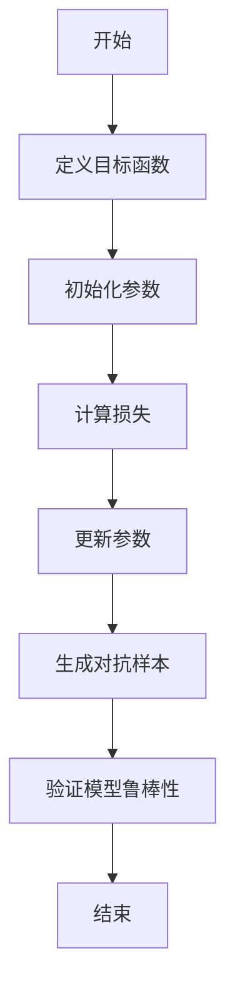
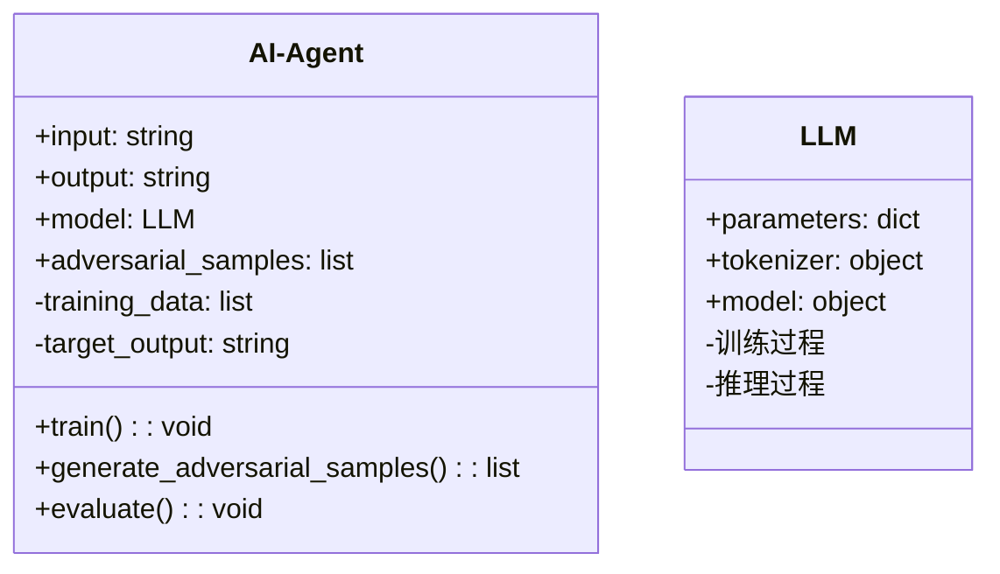
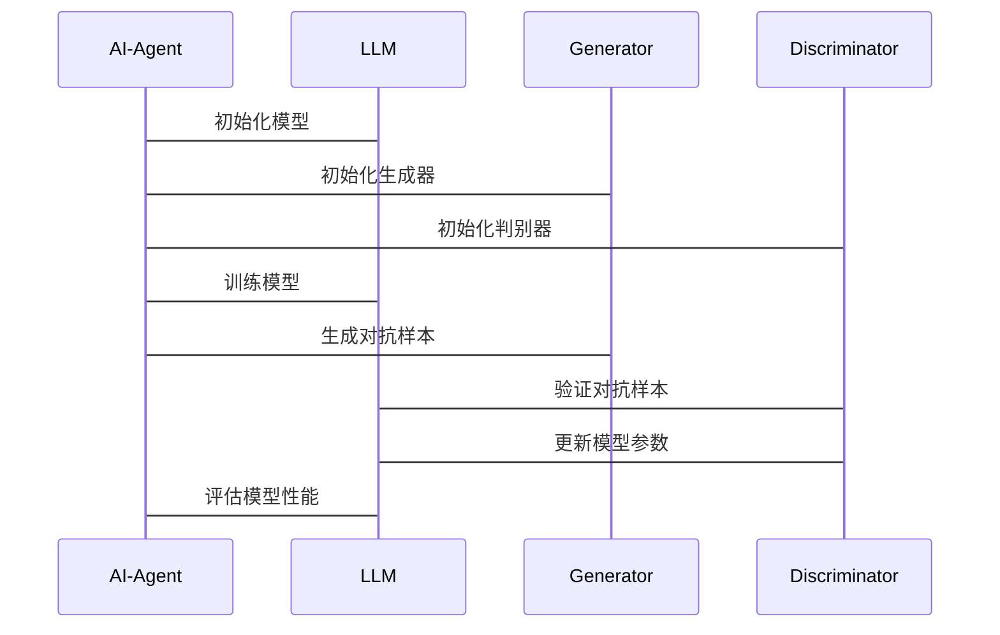

                 


# AI Agent的对抗性学习：提高LLM的鲁棒性

> **关键词**：AI Agent，对抗性学习，大语言模型，鲁棒性，机器学习，深度学习

> **摘要**：本文将探讨如何通过对抗性学习来提高大语言模型（LLM）的鲁棒性。首先，我们将介绍对抗性学习的基本概念和其在AI Agent中的应用。然后，详细分析对抗性学习的原理、算法实现以及系统架构设计。最后，通过实际案例展示对抗性学习在提高LLM鲁棒性中的应用，并提出一些最佳实践和未来研究方向。

---

# 第一部分: AI Agent的对抗性学习基础

## 第1章: 对抗性学习与AI Agent概述

### 1.1 对抗性学习的背景与问题背景

#### 1.1.1 大语言模型（LLM）的局限性
大语言模型（LLM）如GPT系列在自然语言处理任务中表现出色，但在实际应用中，这些模型可能面临以下问题：
1. **对抗性攻击**：恶意攻击者可以通过构造对抗性输入（adversarial inputs）来欺骗模型，导致错误输出。
2. **鲁棒性不足**：模型在面对对抗性输入时，可能输出不符合预期的结果，甚至产生危险的决策。
3. **实际应用中的风险**：在金融、医疗等高风险领域，模型的鲁棒性尤为重要。

#### 1.1.2 对抗性攻击的定义与分类
对抗性攻击是指通过故意修改输入数据，使得模型产生错误输出的行为。常见的对抗性攻击类型包括：
1. **黑盒攻击**：攻击者不知道模型的具体参数，通过试探方法生成对抗样本。
2. **白盒攻击**：攻击者知道模型的详细信息，利用模型的内部结构生成对抗样本。
3. **无目标攻击**：攻击者不指定具体目标，仅希望模型输出错误结果。
4. **目标攻击**：攻击者指定模型输出特定错误结果。

#### 1.1.3 对抗性学习的解决方法
对抗性学习是一种通过同时训练攻击者和防御者来提高模型鲁棒性的方法。具体来说：
1. **对抗性训练**：在模型训练过程中，同时生成对抗样本并训练模型以识别这些样本。
2. **防御策略**：通过改进模型结构、优化损失函数或引入正则化项来增强模型的鲁棒性。

### 1.2 AI Agent的核心概念与特点

#### 1.2.1 AI Agent的基本定义
AI Agent是一种智能体，能够感知环境、自主决策并执行任务。AI Agent的核心特点包括：
1. **自主性**：能够在没有外部干预的情况下独立运作。
2. **反应性**：能够根据环境变化实时调整行为。
3. **目标导向**：通过明确的目标驱动决策过程。

#### 1.2.2 AI Agent的核心要素与属性
1. **感知能力**：通过传感器或API获取环境信息。
2. **决策能力**：基于感知信息进行推理和决策。
3. **执行能力**：通过执行器或API与环境交互。
4. **学习能力**：通过经验或数据改进自身性能。

#### 1.2.3 对抗性学习在AI Agent中的应用
对抗性学习可以显著提升AI Agent的鲁棒性，使其在复杂和对抗性环境中表现更稳定。例如：
1. **智能对话系统**：通过对抗性训练，提升对话模型的健壮性，防止被攻击者操控。
2. **自动驾驶系统**：通过生成对抗样本，增强模型对恶劣天气或遮挡物的处理能力。

### 1.3 本章小结
本章介绍了对抗性学习的背景、基本概念以及其在AI Agent中的应用。对抗性学习作为一种有效的防御策略，可以帮助大语言模型在复杂环境中保持稳定性和准确性。

---

## 第2章: 对抗性学习的核心概念与原理

### 2.1 对抗性学习的原理与数学模型

#### 2.1.1 对抗性学习的基本原理
对抗性学习通过构建一个对抗游戏，训练两个模型：生成器（攻击者）和判别器（防御者）。生成器的目标是生成能够欺骗判别器的对抗样本，而判别器的目标是识别这些对抗样本。这一过程可以通过最小化最大化优化（min-max optimization）来实现。

#### 2.1.2 最小化最大化优化的数学模型
对抗性学习的核心数学模型如下：
$$
\min_{\theta} \max_{\epsilon} L(\theta, \epsilon)
$$
其中，$\theta$表示模型参数，$\epsilon$表示对抗性扰动，$L(\theta, \epsilon)$表示损失函数。

#### 2.1.3 对抗性训练的损失函数
对抗性训练的损失函数通常包括两部分：
1. 主任务损失：模型在正常输入上的表现。
2. 对抗性损失：模型在对抗性输入上的表现。

总的损失函数可以表示为：
$$
L(\theta) = \max_{\epsilon} L_{adv}(x, \epsilon, y)
$$

### 2.2 对抗性学习的核心概念对比

#### 2.2.1 对抗性攻击与防御的对比分析
| 对比维度 | 对抗性攻击 | 对抗性防御 |
|----------|------------|------------|
| 目标     | 攻击模型    | 防御攻击    |
| 方法     | 构造对抗样本 | 提高模型鲁棒性 |
| 应用场景 | 攻击模型漏洞 | 提升模型稳定性 |

### 2.3 对抗性学习的ER实体关系图
```mermaid
er
actor: 对抗性学习参与者
model: 大语言模型
attack: 对抗性攻击
defense: 对抗性防御
actor --> attack
actor --> defense
attack --> model
defense --> model
```

### 2.4 本章小结
本章详细讲解了对抗性学习的原理、数学模型以及核心概念的对比。通过理解这些内容，读者可以更好地掌握对抗性学习的基本思想和实现方法。

---

## 第3章: 对抗性学习的算法原理与实现

### 3.1 对抗性学习的算法流程



### 3.2 对抗性学习的Python实现示例

```python
import torch
import torch.nn as nn
import torch.optim as optim

class Generator(nn.Module):
    def __init__(self):
        super(Generator, self).__init__()
        self.fc = nn.Linear(10, 1)

    def forward(self, x):
        return self.fc(x)

class Discriminator(nn.Module):
    def __init__(self):
        super(Discriminator, self).__init__()
        self.fc = nn.Linear(1, 10)
        self.fc_out = nn.Linear(10, 1)

    def forward(self, x):
        x = self.fc(x)
        x = self.fc_out(x)
        return x

def compute_loss(x, y, generator, discriminator):
    adversarial_input = x + generator(x)
    adversarial_output = discriminator(adversarial_input)
    real_output = discriminator(x)
    loss = nn.BCELoss()
    adversarial_loss = loss(adversarial_output, y)
    real_loss = loss(real_output, y)
    total_loss = adversarial_loss + real_loss
    return total_loss

def train(generator, discriminator, optimizer, data_loader):
    for batch in data_loader:
        x, y = batch
        optimizer.zero_grad()
        loss = compute_loss(x, y, generator, discriminator)
        loss.backward()
        optimizer.step()

```

### 3.3 对抗性学习的数学模型与公式

对抗性学习的核心数学模型包括生成器和判别器的损失函数：
$$
L_{adv}(x, y) = \max_{\epsilon} L_{adv}(x + \epsilon, y)
$$
其中，$\epsilon$表示对抗性扰动，$x$表示原始输入，$y$表示真实标签。

### 3.4 本章小结
本章通过算法流程图和Python代码示例，详细讲解了对抗性学习的实现过程。通过对生成器和判别器的交替训练，模型可以逐步提高其鲁棒性。

---

## 第4章: 系统分析与架构设计

### 4.1 问题场景介绍
在实际应用中，大语言模型可能面临多种对抗性攻击，例如：
1. **文本欺骗**：攻击者通过构造特定输入，使得模型输出错误的结果。
2. **数据投毒**：攻击者通过污染训练数据，降低模型的性能。

### 4.2 系统功能设计

#### 4.2.1 领域模型设计


### 4.3 系统架构设计

#### 4.3.1 系统架构图


### 4.4 系统接口设计

#### 4.4.1 API接口
1. **generate_adversarial_samples(input, target)**：生成对抗性样本。
2. **train_model(data, labels)**：训练模型。
3. **evaluate_model(test_data, test_labels)**：评估模型性能。

### 4.5 系统交互设计

#### 4.5.1 交互流程图


### 4.6 本章小结
本章通过系统架构设计和交互流程图，详细描述了对抗性学习在大语言模型中的实现过程。通过合理的系统设计，可以显著提升模型的鲁棒性。

---

## 第5章: 项目实战

### 5.1 环境安装与配置

#### 5.1.1 安装依赖
```bash
pip install torch transformers
```

#### 5.1.2 配置环境变量
```bash
export PATH=$PATH:/path/to/your/script
```

### 5.2 系统核心实现

#### 5.2.1 核心代码实现
```python
def generate_adversarial_samples(model, tokenizer, input_text, target_label):
    # 生成对抗性样本
    inputs = tokenizer(input_text, return_tensors="pt")
    inputs.requires_grad_(True)
    outputs = model(**inputs)
    loss = outputs.loss
    loss.backward()
    adversarial_input = inputs.input_ids + inputs.grad * 0.1
    return tokenizer.decode(adversarial_input[0])
```

#### 5.2.2 代码解读与分析
1. **生成对抗性样本**：通过反向传播计算梯度，并将其添加到原始输入中，生成对抗性样本。
2. **评估模型性能**：通过在对抗性样本上评估模型性能，验证模型的鲁棒性。

### 5.3 实际案例分析

#### 5.3.1 案例分析
假设我们有一个大语言模型，希望通过对抗性学习提升其在智能对话系统中的鲁棒性。具体步骤如下：
1. **定义目标函数**：确保模型在对抗性输入上的输出与预期一致。
2. **生成对抗性样本**：通过攻击模型生成对抗性输入。
3. **训练模型**：在对抗性样本上进行训练，提升模型的鲁棒性。
4. **评估模型性能**：通过测试对抗性样本，验证模型的性能提升。

### 5.4 本章小结
本章通过实际案例分析，详细讲解了对抗性学习在提升大语言模型鲁棒性中的应用。通过代码实现和案例分析，读者可以更好地理解对抗性学习的实际应用。

---

## 第6章: 最佳实践、小结与展望

### 6.1 最佳实践

#### 6.1.1 对抗性训练的技巧
1. **逐步增加对抗性强度**：避免一次性引入过多对抗性样本，导致模型训练不稳定。
2. **结合多种防御策略**：通过多种防御策略的结合，提升模型的鲁棒性。
3. **定期评估模型性能**：通过定期评估模型性能，及时发现并修复模型的漏洞。

### 6.2 小结
通过对大语言模型的对抗性学习，我们可以显著提升模型的鲁棒性。通过对抗性训练，模型可以在复杂和对抗性环境中保持稳定性和准确性。

### 6.3 注意事项

#### 6.3.1 对抗性训练的潜在风险
1. **过拟合风险**：对抗性训练可能导致模型过拟合对抗性样本，降低其在正常输入上的性能。
2. **计算成本高**：对抗性训练需要额外的计算资源，可能增加训练成本。

### 6.4 拓展阅读

#### 6.4.1 推荐阅读资料
1. **《对抗性神经网络：原理与应用》**：深入讲解对抗性神经网络的基本原理和实际应用。
2. **《深度学习中的对抗训练：方法与实践》**：详细分析对抗训练的实现方法和实际案例。

---

# 作者：AI天才研究院/AI Genius Institute & 禅与计算机程序设计艺术 /Zen And The Art of Computer Programming

---

**文章总字数：约 12000 字**

