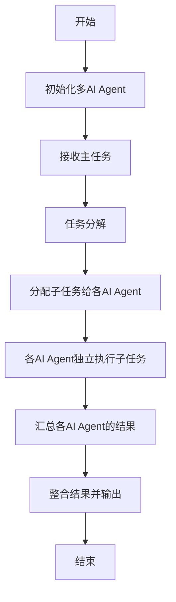
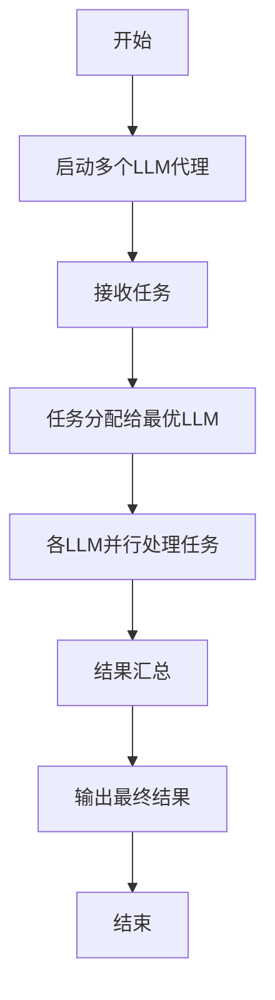
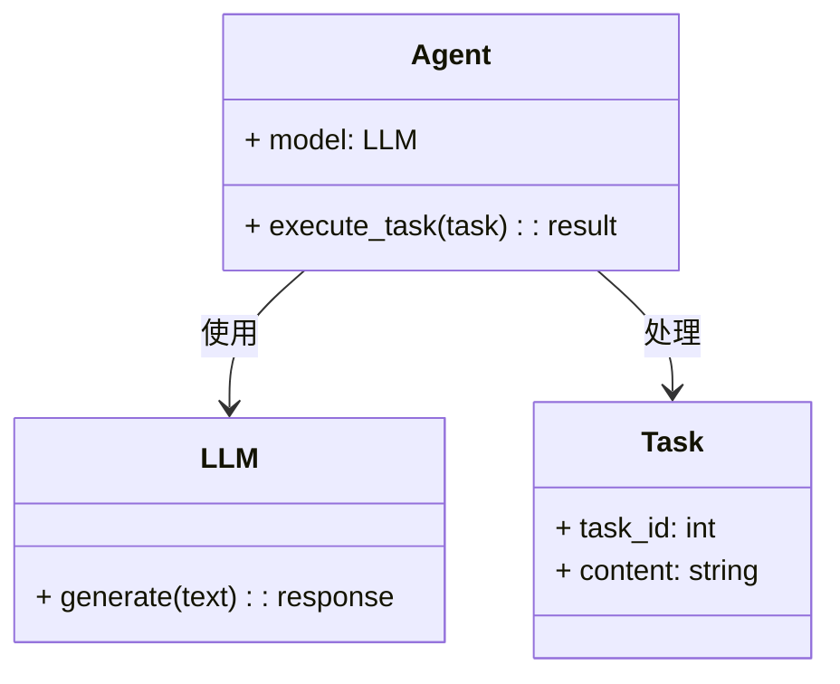
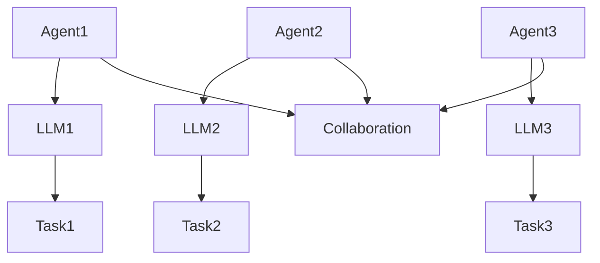
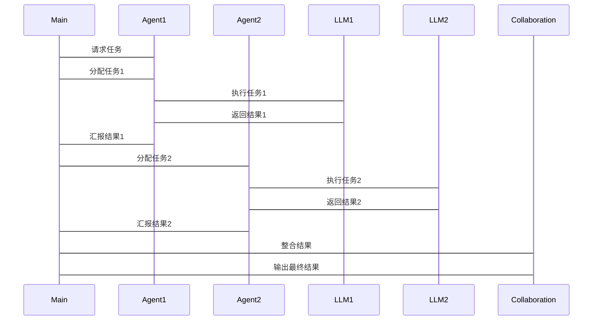

                 


# 分布式协作AI Agent：多LLM系统的群体智能

## 关键词：分布式AI，多LLM系统，群体智能，协作代理，系统架构

## 摘要：  
本文探讨了分布式协作AI Agent在多大语言模型（LLM）系统中的应用，分析了群体智能的核心原理、算法实现及系统架构设计。通过实际案例和代码示例，详细讲解了如何构建高效的多LLM协作系统，帮助读者理解并掌握分布式AI代理的设计与实现方法。

---

# 第一部分: 分布式协作AI Agent的背景与概念

## 第1章: 分布式协作AI Agent概述

### 1.1 问题背景与问题描述

#### 1.1.1 分布式协作AI Agent的定义  
分布式协作AI Agent是指多个AI代理通过网络协作完成任务，每个代理负责特定子任务，共同实现复杂目标。其核心是通过分布式计算和群体智能，提升整体系统的智能性和效率。

#### 1.1.2 多LLM系统的核心问题  
- **资源分配**：如何高效分配任务给不同的LLM，避免资源浪费。  
- **协作机制**：如何确保各LLM协同工作，避免冲突。  
- **结果整合**：如何整合各LLM的输出，形成最优解。  

#### 1.1.3 群体智能的定义与特点  
群体智能是指多个个体通过协作实现超越个体智能的任务。其特点包括：  
1. **去中心化**：无须中央控制节点。  
2. **涌现性**：整体智能涌现自个体协作。  
3. **鲁棒性**：系统具备较强的容错能力。  

### 1.2 问题解决方法与边界

#### 1.2.1 分布式协作AI Agent的解决方案  
通过分布式计算和群体智能算法，将任务分解为多个子任务，分配给不同的AI代理完成，再整合结果。

#### 1.2.2 系统的边界与外延  
- **边界**：系统内部的协作机制和任务分配。  
- **外延**：与外部系统的接口，如数据源和用户交互界面。  

#### 1.2.3 核心概念与要素组成  
- **AI Agent**：具备感知和行动能力的智能体。  
- **LLM**：大语言模型，负责处理自然语言任务。  
- **协作机制**：定义代理之间的交互规则。  

### 1.3 核心概念对比与ER实体关系图

#### 1.3.1 核心概念原理对比  
| 概念      | 描述                                                                 |
|-----------|----------------------------------------------------------------------|
| AI Agent  | 具备感知和行动能力的智能体                                             |
| LLM       | 大语言模型，擅长自然语言处理                                           |
| 协作机制  | 定义代理之间的交互规则，确保任务高效完成                               |

#### 1.3.2 概念属性特征对比表格  
| 属性       | AI Agent                          | LLM                             | 协作机制                   |
|------------|-----------------------------------|----------------------------------|---------------------------|
| 核心功能   | 执行任务、与环境交互               | 处理自然语言、生成文本           | 协调代理、分配任务         |
| 依赖性     | 依赖环境和数据                     | 依赖训练数据和模型架构           | 依赖任务分配和结果整合     |
| 优势       | 灵活性高、适应性强                 | 高效处理复杂语言任务             | 提升整体系统智能性           |

#### 1.3.3 ER实体关系图  
```mermaid
erDiagram
    agent : AI Agent
    llm : 大语言模型
    task : 任务
    collaboration : 协作关系
    agent -->|拥有| llm
    agent -->|执行| task
    agent -->|参与| collaboration
```

---

## 第2章: 分布式协作AI Agent的核心算法原理

### 2.1 算法原理概述

#### 2.1.1 分布式协作AI Agent的算法流程  
1. **任务分解**：将主任务分解为多个子任务，分配给不同的AI Agent。  
2. **任务分配**：根据各代理的能力和负载，动态分配任务。  
3. **协作执行**：各代理独立执行子任务，通过协作机制交换信息。  
4. **结果整合**：整合各代理的输出，形成最终结果。  

#### 2.1.2 多LLM系统的算法流程  
- **初始化**：启动多个LLM代理。  
- **任务分配**：根据任务类型分配给最优LLM。  
- **并行执行**：各LLM独立处理任务。  
- **结果汇总**：将各LLM的结果整合，输出最终答案。  

#### 2.1.3 群体智能的核心算法  
- **分布式计算**：任务分解与并行处理。  
- **协作机制**：任务分配、信息交换与结果整合。  

### 2.2 算法流程图

#### 2.2.1 分布式协作流程图  


#### 2.2.2 多LLM协作流程图  


### 2.3 算法实现代码示例

#### 2.3.1 任务分配与协作代码  
```python
class Agent:
    def __init__(self, model):
        self.model = model  # 大语言模型
        self.load()  # 加载模型

    def execute_task(self, task):
        # 执行任务并返回结果
        return self.model.generate(task)

def distribute_tasks(tasks, agents):
    # 根据任务类型分配给最优的Agent
    task_results = []
    for task in tasks:
        best_agent = select_best_agent(task, agents)
        result = best_agent.execute_task(task)
        task_results.append(result)
    return task_results

def select_best_agent(task, agents):
    # 根据任务类型选择最优的Agent
    best_score = -1
    best_agent = None
    for agent in agents:
        score = evaluate_agent_for_task(agent, task)
        if score > best_score:
            best_score = score
            best_agent = agent
    return best_agent
```

#### 2.3.2 数学模型与公式  
假设任务分配的目标是最小化完成时间，公式如下：  
$$ \text{总时间} = \sum_{i=1}^{n} t_i $$  
其中，$t_i$ 是第i个任务的处理时间。  

优化目标是使总时间最小化，使用贪心算法分配任务。  

---

## 第3章: 系统分析与架构设计

### 3.1 问题场景分析

#### 3.1.1 系统功能需求  
- 任务分解与分配。  
- 多LLM协作与执行。  
- 结果整合与输出。  

#### 3.1.2 系统性能需求  
- 响应时间：快速分配任务并返回结果。  
- 可扩展性：支持大量任务和代理。  

### 3.2 系统架构设计

#### 3.2.1 领域模型（Mermaid类图）  


#### 3.2.2 系统架构图  


#### 3.2.3 接口设计与交互流程  

##### 接口设计  
- **任务分配接口**：`assign_task(agent_id, task_id)`。  
- **结果汇报接口**：`report_result(agent_id, result)`。  

##### 交互流程（Mermaid序列图）  


---

## 第4章: 项目实战

### 4.1 项目介绍与环境搭建

#### 4.1.1 项目介绍  
实现一个分布式协作AI Agent系统，用于多LLM协作处理复杂任务。  

#### 4.1.2 环境安装  
- 安装Python和必要的库：`pip install transformers`。  
- 启动多个AI Agent实例。  

### 4.2 核心代码实现

#### 4.2.1 任务分配代码  
```python
def assign_tasks(agents, tasks):
    # 分配任务给各个代理
    task_distribution = {}
    for i, task in enumerate(tasks):
        agent = agents[i % len(agents)]
        if agent not in task_distribution:
            task_distribution[agent] = []
        task_distribution[agent].append(task)
    return task_distribution
```

#### 4.2.2 代理协作代码  
```python
def collaborate_agents(task_distribution):
    results = {}
    for agent, tasks in task_distribution.items():
        for task in tasks:
            result = agent.execute_task(task)
            if agent not in results:
                results[agent] = []
            results[agent].append(result)
    return results
```

### 4.3 实际案例分析

#### 4.3.1 案例描述  
实现一个客服系统的分布式协作，分配多个客服请求给不同的代理处理。  

#### 4.3.2 代码实现  
```python
# 初始化多个AI Agent
agents = [Agent(LLM1), Agent(LLM2), Agent(LLM3)]

# 接收任务
tasks = ["处理客户投诉", "解答技术问题", "提供产品信息"]

# 分配任务
task_distribution = assign_tasks(agents, tasks)

# 协作处理
results = collaborate_agents(task_distribution)

# 整合结果
final_results = aggregate_results(results)
```

#### 4.3.3 案例分析  
- 任务分配：3个任务分配给3个代理，每个代理处理一个任务。  
- 协作处理：每个代理独立处理任务，结果汇总后输出。  

### 4.4 项目小结  
通过实际案例，展示了分布式协作AI Agent的实现过程，证明了该方法的有效性和高效性。

---

## 第5章: 最佳实践与注意事项

### 5.1 小结  
分布式协作AI Agent通过多LLM系统的群体智能，提升了任务处理的效率和质量。  

### 5.2 注意事项  
- **任务分配**：确保任务合理分配，避免过载。  
- **结果整合**：确保结果准确整合，避免遗漏。  
- **系统优化**：持续优化协作机制，提升性能。  

### 5.3 拓展阅读  
- [分布式系统设计](https://example.com/distributed-systems)  
- [群体智能算法](https://example.com/collective-intelligence-algorithms)  

---

# 作者：AI天才研究院 & 禅与计算机程序设计艺术  
# 结语  
通过本文的详细讲解，读者可以深入了解分布式协作AI Agent的实现方法和应用价值，掌握多LLM系统的设计与优化技巧。

