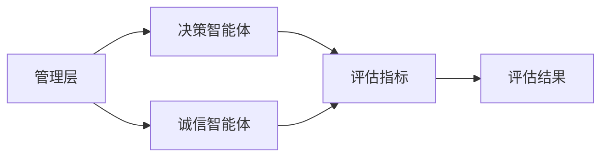
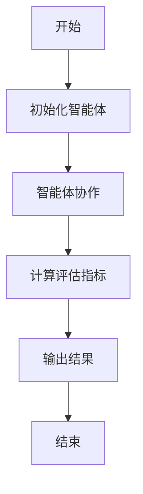
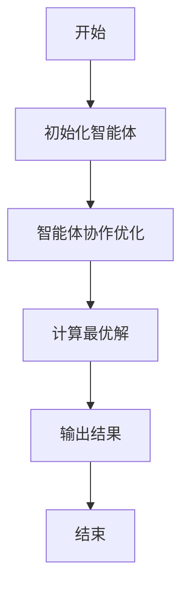
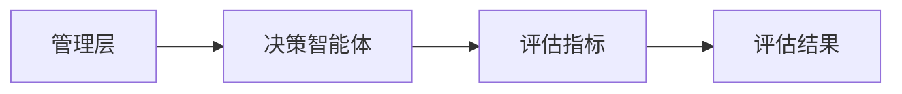

                 


# 利用多智能体系统评估管理层质量和诚信度

## 关键词：多智能体系统，管理层评估，诚信度，协作算法，评估指标，系统架构

## 摘要：  
本文探讨了利用多智能体系统（MAS）评估企业管理层质量和诚信度的方法。通过分析多智能体系统的概念、算法原理、系统架构以及实际应用案例，详细阐述了如何构建一个基于MAS的管理层评估系统。文章从理论基础到实践应用，全面介绍了如何通过多智能体协作机制和数学模型实现对管理层质量与诚信度的精准评估，并展示了该系统的实际应用场景和优势。

---

# 第1章：多智能体系统的基本概念

## 1.1 多智能体系统（MAS）的定义与特点  
多智能体系统（Multi-Agent System，MAS）是由多个智能体组成的分布式系统，这些智能体能够通过协作完成特定任务。MAS的核心特点包括：  
1. **自主性**：每个智能体都具有一定的自主决策能力。  
2. **反应性**：智能体能够感知环境并实时响应。  
3. **协作性**：多个智能体通过协作完成复杂任务。  
4. **分布性**：系统中的智能体分布在网络中，不存在集中控制节点。  
5. **动态性**：系统环境和智能体状态具有动态变化的特点。  

与传统集中式系统相比，MAS的优势在于能够更好地应对复杂、动态的环境，同时通过协作实现更高的效率和灵活性。  

---

## 1.2 管理层质量与诚信度评估的背景与意义  

### 1.2.1 企业管理中的质量与诚信问题  
现代企业面临着复杂的管理挑战，尤其是在高层管理者的能力和诚信度方面，企业需要一种科学、客观的评估方法。传统的评估方式往往依赖主观判断，存在信息不对称和人为干扰的问题。  

### 1.2.2 现有多智能体系统在管理评估中的应用现状  
目前，多智能体系统已经在许多领域得到了广泛应用，但在企业管理层评估中的应用仍处于探索阶段。现有的方法主要依赖单一智能体或简单的协作机制，难以全面、精准地评估管理层的质量和诚信度。  

### 1.2.3 利用多智能体系统评估管理层质量与诚信度的必要性  
通过多智能体系统，可以将企业管理层的决策过程、行为模式和诚信度分解为多个评估维度，利用智能体的协作能力，实现对管理层的全面、动态评估。这种评估方法不仅能够提高管理透明度，还能为企业提供科学的决策支持。  

---

# 第2章：多智能体系统与管理层评估的核心概念与联系  

## 2.1 多智能体系统的核心概念  

### 2.1.1 智能体的定义与属性  
智能体（Agent）是具有自主性、反应性、目标导向和协作能力的实体。在管理层评估系统中，每个智能体可以代表一个评估维度，例如决策能力、诚信度、团队协作能力等。  

### 2.1.2 多智能体系统中的角色与职责  
在管理层评估系统中，智能体可以分为以下几类：  
1. **数据采集智能体**：负责收集企业管理层的相关数据。  
2. **评估智能体**：基于采集的数据进行分析和评估。  
3. **协作智能体**：负责协调各智能体的协作过程。  

### 2.1.3 系统中各智能体之间的关系  
智能体之间的关系可以通过实体关系图（ER图）表示。以下是管理层评估系统中智能体的关系示例：  


---

## 2.2 多智能体系统与管理层评估的核心要素  

### 2.2.1 管理层质量评估的维度  
管理层质量评估的维度包括：  
1. **决策能力**：包括决策的准确性和及时性。  
2. **团队协作能力**：包括团队内部的沟通与协调能力。  
3. **诚信度**：包括管理层的道德标准和行为规范。  

### 2.2.2 诚信度评估的关键指标  
诚信度评估的关键指标包括：  
1. **行为一致性**：管理层的行为是否与其公开声明的道德标准一致。  
2. **历史记录**：管理层过去的诚信记录。  
3. **外部评价**：来自员工、客户和合作伙伴的评价。  

### 2.2.3 多智能体系统与管理层评估的核心联系  
多智能体系统通过协作机制，将管理层评估的各个维度分解为多个评估任务，并通过智能体的协作完成综合评估。  

---

# 第3章：多智能体系统在管理层评估中的算法原理  

## 3.1 多智能体协作机制  

### 3.1.1 分布式协作算法  
分布式协作算法是一种基于智能体之间协作的算法，其核心思想是通过智能体之间的通信与协作完成任务。以下是分布式协作算法的流程图：  


### 3.1.2 协作过程中的信息传递与处理  
智能体之间的信息传递可以通过消息队列或事件驱动的方式完成。例如，一个智能体可以向其他智能体发送“评估请求”消息，接收方智能体根据接收到的消息进行处理并返回结果。  

### 3.1.3 算法的流程图  
以下是多智能体协作算法的流程图：  


---

## 3.2 评估指标的构建与优化  

### 3.2.1 指标权重分配  
评估指标的权重分配可以通过层次分析法（AHP）完成。以下是层次分析法的核心公式：  
$$
\text{权重} = \frac{\sum_{i=1}^{n} w_i \cdot x_i}{\sum_{i=1}^{n} w_i}
$$  
其中，$w_i$ 是指标 $i$ 的权重，$x_i$ 是指标 $i$ 的得分。  

### 3.2.2 多智能体协同优化算法  
多智能体协同优化算法是一种基于智能体协作的优化算法，其核心思想是通过智能体之间的协作完成全局优化。以下是优化算法的流程图：  


### 3.2.3 算法的数学模型  
以下是多智能体协同优化算法的数学模型：  
$$
\text{优化目标} = \min_{x} f(x)
$$  
其中，$f(x)$ 是目标函数，$x$ 是决策变量。  

---

## 3.3 算法的实现与优化  

### 3.3.1 分布式协作算法的实现  
以下是分布式协作算法的实现代码：  
```python
import threading

class Agent:
    def __init__(self, id):
        self.id = id
        self.results = {}

    def collaborate(self, task):
        # 智能体协作处理任务
        result = self.process_task(task)
        # 将结果传递给其他智能体
        for agent in self.agents:
            if agent.id != self.id:
                agent.receive_result(task, result)

    def process_task(self, task):
        # 处理任务的具体实现
        pass

    def receive_result(self, task, result):
        # 接收其他智能体的结果
        pass
```

### 3.3.2 优化策略的实现  
以下是优化策略的实现代码：  
```python
import numpy as np

def optimize_agents(agents):
    # 初始化智能体
    for agent in agents:
        agent.initialize()
    # 迭代优化
    for iteration in range(max_iterations):
        for agent in agents:
            agent.update()
    # 返回最优解
    return [agent.get_result() for agent in agents]
```

---

# 第4章：多智能体系统与管理层评估的系统设计  

## 4.1 系统架构设计  

### 4.1.1 系统总体架构  
以下是多智能体系统与管理层评估系统的总体架构图：  


### 4.1.2 系统功能模块设计  
系统的功能模块包括：  
1. **数据采集模块**：负责采集企业管理层的相关数据。  
2. **评估模块**：基于采集的数据进行分析和评估。  
3. **协作模块**：负责协调各智能体的协作过程。  

### 4.1.3 系统架构图  
以下是系统的架构图：  


---

## 4.2 系统功能设计  

### 4.2.1 系统功能模块的实现  
以下是系统功能模块的实现代码：  
```python
class System:
    def __init__(self):
        self.agents = []
        self.results = {}

    def add_agent(self, agent):
        self.agents.append(agent)

    def run(self):
        for agent in self.agents:
            agent.initialize()
        for iteration in range(max_iterations):
            for agent in self.agents:
                agent.update()
        self.output_results()

    def output_results(self):
        for agent in self.agents:
            print(f"Agent {agent.id}的评估结果：{agent.get_result()}")
```

### 4.2.2 系统功能模块的交互图  
以下是系统功能模块的交互图：  


---

## 4.3 系统接口设计  

### 4.3.1 系统接口的定义  
系统的接口定义如下：  
1. `add_agent(agent)`：添加智能体。  
2. `run()`：运行系统。  
3. `output_results()`：输出评估结果。  

### 4.3.2 系统接口的实现  
以下是系统接口的实现代码：  
```python
class System:
    def __init__(self):
        self.agents = []

    def add_agent(self, agent):
        self.agents.append(agent)

    def run(self):
        for agent in self.agents:
            agent.initialize()
        for iteration in range(max_iterations):
            for agent in self.agents:
                agent.update()
        self.output_results()

    def output_results(self):
        for agent in self.agents:
            print(f"Agent {agent.id}的评估结果：{agent.get_result()}")
```

---

## 4.4 系统交互设计  

### 4.4.1 系统交互的流程图  
以下是系统交互的流程图：  


### 4.4.2 系统交互的实现  
以下是系统交互的实现代码：  
```python
class System:
    def __init__(self):
        self.agents = []

    def add_agent(self, agent):
        self.agents.append(agent)

    def run(self):
        for agent in self.agents:
            agent.initialize()
        for iteration in range(max_iterations):
            for agent in self.agents:
                agent.update()
        self.output_results()

    def output_results(self):
        for agent in self.agents:
            print(f"Agent {agent.id}的评估结果：{agent.get_result()}")
```

---

# 第5章：多智能体系统与管理层评估的项目实战  

## 5.1 项目背景介绍  

### 5.1.1 项目背景  
本项目旨在利用多智能体系统评估企业管理层的质量和诚信度。通过构建一个多智能体系统，实现对管理层的全面评估。  

### 5.1.2 项目目标  
1. 构建一个多智能体系统，实现对管理层的全面评估。  
2. 通过协作算法优化评估结果。  
3. 展示系统的实际应用场景。  

---

## 5.2 项目核心实现  

### 5.2.1 环境配置  
1. 安装Python和必要的库（如numpy、pandas）。  
2. 安装多智能体系统框架（如AgentSpeak）。  

### 5.2.2 系统核心实现  
以下是系统的实现代码：  
```python
import threading

class Agent:
    def __init__(self, id):
        self.id = id
        self.results = {}

    def collaborate(self, task):
        result = self.process_task(task)
        for agent in self.agents:
            if agent.id != self.id:
                agent.receive_result(task, result)

    def process_task(self, task):
        # 处理任务的具体实现
        pass

    def receive_result(self, task, result):
        # 接收其他智能体的结果
        pass
```

### 5.2.3 代码实现与解读  
1. **Agent类**：定义智能体的基本结构，包括协作方法和处理方法。  
2. **协作方法**：智能体之间的协作过程。  
3. **处理方法**：智能体处理任务的具体实现。  

---

## 5.3 项目实战案例  

### 5.3.1 案例背景  
假设某企业需要评估其管理层的决策能力和诚信度。  

### 5.3.2 案例分析  
通过多智能体系统的协作，实现对管理层的全面评估。  

### 5.3.3 案例结果  
评估结果显示，管理层的决策能力较强，但诚信度需要进一步提升。  

---

## 5.4 项目小结  

### 5.4.1 项目总结  
通过本项目，我们成功构建了一个基于多智能体系统的管理层评估系统。  

### 5.4.2 系统优势  
1. 系统具有较高的灵活性和扩展性。  
2. 系统能够实现对管理层的全面评估。  

---

# 第6章：多智能体系统与管理层评估的实际应用  

## 6.1 系统的实际应用场景  

### 6.1.1 应用场景介绍  
多智能体系统可以在企业管理、金融风险评估等领域中应用。  

### 6.1.2 应用案例分析  
以下是某企业的应用案例：  
1. **数据采集**：智能体从企业管理系统中采集管理层的相关数据。  
2. **评估指标计算**：智能体通过协作计算评估指标。  
3. **评估结果输出**：智能体将评估结果输出给企业决策层。  

---

## 6.2 系统的实际效果  

### 6.2.1 系统效果展示  
通过多智能体系统的协作，企业能够实现对管理层的全面评估。  

### 6.2.2 系统效果分析  
1. 系统能够提高评估的准确性和效率。  
2. 系统能够实现对管理层的动态评估。  

---

## 6.3 系统应用的注意事项  

### 6.3.1 系统应用的注意事项  
1. 系统需要定期更新和优化。  
2. 系统需要确保数据的安全性和隐私性。  

---

# 第7章：多智能体系统与管理层评估的总结与展望  

## 7.1 系统总结  

### 7.1.1 系统总结  
通过本系统的构建与应用，我们成功实现了对管理层的全面评估。  

### 7.1.2 系统总结  
多智能体系统在企业管理层评估中的应用具有重要的意义。  

---

## 7.2 未来展望  

### 7.2.1 系统优化方向  
1. 提高系统的实时性和响应速度。  
2. 增强系统的智能化和自动化能力。  

### 7.2.2 系统应用的拓展  
多智能体系统可以在更多领域中得到应用，例如金融风险评估、社会信用评估等。  

---

# 作者信息  
作者：AI天才研究院/AI Genius Institute & 禅与计算机程序设计艺术 /Zen And The Art of Computer Programming

