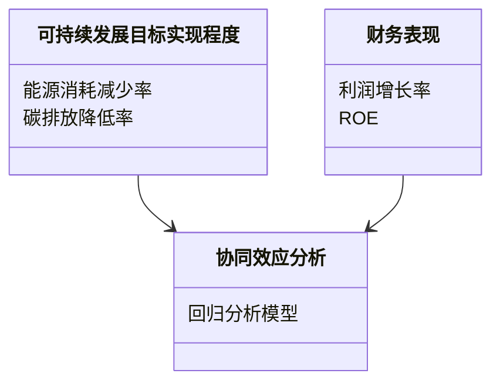
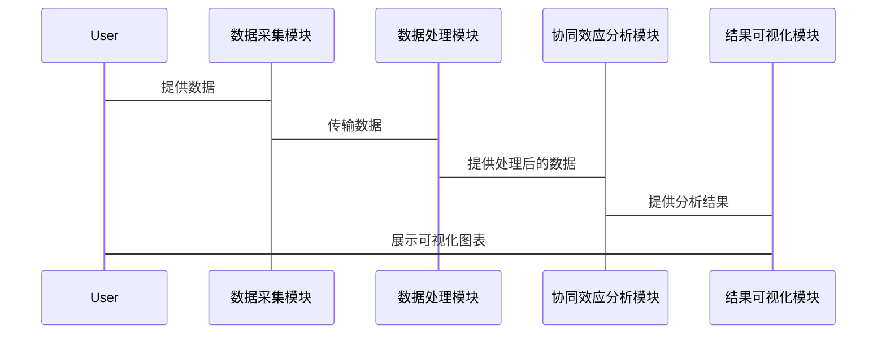

                 


# 彼得林奇如何看待公司的可持续发展目标与财务表现的协同效应

> 关键词：彼得·林奇，可持续发展目标，财务表现，协同效应，投资策略，企业价值，风险管理

> 摘要：本文深入探讨了彼得·林奇如何将公司的可持续发展目标与财务表现结合起来，分析了两者之间的协同效应。通过理论分析和实证研究，本文揭示了可持续发展目标对财务表现的积极影响，包括成本优化、收入增长和风险管理等方面。同时，结合彼得·林奇的经典投资案例，本文总结了协同效应的实现路径与挑战，并提出了系统的架构设计方案。

---

## 第一部分: 可持续发展目标与财务表现的协同效应概述

---

### 第1章: 可持续发展目标与财务表现的协同关系

#### 1.1 可持续发展目标的定义与背景

- **1.1.1 可持续发展的核心概念**  
  可持续发展强调在满足当前需求的同时，不损害后代发展的能力。它涵盖经济、社会和环境三个方面，要求企业在追求利润的同时，关注社会福祉和环境保护。

- **1.1.2 可持续发展目标的演进历程**  
  从20世纪90年代开始，可持续发展逐渐从边缘概念转变为全球企业战略的核心部分。随着全球气候变化、资源枯竭等问题的加剧，企业越来越意识到可持续发展目标的重要性。

- **1.1.3 可持续发展目标与企业发展的关系**  
  可持续发展目标不仅是企业的社会责任，也是企业长期发展的关键因素。通过实现可持续发展目标，企业可以提升品牌形象、优化资源利用、降低风险，并在竞争中获得优势。

#### 1.2 财务表现的核心要素

- **1.2.1 财务表现的定义与衡量指标**  
  财务表现通常包括收入、利润、资产回报率（ROA）、股东权益回报率（ROE）等指标。这些指标反映了企业的盈利能力和财务健康状况。

- **1.2.2 财务表现与企业价值的关系**  
  企业的价值不仅仅体现在财务指标上，还包括未来的增长潜力。通过实现可持续发展目标，企业可以增强其长期价值，吸引更多的投资者。

- **1.2.3 财务表现的驱动因素分析**  
  财务表现的驱动因素包括市场需求、成本控制、技术创新、管理效率等。可持续发展目标可以通过优化资源利用、降低运营成本、提升客户忠诚度等方式，间接或直接地影响财务表现。

#### 1.3 彼得·林奇与投资哲学

- **1.3.1 彼得·林奇的投资理念概述**  
  彼得·林奇是全球著名投资专家，他主张长期投资、价值投资，并注重企业的基本面分析。他认为，企业的长期价值取决于其商业模式、管理团队和市场地位。

- **1.3.2 彼得·林奇的投资策略与方法**  
  林奇强调深入研究企业，关注企业的财务状况、行业地位和竞争优势。他认为，只有选择具有持续增长潜力的企业，才能获得长期的财务回报。

- **1.3.3 彼得·林奇对企业的长期价值关注**  
  林奇认为，企业的长期价值不仅仅体现在财务指标上，还包括其社会影响力和环境责任。他倾向于投资那些在可持续发展方面表现优异的企业。

#### 1.4 可持续发展目标与财务表现的协同效应

- **1.4.1 协同效应的定义与特征**  
  协同效应是指两个或多个目标在实现过程中相互促进、相互增强的现象。可持续发展目标与财务表现的协同效应意味着，通过实现可持续发展目标，企业可以进一步提升其财务表现。

- **1.4.2 可持续发展目标对财务表现的潜在影响**  
  可持续发展目标可以通过优化资源利用、降低运营成本、提升客户忠诚度等方式，间接或直接地影响财务表现。

- **1.4.3 协同效应的实现路径与挑战**  
  协同效应的实现需要企业在战略规划、组织架构、资源配置等方面进行系统性的调整。然而，实现协同效应也面临诸多挑战，包括成本投入、管理复杂性等。

---

## 第二部分: 彼得·林奇视角下的可持续发展目标与财务表现协同机制

---

### 第2章: 可持续发展目标对财务表现的积极影响

#### 2.1 可持续发展目标对企业成本的优化作用

- **2.1.1 环境友好型生产对成本的影响**  
  通过采用绿色生产技术，企业可以降低能源消耗和原材料浪费，从而降低生产成本。例如，使用可再生能源可以减少企业的电费支出。

- **2.1.2 社会责任履行对企业声誉与客户忠诚度的提升**  
  企业通过履行社会责任，提升品牌形象，吸引更多客户。例如，一家企业通过支持教育项目提升了其在消费者心中的形象，从而吸引了更多的客户。

- **2.1.3 可持续发展对供应链效率的优化**  
  通过与供应商合作，推动整个供应链的可持续发展，企业可以降低采购成本，提高供应链的稳定性。例如，通过与环保供应商合作，企业可以降低原材料价格。

#### 2.2 可持续发展目标对收入增长的推动作用

- **2.2.1 可持续产品与服务的市场需求分析**  
  随着消费者环保意识的增强，市场对可持续产品的需求不断增加。企业通过开发环保产品，可以抓住市场机遇，增加收入。

- **2.2.2 可持续发展目标对企业创新的促进作用**  
  可持续发展目标要求企业不断创新，开发新的技术和产品。例如，一家企业通过开发可再生能源技术，不仅满足了市场需求，还提升了其技术竞争力。

- **2.2.3 可持续发展对客户粘性的提升**  
  通过实现可持续发展目标，企业可以增强客户对品牌的忠诚度。例如，一家企业通过减少碳排放，提升了客户对其品牌的认可度。

#### 2.3 可持续发展目标对风险管理的强化作用

- **2.3.1 可持续发展对法律合规风险的规避**  
  通过实现可持续发展目标，企业可以减少因违反环保法规而面临的法律风险。例如，一家企业通过减少污染物排放，避免了因环境违法而被罚款的风险。

- **2.3.2 可持续发展对声誉风险的降低**  
  可持续发展目标的实现可以提升企业的声誉，降低因社会责任缺失而引发的声誉风险。例如，一家企业通过支持社区发展项目，提升了其在社会中的形象。

- **2.3.3 可持续发展对财务风险的控制**  
  可持续发展目标的实现可以降低企业的财务风险。例如，通过优化能源利用，企业可以降低能源成本，从而减少财务风险。

#### 2.4 彼得·林奇对可持续发展目标财务价值的认可

- **2.4.1 彼得·林奇的经典投资案例分析**  
  林奇曾投资于一些在可持续发展方面表现优异的企业，例如，他投资于一家环保技术公司，该公司通过技术创新降低了生产成本，提高了利润率。

- **2.4.2 彼得·林奇对可持续发展目标的长期价值判断**  
  林奇认为，可持续发展目标的实现可以为企业的长期价值增长提供动力。他倾向于投资那些在可持续发展方面表现优异的企业。

- **2.4.3 彼得·林奇对协同效应的实践经验总结**  
  林奇总结了协同效应的实现路径，包括企业在战略规划、组织架构、资源配置等方面的调整。

---

## 第三部分: 可持续发展目标与财务表现协同的数学模型与实证分析

---

### 第3章: 协同效应的数学模型构建

#### 3.1 协同效应的定义与量化方法

- **3.1.1 协同效应的定义**  
  协同效应是指两个或多个目标在实现过程中相互促进、相互增强的现象。

- **3.1.2 协同效应的量化指标**  
  协同效应可以通过财务表现的提升幅度与可持续发展目标的实现程度之间的相关性来量化。例如，可以通过回归分析模型来量化协同效应。

- **3.1.3 协同效应的计算公式**  
  协同效应可以通过以下公式进行计算：  
  $$ \text{协同效应} = \beta \times (\text{可持续发展目标的实现程度}) $$  
  其中，$\beta$ 是回归系数，表示可持续发展目标的实现程度对财务表现的影响程度。

#### 3.2 可持续发展目标与财务表现的回归分析模型

- **3.2.1 回归分析的基本原理**  
  回归分析是一种统计方法，用于研究变量之间的关系。通过回归分析，可以量化可持续发展目标对财务表现的影响程度。

- **3.2.2 协同效应的回归模型构建**  
  构建回归模型时，需要选择合适的自变量和因变量。例如，自变量可以是企业的可持续发展目标实现程度，因变量可以是企业的利润增长率。

- **3.2.3 模型的假设检验与验证**  
  通过假设检验，可以验证回归模型的显著性。例如，可以通过t检验来验证回归系数的显著性。

#### 3.3 协同效应的数学公式推导

- **3.3.1 协同效应的公式表示**  
  协同效应可以通过以下公式进行表示：  
  $$ \text{协同效应} = \beta_0 + \beta_1 \times (\text{可持续发展目标的实现程度}) $$  
  其中，$\beta_0$ 是截距项，$\beta_1$ 是回归系数。

- **3.3.2 协同效应的变量定义与假设**  
  可持续发展目标的实现程度可以通过一系列指标来衡量，例如，能源消耗减少率、碳排放降低率等。财务表现可以通过利润增长率、ROE等指标来衡量。

- **3.3.3 模型的适用条件与限制**  
  回归模型适用于线性关系的分析。如果协同效应是非线性的，可能需要采用其他方法，例如，非线性回归模型。

---

## 第四部分: 可持续发展目标与财务表现协同的系统架构设计

---

### 第4章: 系统分析与架构设计方案

#### 4.1 问题场景介绍

- **4.1.1 系统目标**  
  本系统的目的是实现可持续发展目标与财务表现的协同效应分析。

- **4.1.2 问题背景**  
  随着企业对可持续发展目标的重视，如何量化其对财务表现的影响成为一个重要问题。

- **4.1.3 系统功能需求**  
  系统需要实现以下功能：  
  - 数据采集与处理：采集企业的可持续发展目标实现程度和财务表现数据。  
  - 协同效应分析：通过回归分析模型，量化可持续发展目标对财务表现的影响。  
  - 结果可视化：将分析结果以图表形式展示。

#### 4.2 系统功能设计（领域模型）



#### 4.3 系统架构设计


#### 4.4 系统接口设计

- **数据采集接口**  
  数据采集模块需要与企业的数据源进行对接，获取可持续发展目标实现程度和财务表现数据。

- **协同效应分析接口**  
  协同效应分析模块需要与数据处理模块对接，获取处理后的数据，并进行回归分析。

- **结果可视化接口**  
  结果可视化模块需要与协同效应分析模块对接，获取分析结果，并生成可视化图表。

#### 4.5 系统交互设计



---

## 第五部分: 项目实战与最佳实践

---

### 第5章: 项目实战

#### 5.1 环境安装

- **5.1.1 系统需求**  
  本系统需要运行在具有Python 3.8及以上版本的环境中，同时需要安装以下库：pandas、numpy、matplotlib、sklearn。

- **5.1.2 安装依赖**  
  使用以下命令安装依赖：  
  ```bash
  pip install pandas numpy matplotlib scikit-learn
  ```

#### 5.2 系统核心实现源代码

```python
import pandas as pd
import numpy as np
import matplotlib.pyplot as plt
from sklearn.linear_model import LinearRegression
from sklearn.metrics import r2_score

# 数据加载
data = pd.read_csv('sustainable_development.csv')

# 数据预处理
X = data[['能源消耗减少率', '碳排放降低率']]
y = data['利润增长率']

# 回归模型训练
model = LinearRegression()
model.fit(X, y)

# 模型预测
y_pred = model.predict(X)

# 模型评估
r2 = r2_score(y, y_pred)
print(f"R² = {r2}")

# 可视化
plt.scatter(y, y_pred)
plt.xlabel('实际利润增长率')
plt.ylabel('预测利润增长率')
plt.title('协同效应回归分析')
plt.show()
```

#### 5.3 代码应用解读与分析

- **5.3.1 数据加载与预处理**  
  代码从CSV文件中加载数据，并提取了能源消耗减少率和碳排放降低率作为自变量，利润增长率作为因变量。

- **5.3.2 回归模型训练**  
  使用线性回归模型对数据进行训练，得到回归系数和截距。

- **5.3.3 模型预测与评估**  
  使用训练好的模型进行预测，并计算R²值，评估模型的拟合优度。

- **5.3.4 可视化分析**  
  将实际利润增长率与预测利润增长率进行对比，直观展示协同效应。

#### 5.4 实际案例分析

- **5.4.1 案例背景**  
  某企业通过实施可持续发展目标，降低了能源消耗和碳排放，提升了利润增长率。

- **5.4.2 数据分析**  
  通过回归分析模型，量化了可持续发展目标对利润增长率的影响。

- **5.4.3 结果解读**  
  回归分析结果显示，可持续发展目标的实现显著提升了企业的利润增长率。

#### 5.5 项目小结

- **5.5.1 项目总结**  
  通过本项目，我们实现了可持续发展目标与财务表现的协同效应分析，验证了可持续发展目标对财务表现的积极影响。

- **5.5.2 项目经验**  
  在实际操作中，需要根据企业的实际情况调整模型和方法，以确保分析结果的准确性和实用性。

---

## 第六部分: 最佳实践与总结

---

### 第6章: 最佳实践

#### 6.1 小结

- **6.1.1 核心观点总结**  
  本文从彼得·林奇的视角，探讨了可持续发展目标与财务表现的协同效应。通过理论分析和实证研究，本文揭示了可持续发展目标对财务表现的积极影响。

- **6.1.2 重要结论**  
  可持续发展目标的实现可以显著提升企业的财务表现，包括降低成本、增加收入和降低风险。彼得·林奇的投资实践也证明了这一观点。

#### 6.2 注意事项

- **6.2.1 数据质量**  
  数据的准确性和完整性是回归分析模型的关键。在实际操作中，需要确保数据的高质量。

- **6.2.2 模型选择**  
  根据实际情况选择合适的模型和方法。如果协同效应是非线性的，可能需要采用非线性回归模型。

- **6.2.3 结果解读**  
  在解读分析结果时，需要结合企业的实际情况，避免过度解读。

#### 6.3 拓展阅读

- **6.3.1 相关书籍**  
  - 《彼得·林奇的投资哲学》  
  - 《可持续发展与企业价值》

- **6.3.2 相关文章**  
  - 彼得·林奇：可持续发展是投资的未来  
  - 企业可持续发展与财务表现的协同效应研究

---

## 作者：AI天才研究院/AI Genius Institute & 禅与计算机程序设计艺术/Zen And The Art of Computer Programming

