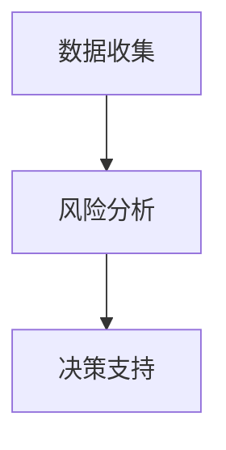
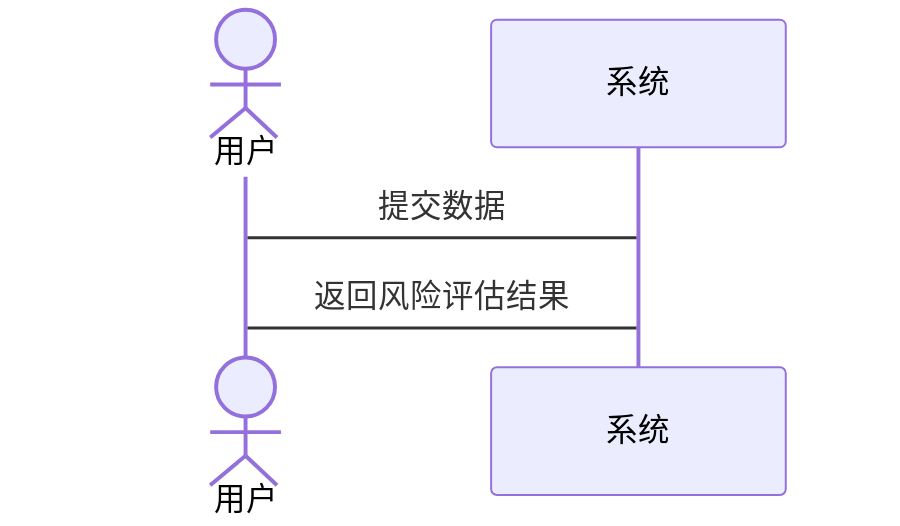

                 


# 彼得林奇的"反向思维"在地缘政治风险评估中的应用

> 关键词：彼得林奇，反向思维，地缘政治，风险评估，算法原理

> 摘要：本文探讨了彼得林奇的反向思维在地缘政治风险评估中的应用。首先介绍了反向思维的核心概念和地缘政治风险评估的基本原理。然后详细分析了反向思维在地缘政治中的独特价值，并结合数学模型和算法，详细讲解了反向思维在风险评估中的具体实现。最后，通过实际案例分析，展示了反向思维在地缘政治决策中的应用效果，并提出了相应的系统架构设计方案。

---

# 第一部分: 彼得林奇的"反向思维"与地缘政治风险评估概述

## 第1章: 反向思维的定义与核心概念

### 1.1 反向思维的定义与特点

#### 1.1.1 什么是反向思维
反向思维是一种与传统思维方式相反的思考方式，它通过从相反的角度出发，寻找问题的解决办法或机会。这种思维方式在投资领域尤其著名，彼得·林奇是其代表人物之一。

反向思维的核心在于“逆向思考”，即通过分析问题的对立面，找到潜在的机会或风险。例如，在投资中，反向思维可以帮助投资者在市场低迷时发现被低估的资产，在市场繁荣时警惕潜在的风险。

#### 1.1.2 反向思维的核心特点
- **对立性**：反向思维强调从对立面出发，寻找问题的解决办法。
- **独特性**：通过反向思考，可以发现传统思维难以察觉的机会或风险。
- **实用性**：反向思维在投资、商业决策等领域具有广泛的应用价值。

#### 1.1.3 反向思维与传统思维的对比

| 特性 | 传统思维 | 反向思维 |
|------|----------|----------|
| 视角 | 正向分析 | 逆向分析 |
| 优点 | 直观易懂 | 发现潜在机会 |
| 局限性 | 易受惯性思维影响 | 需要更多创新思维 |

### 1.2 地缘政治风险评估的基本概念

#### 1.2.1 地缘政治的定义
地缘政治是指地理因素对政治格局的影响，涉及国家之间的权力斗争、资源分配和领土争端等。

#### 1.2.2 地缘政治风险的分类
地缘政治风险可以分为以下几类：
- **政治风险**：如政府更迭、政策变化等。
- **经济风险**：如贸易摩擦、资源短缺等。
- **军事风险**：如战争、冲突等。
- **文化风险**：如文化冲突、宗教极端主义等。

#### 1.2.3 地缘政治风险评估的意义
地缘政治风险评估可以帮助企业和政府提前识别潜在风险，制定有效的应对策略。例如，企业在跨国投资时，可以通过评估地缘政治风险，选择相对稳定的市场。

---

## 第2章: 彼得林奇反向思维在地缘政治中的应用背景

### 2.1 当前地缘政治的复杂性

#### 2.1.1 全球化背景下的地缘政治挑战
全球化使得国家之间的联系更加紧密，但也带来了更多的地缘政治风险。例如，贸易摩擦、供应链中断等问题频发。

#### 2.1.2 地缘政治风险的多样性
地缘政治风险具有多样性和复杂性。例如，中东地区的政治动荡可能影响全球能源供应，而中美之间的贸易摩擦可能影响全球经济格局。

#### 2.1.3 传统地缘政治分析的局限性
传统地缘政治分析方法通常基于正向思维，即从已知的事实出发，预测未来的发展趋势。这种方法在面对复杂多变的地缘政治环境时，往往显得力不从心。

### 2.2 反向思维在地缘政治中的独特价值

#### 2.2.1 反向思维在风险识别中的作用
通过反向思维，可以提前识别潜在的地缘政治风险。例如，通过分析一个国家的经济状况，可以预测其可能面临的政治动荡。

#### 2.2.2 反向思维在风险应对中的优势
反向思维可以帮助企业和政府制定更加灵活的应对策略。例如，在面对贸易摩擦时，可以通过反向思维寻找替代方案，降低风险。

#### 2.2.3 反向思维与地缘政治决策的关系
反向思维可以为地缘政治决策提供新的视角。通过反向思维，可以更好地理解对手的动机和行为模式，从而制定更加有效的应对策略。

---

# 第二部分: 反向思维在地缘政治风险评估中的核心概念与联系

## 第3章: 地缘政治风险评估的核心要素

### 3.1 地缘政治风险的核心要素

#### 3.1.1 政治因素
政治因素是地缘政治风险的核心要素之一。例如，政府更迭、政策变化、政治动荡等都可能对地缘政治风险产生重大影响。

#### 3.1.2 经济因素
经济因素是地缘政治风险的重要组成部分。例如，经济衰退、贸易摩擦、资源短缺等都可能引发地缘政治冲突。

#### 3.1.3 文化因素
文化因素在地缘政治风险中起着重要作用。例如，文化冲突、宗教极端主义等可能引发地缘政治紧张。

#### 3.1.4 军事因素
军事因素是地缘政治风险的关键要素。例如，军事冲突、军备竞赛、领土争端等都可能引发地缘政治风险。

### 3.2 反向思维与地缘政治风险要素的关联

#### 3.2.1 反向思维如何影响政治决策
通过反向思维，可以更好地理解政治决策的动机和行为模式。例如，通过分析一个国家的政治决策，可以预测其可能采取的外交政策。

#### 3.2.2 经济利益与反向思维的结合
反向思维可以帮助企业和政府更好地应对经济利益相关的地缘政治风险。例如，通过分析贸易摩擦的潜在影响，制定更加灵活的贸易策略。

#### 3.2.3 文化差异与反向思维的策略
通过反向思维，可以更好地理解文化差异对地缘政治风险的影响。例如，通过分析文化冲突的潜在影响，制定更加有效的跨文化沟通策略。

---

## 第4章: 地缘政治风险评估的系统分析与架构设计

### 4.1 地缘政治风险评估的系统框架

#### 4.1.1 系统目标
地缘政治风险评估系统的目标是通过反向思维，帮助用户识别和应对潜在的地缘政治风险。

#### 4.1.2 系统边界
系统边界包括地缘政治风险的各个核心要素，如政治、经济、文化、军事等。

#### 4.1.3 系统功能模块
系统功能模块包括数据收集、风险分析、决策支持等。

### 4.2 系统架构设计

#### 4.2.1 数据收集模块
数据收集模块负责收集与地缘政治风险相关的各种数据，包括政治、经济、文化、军事等领域的数据。

#### 4.2.2 风险分析模块
风险分析模块通过对收集到的数据进行分析，识别潜在的地缘政治风险。

#### 4.2.3 决策支持模块
决策支持模块基于风险分析结果，提供具体的应对策略和决策支持。

### 4.3 系统接口与交互设计

#### 4.3.1 数据接口设计
数据接口设计包括数据输入、数据处理和数据输出的接口设计。

#### 4.3.2 用户交互流程
用户交互流程包括用户输入需求、系统分析需求、系统输出结果等。

---

# 第三部分: 反向思维在地缘政治风险评估中的算法原理与数学模型

## 第5章: 反向思维的算法原理

### 5.1 反向思维算法概述

#### 5.1.1 算法的基本思想
反向思维算法的基本思想是通过从相反的角度出发，寻找问题的解决办法或机会。

#### 5.1.2 算法的输入与输出
- 输入：地缘政治风险相关的数据，如政治、经济、文化、军事等领域的数据。
- 输出：潜在的地缘政治风险及应对策略。

#### 5.1.3 算法的实现步骤
1. 数据收集与预处理
2. 风险识别与分析
3. 应对策略制定

### 5.2 反向思维算法的数学模型

#### 5.2.1 数学模型的建立
反向思维算法的数学模型可以通过概率分析和博弈论模型来建立。

#### 5.2.2 概率分析与风险评估
概率分析可以帮助我们量化地缘政治风险的可能性和影响程度。

#### 5.2.3 算法的优化与改进
通过不断优化算法模型，提高地缘政治风险评估的准确性和实用性。

### 5.3 算法实现的Python代码示例

#### 5.3.1 代码框架
```python
def reverse_thinking_analysis(data):
    # 数据预处理
    processed_data = preprocess(data)
    # 风险识别
    risks = identify_risks(processed_data)
    # 应对策略制定
    strategies = develop_strategies(risks)
    return strategies
```

#### 5.3.2 代码实现
```python
def preprocess(data):
    # 数据清洗和转换
    processed_data = {}
    for key, value in data.items():
        processed_data[key] = value.strip().lower()
    return processed_data

def identify_risks(processed_data):
    # 风险识别
    risks = []
    for key, value in processed_data.items():
        if value == '政治':
            risks.append('政治风险')
        elif value == '经济':
            risks.append('经济风险')
    return risks

def develop_strategies(risks):
    # 应对策略制定
    strategies = []
    for risk in risks:
        if risk == '政治风险':
            strategies.append('加强政企沟通')
        elif risk == '经济风险':
            strategies.append(' diversify investments')
    return strategies

data = {
    'factor1': '政治',
    'factor2': '经济',
    'factor3': '文化'
}

strategies = reverse_thinking_analysis(data)
print("识别到的风险:", data)
print("应对策略:", strategies)
```

#### 5.3.3 代码解读
- 数据预处理：对输入数据进行清洗和转换，确保数据格式一致。
- 风险识别：根据数据内容，识别潜在的地缘政治风险。
- 应对策略制定：根据识别的风险，制定相应的应对策略。

---

## 第6章: 地缘政治风险评估的数学模型

### 6.1 数学模型的构建

#### 6.1.1 风险评估公式
$$
\text{风险值} = \sum_{i=1}^{n} w_i \times r_i
$$
其中，\( w_i \) 是第 \( i \) 个风险因素的权重，\( r_i \) 是第 \( i \) 个风险因素的风险值。

#### 6.1.2 模型的参数设定
- \( w_i \)：根据经验或专家判断确定各风险因素的权重。
- \( r_i \)：根据历史数据或专家判断确定各风险因素的风险值。

#### 6.1.3 模型的验证与测试
通过历史数据验证模型的准确性，并根据验证结果调整模型参数。

### 6.2 数学公式的详细推导

#### 6.2.1 风险概率计算公式
$$
P(r) = \sum_{i=1}^{n} P(r_i) \times w_i
$$
其中，\( P(r_i) \) 是第 \( i \) 个风险因素发生的概率，\( w_i \) 是其权重。

#### 6.2.2 模型的优化公式
$$
\text{优化后的风险值} = \sum_{i=1}^{n} (w_i \times r_i) \times \alpha_i
$$
其中，\( \alpha_i \) 是根据优化目标调整的系数。

#### 6.2.3 模型的适用性
通过数学模型，我们可以量化地缘政治风险的可能性和影响程度，为决策者提供科学依据。

---

## 第7章: 系统架构与交互设计

### 7.1 系统架构设计

#### 7.1.1 系统功能模块
- 数据收集模块
- 风险分析模块
- 决策支持模块

#### 7.1.2 系统架构图


### 7.2 系统接口设计

#### 7.2.1 数据接口设计
- 输入接口：接收地缘政治风险相关的数据。
- 输出接口：输出潜在风险及应对策略。

#### 7.2.2 用户交互流程


---

## 第8章: 项目实战与案例分析

### 8.1 项目实战

#### 8.1.1 环境安装
- 安装Python和相关库（如pandas、numpy）。

#### 8.1.2 系统核心实现源代码
```python
import pandas as pd
import numpy as np

def reverse_thinking_analysis(data_frame):
    processed_data = data_frame.apply(lambda x: x.astype(str).str.strip().str.lower(), axis=1)
    risks = []
    for i in range(len(processed_data)):
        if processed_data.iloc[i, 0] == '政治':
            risks.append('政治风险')
        elif processed_data.iloc[i, 1] == '经济':
            risks.append('经济风险')
    strategies = []
    for risk in risks:
        if risk == '政治风险':
            strategies.append('加强政企沟通')
        elif risk == '经济风险':
            strategies.append('diversify investments')
    return strategies

data = {
    'factor1': ['政治', '经济', '文化'],
    'factor2': ['经济', '政治', '文化']
}

data_frame = pd.DataFrame(data)
strategies = reverse_thinking_analysis(data_frame)
print("识别到的风险:", data)
print("应对策略:", strategies)
```

#### 8.1.3 代码应用解读与分析
通过上述代码，我们可以实现地缘政治风险的识别与应对策略的制定。数据预处理确保了数据的一致性，风险识别模块能够准确识别潜在风险，决策支持模块则为用户提供具体的应对策略。

### 8.2 实际案例分析

#### 8.2.1 案例背景
假设某企业在中东地区进行投资，需要评估地缘政治风险。

#### 8.2.2 风险识别
通过反向思维算法，识别出中东地区的政治风险和经济风险。

#### 8.2.3 应对策略
根据识别的风险，制定相应的应对策略，例如加强政企沟通、分散投资等。

---

## 第9章: 最佳实践与总结

### 9.1 最佳实践 tips

- 数据的准确性和完整性对地缘政治风险评估至关重要。
- 反向思维算法需要结合实际情况进行优化和调整。
- 在实际应用中，应结合多种方法进行综合评估。

### 9.2 小结
本文详细探讨了彼得林奇的反向思维在地缘政治风险评估中的应用，通过数学模型和算法，展示了如何利用反向思维帮助企业和政府识别和应对潜在的地缘政治风险。

### 9.3 注意事项
- 数据的准确性和及时性直接影响评估结果。
- 模型的优化需要结合实际需求进行调整。
- 在实际应用中，应考虑多种因素的综合作用。

### 9.4 拓展阅读
- 彼得·林奇的投资策略
- 地缘政治学的经典理论
- 数学模型在风险管理中的应用

---

# 作者：AI天才研究院/AI Genius Institute & 禅与计算机程序设计艺术 /Zen And The Art of Computer Programming

