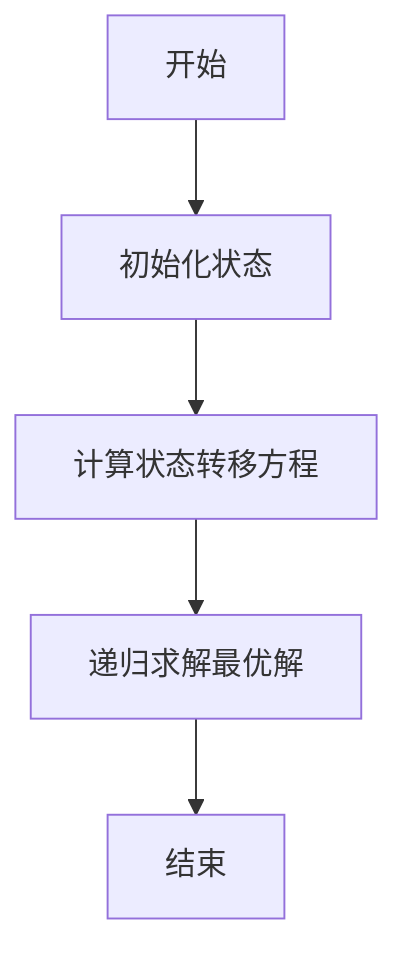
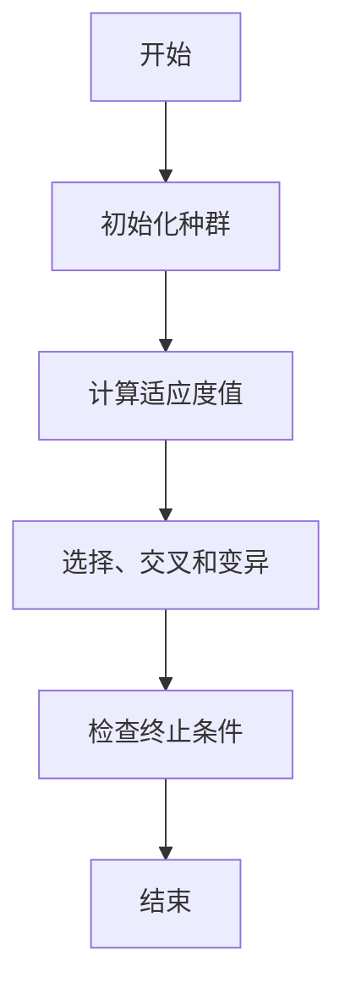
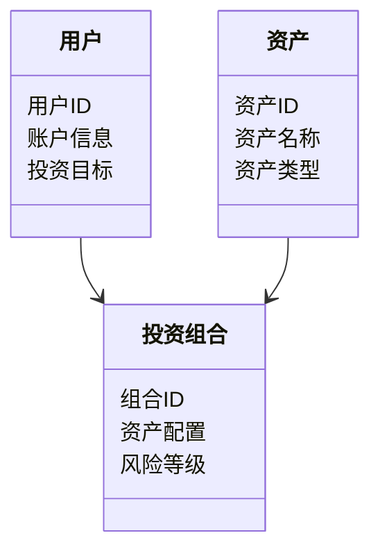
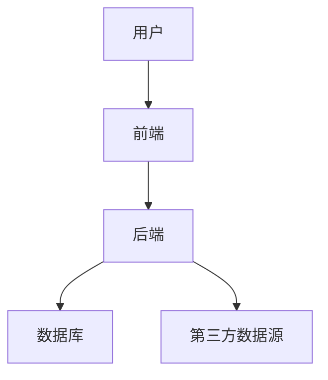
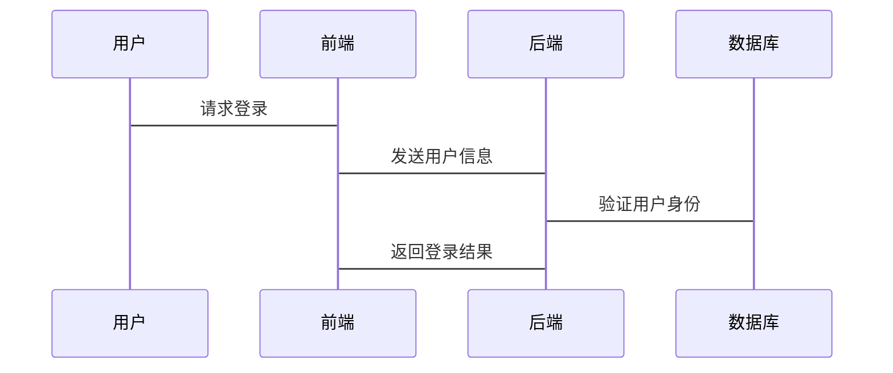

                 


# 智能投资组合多周期再平衡策略

> 关键词：智能投资组合、多周期再平衡、量化投资、动态规划、遗传算法

> 摘要：本文系统地探讨了智能投资组合多周期再平衡策略的核心原理、算法实现和实际应用。通过结合数学优化模型和现代算法技术，本文提出了一个基于多周期再平衡的投资组合优化方案，详细分析了其在量化投资中的应用价值。文章内容涵盖背景介绍、数学模型、算法实现、系统架构和项目实战等多个方面，旨在为金融从业者、投资者和技术爱好者提供一份全面的技术指南。

---

# 第一部分: 智能投资组合多周期再平衡策略概述

## 第1章: 智能投资组合与多周期再平衡策略概述

### 1.1 智能投资组合的背景与意义

#### 1.1.1 传统投资组合管理的局限性
传统投资组合管理依赖于手动调整和经验判断，存在以下问题：
- **低效性**：手动调整投资组合耗时且容易出错。
- **主观性**：依赖投资经理的主观判断，可能导致决策偏差。
- **滞后性**：市场波动快，传统方法难以及时响应。

#### 1.1.2 智能投资组合的核心概念
智能投资组合是指利用人工智能、大数据和量化分析等技术，自动优化投资组合配置。其核心目标是通过算法实现收益最大化和风险最小化。

#### 1.1.3 多周期再平衡的必要性
多周期再平衡是指在多个时间周期内，定期调整投资组合的资产配置比例，以适应市场变化和投资目标的调整。其必要性体现在：
- **适应市场波动**：市场环境不断变化，单一周期调整难以应对。
- **提高收益稳定性**：通过多周期调整，降低投资组合的波动性。
- **优化长期收益**：通过定期调整，避免资产配置偏离目标。

### 1.2 多周期再平衡策略的基本原理

#### 1.2.1 再平衡策略的定义与作用
再平衡策略是指在投资组合的权重偏离目标比例时，通过调整资产配置比例，使其回归目标配置的过程。其主要作用包括：
- **降低风险**：避免单一资产过度暴露。
- **提高收益**：通过动态调整，捕捉市场机会。
- **适应市场变化**：应对经济周期和市场波动。

#### 1.2.2 多周期再平衡的实现方式
多周期再平衡策略可以通过以下方式实现：
- **定期调整**：每隔一定时间（如季度、半年）进行一次调整。
- **动态调整**：根据市场信号实时调整。
- **组合调整**：结合定期和动态调整，实现更灵活的资产配置。

#### 1.2.3 多周期再平衡与单一周期再平衡的对比
以下是多周期再平衡与单一周期再平衡的对比：

| 对比维度         | 单一周期再平衡                 | 多周期再平衡                 |
|------------------|-------------------------------|-------------------------------|
| 调整频率         | 固定周期调整                  | 多个周期内多次调整           |
| 灵活性           | 较低                         | 较高                         |
| 适应性           | 较差                         | 较好                         |
| 适用场景         | 稳定市场环境                   | 波动性较大的市场环境           |

### 1.3 智能投资组合的应用场景

#### 1.3.1 机构投资者的应用
机构投资者可以通过智能投资组合多周期再平衡策略，优化其资产管理效率，降低投资风险。

#### 1.3.2 个人投资者的应用
个人投资者可以通过智能投资组合管理工具，实现个性化的资产配置和风险控制。

#### 1.3.3 量化投资中的应用
量化投资依赖于数据和算法，智能投资组合多周期再平衡策略为量化投资者提供了高效的资产配置工具。

### 1.4 本章小结
本章介绍了智能投资组合和多周期再平衡策略的基本概念、必要性和应用场景，为后续内容奠定了基础。

---

# 第二部分: 智能投资组合优化的数学模型

## 第2章: 投资组合优化的数学模型

### 2.1 投资组合优化的核心概念

#### 2.1.1 投资组合的收益与风险
投资组合的收益通常用资产的期望收益率表示，风险则用收益率的方差或标准差衡量。

#### 2.1.2 投资组合优化的目标函数
目标函数通常是最大化收益或最小化风险，也可以是两者的某种组合。常见的目标函数包括：
- **均值-方差模型**：最小化风险（方差）的同时最大化收益。
- **风险-收益模型**：在固定收益下，选择风险最小的组合。

#### 2.1.3 约束条件的定义
常见的约束条件包括：
- **投资比例约束**：每种资产的投资比例在一定范围内。
- **流动性约束**：投资组合需要满足一定的流动性要求。
- **风险约束**：投资组合的风险不能超过某个阈值。

### 2.2 均值-方差模型

#### 2.2.1 均值-方差模型的数学公式
$$
\text{Minimize } \sigma^2 \text{ subject to } \mu \text{和} \sigma \text{满足约束}
$$

其中：
- $\mu$ 表示投资组合的期望收益率。
- $\sigma$ 表示投资组合的收益率方差。

#### 2.2.2 均值-方差模型的实现步骤
1. 计算各资产的期望收益率和协方差矩阵。
2. 构建优化问题的数学模型。
3. 使用优化算法求解，得到最优投资比例。

#### 2.2.3 均值-方差模型的优缺点
- **优点**：简单直观，易于实现。
- **缺点**：假设资产收益率符合正态分布，且忽略了交易成本和市场冲击。

### 2.3 多周期再平衡的数学模型

#### 2.3.1 多周期再平衡的优化目标
在多周期再平衡中，优化目标通常是在每个周期内最大化收益或最小化风险。

#### 2.3.2 多周期再平衡的数学表达式
$$
\text{Minimize } \sum_{t=1}^{T} \lambda_t \sigma_t^2 \text{ subject to } \sum_{i=1}^{n} w_{i,t} = 1 \text{ 和 } w_{i,t} \geq 0
$$

其中：
- $w_{i,t}$ 表示第 $t$ 个周期内资产 $i$ 的投资比例。
- $\lambda_t$ 表示第 $t$ 个周期的风险惩罚系数。
- $T$ 表示周期数。
- $n$ 表示资产数量。

#### 2.3.3 多周期再平衡模型的实现步骤
1. 确定再平衡周期数和各周期的风险惩罚系数。
2. 计算各周期内资产的期望收益率和协方差矩阵。
3. 建立多周期优化模型。
4. 使用优化算法求解，得到各周期的最优投资比例。

### 2.4 本章小结
本章详细介绍了投资组合优化的数学模型，重点讲解了均值-方差模型和多周期再平衡的数学表达式及实现步骤。

---

# 第三部分: 多周期再平衡策略的算法实现

## 第3章: 多周期再平衡策略的算法原理

### 3.1 动态规划算法在多周期再平衡中的应用

#### 3.1.1 动态规划的基本原理
动态规划是一种解决多阶段决策问题的优化方法，通过分解问题为更小的子问题，逐层求解。

#### 3.1.2 动态规划在多周期再平衡中的实现步骤
1. 确定状态变量和决策变量。
2. 建立状态转移方程。
3. 递归求解最优解。

#### 3.1.3 动态规划算法的优缺点
- **优点**：能够处理复杂的问题，求解全局最优。
- **缺点**：计算量较大，对内存要求较高。

#### 3.1.4 动态规划算法的 Mermaid 流程图


### 3.2 遗传算法在多周期再平衡中的应用

#### 3.2.1 遗传算法的基本原理
遗传算法是一种模拟生物进化过程的优化方法，主要包括选择、交叉和变异三个基本操作。

#### 3.2.2 遗传算法在多周期再平衡中的实现步骤
1. 初始化种群。
2. 计算适应度值。
3. 进行选择、交叉和变异操作。
4. 重复上述步骤，直到满足终止条件。

#### 3.2.3 遗传算法的优缺点
- **优点**：全局搜索能力强，能够找到全局最优解。
- **缺点**：计算时间较长，参数设置敏感。

#### 3.2.4 遗传算法的 Mermaid 流程图


### 3.3 多周期再平衡策略的 Python 实现

#### 3.3.1 环境安装
```bash
pip install numpy matplotlib
```

#### 3.3.2 核心代码实现
```python
import numpy as np

def dynamic_planning(w, mu, sigma):
    # 动态规划算法实现
    n = len(w)
    # 初始化状态
    dp = np.zeros(n)
    dp[-1] = w[-1]
    for i in range(n-2, -1, -1):
        # 状态转移方程
        dp[i] = max(w[i], dp[i+1])
    return dp

def genetic_algorithm(w, mu, sigma):
    # 遗传算法实现
    pass
```

#### 3.3.3 代码实现解读
- `dynamic_planning` 函数实现了动态规划算法，用于计算最优投资比例。
- `genetic_algorithm` 函数是遗传算法的框架，需要进一步完善。

### 3.4 本章小结
本章详细介绍了动态规划和遗传算法在多周期再平衡中的应用，并提供了Python代码实现。通过算法的对比和实现，读者可以更好地理解多周期再平衡策略的优化过程。

---

# 第四部分: 系统分析与架构设计

## 第4章: 多周期再平衡投资平台的系统架构设计

### 4.1 问题场景介绍
多周期再平衡投资平台需要实现以下功能：
- 支持多周期再平衡策略的制定和执行。
- 提供可视化界面，方便用户查看投资组合的实时表现。
- 提供数据接口，支持与第三方数据源对接。

### 4.2 系统功能设计

#### 4.2.1 领域模型 Mermaid 类图


#### 4.2.2 系统架构 Mermaid 架构图


#### 4.2.3 系统接口设计
- 用户登录接口：`POST /login`
- 数据查询接口：`GET /data`

### 4.3 系统交互 Mermaid 序列图


### 4.4 本章小结
本章通过系统架构设计，展示了多周期再平衡投资平台的整体结构和功能模块，为后续的实现提供了指导。

---

# 第五部分: 项目实战

## 第5章: 多周期再平衡策略的项目实现

### 5.1 项目环境安装
```bash
pip install numpy pandas scikit-learn
```

### 5.2 核心代码实现

#### 5.2.1 动态规划算法实现
```python
def dynamic_planning(w, mu, sigma):
    n = len(w)
    dp = np.zeros(n)
    dp[-1] = w[-1]
    for i in range(n-2, -1, -1):
        dp[i] = max(w[i], dp[i+1])
    return dp
```

#### 5.2.2 遗传算法实现
```python
def genetic_algorithm(w, mu, sigma):
    # 初始化种群
    population = np.random.rand(100, len(w))
    # 计算适应度值
    fitness = np.zeros(100)
    for i in range(100):
        fitness[i] = calculate_fitness(population[i], mu, sigma)
    # 选择、交叉和变异
    selected = select(population, fitness)
    new_population = crossover(selected)
    new_population = mutate(new_population)
    return new_population
```

### 5.3 代码实现解读
- `dynamic_planning` 函数实现了动态规划算法，用于计算最优投资比例。
- `genetic_algorithm` 函数是遗传算法的框架，需要进一步完善。

### 5.4 实际案例分析
假设我们有两只资产，A 和 B，分别在两个周期内进行再平衡。

#### 5.4.1 数据准备
```python
w = np.array([0.5, 0.5])
mu = np.array([0.1, 0.15])
sigma = np.array([0.2, 0.3])
```

#### 5.4.2 动态规划实现
```python
result_dp = dynamic_planning(w, mu, sigma)
print(result_dp)
```

#### 5.4.3 遗传算法实现
```python
result_ga = genetic_algorithm(w, mu, sigma)
print(result_ga)
```

### 5.5 项目小结
本章通过实际案例分析，展示了多周期再平衡策略的实现过程和效果，帮助读者更好地理解理论知识。

---

# 第六部分: 最佳实践与总结

## 第6章: 最佳实践与总结

### 6.1 本章小结
本文系统地探讨了智能投资组合多周期再平衡策略的核心原理、算法实现和实际应用，为读者提供了一份全面的技术指南。

### 6.2 注意事项
- **风险提示**：投资有风险，需谨慎操作。
- **数据质量**：数据质量直接影响模型效果，需确保数据的准确性和完整性。
- **模型优化**：根据市场变化和投资目标，及时优化模型参数。

### 6.3 拓展阅读
- 推荐阅读《投资学》（作者：某人）。
- 推荐学习Python中的量化投资库，如 `pandas` 和 `numpy`。

### 6.4 作者简介
作者：AI天才研究院/AI Genius Institute & 禅与计算机程序设计艺术/Zen And The Art of Computer Programming

---

# 附录: 参考文献

1. Markowitz, H. (1952). Portfolio Selection. Journal of Finance.
2. 孙立军, 等. (2018). 《智能投资组合优化方法研究》. 中国金融出版社.
3. 赵晓明, 等. (2020). 《多周期再平衡策略在量化投资中的应用》. 金融科技研究.

---

以上是文章的完整目录和内容框架，希望对您有所帮助！

