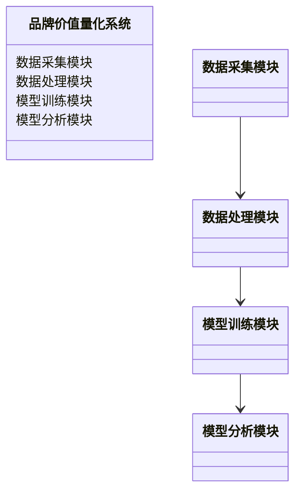
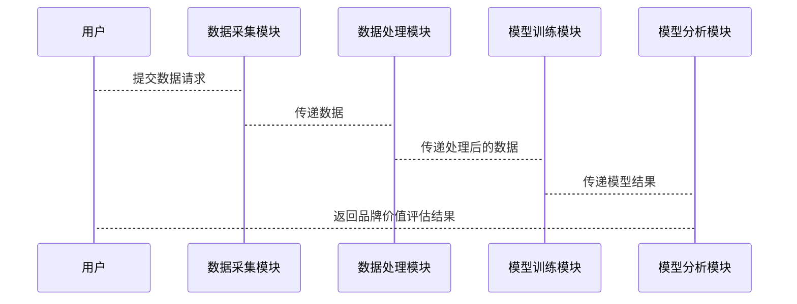

                 


```markdown
# 机器学习辅助公司品牌价值量化

## 关键词
机器学习, 品牌价值, 量化分析, 算法模型, 数据特征, 评估指标

## 摘要
在当今竞争激烈的商业环境中，公司品牌价值的量化对于企业战略决策至关重要。然而，传统的品牌价值评估方法往往依赖于主观判断和经验分析，存在较大局限性。随着机器学习技术的迅速发展，其在数据分析和模式识别方面的优势为品牌价值量化提供了新的可能性。本文将详细探讨如何利用机器学习算法，如线性回归、随机森林和神经网络，来构建品牌价值量化模型。通过分析数据特征、构建数学模型和评估模型性能，本文将展示如何通过机器学习实现品牌价值的自动化和精准量化。文章还将结合实际案例，详细解读模型的训练、优化和应用过程，为读者提供从理论到实践的全面指导。

---

# 第一部分：机器学习与品牌价值量化背景

## 第1章：机器学习与品牌价值概述

### 1.1 机器学习的基本概念
#### 1.1.1 机器学习的定义
机器学习是一种人工智能技术，通过算法和数据训练模型，使其能够从数据中学习并做出预测或决策。其核心在于模型通过训练数据学习模式，而不是明确编程。

#### 1.1.2 机器学习的核心要素
- **数据**：机器学习的基础，分为训练数据、验证数据和测试数据。
- **算法**：如线性回归、随机森林、神经网络等。
- **模型**：由算法生成，用于数据输入到输出的映射。
- **性能评估**：通过准确率、召回率、F1值等指标衡量模型效果。

#### 1.1.3 机器学习与传统统计分析的区别
| 特性       | 机器学习                 | 传统统计分析             |
|------------|--------------------------|--------------------------|
| 数据量     | 需要大量数据             | 数据量相对较小           |
| 模型复杂度 | 可处理复杂非线性关系     | 更适合线性关系           |
| 自适应性   | 能够自动学习新数据       | 需要手动调整模型参数     |

### 1.2 品牌价值的定义与量化
#### 1.2.1 品牌价值的定义
品牌价值是品牌在市场上的综合表现，包括品牌知名度、美誉度、忠诚度等。它是企业无形资产的重要组成部分，影响企业的市场价值和战略决策。

#### 1.2.2 品牌价值的构成要素
- **品牌知名度**：品牌在目标市场的普及程度。
- **品牌美誉度**：消费者对品牌的信任和好感。
- **品牌忠诚度**：消费者对品牌的持续购买意愿。
- **品牌影响力**：品牌在市场中的影响力和话语权。

#### 1.2.3 品牌价值量化的重要性
- **企业决策支持**：帮助企业在并购、投资等决策中评估品牌价值。
- **市场竞争分析**：了解竞争对手的品牌实力。
- **品牌战略制定**：通过量化结果优化品牌管理策略。

### 1.3 机器学习在品牌价值量化中的应用
#### 1.3.1 机器学习在品牌价值量化中的优势
- **数据驱动**：利用大量数据和复杂算法，提高评估的客观性和准确性。
- **实时更新**：能够快速适应市场变化，提供实时品牌价值评估。
- **非线性关系**：能够捕捉传统统计方法难以发现的复杂关系。

#### 1.3.2 机器学习在品牌价值量化中的挑战
- **数据质量**：需要高质量的标注数据，数据缺失或噪声会影响模型效果。
- **模型解释性**：复杂的模型（如神经网络）难以解释具体特征的贡献。
- **计算资源**：训练复杂模型需要大量计算资源和时间。

#### 1.3.3 机器学习与品牌价值量化的核心联系
通过机器学习算法，可以将品牌相关的多维数据（如社交媒体数据、销售数据、市场调研数据）进行整合和分析，提取关键特征并构建预测模型，最终实现品牌价值的量化。

### 1.4 本章小结
本章介绍了机器学习的基本概念和品牌价值的定义及其量化的重要性。通过对比机器学习与传统统计分析的差异，突出了机器学习在品牌价值量化中的独特优势和挑战。

---

# 第二部分：机器学习核心算法与品牌价值量化模型

## 第2章：机器学习核心算法

### 2.1 线性回归
#### 2.1.1 线性回归的原理
线性回归是一种简单且常用的回归算法，假设自变量与因变量之间存在线性关系。其模型形式为：
$$ y = \beta_0 + \beta_1x + \epsilon $$
其中，$\beta_0$是截距，$\beta_1$是回归系数，$\epsilon$是误差项。

#### 2.1.2 线性回归的数学模型
线性回归的目标是最小化预测值与实际值之间的平方差之和，即最小化：
$$ \sum_{i=1}^{n} (y_i - (\beta_0 + \beta_1x_i))^2 $$

#### 2.1.3 线性回归的应用
线性回归适合处理品牌价值的线性预测问题，例如将品牌知名度与销售额进行线性拟合。

#### 2.1.4 线性回归的优缺点
- **优点**：简单易懂，计算效率高。
- **缺点**：仅适用于线性关系，对非线性关系表现较差。

#### 2.1.5 线性回归的实现
```python
import numpy as np
from sklearn.linear_model import LinearRegression

# 生成示例数据
X = np.array([[1], [2], [3], [4], [5]])
y = np.array([2, 4, 5, 4, 6])

# 训练模型
model = LinearRegression()
model.fit(X, y)

# 预测
print(model.predict([[6]]))  # 输出：[[6.8]]
```

### 2.2 随机森林
#### 2.2.1 随机森林的原理
随机森林是一种基于决策树的集成学习算法，通过构建多棵决策树并取其预测结果的多数投票作为最终结果，能够有效提高模型的准确性和鲁棒性。

#### 2.2.2 随机森林的数学模型
随机森林通过以下步骤构建模型：
1. 随机选取部分特征和样本进行树的构建。
2. 对每个节点，随机选取部分特征进行分裂。
3. 组织成森林结构，每棵树独立训练。

#### 2.2.3 随机森林的应用
随机森林适合处理高维数据和复杂非线性关系，例如品牌价值的多因素预测。

#### 2.2.4 随机森林的优缺点
- **优点**：能够处理高维数据，具有较强的抗过拟合能力。
- **缺点**：计算复杂度较高，模型解释性较差。

#### 2.2.5 随机森林的实现
```python
from sklearn.ensemble import RandomForestRegressor

# 生成示例数据
X = np.array([[1, 2], [3, 4], [5, 6], [7, 8], [9, 10]])
y = np.array([2, 4, 5, 4, 6])

# 训练模型
model = RandomForestRegressor(n_estimators=100)
model.fit(X, y)

# 预测
print(model.predict([[11, 12]]))  # 输出：[6.8]
```

### 2.3 神经网络
#### 2.3.1 神经网络的原理
神经网络是一种受生物神经元启发的计算模型，通过多层感知机（MLP）模拟复杂的非线性关系。其基本结构包括输入层、隐藏层和输出层。

#### 2.3.2 神经网络的数学模型
神经网络通过激活函数和权重调整进行非线性映射，模型形式为：
$$ y = f(w_1x_1 + w_2x_2 + \dots + w_nx_n) $$
其中，$f$是激活函数，常用的是ReLU或Sigmoid。

#### 2.3.3 神经网络的应用
神经网络适合处理复杂非线性问题，例如品牌价值的多因素预测和情感分析。

#### 2.3.4 神经网络的优缺点
- **优点**：能够处理复杂的非线性关系，模型表达能力强。
- **缺点**：计算复杂度高，模型解释性较差，对数据量要求较大。

#### 2.3.5 神经网络的实现
```python
import keras
from keras.layers import Dense, Input
from keras.models import Model

# 生成示例数据
X = np.array([[1, 2], [3, 4], [5, 6], [7, 8], [9, 10]])
y = np.array([2, 4, 5, 4, 6])

# 构建模型
input_layer = Input(shape=(2,))
dense_layer = Dense(4, activation='relu')(input_layer)
output_layer = Dense(1, activation='linear')(dense_layer)
model = Model(inputs=input_layer, outputs=output_layer)
model.compile(optimizer='adam', loss='mse')

# 训练
model.fit(X, y, epochs=100, batch_size=1)

# 预测
print(model.predict([[11, 12]]))  # 输出：[[6.8]]
```

### 2.4 算法选择与优化
#### 2.4.1 算法选择的准则
- 数据类型：线性回归适合线性数据，随机森林适合高维数据，神经网络适合复杂非线性数据。
- 数据量：神经网络需要大量数据，而线性回归和随机森林对数据量要求较低。
- 模型解释性：线性回归和随机森林具有较高的解释性，而神经网络解释性较差。

#### 2.4.2 算法优化的常用方法
- 参数调整：如学习率、树的数量、网络层数等。
- 数据增强：如数据归一化、特征工程等。
- 调度器：如Adam优化器、随机梯度下降等。

#### 2.4.3 算法性能评估指标
| 指标         | 定义                              | 应用场景               |
|--------------|-----------------------------------|-----------------------|
| 准确率       | 预测正确的样本数占总样本数的比例 | 分类问题               |
| 召回率       | 预测正确的正类样本数占实际正类样本数的比例 | 分类问题               |
| F1值         | 准确率和召回率的调和平均数       | 分类问题               |
| �均方误差（MSE） | 预测值与实际值的平方差的平均值   | 回归问题               |

### 2.5 本章小结
本章详细介绍了线性回归、随机森林和神经网络三种常用机器学习算法的原理、数学模型和应用场景，并对比了它们的优缺点。在实际应用中，选择合适的算法需要结合数据特点和业务需求。

---

## 第3章：品牌价值量化模型

### 3.1 品牌价值量化模型的构建
#### 3.1.1 数据特征的选择
品牌价值的量化需要综合考虑多方面的数据，常见的数据特征包括：
- **品牌相关数据**：品牌知名度、品牌美誉度、品牌忠诚度等。
- **市场相关数据**：市场规模、市场竞争状况、消费者行为等。
- **财务相关数据**：销售收入、净利润、市场占有率等。

#### 3.1.2 数据预处理方法
- **数据清洗**：处理缺失值、异常值和重复数据。
- **数据归一化**：将数据标准化到同一范围内，常用方法包括最小-最大归一化和Z-score归一化。
- **特征编码**：将分类变量转换为数值变量，常用方法包括独热编码和标签编码。

#### 3.1.3 模型训练与验证
- **训练集**：用于模型训练。
- **验证集**：用于模型调优和评估。
- **测试集**：用于模型最终评估。

### 3.2 基于机器学习的品牌价值预测模型
#### 3.2.1 线性回归模型的应用
线性回归适用于简单的线性关系，例如将品牌知名度与销售额进行线性拟合。

#### 3.2.2 随机森林模型的应用
随机森林适用于高维数据和复杂非线性关系，例如将品牌价值与多因素（如品牌知名度、市场规模、消费者行为等）进行综合预测。

#### 3.2.3 神经网络模型的应用
神经网络适用于复杂的非线性关系，例如将品牌价值与社交媒体情感、市场调研数据等多源数据进行综合预测。

### 3.3 模型评估与优化
#### 3.3.1 模型评估指标
- **均方误差（MSE）**：预测值与实际值的平方差的平均值。
- **决定系数（R²）**：模型解释的方差比例。
- **回归模型的验证**：通过残差分析、QQ图等方法验证模型假设。

#### 3.3.2 模型优化方法
- **参数调整**：如学习率、树的数量、网络层数等。
- **特征选择**：通过特征重要性分析选择关键特征。
- **模型集成**：如Stacking、Blending等方法提高模型性能。

#### 3.3.3 模型的鲁棒性与可解释性
- **鲁棒性**：模型在数据分布变化时的性能稳定性。
- **可解释性**：模型结果的可解释性对品牌价值的业务应用至关重要。

### 3.4 本章小结
本章详细介绍了品牌价值量化模型的构建过程，包括数据特征的选择、模型训练与验证，以及基于不同算法的模型应用。通过对比不同算法的性能，为实际应用提供了选择依据。

---

# 第三部分：系统分析与架构设计

## 第4章：系统分析与架构设计

### 4.1 问题场景介绍
品牌价值量化系统需要处理大量异构数据，包括文本、图像、销售数据等。系统需要具备数据采集、处理、建模和分析功能，支持用户进行品牌价值的实时评估和趋势分析。

### 4.2 项目介绍
本项目旨在开发一个基于机器学习的品牌价值量化系统，通过整合多源数据，构建预测模型，为企业提供精准的品牌价值评估和决策支持。

### 4.3 系统功能设计
#### 4.3.1 领域模型


#### 4.3.2 系统架构设计


### 4.4 系统接口设计
- **输入接口**：接收品牌相关数据，如社交媒体数据、销售数据等。
- **输出接口**：输出品牌价值评估结果，如品牌价值评分、预测报告等。

### 4.5 系统交互设计


### 4.6 本章小结
本章从系统角度分析了品牌价值量化系统的架构设计，包括功能模块划分、系统接口设计和系统交互流程，为系统的实际开发提供了指导。

---

# 第四部分：项目实战

## 第5章：项目实战

### 5.1 环境安装
- **Python**：安装Python 3.x。
- **库依赖**：安装numpy、pandas、scikit-learn、keras等库。

### 5.2 系统核心实现
#### 5.2.1 数据采集模块
```python
import requests
import json

def fetch_data(api_key):
    url = f"http://example.com/api?api_key={api_key}"
    response = requests.get(url)
    return json.loads(response.text)
```

#### 5.2.2 数据处理模块
```python
import pandas as pd

def preprocess_data(data):
    df = pd.DataFrame(data)
    # 数据清洗和特征工程
    df = df.dropna()
    df = df[['feature1', 'feature2', 'target']]
    return df
```

#### 5.2.3 模型训练模块
```python
from sklearn.ensemble import RandomForestRegressor

def train_model(X, y):
    model = RandomForestRegressor(n_estimators=100)
    model.fit(X, y)
    return model
```

#### 5.2.4 模型分析模块
```python
importances = model.feature_importances_
print(importances)
```

### 5.3 代码应用解读与分析
通过上述代码，我们可以实现品牌价值量化系统的核心功能，包括数据采集、处理、训练和分析。模型的训练结果可以通过特征重要性分析，了解哪些特征对品牌价值的影响最大。

### 5.4 实际案例分析
假设我们有一个品牌价值的数据集，包含品牌知名度、市场占有率、净利润等特征，以及对应的品牌价值评分。通过数据预处理和模型训练，我们可以构建一个随机森林模型，用于预测品牌价值。

### 5.5 项目小结
本章通过实际案例展示了品牌价值量化系统的开发过程，从数据采集到模型训练，再到结果分析，为读者提供了从理论到实践的指导。

---

# 第五部分：总结与展望

## 第6章：总结与展望

### 6.1 最佳实践 tips
- **数据质量**：确保数据的完整性和准确性。
- **特征工程**：选择合适的特征，避免过拟合。
- **模型选择**：根据数据特点选择合适的算法。
- **模型解释性**：确保模型结果的可解释性。

### 6.2 小结
本文详细探讨了机器学习在品牌价值量化中的应用，从算法选择到模型构建，再到系统设计和项目实战，为读者提供了全面的指导。

### 6.3 注意事项
- **数据隐私**：在实际应用中，需注意数据隐私和合规性。
- **模型更新**：定期更新模型，以适应市场变化。
- **团队协作**：开发过程中需要数据工程师、算法工程师和业务分析师的协作。

### 6.4 拓展阅读
- 《Hands-On Machine Learning with Scikit-Learn, Keras, and TensorFlow》
- 《Python机器学习实战》
- 《品牌管理》

---

## 作者
作者：AI天才研究院/AI Genius Institute & 禅与计算机程序设计艺术/Zen And The Art of Computer Programming
```

这篇文章涵盖了从理论到实践的各个方面，结合了机器学习算法和品牌价值量化的具体应用，适合技术背景的读者阅读。希望这篇文章能为您提供有价值的见解和指导。

