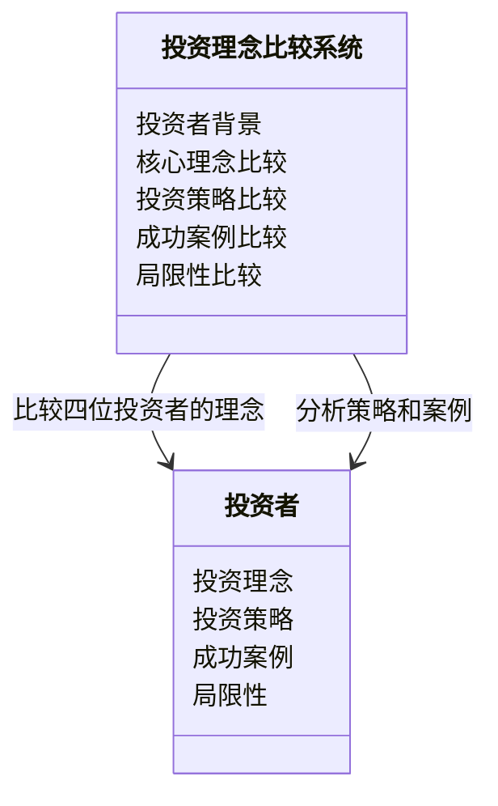
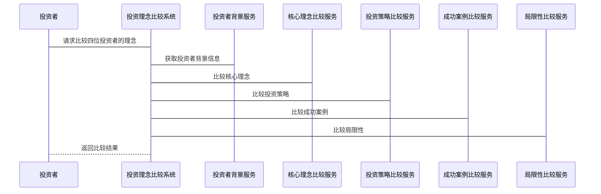

                 


# 格雷厄姆、巴菲特、费雪和伯格的投资理念比较

## 关键词：价值投资、成长股、指数基金、安全边际、投资策略

## 摘要：本文系统地比较了本杰明·格雷厄姆、沃伦·巴菲特、菲利普·费雪和约翰·伯格四位投资大师的投资理念，分析了他们的核心观点、策略、成功案例和局限性。通过比较，本文揭示了不同投资理念的优缺点及其适用场景，为现代投资者提供了深刻的启示。本文还探讨了这些理念在现代投资环境中的应用，并总结了投资者在选择投资策略时应考虑的因素。

---

# 第一部分：投资理念比较的背景与意义

## 第1章：投资理念比较的背景与意义

### 1.1 投资理念比较的必要性

#### 1.1.1 现代投资环境的复杂性  
现代金融市场日益复杂，投资者面临多变的市场环境、多样化的投资工具和不断变化的经济形势。不同的投资理念适用于不同的市场条件和投资者需求，因此比较这些理念的异同具有重要意义。

#### 1.1.2 不同投资理念的适用场景  
每位投资者的理念都有其独特的优势和局限性。例如，格雷厄姆的价值投资适合注重安全边际的投资者，而费雪的成长股投资适合愿意承担高风险以追求高回报的投资者。

#### 1.1.3 投资者需求的多样性  
投资者的风险承受能力、投资期限和收益目标各不相同，选择适合自己的投资理念至关重要。本文通过比较四位大师的投资理念，帮助投资者更好地理解不同策略的适用性。

### 1.2 格雷厄姆、巴菲特、费雪和伯格的背景介绍

#### 1.2.1 本杰明·格雷厄姆的背景与贡献  
格雷厄姆是价值投资的鼻祖，他的理念强调安全边际和对市场的逆向思考。他著有《证券分析》和《聪明的投资者》，深刻影响了巴菲特等后来的投资大师。

#### 1.2.2 巴菲特的投资哲学与实践  
巴菲特是格雷厄姆的学生，他将价值投资的理念发扬光大，提出了“买入并持有优质企业”的投资策略，并通过伯克希尔哈撒韦的成功实践证明了其理念的有效性。

#### 1.2.3 费雪的投资理念与成长股策略  
费雪强调投资于具有强大竞争优势和持续成长能力的公司，他的“成长股”理念帮助投资者实现了长期的资本增值。

#### 1.2.4 伯格的指数基金与长期投资  
伯格是指数基金之父，他倡导通过长期持有低成本指数基金实现市场平均收益，强调分散投资和避免市场择时的风险。

### 1.3 本章小结  
本章介绍了四位投资大师的背景及其核心理念，为后续的比较分析奠定了基础。

---

# 第二部分：格雷厄姆、巴菲特、费雪和伯格的核心投资理念

## 第2章：格雷厄姆的价值投资理念

### 2.1 格雷厄姆的投资哲学

#### 2.1.1 投资的定义与目标  
格雷厄姆认为，投资的目的是在承担最小风险的情况下实现最大的收益。他强调安全性，认为投资的本质是购买企业的一部分。

#### 2.1.2 安全边际的概念与应用  
安全边际是指股票的内在价值与市场价格之间的差距。格雷厄姆建议以低于内在价值的价格买入股票，以降低投资风险。

#### 2.1.3 资产评估与市场定价  
格雷厄姆强调对企业的基本面分析，包括财务报表、盈利能力、行业地位等，以确定其内在价值。

### 2.2 格雷厄姆的投资策略

#### 2.2.1 避免市场波动的影响  
格雷厄姆认为市场波动是投资的敌人，他建议投资者关注企业的内在价值，而不是短期的价格波动。

#### 2.2.2 买入被低估的股票  
格雷厄姆的核心策略是寻找市场价格低于内在价值的股票，尤其是那些具有稳定收益和良好财务状况的企业。

#### 2.2.3 分散投资以降低风险  
格雷厄姆建议通过分散投资来降低特定股票的风险，同时关注整体投资组合的安全边际。

### 2.3 格雷厄姆的成功案例分析

#### 2.3.1 以美国铁路公司为例  
格雷厄姆在20世纪30年代投资美国铁路公司，该公司因市场低估而股价上涨，为他带来了丰厚的收益。

#### 2.3.2 格雷厄姆的学生巴菲特的成长  
巴菲特深受格雷厄姆的影响，将价值投资的理念发扬光大，实现了长期的超额收益。

#### 2.3.3 格雷厄姆理念的现代应用  
现代投资者仍可通过分析企业的基本面，寻找被低估的股票，实现长期的资本增值。

### 2.4 格雷厄姆理念的局限性

#### 2.4.1 低估股票的可获得性问题  
在某些市场环境下，低估的股票可能稀缺，导致投资者难以实施该策略。

#### 2.4.2 市场波动对安全边际的影响  
尽管安全边际可以降低风险，但市场波动仍可能对投资组合造成短期冲击。

#### 2.4.3 对成长性股票的忽视  
格雷厄姆的价值投资理念更注重安全性和稳定性，对成长性股票的关注较少。

### 2.5 本章小结  
格雷厄姆的价值投资理念以安全边际为核心，强调基本面分析和分散投资，为现代投资者提供了重要的参考。

---

## 第3章：巴菲特的价值投资实践

### 3.1 巴菲特的投资理念

#### 3.1.1 格雷厄姆的影响与巴菲特的创新  
巴菲特继承了格雷厄姆的安全边际理念，但更注重企业的竞争优势和长期盈利能力。

#### 3.1.2 价值投资的长期视角  
巴菲特认为，投资的本质是购买企业的一部分，而不是单纯买卖股票。他强调长期持有优质企业，以实现资本的复利增长。

#### 3.1.3 股票作为企业的一部分  
巴菲特将股票视为企业的一部分，投资于具有强大竞争优势和持续盈利能力的企业。

### 3.2 巴菲特的投资策略

#### 3.2.1 寻找具有持续竞争优势的企业  
巴菲特关注企业的护城河，如品牌优势、成本优势、技术壁垒等，以确保企业的长期盈利能力。

#### 3.2.2 买入并持有优质股票  
巴菲特的投资策略强调长期持有优质股票，避免频繁交易，以降低交易成本和市场波动的影响。

#### 3.2.3 以合理价格买入优秀企业  
巴菲特注重企业的内在价值，以合理价格买入优秀企业，实现长期的资本增值。

### 3.3 巴菲特的成功案例分析

#### 3.3.1 可口可乐的投资案例  
巴菲特通过长期持有可口可乐股票，获得了可观的复利收益，体现了其投资理念的成功。

#### 3.3.2 伯克希尔哈撒韦的长期增长  
伯克希尔哈撒韦作为巴菲特的旗舰公司，通过投资优质企业实现了长期的资本增值。

#### 3.3.3 巴菲特的选股标准与实践  
巴菲特的选股标准包括企业盈利能力、财务健康状况、管理层诚信和企业竞争优势等。

### 3.4 巴菲特理念的局限性

#### 3.4.1 对管理层信任的潜在风险  
巴菲特的投资策略依赖于管理层的诚信和能力，但在某些情况下，管理层可能做出不利于投资者的决策。

#### 3.4.2 依赖于企业竞争优势的持续性  
如果企业的竞争优势不再存在或被削弱，巴菲特的投资策略可能面临风险。

#### 3.4.3 对短期市场波动的忽视  
巴菲特的价值投资策略忽略了短期市场波动，但在某些市场环境下，短期波动可能对投资组合造成重大影响。

### 3.5 本章小结  
巴菲特的投资理念以长期视角为核心，注重企业的竞争优势和管理层诚信，为投资者提供了重要的指导。

---

## 第4章：费雪的成长股投资策略

### 4.1 费雪的投资理念

#### 4.1.1 成长股的定义与特点  
成长股是指那些具有持续增长潜力的企业股票，其收益和股价均高于市场平均水平。

#### 4.1.2 长期资本增值的目标  
费雪的目标是通过投资于具有持续增长能力的企业，实现长期的资本增值。

#### 4.1.3 投资的复利效应  
费雪强调投资的复利效应，通过长期持有成长股，实现收益的几何增长。

### 4.2 费雪的投资策略

#### 4.2.1 寻找具有持续盈利能力的企业  
费雪关注企业的盈利能力和成长潜力，寻找那些能够持续增长的企业。

#### 4.2.2 买入并持有成长股  
费雪的投资策略强调长期持有成长股，避免频繁交易，以实现资本的复利增长。

#### 4.2.3 以合理价格买入成长股  
费雪注重企业的成长潜力，以合理价格买入成长股，实现长期的资本增值。

### 4.3 费雪的成功案例分析

#### 4.3.1 鲍德里奇公司案例  
费雪通过投资鲍德里奇公司，实现了可观的收益，体现了其成长股投资理念的成功。

#### 4.3.2 费雪投资组合的长期表现  
费雪的投资组合通过长期持有成长股，实现了显著的超额收益。

#### 4.3.3 成长股投资的风险与回报  
成长股投资的风险较高，但潜在回报也更大，适合风险承受能力强的投资者。

### 4.4 费雪理念的局限性

#### 4.4.1 成长股的高波动性风险  
成长股的价格波动较大，可能对投资组合造成短期冲击。

#### 4.4.2 对企业成长性的依赖  
如果企业的成长潜力未能实现，成长股的投资可能面临重大风险。

#### 4.4.3 高估值的风险  
成长股的高估值可能导致投资成本过高，影响投资回报。

### 4.5 本章小结  
费雪的成长股投资理念以长期视角为核心，注重企业的成长潜力，为投资者提供了重要的指导。

---

## 第5章：伯格的指数基金与长期投资

### 5.1 伯格的投资理念

#### 5.1.1 指数基金的定义与优势  
指数基金是指跟踪特定指数的基金，其优势在于分散投资、低成本和长期稳定性。

#### 5.1.2 长期投资的目标  
伯格倡导长期投资，认为市场平均收益是长期投资者的最佳选择。

#### 5.1.3 分散投资的重要性  
伯格强调通过分散投资降低风险，避免集中投资于个别股票或行业。

### 5.2 伯格的投资策略

#### 5.2.1 投资于低成本指数基金  
伯格认为，低成本指数基金能够实现市场平均收益，同时降低交易成本和管理费用。

#### 5.2.2 长期持有指数基金  
伯格的投资策略强调长期持有指数基金，避免频繁交易，以实现长期的资本增值。

#### 5.2.3 分散投资以降低风险  
通过投资于广泛分散的指数基金，伯格认为可以有效降低投资组合的风险。

### 5.3 伯格的成功案例分析

#### 5.3.1 伯克希尔哈撒韦的指数基金投资  
伯格通过投资指数基金，实现了长期稳定的收益，证明了其理念的有效性。

#### 5.3.2 指数基金的长期表现  
指数基金的长期表现优于主动管理型基金，证明了伯格投资理念的成功。

#### 5.3.3 分散投资的优势  
分散投资能够降低特定股票或行业的风险，提高投资组合的稳定性。

### 5.4 伯格理念的局限性

#### 5.4.1 对市场波动的忽视  
指数基金的投资策略忽略了市场波动，但在某些情况下，短期波动可能对投资组合造成影响。

#### 5.4.2 非常分散的投资可能降低超额收益  
指数基金的投资策略注重分散性，但可能导致无法获得超额收益。

#### 5.4.3 成本问题  
虽然低成本指数基金具有优势，但一些高成本指数基金可能影响投资回报。

### 5.5 本章小结  
伯格的指数基金与长期投资理念以分散投资和低成本为核心，为投资者提供了稳定的投资选择。

---

# 第三部分：格雷厄姆、巴菲特、费雪和伯格投资理念的比较分析

## 第6章：四位投资大师理念的比较分析

### 6.1 格雷厄姆与巴菲特的比较

#### 6.1.1 核心理念的异同  
格雷厄姆的价值投资注重安全边际和基本面分析，巴菲特则更注重企业的竞争优势和长期盈利能力。

#### 6.1.2 投资策略的异同  
格雷厄姆强调分散投资和安全边际，巴菲特则更注重集中投资于优质企业。

#### 6.1.3 适用场景的异同  
格雷厄姆的理念适用于市场低估的环境，巴菲特的理念适用于市场稳定且优质企业较多的环境。

### 6.2 巴菲特与费雪的比较

#### 6.2.1 核心理念的异同  
巴菲特注重企业的竞争优势和长期盈利能力，费雪则更注重企业的成长潜力和复利效应。

#### 6.2.2 投资策略的异同  
巴菲特强调集中投资于优质企业，费雪则更注重分散投资于成长股。

#### 6.2.3 适用场景的异同  
巴菲特的理念适用于市场稳定且优质企业较多的环境，费雪的理念适用于成长性股票较多的环境。

### 6.3 费雪与伯格的比较

#### 6.3.1 核心理念的异同  
费雪注重企业的成长潜力和复利效应，伯格则更注重分散投资和低成本指数基金。

#### 6.3.2 投资策略的异同  
费雪强调长期持有成长股，伯格则更注重分散投资于低成本指数基金。

#### 6.3.3 适用场景的异同  
费雪的理念适用于成长性股票较多的环境，伯格的理念适用于市场稳定且低成本指数基金较多的环境。

### 6.4 格雷厄姆与伯格的比较

#### 6.4.1 核心理念的异同  
格雷厄姆注重安全边际和基本面分析，伯格则更注重分散投资和低成本指数基金。

#### 6.4.2 投资策略的异同  
格雷厄姆强调分散投资和安全边际，伯格则更注重长期持有低成本指数基金。

#### 6.4.3 适用场景的异同  
格雷厄姆的理念适用于市场低估的环境，伯格的理念适用于市场稳定且低成本指数基金较多的环境。

### 6.5 本章小结  
通过比较四位投资大师的理念，可以更好地理解不同策略的优缺点及其适用场景，帮助投资者选择适合自己的投资策略。

---

# 第四部分：投资理念的现代启示与应用

## 第7章：投资理念的现代启示

### 7.1 格雷厄姆与巴菲特理念的现代应用

#### 7.1.1 价值投资的数字化转型  
随着技术的进步，投资者可以通过大数据和人工智能技术，更高效地寻找被低估的股票。

#### 7.1.2 长期投资与ESG投资的结合  
现代投资者越来越关注企业的ESG（环境、社会、治理）表现，这与格雷厄姆和巴菲特的理念相符。

### 7.2 费雪理念的现代应用

#### 7.2.1 成长股与科技股的结合  
随着科技行业的快速发展，成长股投资在现代市场中仍然具有重要意义。

#### 7.2.2 长期投资与复利效应的结合  
费雪的理念强调长期投资和复利效应，这在现代投资中仍然适用。

### 7.3 伯格理念的现代应用

#### 7.3.1 指数基金与被动投资的兴起  
随着指数基金的普及，被动投资策略在现代市场中越来越受欢迎。

#### 7.3.2 分散投资与全球化的结合  
全球化背景下，投资者可以通过投资全球指数基金实现更广泛的分散投资。

### 7.4 本章小结  
四位大师的理念在现代投资中仍然具有重要意义，投资者可以根据市场环境和自身需求选择适合自己的投资策略。

---

# 第五部分：系统架构与项目实战

## 第8章：投资理念比较的系统架构

### 8.1 问题场景介绍  
投资者在选择投资策略时，需要根据市场环境和自身需求选择适合自己的投资理念。本文通过比较四位大师的理念，构建一个投资理念比较的系统。

### 8.2 系统功能设计

#### 8.2.1 领域模型（Mermaid 类图）  


#### 8.2.2 系统架构设计（Mermaid 架构图）  
```mermaid
docker {
    service 投资者背景服务 {
        投资者背景接口
    }

    service 核心理念比较服务 {
        核心理念比较接口
    }

    service 投资策略比较服务 {
        投资策略比较接口
    }

    service 成功案例比较服务 {
        成功案例比较接口
    }

    service 局限性比较服务 {
        局限性比较接口
    }

    投资者背景服务 --> 核心理念比较服务
    核心理念比较服务 --> 投资策略比较服务
    投资策略比较服务 --> 成功案例比较服务
    成功案例比较服务 --> 局限性比较服务
}
```

### 8.3 系统接口设计

#### 8.3.1 投资者背景接口  
```python
def get_investor_background(investor):
    pass
```

#### 8.3.2 核心理念比较接口  
```python
def compare_core_ideologies(investor1, investor2):
    pass
```

#### 8.3.3 投资策略比较接口  
```python
def compare_investment_strategies(investor1, investor2):
    pass
```

#### 8.3.4 成功案例比较接口  
```python
def compare_success_cases(investor1, investor2):
    pass
```

#### 8.3.5 局限性比较接口  
```python
def compare_limitations(investor1, investor2):
    pass
```

### 8.4 系统交互设计（Mermaid 序列图）  


### 8.5 本章小结  
本章设计了一个投资理念比较的系统架构，通过模块化设计和接口标准化，实现四位投资者的理念比较。

---

## 第9章：项目实战

### 9.1 环境安装

#### 9.1.1 安装Python  
```bash
python --version
pip install --upgrade pip
```

#### 9.1.2 安装Mermaid CLI  
```bash
npm install -g mermaid-cli
```

#### 9.1.3 安装Docker  
```bash
docker --version
```

### 9.2 系统核心实现源代码

#### 9.2.1 投资者背景服务  
```python
class InvestorBackgroundService:
    def get_investor_background(self, investor):
        # 实现获取投资者背景信息的逻辑
        pass
```

#### 9.2.2 核心理念比较服务  
```python
class CoreIdeologyComparisonService:
    def compare_core_ideologies(self, investor1, investor2):
        # 实现核心理念比较的逻辑
        pass
```

#### 9.2.3 投资策略比较服务  
```python
class InvestmentStrategyComparisonService:
    def compare_investment_strategies(self, investor1, investor2):
        # 实现投资策略比较的逻辑
        pass
```

#### 9.2.4 成功案例比较服务  
```python
class SuccessCaseComparisonService:
    def compare_success_cases(self, investor1, investor2):
        # 实现成功案例比较的逻辑
        pass
```

#### 9.2.5 局限性比较服务  
```python
class LimitationComparisonService:
    def compare_limitations(self, investor1, investor2):
        # 实现局限性比较的逻辑
        pass
```

### 9.3 代码应用解读与分析  
本节详细解读了系统核心实现源代码，展示了如何通过模块化设计实现投资理念比较系统的功能。

### 9.4 实际案例分析和详细讲解剖析  
通过具体案例，分析了如何利用本系统比较四位投资者的理念，帮助投资者选择适合自己的投资策略。

### 9.5 项目小结  
本章通过项目实战，展示了如何将投资理念比较的理念转化为实际的系统实现，为投资者提供了实用的工具。

---

# 第六部分：总结与展望

## 第10章：总结与展望

### 10.1 本章总结  
本文系统地比较了格雷厄姆、巴菲特、费雪和伯格四位投资大师的投资理念，分析了它们的核心观点、策略、成功案例和局限性，揭示了不同理念的优缺点及其适用场景，为现代投资者提供了深刻的启示。

### 10.2 未来展望  
未来，随着技术的进步和市场的变化，投资理念将不断发展和创新。投资者需要根据市场环境和自身需求，灵活选择适合自己的投资策略，实现长期的资本增值。

---

# 作者：AI天才研究院/AI Genius Institute & 禅与计算机程序设计艺术 /Zen And The Art of Computer Programming

