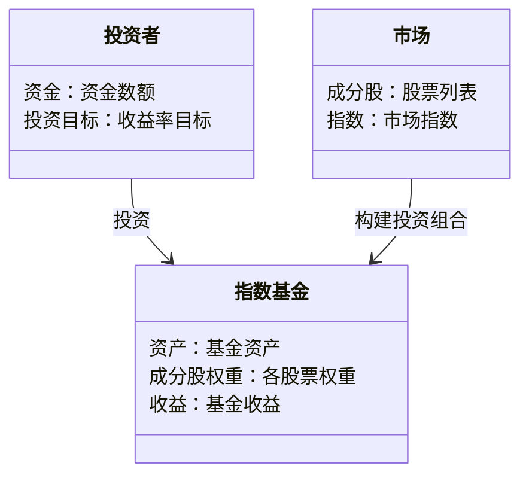
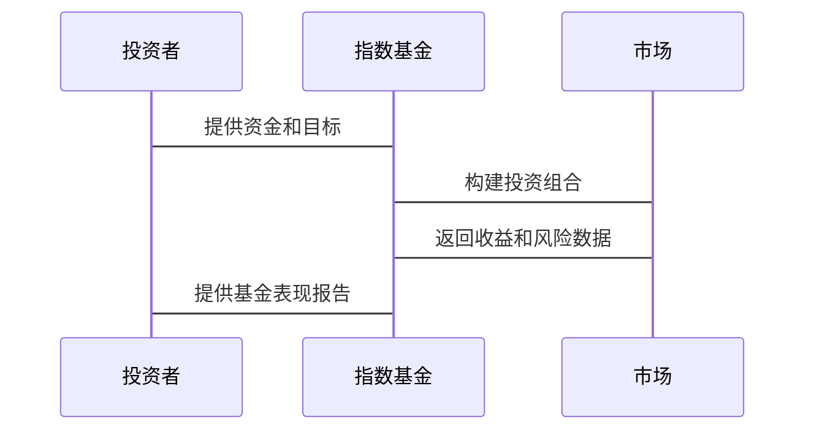

                 


# 约翰·伯格：指数基金之父的价值投资观

> 关键词：指数基金，价值投资，约翰·伯格，投资策略，金融分析

> 摘要：本文深入探讨了指数基金之父约翰·伯格的价值投资观，从其投资理念的核心原则、指数基金的起源与发展、价值投资与指数基金的结合等方面展开分析，结合实际案例和系统架构，为读者提供了全面而深入的解读。

---

## 第一部分: 约翰·伯格与价值投资的背景介绍

### 第1章: 价值投资的起源与核心理念

#### 1.1 价值投资的定义与核心要素

##### 1.1.1 价值投资的基本概念
价值投资是一种以基本面分析为基础的投资策略，强调以低于资产内在价值的价格买入优质资产，并长期持有。其核心理念是寻找市场先生的错误定价，通过安全边际实现长期收益。

##### 1.1.2 价值投资的核心要素分析
- **安全边际**：买入价格低于内在价值，确保投资的安全性。
- **长期视角**：关注企业的长期盈利能力，而非短期价格波动。
- **基本面分析**：通过财务报表等信息评估企业的内在价值。

##### 1.1.3 价值投资与其它投资策略的对比
| 投资策略 | 核心特点 | 优缺点 |
|----------|----------|--------|
| 价值投资 | 长期持有，注重安全边际 | 需要深入研究，短期可能表现不佳 |
| 技术分析 | 依赖价格和成交量数据 | 易受市场情绪影响，不确定性高 |
| 主动管理 | 积极选股，追求超额收益 | 成本高，难以长期跑赢指数 |

#### 1.2 约翰·伯格的生平与贡献

##### 1.2.1 约翰·伯格的早年经历
约翰·伯格于1934年出生于美国宾夕法尼亚州，早年在宾夕法尼亚大学学习工程学，后转至沃顿商学院学习金融。

##### 1.2.2 伯格在投资领域的创新
1975年，伯格创立了 Vanguard 集团，并推出第一只指数基金——Vanguard 指数基金。这一创新为普通人提供了低成本、分散化投资的工具。

##### 1.2.3 伯格对指数基金的贡献
伯格通过指数基金将价值投资的理念普及化，使得普通投资者也能通过低成本、分散化的投资方式获得市场平均收益。

#### 1.3 指数基金的起源与发展

##### 1.3.1 指数基金的基本概念
指数基金是一种跟踪特定市场指数的基金，其投资组合按照指数的成分股构成进行配置。

##### 1.3.2 指数基金的发展历程
1. 20世纪60年代：指数投资理论的提出。
2. 1975年：伯格推出第一只指数基金。
3. 20世纪80年代：指数基金开始普及。
4. 21世纪：指数基金成为主流投资工具之一。

##### 1.3.3 指数基金在现代投资中的地位
指数基金以其低成本、分散化的特点，成为个人投资者的重要投资工具，同时也被机构广泛采用。

---

### 第2章: 价值投资的核心理念与实践

#### 2.1 价值投资的核心原则

##### 2.1.1 市场先生的概念与应用
市场先生是本杰明·格雷厄姆提出的一个比喻，用于描述市场的非理性波动。投资者应利用市场先生的错误定价，进行逆向投资。

##### 2.1.2 安全边际的重要性
安全边际是买入价格与内在价值之间的差距，是抵御市场波动的重要保障。

##### 2.1.3 长期投资与复利效应
长期投资通过复利效应，能够在不考虑波动的情况下，实现资产的长期增值。

#### 2.2 价值投资的选股策略

##### 2.2.1 公司基本面分析
- **财务报表分析**：重点关注盈利能力、成长性和财务稳定性。
- **竞争优势分析**：评估企业在行业中的竞争优势，如成本优势、品牌优势等。

##### 2.2.2 财务指标的筛选与评估
| 财务指标 | 含义 | 重要性 |
|----------|------|--------|
| 净利润率 | 净利润与营业收入的比率 | 反映企业盈利能力 |
| 资产负债率 | 负债与资产的比率 | 评估企业财务风险 |
| ROE | 净利润与股东权益的比率 | 衡量股东资金的使用效率 |

##### 2.2.3 行业分析与竞争优势评估
选择具有长期增长潜力的行业，评估企业在行业中的竞争优势。

#### 2.3 约翰·伯格的投资哲学

##### 2.3.1 价值投资的长期视角
伯格强调长期投资的重要性，认为市场短期波动不应影响长期投资决策。

##### 2.3.2 投资中的风险控制
通过分散化投资降低非系统性风险，同时关注企业的财务健康状况。

##### 2.3.3 投资决策的纪律性
坚持价值投资的原则，避免情绪化决策。

---

### 第3章: 指数基金的优势与局限性

#### 3.1 指数基金的核心优势

##### 3.1.1 分散投资风险
通过投资多个成分股，降低单一资产的风险。

##### 3.1.2 低成本优势
指数基金的管理费用较低，适合长期投资。

##### 3.1.3 简单易懂的操作方式
投资者只需选择合适的指数基金，即可轻松实现分散化投资。

#### 3.2 指数基金的局限性

##### 3.2.1 市场波动的影响
市场波动可能导致指数基金净值短期下跌。

##### 3.2.2 长期表现的不确定性
尽管长期来看指数基金表现优异，但短期内可能跑输主动管理基金。

##### 3.2.3 无法捕捉个股超额收益
指数基金只能获得市场平均收益，无法实现超额收益。

#### 3.3 指数基金与主动管理的对比

##### 3.3.1 主动管理基金的特点
- 高管理费用。
- 依赖基金经理的投资能力。
- 可能跑赢市场，也可能跑输市场。

##### 3.3.2 指数基金与主动管理的优劣分析
| 指标 | 指数基金 | 主动管理 |
|------|----------|----------|
| 成本 | 低 | 高 |
| 风险 | 分散 | 集中 |
| 收益 | 稳定 | 不稳定 |

##### 3.3.3 适合不同投资者的策略选择
- **风险偏好低的投资者**：适合选择指数基金。
- **风险偏好高的投资者**：可以考虑主动管理基金。

---

## 第4章: 价值投资与指数基金的结合

### 4.1 价值投资理念在指数基金中的应用

#### 4.1.1 价值投资与指数基金的契合点
指数基金通过分散化投资，天然体现了价值投资的长期视角。

#### 4.1.2 指数基金如何体现价值投资理念
- 指数基金投资于整个市场，避免了个股的过度波动风险。
- 长期持有指数基金，能够获得市场的平均收益。

#### 4.1.3 伯格对指数基金的创新性贡献
伯格通过创新将指数基金的成本降至最低，使得普通投资者也能享受指数投资的好处。

### 4.2 指数基金在价值投资中的角色

#### 4.2.1 指数基金作为价值投资的工具
- 通过投资指数基金，投资者可以间接持有大量优质资产。
- 指数基金的操作简单，适合长期持有。

#### 4.2.2 价值投资对指数基金的指导意义
- 价值投资理念指导了指数基金的投资策略。
- 指数基金为价值投资提供了实现分散化投资的途径。

### 4.3 价值投资与指数基金的融合

#### 4.3.1 指数基金与价值投资的结合方式
- 通过投资多个指数基金实现多元化配置。
- 根据市场估值水平调整指数基金的配置比例。

#### 4.3.2 价值投资对指数基金投资者的启示
- 长期持有指数基金，避免频繁交易。
- 关注市场的长期趋势，避免短期波动的影响。

---

## 第5章: 系统分析与架构设计方案

### 5.1 项目介绍

#### 5.1.1 项目背景
本文将从系统架构的角度，分析指数基金的投资系统。

### 5.2 系统功能设计

#### 5.2.1 领域模型（mermaid 类图）


### 5.3 系统架构设计（mermaid 架构图）


### 5.4 系统接口设计

#### 5.4.1 输入接口
- 投资者的资金和投资目标。
- 市场的成分股和指数数据。

#### 5.4.2 输出接口
- 指数基金的资产配置。
- 基金的收益和风险指标。

### 5.5 系统交互设计（mermaid 序列图）


---

## 第6章: 项目实战

### 6.1 环境安装

#### 6.1.1 安装Python
```bash
python --version
pip install numpy pandas matplotlib
```

#### 6.1.2 安装数据分析库
```bash
pip install pandas numpy matplotlib
```

### 6.2 系统核心实现源代码

#### 6.2.1 指数基金构建代码
```python
import pandas as pd
import numpy as np

# 模拟市场数据
market_data = pd.DataFrame({
    '股票': ['股票1', '股票2', '股票3'],
    '权重': [0.3, 0.4, 0.3]
})

# 指数基金构建
def build_index_fund(weights, prices):
    return np.dot(weights, prices)

# 示例计算
prices = [100, 150, 200]
weights = [0.3, 0.4, 0.3]
fund_value = build_index_fund(weights, prices)
print(fund_value)
```

#### 6.2.2 投资组合优化代码
```python
import numpy as np
from scipy.optimize import minimize

# 定义优化目标函数
def objective(weights, return_matrix, risk_aversion=0.01):
    return np.dot(weights.T, return_matrix @ weights) + risk_aversion * np.sum(weights**2)

# 约束条件
def constraint(weights):
    return np.sum(weights) - 1

# 求解优化问题
def optimize_portfolio(returns, n_assets):
    n = n_assets
    return_matrix = returns.dot(returns.T)
    initial_weights = np.array([1/n]*n)
    result = minimize(objective, initial_weights, args=(return_matrix,), method='SLSQP')
    return result.x

# 示例计算
returns = np.array([[0.1, 0.2, 0.1], [0.2, 0.3, 0.2], [0.1, 0.2, 0.1]])
n_assets = 3
optimal_weights = optimize_portfolio(returns, n_assets)
print(optimal_weights)
```

### 6.3 代码应用解读与分析

#### 6.3.1 指数基金构建代码解读
- 通过权重和价格数据计算指数基金的净值。
- 示例计算展示了如何根据权重和价格计算基金的理论价值。

#### 6.3.2 投资组合优化代码解读
- 使用优化算法求解最优资产配置。
- 示例计算展示了如何在给定的收益矩阵下，求解最优权重。

### 6.4 实际案例分析

#### 6.4.1 案例背景
假设我们有三只股票，其历史收益率如下：

| 股票 | 收益率 |
|------|--------|
| 股票1 | 10%    |
| 股票2 | 20%    |
| 股票3 | 15%    |

#### 6.4.2 优化过程
使用上述优化代码，计算最优资产配置。

#### 6.4.3 结果分析
假设最优权重为 [0.2, 0.5, 0.3]，则投资组合的预期收益率为：

$$ 0.2 \times 0.1 + 0.5 \times 0.2 + 0.3 \times 0.15 = 0.02 + 0.1 + 0.045 = 0.165 $$

即 16.5% 的预期年化收益率。

### 6.5 项目小结

#### 6.5.1 项目成果
通过代码实现，展示了如何构建指数基金和优化投资组合。

#### 6.5.2 经验总结
- 代码实现需要结合实际数据和具体需求。
- 优化算法的选择和参数设置对结果影响较大。

---

## 第7章: 最佳实践与小结

### 7.1 最佳实践 tips

#### 7.1.1 投资者
- 长期持有指数基金，避免频繁交易。
- 根据自身风险承受能力选择合适的指数基金。

#### 7.1.2 理财顾问
- 结合市场环境和客户需求，推荐合适的指数基金。
- 定期评估客户的投资组合，及时调整。

### 7.2 小结

本文从约翰·伯格的价值投资观出发，结合指数基金的理论与实践，详细分析了其投资理念的核心要素、指数基金的优势与局限性，以及如何将价值投资理念融入指数基金的投资策略中。同时，通过系统架构设计和项目实战，展示了如何在实际操作中应用这些理论。

### 7.3 注意事项

- 投资有风险，入市需谨慎。
- 长期投资需要耐心和纪律性。
- 定期评估和调整投资组合，以适应市场变化。

### 7.4 拓展阅读

- 《指数基金投资指南》
- 《价值投资入门》
- 《投资的智慧》

---

## 作者

作者：AI天才研究院/AI Genius Institute & 禅与计算机程序设计艺术 /Zen And The Art of Computer Programming

---

# 结语

通过本文的详细分析，读者可以深入理解约翰·伯格的价值投资观，并将其应用于实际投资中。无论是从理论还是实践的角度，指数基金都是实现长期财富增长的重要工具。希望本文能够为读者提供有价值的见解和启发。

