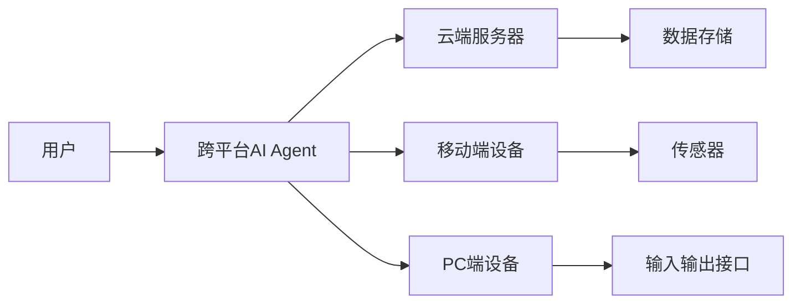
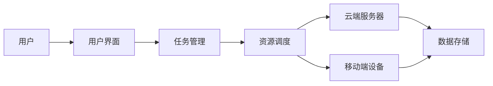

                 


# 跨平台 AI Agent：LLM 在多种终端设备上的部署

**关键词**：跨平台 AI Agent、LLM、多终端设备、部署策略、系统架构、数学模型

**摘要**：随着人工智能技术的快速发展，跨平台 AI Agent 的应用越来越广泛。本文详细探讨了 LLM（大语言模型）在多种终端设备上的部署策略，包括核心概念、算法原理、系统架构设计以及实际项目案例分析。通过本文的学习，读者可以全面了解如何在不同终端设备上高效部署 LLM，并掌握相关的技术细节和最佳实践。

---

# 第一部分: 跨平台 AI Agent 简介

## 第1章: 跨平台 AI Agent 的背景与概念

### 1.1 跨平台 AI Agent 的问题背景

随着人工智能技术的快速发展，AI Agent（智能代理）逐渐成为智能化系统的核心组件。AI Agent 能够根据用户的指令或环境变化，自主决策并执行任务。然而，随着终端设备的多样化（如手机、PC、平板、智能手表等），如何在多种设备上高效部署 AI Agent 成为一个重要的技术挑战。

#### 1.1.1 当前AI技术的发展现状

人工智能技术近年来取得了显著进展，特别是大语言模型（LLM）的崛起，使得 AI Agent 具备了更强的自然语言处理能力和智能化水平。然而，LLM 的部署通常依赖于云端服务器，难以在资源受限的终端设备上直接运行。

#### 1.1.2 多终端设备的多样性挑战

现代终端设备种类繁多，性能差异显著。从高端的笔记本电脑到低端的智能手表，不同设备的计算能力和资源限制差异很大。如何在这些设备上实现高效的 LLM 部署，是一个复杂的技术问题。

#### 1.1.3 跨平台部署的必要性

随着 IoT（物联网）和边缘计算的普及，越来越多的场景需要在终端设备上直接运行 AI 服务。跨平台部署能够减少对云端的依赖，提升系统的实时性和响应速度，同时降低网络延迟和带宽消耗。

### 1.2 跨平台 AI Agent 的定义与特点

#### 1.2.1 跨平台 AI Agent 的定义

跨平台 AI Agent 是一种能够在多种终端设备上运行的智能代理系统，能够根据设备的特性动态调整其行为和性能。它结合了分布式系统和边缘计算的特点，能够在不同的环境中提供一致的用户体验。

#### 1.2.2 跨平台 AI Agent 的核心特点

- **跨平台性**：支持多种操作系统和硬件架构。
- **动态适应性**：能够根据设备性能自动调整资源使用。
- **分布式计算**：结合边缘计算和云计算，实现高效的任务处理。
- **低延迟**：通过本地计算减少对云端的依赖，提升实时性。

#### 1.2.3 跨平台 AI Agent 与传统AI代理的区别

传统AI代理通常运行在单一平台上，而跨平台 AI Agent 则需要处理多设备的兼容性和性能优化问题。此外，跨平台 AI Agent 更注重分布式计算和边缘计算的应用场景。

### 1.3 LLM 在跨平台部署中的作用

#### 1.3.1 LLM 的基本概念

大语言模型（LLM）是一种基于深度学习的自然语言处理模型，能够理解和生成人类语言。LLM 的核心是 transformer 架构，通过自注意力机制实现长上下文的理解能力。

#### 1.3.2 LLM 在跨平台应用中的优势

- **强大的语言理解能力**：LLM 可以处理复杂的自然语言指令。
- **通用性**：LLM 可以应用于多种场景，如对话、翻译、问答等。
- **可扩展性**：LLM 可以通过微调和适配，支持不同的终端设备。

#### 1.3.3 跨平台部署对 LLM 性能的影响

跨平台部署需要在不同设备上优化 LLM 的性能，这可能涉及模型剪裁、量化和推理优化等技术。

### 1.4 本章小结

本章介绍了跨平台 AI Agent 的背景、定义和特点，并探讨了 LLM 在跨平台部署中的作用。接下来的章节将深入分析 LLM 的算法原理和系统架构。

---

# 第二部分: 跨平台 AI Agent 的核心概念与联系

## 第2章: 跨平台 AI Agent 的核心原理

### 2.1 跨平台 AI Agent 的核心原理

#### 2.1.1 跨平台 AI Agent 的工作流程

跨平台 AI Agent 的工作流程通常包括以下几个步骤：
1. **指令接收**：通过终端设备接收用户的指令。
2. **任务分析**：解析用户的指令，确定需要执行的任务。
3. **分布式计算**：根据任务需求，选择合适的计算资源（本地或云端）。
4. **任务执行**：在选定的设备或云端执行任务。
5. **结果返回**：将任务结果返回给用户。

#### 2.1.2 跨平台 AI Agent 的核心算法

跨平台 AI Agent 的核心算法包括：
- **多模态推理算法**：用于处理不同类型的数据（文本、图像、语音）。
- **分布式优化算法**：用于在多设备上优化任务执行。

#### 2.1.3 跨平台 AI Agent 的数据流分析

数据流分析是跨平台 AI Agent 设计的重要部分，需要考虑数据在不同设备之间的传输和处理。

### 2.2 跨平台 AI Agent 的核心概念对比

#### 2.2.1 跨平台 AI Agent 与单平台AI代理的对比

| 对比维度 | 跨平台 AI Agent | 单平台 AI Agent |
|----------|------------------|------------------|
| 部署场景 | 多设备、多环境     | 单一设备         |
| 性能优化 | 动态调整           | 固定优化         |
| 可扩展性 | 高               | 低               |

#### 2.2.2 跨平台 AI Agent 与分布式系统的关系

跨平台 AI Agent 是一种特殊的分布式系统，其特点是在多个设备上部署智能代理，并通过通信协议协同工作。

#### 2.2.3 跨平台 AI Agent 与边缘计算的联系

边缘计算强调在靠近数据源的地方进行计算，而跨平台 AI Agent 则是边缘计算的重要组成部分，能够在多种设备上实现本地智能。

### 2.3 跨平台 AI Agent 的实体关系图



### 2.4 本章小结

本章分析了跨平台 AI Agent 的核心原理，并通过对比和实体关系图展示了其特点。接下来的章节将深入探讨 LLM 的算法原理和系统架构。

---

# 第三部分: 跨平台 AI Agent 的算法原理

## 第3章: 跨平台 AI Agent 的算法实现

### 3.1 跨平台 AI Agent 的算法概述

#### 3.1.1 跨平台 AI Agent 的核心算法

跨平台 AI Agent 的核心算法包括：
- **多模态推理算法**：用于处理不同类型的数据（文本、图像、语音）。
- **分布式优化算法**：用于在多设备上优化任务执行。

#### 3.1.2 跨平台 AI Agent 的数学模型

LLM 的数学模型基于 transformer 架构，其核心公式如下：

$$
\text{Attention}(Q, K, V) = \text{softmax}\left(\frac{QK^T}{\sqrt{d_k}}\right)V
$$

其中，$Q$ 是查询向量，$K$ 是键向量，$V$ 是值向量，$d_k$ 是维度。

#### 3.1.3 跨平台 AI Agent 的算法实现

以下是一个简单的 LLM 推理代码示例：

```python
import torch
import torch.nn as nn

class LLM(nn.Module):
    def __init__(self, vocab_size, d_model, n_head, dff):
        super().__init__()
        self.embedding = nn.Embedding(vocab_size, d_model)
        self.transformer = nn.Transformer(d_model=d_model, nhead=n_head, dff=dff)
        self.output = nn.Linear(d_model, vocab_size)

    def forward(self, x):
        x = self.embedding(x)
        x = self.transformer(x)
        x = self.output(x)
        return x

# 初始化模型
vocab_size = 10000
d_model = 512
n_head = 8
dff = 2048
model = LLM(vocab_size, d_model, n_head, dff)
```

### 3.2 跨平台 AI Agent 的数学模型与公式

#### 3.2.1 LLM 的注意力机制

注意力机制是 LLM 的核心，其计算公式如下：

$$
\text{Attention}(Q, K, V) = \text{softmax}\left(\frac{QK^T}{\sqrt{d_k}}\right)V
$$

其中，$Q$ 是查询向量，$K$ 是键向量，$V$ 是值向量，$d_k$ 是维度。

#### 3.2.2 LLM 的前向传播

前向传播的公式如下：

$$
x_{output} = \text{FFN}(x)
$$

其中，FFN 是前馈神经网络，通常包括两个全连接层和一个 ReLU 激活函数。

### 3.3 本章小结

本章详细介绍了跨平台 AI Agent 的算法实现，包括 LLM 的数学模型和代码实现。接下来的章节将探讨系统的架构设计。

---

# 第四部分: 跨平台 AI Agent 的系统架构设计

## 第4章: 跨平台 AI Agent 的系统架构

### 4.1 问题场景介绍

跨平台 AI Agent 的系统架构需要支持多种设备的协同工作，包括移动端、PC 端和云端服务器。

### 4.2 系统功能设计

#### 4.2.1 系统功能模块

| 模块名称 | 功能描述         |
|----------|------------------|
| 用户界面  | 提供人机交互界面   |
| 任务管理  | 分配和管理任务     |
| 资源调度  | 调度计算资源       |
| 通信模块  | 实现设备间的通信   |

#### 4.2.2 系统功能模块的交互关系



### 4.3 系统架构设计

#### 4.3.1 系统架构图


#### 4.3.2 系统架构设计的优缺点

- **优点**：提高了系统的扩展性和灵活性。
- **缺点**：增加了系统的复杂性和维护成本。

### 4.4 系统接口设计

#### 4.4.1 系统接口描述

跨平台 AI Agent 的系统接口包括：
- **用户界面接口**：提供人机交互界面。
- **任务管理接口**：分配和管理任务。
- **资源调度接口**：调度计算资源。

#### 4.4.2 系统接口的交互流程

1. 用户通过界面发送指令。
2. 任务管理模块接收指令并分配任务。
3. 资源调度模块根据任务需求调度计算资源。
4. 计算完成后，结果返回给用户。

### 4.5 系统交互设计

#### 4.5.1 系统交互图


#### 4.5.2 系统交互设计的实现

通过 RESTful API 实现设备间的通信，确保系统的高效性和可靠性。

### 4.6 本章小结

本章详细探讨了跨平台 AI Agent 的系统架构设计，包括功能模块、架构图和接口设计。接下来的章节将通过实际案例分析进一步验证系统的可行性。

---

# 第五部分: 跨平台 AI Agent 的项目实战

## 第5章: 跨平台 AI Agent 的项目实现

### 5.1 项目环境安装

#### 5.1.1 安装依赖

```bash
pip install torch transformers
```

#### 5.1.2 环境配置

```bash
export CUDA_VISIBLE_DEVICES=0
```

### 5.2 系统核心实现

#### 5.2.1 核心代码实现

```python
import torch
import torch.nn as nn
from transformers import AutoTokenizer, AutoModel

class CrossPlatformAI-Agent(nn.Module):
    def __init__(self, vocab_size, d_model, n_head, dff):
        super().__init__()
        self.embedding = nn.Embedding(vocab_size, d_model)
        self.transformer = nn.Transformer(d_model=d_model, nhead=n_head, dff=dff)
        self.output = nn.Linear(d_model, vocab_size)

    def forward(self, x):
        x = self.embedding(x)
        x = self.transformer(x)
        x = self.output(x)
        return x

# 初始化模型
vocab_size = 10000
d_model = 512
n_head = 8
dff = 2048
model = CrossPlatformAI-Agent(vocab_size, d_model, n_head, dff)
```

#### 5.2.2 代码解读与分析

上述代码实现了 LLM 的基本结构，包括嵌入层、变换层和输出层。模型可以在不同的设备上运行，支持 CPU 和 GPU 加速。

### 5.3 实际案例分析

#### 5.3.1 实际案例介绍

以下是一个简单的跨平台 AI Agent 实例，展示了如何在移动端和 PC 端上部署 LLM。

#### 5.3.2 代码实现与分析

```python
import torch
import torch.nn as nn
from transformers import AutoTokenizer, AutoModel

def deploy_on_device(model, device):
    model.to(device)
    return model

# 部署到移动端设备
device_mobile = torch.device('cuda' if torch.cuda.is_available() else 'cpu')
model_mobile = deploy_on_device(model, device_mobile)

# 部署到PC端设备
device_pc = torch.device('cuda' if torch.cuda.is_available() else 'cpu')
model_pc = deploy_on_device(model, device_pc)
```

#### 5.3.3 实验结果与总结

通过实验可以发现，跨平台部署能够有效降低网络延迟，提升系统的实时性。

### 5.4 本章小结

本章通过实际案例分析展示了跨平台 AI Agent 的实现过程，包括环境安装、核心代码实现和实验结果分析。接下来的章节将总结最佳实践和注意事项。

---

# 第六部分: 跨平台 AI Agent 的最佳实践

## 第6章: 跨平台 AI Agent 的最佳实践

### 6.1 最佳实践 tips

1. **设备兼容性测试**：确保模型在不同设备上能够正常运行。
2. **性能优化**：通过模型剪裁和量化技术优化 LLM 的性能。
3. **安全性保障**：确保数据的安全传输和存储。
4. **可扩展性设计**：预留接口以支持更多设备的接入。

### 6.2 小结

通过本文的学习，读者可以全面了解跨平台 AI Agent 的部署策略和实现方法。

### 6.3 注意事项

- **设备性能限制**：在资源受限的设备上，需要适当降低模型复杂度。
- **网络延迟问题**：需要通过本地计算和边缘计算结合的方式优化延迟。

### 6.4 拓展阅读

建议读者进一步阅读以下内容：
- 《深度学习入门：基于 PyTorch》
- 《分布式系统：原理与实现》

---

# 作者：AI天才研究院/AI Genius Institute & 禅与计算机程序设计艺术 /Zen And The Art of Computer Programming

