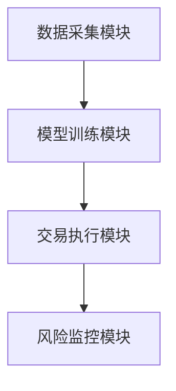
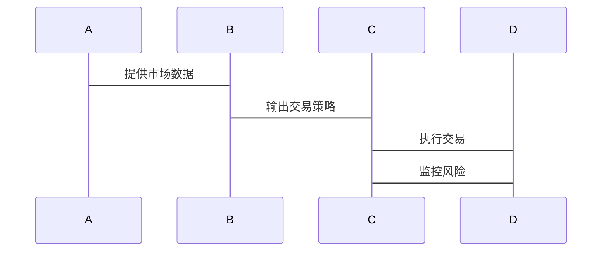

                 


# 《金融领域强化学习在多层次流动性管理中的应用》

> 关键词：强化学习, 流动性管理, 多层次管理, 金融领域, 算法原理

> 摘要：本文探讨了强化学习在金融领域多层次流动性管理中的应用，分析了强化学习的基本原理及其在流动性管理中的优势，详细讲解了多层次流动性管理的结构与挑战，结合具体案例分析了强化学习在金融流动性管理中的数学模型、算法实现及系统架构设计，最后给出了实际应用中的最佳实践和未来研究方向。

---

## 第一部分：强化学习与金融流动性管理概述

### 第1章：强化学习与流动性管理的背景

#### 1.1 强化学习的基本概念

##### 1.1.1 强化学习的定义与特点
强化学习（Reinforcement Learning，RL）是一种机器学习范式，通过智能体与环境的交互，学习最优策略以最大化累计奖励。其特点包括：

- **试错性**：智能体通过与环境交互，不断试错以获得最优策略。
- **延迟反馈**：奖励通常不是即时的，而是通过长期行为的累积结果。
- **策略优化**：强化学习的目标是优化策略，即在特定状态下选择最优动作。

##### 1.1.2 强化学习的核心要素
强化学习的核心要素包括：

- **状态（State）**：描述环境当前情况的特征，如资产价格、市场流动性等。
- **动作（Action）**：智能体在特定状态下选择的行为，如买入或卖出资产。
- **奖励（Reward）**：环境对智能体行为的反馈，衡量行为的优劣。
- **策略（Policy）**：智能体在特定状态下选择动作的概率分布。
- **值函数（Value Function）**：衡量某状态下策略的优劣，帮助智能体做出决策。

##### 1.1.3 强化学习与金融领域的结合
在金融领域，强化学习广泛应用于股票交易、投资组合管理、风险控制等场景。其优势在于能够处理高度不确定性和动态变化的金融环境，通过不断试错优化交易策略。

#### 1.2 金融流动性管理的概述

##### 1.2.1 流动性管理的定义与目标
流动性管理是指在金融市场中，通过合理配置资产，确保资金在不同市场参与者之间的顺畅流动，以维持市场的稳定性和高效性。其目标包括：

- **防范流动性风险**：避免因资产流动性不足导致的市场崩盘。
- **优化资源配置**：确保资金流向高效率的经济活动。
- **稳定市场运行**：维持金融市场的正常运作，减少剧烈波动。

##### 1.2.2 金融市场的流动性风险
流动性风险是指资产在短时间内难以以合理价格变现的风险。在金融市场中，流动性风险可能由市场参与者的行为、市场结构的变化或外部事件引发。

##### 1.2.3 多层次流动性管理的必要性
金融市场通常由多个参与者构成，包括中央银行、商业银行、保险公司、基金公司等。不同参与者在流动性管理中的角色和责任不同，因此需要多层次的流动性管理框架。

---

### 第2章：强化学习在金融中的应用基础

#### 2.1 强化学习在金融中的应用领域

##### 2.1.1 股票交易与投资组合管理
强化学习可以用于股票交易策略的优化，通过分析市场数据，学习最优买卖时机。在投资组合管理中，强化学习可以帮助优化资产配置，降低风险。

##### 2.1.2 风险控制与市场预测
强化学习可以用于金融市场的风险预测和控制，通过分析历史数据，识别潜在风险点，并制定应对策略。

##### 2.1.3 多层次流动性管理的挑战
在多层次流动性管理中，强化学习需要处理不同层次之间的复杂关系，确保各层次的流动性管理策略协调一致，避免局部优化导致全局问题。

#### 2.2 强化学习的核心算法简介

##### 2.2.1 Q-learning算法
Q-learning是一种经典的强化学习算法，通过学习价值函数来选择最优动作。其核心公式为：

$$ Q(s, a) = Q(s, a) + \alpha [r + \gamma \max Q(s', a') - Q(s, a)] $$

其中：
- \( Q(s, a) \) 表示状态 \( s \) 下选择动作 \( a \) 的价值。
- \( \alpha \) 表示学习率。
- \( r \) 表示奖励。
- \( \gamma \) 表示折扣因子。

##### 2.2.2 Deep Q-learning算法
Deep Q-learning结合了深度学习和强化学习，通过神经网络近似价值函数，适用于高维状态空间的复杂问题。

##### 2.2.3 其他强化学习算法
其他常见算法包括策略梯度（Policy Gradient）、Actor-Critic算法等，各有优缺点，适用于不同的应用场景。

---

### 第3章：多层次流动性管理的结构与挑战

#### 3.1 多层次流动性管理的定义

##### 3.1.1 多层次流动性管理的层次划分
多层次流动性管理通常分为微观、中观和宏观三个层次：

- **微观层次**：个体投资者或机构的流动性管理。
- **中观层次**：市场参与者的流动性管理。
- **宏观层次**：整个金融系统的流动性管理。

##### 3.1.2 各层次之间的关系与影响
不同层次的流动性管理相互影响，微观层次的决策可能影响中观和宏观层次，反之亦然。因此，需要协调各层次的管理策略。

#### 3.2 强化学习在多层次流动性管理中的应用

##### 3.2.1 强化学习在微观流动性管理中的应用
在微观层次，强化学习可以用于个体投资者的交易策略优化，通过分析市场数据，学习最优买卖时机。

##### 3.2.2 强化学习在中观流动性管理中的应用
在中观层次，强化学习可以用于市场参与者的流动性管理，优化资产配置，降低流动性风险。

##### 3.2.3 强化学习在宏观流动性管理中的应用
在宏观层次，强化学习可以用于整个金融系统的流动性管理，通过分析市场数据，预测潜在风险，并制定应对策略。

---

## 第二部分：强化学习的核心概念与算法原理

### 第4章：强化学习的核心概念与数学模型

#### 4.1 强化学习的核心概念

##### 4.1.1 状态空间与动作空间
状态空间是所有可能状态的集合，动作空间是所有可能动作的集合。例如，在股票交易中，状态可以是当前的资产价格和市场情绪，动作可以是买入或卖出。

##### 4.1.2 奖励函数与价值函数
奖励函数定义了智能体在特定状态下选择动作后获得的奖励。价值函数衡量了某个状态下策略的优劣，帮助智能体做出决策。

##### 4.1.3 策略与策略优化
策略是智能体在特定状态下选择动作的概率分布。策略优化的目标是找到最优策略，使累计奖励最大化。

#### 4.2 强化学习的数学模型

##### 4.2.1 Bellman方程
Bellman方程是强化学习的核心数学模型，描述了当前状态下最优价值的计算公式：

$$ V(s) = \max_a [r + \gamma V(s')] $$

其中：
- \( V(s) \) 表示状态 \( s \) 的最优价值。
- \( r \) 表示奖励。
- \( \gamma \) 表示折扣因子。
- \( s' \) 表示下一步的状态。

##### 4.2.2 动态规划与值迭代
动态规划是一种通过迭代计算价值函数的方法，值迭代是动态规划的一种形式，用于计算最优策略。

##### 4.2.3 策略梯度与Actor-Critic方法
策略梯度通过优化策略的参数来最大化累计奖励，Actor-Critic方法结合了策略和价值函数的优化，适用于复杂环境。

---

### 第5章：基于强化学习的多层次流动性管理模型

#### 5.1 多层次流动性管理的强化学习模型设计

##### 5.1.1 模型的输入与输出
模型的输入包括市场数据、资产价格、交易量等，输出包括交易决策、资产配置建议等。

##### 5.1.2 模型的训练与优化
强化学习模型需要通过大量数据训练，优化算法参数，以提高模型的预测精度和决策能力。

##### 5.1.3 模型的评估与验证
模型的评估通常通过回测或模拟交易进行，验证模型在不同市场环境下的表现。

#### 5.2 强化学习在多层次流动性管理中的数学推导

##### 5.2.1 状态转移矩阵的构建
状态转移矩阵描述了不同状态下动作的转移概率，帮助智能体进行决策。

##### 5.2.2 动作空间的优化
动作空间的优化需要考虑市场环境的复杂性，选择合适的动作以最大化累计奖励。

##### 5.2.3 奖励函数的设计与实现
奖励函数的设计需要根据具体应用场景，选择合适的奖励机制，引导智能体做出最优决策。

---

## 第三部分：强化学习算法的实现与优化

### 第6章：强化学习算法的实现与优化

#### 6.1 基于Python的强化学习算法实现

##### 6.1.1 Q-learning算法的Python实现
```python
import numpy as np

class QLearning:
    def __init__(self, state_space, action_space, alpha=0.1, gamma=0.99):
        self.state_space = state_space
        self.action_space = action_space
        self.alpha = alpha
        self.gamma = gamma
        self.q_table = np.zeros((state_space, action_space))

    def choose_action(self, state, epsilon=0.1):
        if np.random.random() < epsilon:
            return np.random.randint(self.action_space)
        else:
            return np.argmax(self.q_table[state])

    def update_q_table(self, state, action, reward, next_state):
        self.q_table[state][action] = self.q_table[state][action] + self.alpha * (reward + self.gamma * np.max(self.q_table[next_state]) - self.q_table[state][action])
```

##### 6.1.2 Deep Q-learning算法的Python实现
```python
import torch
import torch.nn as nn

class DQN(nn.Module):
    def __init__(self, input_dim, output_dim):
        super(DQN, self).__init__()
        self.fc1 = nn.Linear(input_dim, 64)
        self.fc2 = nn.Linear(64, output_dim)
    
    def forward(self, x):
        x = torch.relu(self.fc1(x))
        x = self.fc2(x)
        return x
```

##### 6.1.3 策略梯度算法的Python实现
```python
import torch
import torch.nn as nn

class PolicyGradient:
    def __init__(self, input_dim, output_dim, learning_rate=0.01):
        self.net = nn.Sequential(
            nn.Linear(input_dim, 64),
            nn.ReLU(),
            nn.Linear(64, output_dim)
        )
        self.optimizer = torch.optim.Adam(self.net.parameters(), lr=learning_rate)
    
    def get_action(self, state):
        logits = self.net(torch.tensor(state))
        action = torch.multinomial(torch.softmax(logits), 1).item()
        return action

    def update_policy(self, log_probs, rewards):
        loss = -torch.mean(log_probs * rewards)
        self.optimizer.zero_grad()
        loss.backward()
        self.optimizer.step()
```

#### 6.2 算法优化与调参技巧

##### 6.2.1 网络结构的优化
通过调整神经网络的层数、节点数等参数，优化模型的性能。

##### 6.2.2 超参数的优化
合理选择学习率、折扣因子等超参数，提高模型的训练效果。

##### 6.2.3 离线与在线学习的结合
结合在线和离线数据，提高模型的泛化能力。

---

## 第四部分：系统分析与架构设计方案

### 第7章：金融流动性管理系统的架构设计

#### 7.1 问题场景介绍
在金融领域，流动性管理需要协调多个市场参与者的交易行为，确保市场的稳定运行。

#### 7.2 系统功能设计

##### 7.2.1 系统功能模块
- **数据采集模块**：采集市场数据，如资产价格、交易量等。
- **模型训练模块**：训练强化学习模型，优化交易策略。
- **交易执行模块**：根据模型决策执行交易。
- **风险监控模块**：监控市场风险，及时调整策略。

##### 7.2.2 系统功能流程
- 数据采集模块获取市场数据，输入模型训练模块，训练强化学习模型。
- 模型训练模块输出交易策略，由交易执行模块执行交易。
- 风险监控模块实时监控市场风险，调整交易策略。

#### 7.3 系统架构设计

##### 7.3.1 系统架构图


##### 7.3.2 系统交互设计


---

## 第五部分：项目实战与案例分析

### 第8章：强化学习在金融流动性管理中的实战

#### 8.1 环境搭建

##### 8.1.1 环境安装
安装必要的库和工具，如Python、TensorFlow、PyTorch等。

##### 8.1.2 数据准备
收集历史市场数据，如股票价格、交易量等，用于模型训练。

#### 8.2 系统核心实现源代码

##### 8.2.1 Q-learning算法实现
```python
# Q-learning算法实现
class QLearning:
    def __init__(self, state_space, action_space, alpha=0.1, gamma=0.99):
        self.state_space = state_space
        self.action_space = action_space
        self.alpha = alpha
        self.gamma = gamma
        self.q_table = np.zeros((state_space, action_space))

    def choose_action(self, state, epsilon=0.1):
        if np.random.random() < epsilon:
            return np.random.randint(self.action_space)
        else:
            return np.argmax(self.q_table[state])

    def update_q_table(self, state, action, reward, next_state):
        self.q_table[state][action] = self.q_table[state][action] + self.alpha * (reward + self.gamma * np.max(self.q_table[next_state]) - self.q_table[state][action])
```

##### 8.2.2 Deep Q-learning算法实现
```python
# Deep Q-learning算法实现
class DQN(nn.Module):
    def __init__(self, input_dim, output_dim):
        super(DQN, self).__init__()
        self.fc1 = nn.Linear(input_dim, 64)
        self.fc2 = nn.Linear(64, output_dim)
    
    def forward(self, x):
        x = torch.relu(self.fc1(x))
        x = self.fc2(x)
        return x
```

#### 8.3 代码应用解读与分析

##### 8.3.1 算法实现的细节
详细解读代码实现的细节，包括模型的训练、优化策略等。

##### 8.3.2 模型的训练与优化
分析模型的训练过程，包括数据预处理、模型训练、参数调整等。

##### 8.3.3 模型的验证与测试
通过回测或模拟交易，验证模型的性能和效果。

#### 8.4 实际案例分析

##### 8.4.1 案例背景
以某银行间市场为例，分析强化学习在流动性管理中的应用。

##### 8.4.2 数据分析与特征提取
分析市场数据，提取相关特征，用于模型训练。

##### 8.4.3 模型训练与策略优化
训练强化学习模型，优化交易策略，验证模型的性能。

##### 8.4.4 案例分析与结果展示
展示模型在实际案例中的表现，分析其优缺点。

#### 8.5 项目小结
总结项目的主要成果，分析存在的问题，并提出改进建议。

---

## 第六部分：总结与展望

### 第9章：总结与展望

#### 9.1 核心内容回顾
总结本文的核心内容，包括强化学习的基本原理、多层次流动性管理的结构与挑战、算法实现与优化、系统架构设计及项目实战。

#### 9.2 未来研究方向
展望强化学习在金融领域中的未来发展方向，包括算法优化、应用场景拓展、系统架构升级等。

#### 9.3 最佳实践 tips
- **数据质量**：确保数据的准确性和完整性，避免噪声干扰。
- **模型优化**：合理选择算法和参数，提高模型的泛化能力。
- **风险控制**：在实际应用中，需结合专家经验，避免过度依赖模型。

#### 9.4 小结
强化学习在金融领域多层次流动性管理中的应用前景广阔，但仍需进一步研究和实践，以应对复杂多变的金融市场环境。

---

## 作者：AI天才研究院 & 禅与计算机程序设计艺术

---

感谢您的阅读！希望本文对您理解强化学习在金融领域中的应用有所帮助！

