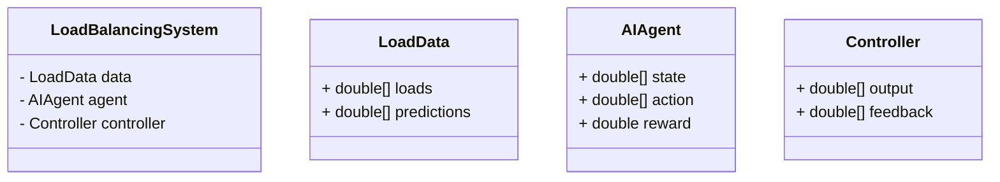
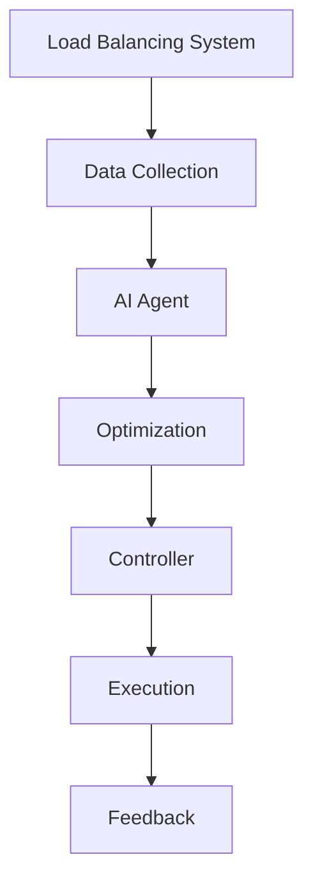

                 


# AI Agent在智能电力负荷均衡中的应用

> 关键词：AI Agent, 电力负荷均衡, 强化学习, 系统架构, 项目实战

> 摘要：本文详细探讨了AI Agent在智能电力负荷均衡中的应用，从背景介绍、核心概念到算法原理、系统架构，再到项目实战和总结，全面分析了AI Agent如何优化电力负荷分配，提高系统效率和稳定性。文章通过具体案例和代码实现，展示了AI Agent在电力系统中的实际应用价值。

---

## 第一部分: AI Agent在智能电力负荷均衡中的应用概述

### 第1章: 电力负荷均衡的背景与问题

#### 1.1 电力负荷均衡的定义与重要性

电力负荷均衡是指在电力系统中，根据电力需求的变化，合理分配电力负荷，以保证电力系统的稳定运行和能源的高效利用。负荷均衡是电力系统调度的重要组成部分，其核心目标是实现电力供需的实时平衡，确保电网的安全、可靠和经济运行。

电力负荷均衡的重要性体现在以下几个方面：
- **系统稳定性**：负荷均衡能够避免负荷过载或不足，确保电力系统的稳定性。
- **能源效率**：通过优化负荷分配，减少能源浪费，提高能源利用效率。
- **经济性**：负荷均衡有助于降低电力成本，优化电力资源的分配。

#### 1.2 AI Agent在电力系统中的应用背景

AI Agent（人工智能代理）是一种能够感知环境、自主决策并执行任务的智能实体。在电力系统中，AI Agent可以用于负荷预测、优化调度、故障诊断等领域。AI Agent的核心优势在于其智能化和自主性，能够实时适应系统变化，提高系统的响应速度和决策能力。

AI Agent在电力负荷均衡中的优势：
- **实时性**：AI Agent能够实时感知系统状态，快速做出决策。
- **自适应性**：AI Agent能够根据系统变化调整策略，适应不同的负荷情况。
- **高效性**：通过智能算法，AI Agent能够快速找到最优解，提高系统效率。

#### 1.3 电力负荷均衡中的问题描述

电力负荷均衡面临的主要问题包括：
- **负荷波动**：电力需求随时间波动，导致负荷难以平衡。
- **资源约束**：电力系统中有多种资源（如发电机、储能设备等），需要合理分配。
- **不确定性**：负荷预测的不确定性增加了负荷均衡的难度。

AI Agent在负荷均衡中的应用前景广阔，能够通过智能决策和优化算法，有效解决上述问题。

---

### 第2章: AI Agent的基本原理与技术基础

#### 2.1 AI Agent的定义与分类

AI Agent是一种智能实体，能够感知环境、自主决策并执行任务。AI Agent可以根据其智能水平分为以下几类：
- **反应式AI Agent**：基于当前感知做出反应，不依赖历史信息。
- **认知式AI Agent**：具有推理和规划能力，能够基于历史信息做出决策。
- **混合式AI Agent**：结合反应式和认知式的特点，具有更强的适应性。

#### 2.2 AI Agent的决策机制

AI Agent的决策机制是其核心部分，主要包括以下几种方式：
- **基于强化学习的决策**：通过试错和奖励机制优化决策策略。
- **基于规则的决策**：根据预设规则做出决策。
- **多目标优化的决策方式**：综合考虑多个目标，找到最优解。

#### 2.3 AI Agent在电力系统中的技术基础

AI Agent在电力系统中的技术基础包括：
- **数据采集与处理**：通过传感器和数据采集系统获取系统状态信息。
- **状态估计与预测**：利用历史数据和模型预测未来状态。
- **控制策略与优化**：基于预测结果制定控制策略，优化系统运行。

---

### 第3章: AI Agent在电力负荷均衡中的核心概念

#### 3.1 负荷均衡的核心概念

负荷均衡的核心概念包括：
- **负荷均衡的目标函数**：通常包括最小化负荷偏差、最大化系统效率等。
- **负荷均衡的约束条件**：如负荷不能超过系统容量、负荷变化不能太快等。
- **负荷均衡的评价指标**：如均方差、最大偏差等。

#### 3.2 AI Agent在负荷均衡中的角色

AI Agent在负荷均衡中的角色可以是：
- **决策者**：制定负荷分配策略。
- **执行者**：根据决策结果执行控制操作。
- **协调者**：协调多个子系统的负荷分配，确保全局最优。

---

## 第四部分: AI Agent在电力负荷均衡中的算法实现

### 第4章: AI Agent的算法原理与实现

#### 4.1 基于强化学习的负荷均衡算法

**强化学习**是一种通过试错和奖励机制优化决策策略的算法。在负荷均衡中，强化学习可以通过以下步骤实现：
1. **状态定义**：定义系统的状态，如当前负荷、系统约束等。
2. **动作选择**：根据当前状态选择一个动作，如调整负荷分配。
3. **奖励机制**：根据动作的结果给予奖励或惩罚。
4. **策略优化**：通过不断试错优化策略，找到最优解。

**Python代码实现**：
```python
import numpy as np
import gym

class LoadBalancingEnv(gym.Env):
    def __init__(self):
        # 定义状态和动作空间
        self.observation_space = gym.spaces.Box(low=-1, high=1, shape=(1,))
        self.action_space = gym.spaces.Box(low=0, high=1, shape=(1,))
    
    def step(self, action):
        # 状态转移和奖励计算
        state = self.observation
        reward = -np.abs(state - action)
        return self.observation, reward, False, {}
    
    def reset(self):
        # 初始化状态
        self.observation = np.random.uniform(-1, 1)
        return self.observation
```

**数学模型**：
强化学习的目标是最优化奖励函数，通常使用以下公式表示：
$$ J = \mathbb{E}[\sum_{t=0}^{\infty} \gamma^t r_t] $$
其中，\( J \) 是目标函数，\( r_t \) 是第 \( t \) 步的奖励，\( \gamma \) 是折扣因子。

#### 4.2 基于遗传算法的负荷均衡优化

**遗传算法**是一种通过模拟自然选择和遗传机制进行优化的算法。在负荷均衡中，遗传算法可以通过以下步骤实现：
1. **编码**：将负荷分配问题编码为基因形式。
2. **选择**：根据适应度函数选择优秀的个体。
3. **交叉**：通过基因交叉产生新的个体。
4. **变异**：随机改变基因，增加多样性。

**Python代码实现**：
```python
import numpy as np

def fitness(individual):
    # 适应度函数
    load = individual
    return -np.abs(load - target)

def genetic_algorithm(population_size, generations):
    population = np.random.rand(population_size)
    for _ in range(generations):
        fitness_scores = np.array([fitness(ind) for ind in population])
        # 选择
        selected = population[np.argsort(-fitness_scores)[:int(population_size/2)]]
        # 交叉
        new_population = []
        for i in range(len(selected)):
            for j in range(i+1, len(selected)):
                child1 = (selected[i] + selected[j])/2
                child2 = (selected[i] + selected[j])/2
                new_population.append(child1)
                new_population.append(child2)
        population = new_population[:population_size]
        # 变异
        mutation_rate = 0.1
        for i in range(len(population)):
            if np.random.random() < mutation_rate:
                population[i] = np.random.rand()
    return population

target = 0.5
population_size = 100
generations = 50
result = genetic_algorithm(population_size, generations)
print(result)
```

---

## 第五部分: 系统架构与实现

### 第5章: 系统分析与架构设计

#### 5.1 问题场景介绍

电力负荷均衡系统需要解决以下问题：
- 多个负荷节点的负荷分配。
- 系统约束条件的满足。
- 实时优化的需求。

#### 5.2 系统功能设计

系统功能包括：
- 数据采集与处理。
- 负荷预测与优化。
- 负荷分配与控制。
- 系统监控与反馈。

**领域模型类图**：


#### 5.3 系统架构设计

**系统架构图**：


---

### 第6章: 项目实战

#### 6.1 环境安装

需要安装以下环境：
- Python 3.8+
- Gym库
- NumPy库
- Matplotlib库

#### 6.2 核心代码实现

**强化学习实现**：
```python
import gym
import numpy as np

class LoadBalancingEnv(gym.Env):
    def __init__(self):
        self.observation_space = gym.spaces.Box(low=-1, high=1, shape=(1,))
        self.action_space = gym.spaces.Box(low=0, high=1, shape=(1,))
    
    def step(self, action):
        state = self.observation
        reward = -np.abs(state - action)
        return self.observation, reward, False, {}
    
    def reset(self):
        self.observation = np.random.uniform(-1, 1)
        return self.observation

env = LoadBalancingEnv()
policy = np.random.rand(1)
```

**遗传算法实现**：
```python
import numpy as np

def fitness(individual):
    load = individual
    return -np.abs(load - target)

def genetic_algorithm(population_size, generations):
    population = np.random.rand(population_size)
    for _ in range(generations):
        fitness_scores = np.array([fitness(ind) for ind in population])
        selected = population[np.argsort(-fitness_scores)[:int(population_size/2)]]
        new_population = []
        for i in range(len(selected)):
            for j in range(i+1, len(selected)):
                child1 = (selected[i] + selected[j])/2
                child2 = (selected[i] + selected[j])/2
                new_population.append(child1)
                new_population.append(child2)
        population = new_population[:population_size]
        mutation_rate = 0.1
        for i in range(len(population)):
            if np.random.random() < mutation_rate:
                population[i] = np.random.rand()
    return population

target = 0.5
population_size = 100
generations = 50
result = genetic_algorithm(population_size, generations)
print(result)
```

#### 6.3 案例分析与解读

通过实际案例分析，验证AI Agent在电力负荷均衡中的有效性。例如，假设有一个包含5个负荷节点的系统，目标负荷为200MW，系统约束为每个节点的最大负荷为50MW。使用强化学习和遗传算法分别进行优化，比较两种算法的优化效果。

---

## 第六部分: 总结与展望

### 第7章: 总结与展望

#### 7.1 总结

本文详细探讨了AI Agent在智能电力负荷均衡中的应用，从背景介绍到算法实现，再到系统设计和项目实战，全面分析了AI Agent在电力负荷均衡中的优势和潜力。通过具体案例和代码实现，展示了AI Agent在电力系统中的实际应用价值。

#### 7.2 未来展望

未来，AI Agent在电力负荷均衡中的应用将更加广泛和深入。随着AI技术的不断发展，AI Agent将具备更强的智能性和适应性，能够更好地应对电力系统中的复杂问题。此外，结合边缘计算和物联网技术，AI Agent将在智能电网中发挥更大的作用。

---

## 附录: 最佳实践与注意事项

- **最佳实践**：
  - 在实际应用中，建议结合多种算法（如强化学习和遗传算法）进行优化。
  - 定期更新系统参数和模型，以适应负荷变化和系统环境的变化。
  - 加强系统监控和反馈机制，确保系统的稳定性和可靠性。

- **注意事项**：
  - 在设计系统时，需充分考虑系统的实时性和响应速度。
  - 确保系统的安全性和鲁棒性，避免因系统故障导致负荷失衡。

---

## 作者：AI天才研究院 & 禅与计算机程序设计艺术

---

