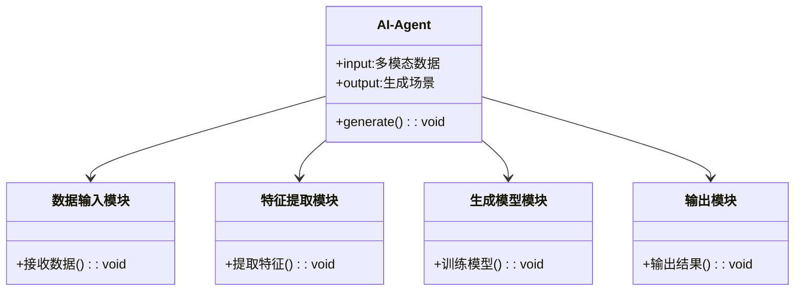
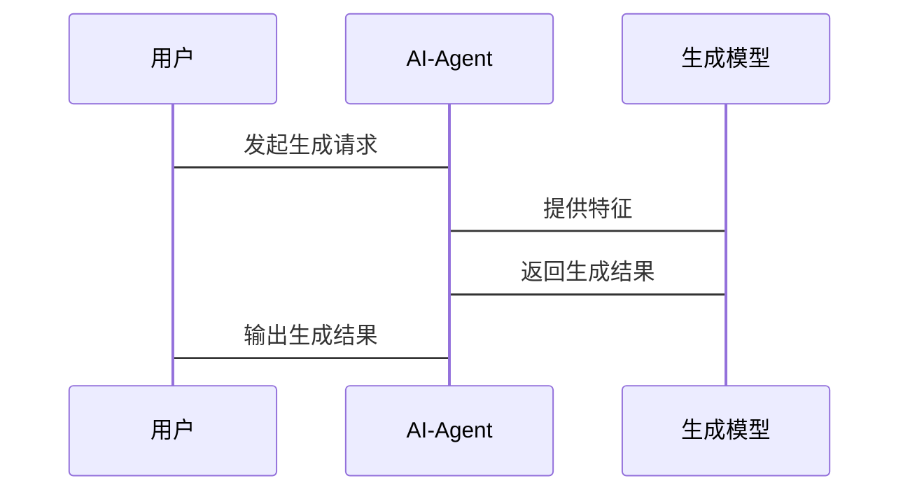

                 


# AI Agent的多模态场景生成与编辑

## 关键词：
AI Agent, 多模态场景生成, 多模态数据融合, 场景编辑, 生成模型

## 摘要：
本文系统地探讨了AI Agent在多模态场景生成与编辑领域的核心概念、算法原理、系统架构及应用实践。通过详细分析多模态数据的处理与融合方法，结合生成模型的数学原理和实际案例，本文为读者提供了从理论到实践的全面指导。同时，文章还探讨了AI Agent在多模态场景生成中的系统架构设计、项目实战以及高级主题，为读者提供了丰富的技术见解和实践建议。

---

# 第1章: AI Agent与多模态场景生成概述

## 1.1 AI Agent的基本概念

### 1.1.1 AI Agent的定义与特点
AI Agent（人工智能代理）是指能够感知环境、执行任务并做出决策的智能实体。其特点包括：
- **自主性**：能够在没有外部干预的情况下自主运行。
- **反应性**：能够实时感知环境并做出反应。
- **学习能力**：能够通过数据和经验不断优化自身行为。
- **协作性**：能够与其他Agent或人类进行协作。

### 1.1.2 多模态场景的定义与特点
多模态场景是指包含多种数据类型的动态环境，例如图像、文本、语音、视频等。其特点包括：
- **多样性**：包含多种数据类型。
- **动态性**：场景内容随时间变化。
- **复杂性**：不同数据类型之间存在复杂的关联。

### 1.1.3 AI Agent在多模态场景中的作用
AI Agent在多模态场景中主要负责：
- **数据融合**：将多种数据类型进行融合，提取有用的特征。
- **场景生成**：根据融合后的数据生成符合要求的场景。
- **实时交互**：与用户或环境进行实时交互，动态调整生成结果。

## 1.2 多模态场景生成的背景与意义

### 1.2.1 多模态数据的融合与处理
多模态数据的融合是实现场景生成的关键技术。通过将图像、文本、语音等多种数据类型进行融合，可以更全面地理解场景内容。

### 1.2.2 场景生成的挑战与机遇
场景生成的挑战主要在于如何处理多种数据类型之间的关联性以及如何保证生成结果的合理性。而机遇则在于多模态场景生成在游戏开发、虚拟现实、人机交互等领域的广泛应用。

### 1.2.3 AI Agent在多模态场景生成中的应用价值
AI Agent能够通过多模态数据的融合与生成模型的应用，为用户提供更加智能化、个性化的场景生成服务。

## 1.3 本章小结
本章介绍了AI Agent的基本概念及其在多模态场景生成中的作用，分析了多模态场景生成的背景与意义，为后续内容奠定了基础。

---

# 第2章: AI Agent的核心概念与原理

## 2.1 AI Agent的定义与架构

### 2.1.1 AI Agent的定义
AI Agent是一种能够感知环境、执行任务并做出决策的智能实体，具有自主性、反应性、学习能力和协作性。

### 2.1.2 AI Agent的架构模型
AI Agent的架构模型可以分为**反应式架构**和**认知式架构**：
- **反应式架构**：基于当前感知做出实时反应，适用于需要快速响应的场景。
- **认知式架构**：结合长期记忆和目标规划，适用于复杂任务。

### 2.1.3 多模态处理能力
AI Agent的多模态处理能力是指其能够同时处理和理解多种数据类型的能力，例如图像、文本、语音等。

## 2.2 多模态数据的处理与融合

### 2.2.1 多模态数据的类型与特点
多模态数据的类型包括：
- **图像数据**：如RGB图像、深度图像。
- **文本数据**：如自然语言文本、标签。
- **语音数据**：如音频信号。

### 2.2.2 数据融合的方法与技术
数据融合的方法包括：
- **特征融合**：将不同数据类型的特征进行融合。
- **模型融合**：在生成模型中同时考虑多种数据类型。

### 2.2.3 多模态数据的表示与编码
多模态数据的表示与编码方法包括：
- **向量表示**：将数据转换为高维向量。
- **图表示**：将数据表示为图结构，便于关系推理。

## 2.3 AI Agent的生成机制

### 2.3.1 生成模型的基本原理
生成模型的核心是通过学习数据的分布，生成符合分布的新样本。

### 2.3.2 多模态生成模型的特点
多模态生成模型的特点包括：
- **多任务性**：能够同时生成多种数据类型。
- **关联性**：生成结果之间具有逻辑关联。

### 2.3.3 AI Agent的生成流程
生成流程包括：
1. **数据预处理**：对输入数据进行标准化和增强。
2. **特征提取**：提取多模态数据的特征。
3. **生成模型训练**：基于特征训练生成模型。
4. **场景生成**：根据输入指令生成多模态场景。

## 2.4 本章小结
本章详细介绍了AI Agent的核心概念与架构，分析了多模态数据的处理与融合方法，探讨了生成模型的基本原理与应用。

---

# 第3章: 多模态场景生成的算法原理

## 3.1 多模态数据的表示与编码

### 3.1.1 图像的表示方法
图像的表示方法包括：
- **卷积神经网络（CNN）**：通过卷积操作提取图像特征。
- **图像分割**：将图像分割为多个区域，分别表示不同内容。

### 3.1.2 文本的表示方法
文本的表示方法包括：
- **词嵌入（Word Embedding）**：如Word2Vec、GloVe。
- **文本编码器**：通过Transformer模型编码文本。

### 3.1.3 融合多模态数据的编码方法
融合多模态数据的编码方法包括：
- **多模态编码器**：同时处理多种数据类型，生成联合表示。
- **注意力机制**：通过注意力机制捕捉数据之间的关联性。

## 3.2 多模态生成模型的算法原理

### 3.2.1 扩散模型的基本原理
扩散模型通过逐步添加噪声并逐步去噪，生成高质量的样本。

### 3.2.2 Transformer模型在多模态生成中的应用
Transformer模型通过自注意力机制，能够同时处理多种数据类型，适用于多模态生成任务。

### 3.2.3 其他生成模型的比较与分析
其他生成模型包括：
- **生成对抗网络（GAN）**：通过生成器和判别器的对抗训练生成样本。
- **变分自编码器（VAE）**：通过最大化似然函数生成样本。

## 3.3 多模态场景生成的数学模型

### 3.3.1 多模态数据的概率分布模型
多模态数据的概率分布模型可以表示为：
$$ p(x_1, x_2, ..., x_n) $$
其中，$x_i$ 表示不同的数据类型。

### 3.3.2 生成模型的损失函数与优化目标
扩散模型的损失函数可以表示为：
$$ \mathcal{L} = \mathbb{E}_{t}[ \mathcal{L}_t ] $$
其中，$\mathcal{L}_t$ 是第 $t$ 步的损失函数。

### 3.3.3 多模态生成的数学公式推导
通过将多模态数据的特征表示为高维向量，并利用生成模型生成新的样本，可以实现多模态场景的生成。

## 3.4 本章小结
本章详细介绍了多模态数据的表示与编码方法，探讨了生成模型的算法原理，并通过数学公式推导展示了生成模型的工作机制。

---

# 第4章: AI Agent的系统架构与设计

## 4.1 系统架构的整体设计

### 4.1.1 系统架构的模块划分
系统架构的模块包括：
- **数据输入模块**：接收多模态数据输入。
- **特征提取模块**：对输入数据进行特征提取。
- **生成模型模块**：基于特征生成多模态场景。
- **输出模块**：将生成结果输出给用户或系统。

### 4.1.2 各模块之间的关系与交互
模块之间的交互流程如下：
1. 数据输入模块接收输入数据。
2. 特征提取模块对数据进行特征提取。
3. 生成模型模块基于特征生成多模态场景。
4. 输出模块将生成结果输出。

### 4.1.3 系统架构的优缺点分析
系统架构的优点包括：
- **模块化设计**：便于维护和扩展。
- **灵活性**：可以根据需求调整各模块的功能。

系统架构的缺点包括：
- **复杂性**：模块之间的交互可能较为复杂。
- **计算资源需求**：生成模型需要大量的计算资源。

## 4.2 系统功能设计

### 4.2.1 领域模型（Mermaid类图）


### 4.2.2 系统架构（Mermaid架构图）


### 4.2.3 系统接口设计
系统接口设计包括：
- **输入接口**：接收多模态数据。
- **输出接口**：输出生成的场景。

### 4.2.4 系统交互（Mermaid序列图）


## 4.3 本章小结
本章详细介绍了AI Agent的系统架构与设计，通过Mermaid图表展示了系统的模块划分、架构设计和交互流程。

---

# 第5章: 项目实战

## 5.1 环境安装与配置

### 5.1.1 安装Python
安装Python 3.8及以上版本。

### 5.1.2 安装依赖库
安装以下依赖库：
```bash
pip install numpy matplotlib tensorflow
```

## 5.2 系统核心实现源代码

### 5.2.1 数据预处理代码
```python
import numpy as np

def preprocess_image(image):
    # 对图像进行预处理
    return image / 255.0

def preprocess_text(text):
    # 对文本进行预处理
    return text.lower()
```

### 5.2.2 生成模型代码
```python
import tensorflow as tf
from tensorflow.keras import layers

def build_generator_model():
    model = tf.keras.Sequential([
        layers.Dense(256, activation='relu'),
        layers.Dense(128, activation='relu'),
        layers.Dense(3, activation='sigmoid')
    ])
    return model
```

### 5.2.3 训练代码
```python
def train_model(model, data, epochs=100):
    model.compile(optimizer='adam', loss='binary_crossentropy')
    model.fit(data, epochs=epochs)
    return model
```

## 5.3 代码应用解读与分析

### 5.3.1 数据预处理
数据预处理是生成模型训练的前提，包括对图像和文本的标准化处理。

### 5.3.2 生成模型的实现
生成模型通过全连接层提取特征，并生成符合要求的场景。

## 5.4 实际案例分析

### 5.4.1 案例背景
以生成一个虚拟场景为例，输入包括图像和文本描述。

### 5.4.2 案例实现
训练生成模型，生成符合要求的场景。

## 5.5 项目小结
本章通过实际案例展示了AI Agent的多模态场景生成与编辑的实现过程，帮助读者更好地理解理论知识。

---

# 第6章: 高级主题与未来展望

## 6.1 多模态场景生成的前沿技术
前沿技术包括：
- **三维场景生成**：生成三维空间中的场景。
- **实时生成技术**：实现实时的场景生成与编辑。

## 6.2 伦理与安全问题
多模态场景生成可能引发的伦理与安全问题包括：
- **虚假信息**：生成虚假场景可能误导用户。
- **隐私问题**：处理敏感数据可能引发隐私泄露。

## 6.3 未来研究方向
未来研究方向包括：
- **更高效的生成模型**：开发更高效的生成算法。
- **多模态数据的自适应处理**：实现更智能的数据融合方法。

## 6.4 本章小结
本章探讨了多模态场景生成的前沿技术、伦理与安全问题，并展望了未来的研究方向。

---

# 第7章: 总结与展望

## 7.1 全文总结
本文系统地探讨了AI Agent的多模态场景生成与编辑的核心概念、算法原理、系统架构及应用实践。

## 7.2 未来研究方向
未来的研究方向包括：
- **更智能的生成模型**：开发更智能的生成算法。
- **多模态数据的自适应处理**：实现更智能的数据融合方法。

## 7.3 注意事项与最佳实践
注意事项包括：
- **数据质量**：确保输入数据的质量。
- **模型优化**：持续优化生成模型的性能。

## 7.4 拓展阅读
推荐的拓展阅读包括：
- **生成对抗网络（GAN）**：深入理解生成模型的原理。
- **多模态数据处理**：学习多模态数据融合的方法。

## 7.5 本章小结
本章总结了全文的主要内容，并提出了未来的研究方向和建议。

---

# 作者：AI天才研究院/AI Genius Institute & 禅与计算机程序设计艺术 /Zen And The Art of Computer Programming

---

通过以上详细的内容，希望为读者提供一个全面的指导，帮助读者理解AI Agent的多模态场景生成与编辑的核心技术和实践应用。

