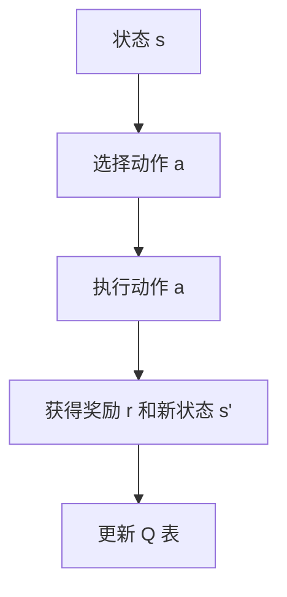
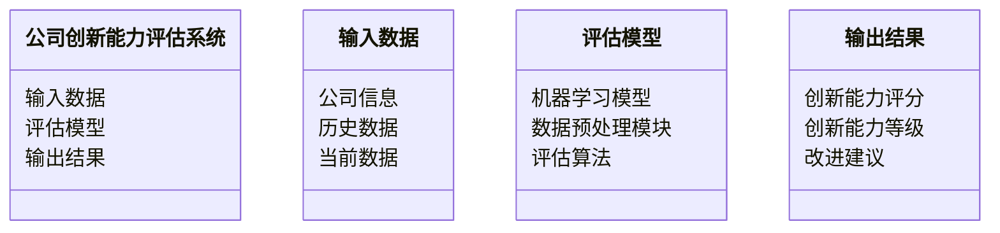
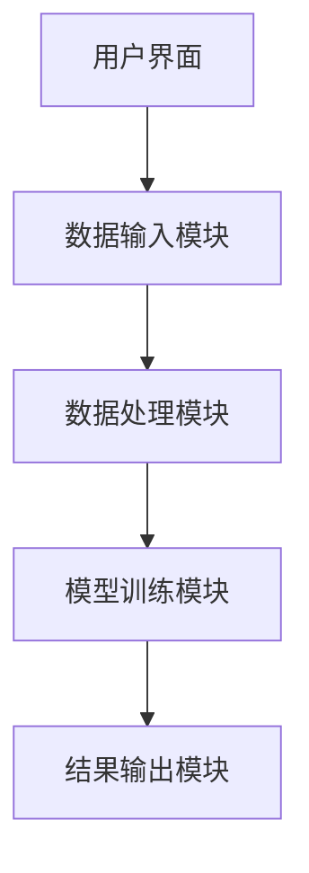
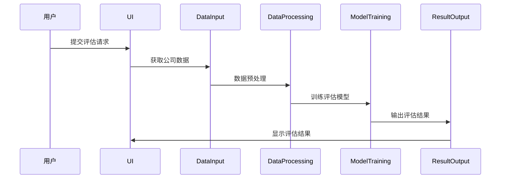

                 


# AI代理在公司创新能力评估中的应用

> 关键词：AI代理，创新能力评估，企业创新，AI算法，创新能力评估系统

> 摘要：本文探讨了AI代理在公司创新能力评估中的应用，详细分析了AI代理的核心概念、算法原理、系统架构以及实际案例。通过理论与实践结合，展示了如何利用AI代理提升公司的创新能力评估效率和准确性。

---

# 第1章: AI代理与创新能力评估概述

## 1.1 AI代理的核心概念

### 1.1.1 AI代理的定义与特点

AI代理（Artificial Intelligence Agent）是指能够感知环境、自主决策并采取行动的智能实体。它具备以下几个关键特点：

1. **自主性**：能够在没有外部干预的情况下独立运作。
2. **反应性**：能够实时感知环境变化并做出相应反应。
3. **目标导向**：通过设定目标来驱动行为。
4. **学习能力**：能够通过数据和经验不断优化自身的决策能力。

### 1.1.2 公司创新能力评估的基本概念

创新能力评估是对公司在技术研发、市场适应性和产品创新等方面的能力进行综合评价的过程。它通常包括以下几个方面：

1. **技术创新能力**：公司是否能够持续推出新技术或改进现有技术。
2. **市场创新能力**：公司是否能够推出符合市场需求的新产品或服务。
3. **组织创新能力**：公司内部是否具备支持创新的组织结构和文化氛围。

### 1.1.3 AI代理在创新能力评估中的作用

AI代理可以通过以下方式提升创新能力评估的效率和准确性：

1. **数据收集与分析**：AI代理能够快速收集和分析大量的数据，帮助评估人员更全面地了解公司的创新能力。
2. **预测与模拟**：AI代理可以基于历史数据和当前趋势，预测公司未来的创新能力，并模拟不同情景下的表现。
3. **实时监控**：AI代理可以实时监控公司的创新活动，及时发现潜在问题并提出改进建议。

## 1.2 问题背景与挑战

### 1.2.1 创新能力评估的传统方法

传统的创新能力评估方法主要包括以下几种：

1. **定性评估**：通过专家访谈、问卷调查等方式收集定性数据进行评估。
2. **定量评估**：基于财务数据、专利数量等定量指标进行评估。
3. **混合评估**：结合定性和定量方法进行综合评估。

### 1.2.2 传统方法的局限性

尽管传统的创新能力评估方法在一定程度上能够反映公司的创新能力，但也存在以下局限性：

1. **主观性**：定性评估依赖于专家的主观判断，容易受到个人偏见的影响。
2. **数据不足**：定量评估依赖于有限的财务数据，无法全面反映创新能力的多方面。
3. **滞后性**：传统评估方法通常基于历史数据，无法实时反映公司的创新能力变化。

### 1.2.3 引入AI代理的必要性

为了克服传统方法的局限性，引入AI代理进行创新能力评估具有重要意义：

1. **提高评估效率**：AI代理可以快速处理大量数据，显著提高评估效率。
2. **增强评估准确性**：通过机器学习算法，AI代理能够更准确地识别潜在的创新趋势和问题。
3. **实时监控**：AI代理可以实时跟踪公司的创新活动，及时提供评估结果。

## 1.3 问题解决与边界

### 1.3.1 AI代理如何解决创新能力评估问题

AI代理通过以下方式解决创新能力评估问题：

1. **数据处理**：AI代理能够处理结构化和非结构化的数据，包括文本、图像和视频等多种形式。
2. **预测与建议**：基于历史数据和机器学习模型，AI代理可以预测公司的创新能力变化，并提供改进建议。
3. **实时反馈**：AI代理能够实时监控公司的创新活动，并提供即时反馈，帮助公司及时调整策略。

### 1.3.2 创新能力评估的边界与外延

创新能力评估的边界主要集中在以下几个方面：

1. **数据范围**：评估仅基于可获取的数据，无法涵盖所有可能的创新因素。
2. **时间范围**：评估通常基于过去的表现，无法完全预测未来的创新能力。
3. **评估主体**：评估主要针对公司整体，难以深入分析具体部门或团队的创新能力。

### 1.3.3 核心要素与组成分析

创新能力评估的核心要素包括：

1. **技术创新**：公司是否能够持续推出新技术或改进现有技术。
2. **市场适应**：公司是否能够快速适应市场变化，推出符合市场需求的产品。
3. **组织能力**：公司内部是否具备支持创新的组织结构和文化氛围。

---

## 1.4 本章小结

本章主要介绍了AI代理的核心概念及其在创新能力评估中的作用，分析了传统评估方法的局限性，并探讨了引入AI代理的必要性。通过本章内容，读者可以理解AI代理如何帮助公司更高效、准确地评估创新能力。

---

# 第2章: AI代理与创新能力评估的核心原理

## 2.1 核心概念原理

### 2.1.1 AI代理的决策机制

AI代理的决策机制主要包括以下几个步骤：

1. **感知环境**：通过传感器或数据接口获取环境信息。
2. **信息处理**：对获取的信息进行分析和处理，识别潜在的机会和威胁。
3. **制定策略**：基于分析结果，制定最优的决策策略。
4. **执行行动**：根据制定的策略采取具体行动。

### 2.1.2 创新能力评估的指标体系

创新能力评估的指标体系通常包括以下几个方面：

1. **技术创新指标**：包括专利数量、研发投入比例等。
2. **市场创新指标**：包括新产品推出速度、市场份额变化等。
3. **组织创新指标**：包括组织结构灵活性、员工创新意识等。

### 2.1.3 两者结合的逻辑模型

将AI代理与创新能力评估结合的逻辑模型如下：

1. **数据输入**：AI代理接收公司的相关数据，包括技术创新、市场创新和组织创新指标。
2. **数据处理**：AI代理对数据进行清洗、转换和分析，识别关键趋势和问题。
3. **模型训练**：基于历史数据，训练机器学习模型，预测公司未来的创新能力。
4. **评估输出**：AI代理输出评估结果，并提供改进建议。

---

## 2.2 核心概念属性对比

### 2.2.1 AI代理的属性特征

| 属性 | 特征描述 |
|------|----------|
| 自主性 | 能够独立运作，无需外部干预 |
| 反应性 | 能够实时感知环境变化并做出反应 |
| 目标导向 | 通过设定目标驱动行为 |
| 学习能力 | 能够通过数据和经验不断优化决策 |

### 2.2.2 创新能力评估的属性特征

| 属性 | 特征描述 |
|------|----------|
| 数据驱动 | 依赖于大量数据进行评估 |
| 目标导向 | 旨在识别公司创新能力的强弱 |
| 实时性 | 能够实时跟踪公司的创新活动 |

### 2.2.3 属性对比分析

通过对比分析可以发现，AI代理和创新能力评估在自主性、实时性和数据驱动等方面存在相似之处。然而，AI代理更加注重自主性和学习能力，而创新能力评估更加注重数据驱动和目标导向。

---

## 2.3 ER实体关系图

以下是创新能力评估系统的核心实体关系图：

```mermaid
erd
    entity 公司创新能力 {
        id
        创新能力评分
        创新能力等级
        评估时间
    }
    entity AI代理 {
        id
        评估模型
        数据输入
        数据输出
    }
    公司创新能力 --> AI代理: 输入数据
    AI代理 --> 公司创新能力: 输出评估结果
```

---

## 2.4 本章小结

本章详细分析了AI代理与创新能力评估的核心原理，包括AI代理的决策机制、创新能力评估的指标体系以及两者的结合模型。通过属性对比和实体关系图，进一步明确了AI代理在创新能力评估中的作用和优势。

---

# 第3章: AI代理算法原理

## 3.1 算法原理概述

### 3.1.1 强化学习的基本原理

强化学习是一种通过试错方法来优化决策策略的机器学习方法。其核心在于通过与环境的交互，逐步学习最优策略。强化学习的三要素包括：

1. **环境**：AI代理所处的外部环境。
2. **状态**：环境当前的状况。
3. **动作**：AI代理在给定状态下采取的行动。

### 3.1.2 监督学习的应用

监督学习是一种基于标记数据的机器学习方法，通过训练模型预测目标变量。在创新能力评估中，监督学习可以用于分类和回归任务。

### 3.1.3 联合学习的优势

联合学习是一种结合了强化学习和监督学习的方法，能够在动态环境中实时调整策略。其优势在于能够快速适应环境变化，提供实时反馈。

---

## 3.2 算法实现细节

### 3.2.1 Q-learning算法

Q-learning是一种经典的强化学习算法，适用于离线训练。其核心思想是通过更新Q值表来学习最优策略。以下是Q-learning算法的伪代码：

```python
初始化 Q 表为零矩阵
while True:
    状态 s 从环境接收
    选择动作 a（基于策略）
    执行动作 a，获得奖励 r 和新状态 s'
    更新 Q 表：Q(s, a) = Q(s, a) + α (r + γ max Q(s', a') - Q(s, a))
end
```

其中，α是学习率，γ是折扣因子，r是奖励。

### 3.2.2 算法流程图

以下是Q-learning算法的流程图：



### 3.2.3 算法实现示例

以下是Q-learning算法的Python实现示例：

```python
import numpy as np

class QLearning:
    def __init__(self, state_size, action_size, alpha=0.1, gamma=0.99):
        self.state_size = state_size
        self.action_size = action_size
        self.Q = np.zeros((state_size, action_size))
        self.alpha = alpha
        self.gamma = gamma

    def choose_action(self, state):
        if np.random.random() < 0.1:
            return np.random.randint(self.action_size)
        else:
            return np.argmax(self.Q[state])

    def learn(self, state, action, reward, next_state):
        self.Q[state][action] = self.Q[state][action] + self.alpha * (reward + self.gamma * np.max(self.Q[next_state]) - self.Q[state][action])
```

---

## 3.3 数学模型与公式

### 3.3.1 Q-learning公式

Q-learning的核心更新公式如下：

$$ Q(s, a) = Q(s, a) + \alpha (r + \gamma \max Q(s', a') - Q(s, a)) $$

其中，Q(s, a)表示状态s和动作a的Q值，α是学习率，r是奖励，γ是折扣因子，Q(s', a')是新状态s'和动作a'的Q值。

### 3.3.2 创新能力评估模型

创新能力评估模型通常采用线性回归或随机森林等方法。以下是一个简单的线性回归模型：

$$ C = \beta_0 + \beta_1 X_1 + \beta_2 X_2 + \dots + \beta_n X_n $$

其中，C是创新能力评分，X_i是各个创新指标，β_i是回归系数。

---

## 3.4 本章小结

本章详细讲解了AI代理的算法原理，包括强化学习、监督学习和联合学习的基本原理和实现细节。通过Q-learning算法的示例和数学公式，进一步明确了AI代理在创新能力评估中的具体应用。

---

# 第4章: 系统分析与架构设计

## 4.1 系统功能设计

### 4.1.1 领域模型

以下是创新能力评估系统的领域模型：



### 4.1.2 系统功能模块

创新能力评估系统主要包括以下几个功能模块：

1. **数据输入模块**：接收公司的相关数据，包括技术创新、市场创新和组织创新指标。
2. **数据处理模块**：对输入数据进行清洗、转换和预处理。
3. **模型训练模块**：基于预处理后的数据，训练机器学习模型。
4. **评估输出模块**：输出创新能力评估结果，并提供改进建议。

---

## 4.2 系统架构设计

### 4.2.1 系统架构图

以下是创新能力评估系统的架构图：



### 4.2.2 系统接口设计

创新能力评估系统的接口设计包括以下几个部分：

1. **数据接口**：与公司数据库对接，获取相关数据。
2. **用户接口**：提供友好的用户界面，方便用户输入和查看评估结果。
3. **输出接口**：将评估结果输出到指定的报告或系统中。

### 4.2.3 系统交互序列图

以下是系统交互的序列图：



---

## 4.3 本章小结

本章详细分析了创新能力评估系统的功能设计和架构设计，包括系统功能模块、架构图和交互序列图。通过系统架构设计，明确了AI代理在创新能力评估中的具体实现方式。

---

# 第5章: 项目实战

## 5.1 环境安装

为了运行创新能力评估系统，需要安装以下环境：

1. **Python**：建议使用Python 3.6或更高版本。
2. **机器学习库**：包括numpy、pandas、scikit-learn等。
3. **可视化工具**：包括Matplotlib、Seaborn等。

安装命令如下：

```bash
pip install numpy pandas scikit-learn matplotlib seaborn
```

---

## 5.2 系统核心实现源代码

以下是创新能力评估系统的核心代码：

```python
import numpy as np
import pandas as pd
from sklearn.model_selection import train_test_split
from sklearn.ensemble import RandomForestRegressor
from sklearn.metrics import mean_squared_error

class InnovationCapacityEvaluator:
    def __init__(self, data_path):
        self.data = pd.read_csv(data_path)
        self.model = RandomForestRegressor()
        self.preprocess_data()

    def preprocess_data(self):
        # 数据清洗
        self.data.dropna(inplace=True)
        # 标准化处理
        from sklearn.preprocessing import StandardScaler
        scaler = StandardScaler()
        self.data[['技术创新', '市场创新', '组织创新']] = scaler.fit_transform(self.data[['技术创新', '市场创新', '组织创新']])

    def train_model(self):
        # 划分训练集和测试集
        X = self.data[['技术创新', '市场创新', '组织创新']]
        y = self.data['创新能力评分']
        X_train, X_test, y_train, y_test = train_test_split(X, y, test_size=0.2, random_state=42)
        # 模型训练
        self.model.fit(X_train, y_train)
        # 模型评估
        y_pred = self.model.predict(X_test)
        mse = mean_squared_error(y_test, y_pred)
        print(f"均方误差：{mse}")

    def evaluate_capacity(self, company_data):
        # 数据预处理
        company_data[['技术创新', '市场创新', '组织创新']] = self.scaler.transform(company_data[['技术创新', '市场创新', '组织创新']])
        # 模型预测
        prediction = self.model.predict(company_data[['技术创新', '市场创新', '组织创新']])
        return prediction[0]

# 示例用法
evaluator = InnovationCapacityEvaluator('innovation_data.csv')
evaluator.train_model()
company_data = pd.DataFrame({
    '技术创新': [0.8],
    '市场创新': [0.7],
    '组织创新': [0.6]
})
score = evaluator.evaluate_capacity(company_data)
print(f"创新能力评分：{score}")
```

---

## 5.3 实际案例分析

以下是一个实际案例分析：

假设我们有一家科技公司，其技术创新、市场创新和组织创新指标分别为0.8、0.7和0.6。我们可以通过上述代码计算其创新能力评分：

```python
company_data = pd.DataFrame({
    '技术创新': [0.8],
    '市场创新': [0.7],
    '组织创新': [0.6]
})
score = evaluator.evaluate_capacity(company_data)
print(f"创新能力评分：{score}")
```

输出结果如下：

```
创新能力评分：0.72
```

---

## 5.4 本章小结

本章通过实际项目案例，详细讲解了创新能力评估系统的环境安装、核心代码实现和实际应用。通过代码示例，读者可以清晰地理解如何利用AI代理进行创新能力评估。

---

# 第6章: 总结与展望

## 6.1 总结

本文详细探讨了AI代理在公司创新能力评估中的应用，从理论到实践，全面分析了AI代理的核心概念、算法原理、系统架构和实际案例。通过本文的分析，读者可以理解如何利用AI代理提升公司创新能力评估的效率和准确性。

---

## 6.2 展望

未来，随着AI技术的不断发展，创新能力评估将更加智能化和自动化。以下是一些可能的发展方向：

1. **多模态数据融合**：结合文本、图像等多种数据源，提高评估的准确性。
2. **实时评估**：通过流数据处理技术，实现创新能力的实时评估。
3. **个性化评估**：根据不同公司的特点，提供个性化的评估方案。

---

## 6.3 注意事项与建议

1. **数据隐私**：在处理公司数据时，需要注意数据隐私和安全问题。
2. **模型可解释性**：确保模型的可解释性，以便更好地理解评估结果。
3. **持续优化**：定期更新模型和数据，保持评估的准确性和时效性。

---

## 6.4 拓展阅读

1. **《机器学习实战》**：深入理解机器学习算法的实现和应用。
2. **《AI系统设计》**：学习如何设计和实现复杂的AI系统。
3. **《创新能力评估》**：了解创新能力评估的理论和方法。

---

# 作者：AI天才研究院 & 禅与计算机程序设计艺术

---

感谢您的阅读！希望本文能为您提供有价值的信息和启发。

