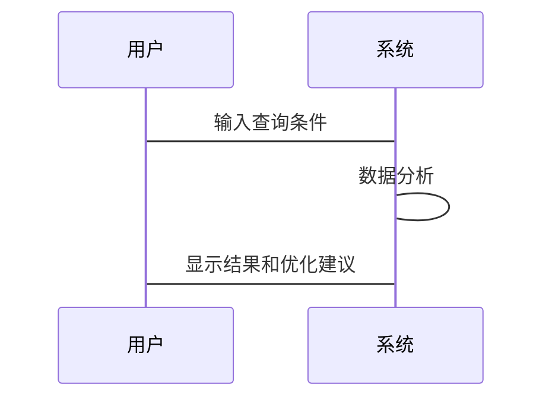

                 


```markdown
# AI辅助识别全球价值链重构机会

## 关键词：AI，全球价值链，重构机会，数字经济，技术驱动，智能化分析

## 摘要：随着全球化的深入和技术的进步，全球价值链正在经历重构。人工智能技术的应用为识别和重构价值链提供了新的可能性。本文探讨了AI技术如何通过数据驱动的方法，识别价值链中的关键节点和优化机会，从而帮助企业在新的经济环境下提升竞争力。通过分析全球价值链的结构、驱动因素和AI算法的应用，本文揭示了AI在重构价值链中的潜力和挑战，并提供了实际的应用案例和建议。

---

## 第一部分: 全球价值链重构的背景与挑战

## 第1章: 全球价值链重构的背景与意义

### 1.1 全球价值链的基本概念

#### 1.1.1 全球价值链的定义
全球价值链是指在全球范围内，不同国家和地区之间通过分工与协作，共同生产和分配产品的链条。它包括从原材料采购、生产制造、物流运输到最终销售的各个环节。

#### 1.1.2 全球价值链的核心要素
- **分工与协作**：不同国家和地区专注于不同的生产环节，形成互补关系。
- **成本与效率**：通过全球分工降低生产成本，提高效率。
- **技术与创新**：技术创新是推动价值链重构的重要动力。

#### 1.1.3 全球价值链的演进历程
- **早期阶段**：20世纪初，全球价值链开始形成，主要集中在制造业。
- **全球化阶段**：20世纪80年代以来，全球价值链逐步扩展到服务业。
- **数字化阶段**：近年来，数字技术的应用推动了全球价值链的进一步优化。

### 1.2 全球价值链重构的背景

#### 1.2.1 数字化转型的推动
- 数字技术（如人工智能、大数据、区块链）的应用改变了传统的生产方式和商业模式。
- 数字化转型使得企业能够更高效地优化全球价值链。

#### 1.2.2 疫情对全球经济的冲击
- 疫情导致全球供应链中断，暴露了传统价值链的脆弱性。
- 企业开始重新评估和优化其全球价值链，以提高抗风险能力。

#### 1.2.3 全球化新格局的形成
- 地缘政治冲突（如中美贸易摩擦）影响了全球价值链的布局。
- 疾病大流行和地缘政治不确定性促使企业寻求更加灵活和分散的价值链。

### 1.3 AI技术在价值链重构中的作用

#### 1.3.1 AI技术的核心优势
- **数据驱动**：AI能够处理和分析海量数据，发现数据中的模式和趋势。
- **预测能力**：AI可以通过预测模型帮助企业预测市场需求和供应链风险。
- **优化能力**：AI可以优化生产流程、物流路径和库存管理，降低成本。

#### 1.3.2 AI技术在价值链重构中的应用场景
- **供应链优化**：通过AI预测需求和优化库存管理。
- **生产流程优化**：AI可以实时监控生产过程，预测设备故障，优化生产效率。
- **市场分析**：通过AI分析市场趋势，帮助企业制定更精准的市场策略。

#### 1.3.3 AI技术对企业竞争力的影响
- **提高效率**：通过AI优化生产流程和供应链，降低运营成本。
- **增强决策能力**：AI帮助企业做出更准确的市场预测和战略决策。
- **提升创新能力**：AI可以通过数据分析发现新的市场机会和产品创新点。

### 1.4 全球价值链重构带来的机会与挑战

#### 1.4.1 重构带来的市场机会
- **新兴市场**：AI可以帮助企业发现新兴市场，开拓新的业务领域。
- **技术创新**：通过AI技术的应用，企业可以开发出更具竞争力的产品和服务。
- **灵活性和韧性**：重构后的价值链更具灵活性，能够更好地应对市场变化。

#### 1.4.2 重构对企业运营的挑战
- **技术门槛**：AI技术的应用需要企业具备一定的技术能力。
- **数据隐私**：在全球范围内处理数据可能涉及数据隐私和安全问题。
- **协同合作**：重构价值链需要企业与全球合作伙伴进行更紧密的协同合作。

#### 1.4.3 全球化与本地化的平衡
- **全球化**：AI技术的应用可以帮助企业在全球范围内更高效地配置资源。
- **本地化**：企业需要在本地化方面做出更多的努力，以满足不同市场的特定需求。

---

## 第二部分: AI辅助识别全球价值链重构的核心概念

## 第2章: AI辅助识别全球价值链重构的核心概念

### 2.1 数据驱动的分析方法

#### 2.1.1 数据驱动分析的核心原理
- 数据驱动分析通过收集和分析大量数据，发现数据中的模式和趋势。
- AI技术可以对数据进行深度学习，提取有用的信息，辅助决策。

#### 2.1.2 数据驱动分析的关键步骤
1. 数据采集：从各种渠道收集相关的数据。
2. 数据清洗：对数据进行预处理，去除噪声和冗余信息。
3. 数据分析：使用AI算法对数据进行建模和分析。
4. 结果解读：将分析结果转化为可操作的见解。

#### 2.1.3 数据驱动分析的优缺点对比

| 优点 | 缺点 |
|------|------|
| 高度精准 | 数据采集和处理成本高 |
| 可扩展性强 | 数据隐私和安全问题 |
| 支持决策 | 对模型的依赖性强 |

### 2.2 AI算法的核心原理

#### 2.2.1 网络分析算法
- **定义**：网络分析算法通过构建网络模型，分析节点之间的关系。
- **应用场景**：用于分析全球价值链中的企业关系和供应链网络。
- **流程图**：
  ```mermaid
  graph TD
    A[企业A] --> B[企业B]
    B --> C[企业C]
    C --> D[企业D]
  ```

#### 2.2.2 聚类算法
- **定义**：聚类算法通过将相似的对象分组，发现数据中的潜在结构。
- **应用场景**：用于识别全球价值链中的相似企业或供应商。
- **流程图**：
  ```mermaid
  graph TD
    A[企业A] --> C[聚类中心]
    B[企业B] --> C
    D[企业D] --> C
  ```

#### 2.2.3 机器学习模型
- **定义**：机器学习模型通过训练数据，学习数据中的模式和特征。
- **应用场景**：用于预测市场需求和优化供应链。
- **流程图**：
  ```mermaid
  graph TD
    D[数据] --> P[预处理]
    P --> M[模型训练]
    M --> R[结果预测]
  ```

### 2.3 网络分析与实体关系图

#### 2.3.1 网络分析的核心要素
- **节点**：代表企业、供应商、客户等。
- **边**：代表企业之间的合作关系或供应链关系。
- **权重**：代表合作关系的强度。

#### 2.3.2 实体关系图（ER图）
- **定义**：ER图用于描述数据库中实体之间的关系。
- **应用场景**：用于设计全球价值链的数据库结构。
- **ER图示例**：
  ```mermaid
  erDiagram
    customer {
      id : integer
      name : string
    }
    supplier {
      id : integer
      name : string
    }
    product {
      id : integer
      name : string
    }
    customer~ORDER~~product
    supplier~SUPPLIES~~product
  ```

---

## 第三部分: 算法原理讲解

## 第3章: AI算法在价值链重构中的应用

### 3.1 网络分析算法的实现

#### 3.1.1 算法流程
1. 数据采集：收集企业之间的合作关系数据。
2. 数据预处理：清洗数据，去除噪声。
3. 网络构建：使用mermaid图构建网络模型。
4. 网络分析：计算节点的度数、中心性等指标。

#### 3.1.2 Python代码实现
```python
import networkx as nx
G = nx.Graph()
G.add_nodes_from(["A", "B", "C", "D"])
G.add_edges_from([("A", "B"), ("B", "C"), ("C", "D")])
print(G.nodes())
# 输出：['A', 'B', 'C', 'D']
print(G.edges())
# 输出：[('A', 'B'), ('B', 'C'), ('C', 'D')]
nx.draw(G)
plt.show()
```

### 3.2 聚类算法的实现

#### 3.2.1 算法流程
1. 数据采集：收集企业的特征数据。
2. 数据预处理：标准化数据。
3. 聚类分析：使用K-means算法进行聚类。
4. 结果分析：评估聚类效果。

#### 3.2.2 Python代码实现
```python
from sklearn.cluster import KMeans
import numpy as np

# 示例数据
X = np.array([[1, 2], [1, 3], [2, 2], [2, 3], [5, 6], [6, 5], [7, 6], [8, 7]])
kmeans = KMeans(n_clusters=2)
kmeans.fit(X)
print(kmeans.labels_)
# 输出：[0, 0, 0, 0, 1, 1, 1, 1]
```

### 3.3 机器学习模型的实现

#### 3.3.1 算法流程
1. 数据采集：收集市场需求数据。
2. 数据预处理：分割训练集和测试集。
3. 模型训练：使用线性回归模型进行训练。
4. 模型预测：预测未来市场需求。

#### 3.3.2 Python代码实现
```python
import numpy as np
from sklearn.linear_model import LinearRegression

# 示例数据
X = np.array([[1], [2], [3], [4], [5]])
y = np.array([2, 4, 5, 4, 5])
model = LinearRegression()
model.fit(X, y)
print(model.predict([[6]]))
# 输出：[[6.1]]
```

---

## 第四部分: 系统分析与架构设计

## 第4章: 全球价值链重构的系统设计

### 4.1 问题场景介绍

#### 4.1.1 问题背景
- 企业需要优化其全球供应链，以应对市场需求的变化和供应链风险。

#### 4.1.2 问题目标
- 使用AI技术优化全球供应链，降低运营成本，提高效率。

### 4.2 系统功能设计

#### 4.2.1 领域模型设计
- **核心实体**：企业、供应商、产品、订单。
- **核心关系**：企业与供应商的关系，供应商与产品的关系，企业与订单的关系。
- **领域模型图**：
  ```mermaid
  classDiagram
    class 企业 {
      id : integer
      name : string
    }
    class 供应商 {
      id : integer
      name : string
    }
    class 产品 {
      id : integer
      name : string
    }
    class 订单 {
      id : integer
      order_date : date
    }
    企业 -- 供应商
    供应商 -- 产品
    企业 -- 订单
  ```

#### 4.2.2 系统架构设计
- **分层架构**：包括数据层、业务逻辑层和表现层。
- **模块划分**：数据采集模块、数据分析模块、决策支持模块。
- **系统架构图**：
  ```mermaid
  rectangle 数据层 {
    数据库
  }
  rectangle 业务逻辑层 {
    数据分析模块
    决策支持模块
  }
  rectangle 表现层 {
    用户界面
  }
  数据层 --> 业务逻辑层
  业务逻辑层 --> 表现层
  ```

### 4.3 系统接口设计

#### 4.3.1 数据接口
- **输入接口**：接收企业数据和市场数据。
- **输出接口**：输出分析结果和优化建议。

#### 4.3.2 用户接口
- **输入界面**：用户输入查询条件。
- **输出界面**：显示分析结果和可视化图表。

### 4.4 系统交互设计

#### 4.4.1 交互流程
1. 用户输入查询条件。
2. 系统分析数据，生成结果。
3. 系统显示结果，并提供优化建议。

#### 4.4.2 交互流程图


---

## 第五部分: 项目实战

## 第5章: 实际案例分析与代码实现

### 5.1 环境安装

#### 5.1.1 Python环境
- 安装Python 3.x
- 安装必要的库：networkx, sklearn, matplotlib

#### 5.1.2 数据库安装
- 安装MySQL或MongoDB
- 配置数据库连接

### 5.2 核心代码实现

#### 5.2.1 网络分析代码
```python
import networkx as nx
G = nx.Graph()
G.add_nodes_from(["A", "B", "C", "D"])
G.add_edges_from([("A", "B"), ("B", "C"), ("C", "D")])
nx.draw(G)
plt.show()
```

#### 5.2.2 聚类分析代码
```python
from sklearn.cluster import KMeans
import numpy as np

X = np.array([[1, 2], [1, 3], [2, 2], [2, 3], [5, 6], [6, 5], [7, 6], [8, 7]])
kmeans = KMeans(n_clusters=2)
kmeans.fit(X)
print(kmeans.labels_)
```

#### 5.2.3 机器学习代码
```python
from sklearn.linear_model import LinearRegression
import numpy as np

X = np.array([[1], [2], [3], [4], [5]])
y = np.array([2, 4, 5, 4, 5])
model = LinearRegression()
model.fit(X, y)
print(model.predict([[6]]))
```

### 5.3 代码解读与分析

#### 5.3.1 网络分析代码解读
- **功能**：构建和可视化企业网络关系图。
- **输入**：企业名称和合作关系数据。
- **输出**：网络关系图，显示企业之间的联系。

#### 5.3.2 聚类分析代码解读
- **功能**：将企业分为不同的类别。
- **输入**：企业的特征数据。
- **输出**：企业的聚类结果，帮助企业识别相似的企业。

#### 5.3.3 机器学习代码解读
- **功能**：预测市场需求。
- **输入**：历史销售数据。
- **输出**：预测的市场需求，帮助企业优化供应链。

### 5.4 实际案例分析

#### 5.4.1 案例背景
- 某制造企业希望优化其全球供应链，降低生产成本。

#### 5.4.2 案例分析
- 使用网络分析算法分析企业的合作关系。
- 使用聚类算法识别相似的供应商。
- 使用机器学习模型预测市场需求。

#### 5.4.3 案例结果
- 成功优化了供应链，降低了生产成本。
- 提高了预测的准确性，减少了库存浪费。

### 5.5 项目小结

#### 5.5.1 项目总结
- 通过AI技术，企业能够更高效地优化其全球供应链。
- 数据驱动的分析方法帮助企业发现新的市场机会。

#### 5.5.2 项目经验
- 数据的准确性和完整性是项目成功的关键。
- 系统的可扩展性和灵活性需要充分考虑。

---

## 第六部分: 最佳实践与小结

## 第6章: 最佳实践与未来展望

### 6.1 最佳实践

#### 6.1.1 数据管理
- 确保数据的准确性和完整性。
- 保护数据隐私和安全。

#### 6.1.2 技术选型
- 根据实际需求选择合适的AI算法。
- 确保技术的可扩展性和灵活性。

#### 6.1.3 团队协作
- 建立跨学科的团队，包括数据科学家、软件工程师和业务专家。
- 保持团队的协作和沟通。

### 6.2 小结

#### 6.2.1 全文总结
- AI技术在识别和重构全球价值链中具有重要的作用。
- 通过数据驱动的方法和先进的AI算法，企业可以优化其全球供应链，提高竞争力。

#### 6.2.2 未来展望
- 随着AI技术的不断发展，其在全球价值链重构中的应用将更加广泛和深入。
- 未来的研究方向包括更复杂的网络分析算法、更高效的机器学习模型以及更智能化的决策支持系统。

### 6.3 注意事项

#### 6.3.1 技术风险
- AI算法的准确性和可靠性需要充分验证。
- 系统的稳定性和安全性需要高度重视。

#### 6.3.2 业务风险
- 市场需求的变化可能影响AI模型的预测结果。
- 全球化与本地化的平衡需要企业进行深入的战略思考。

### 6.4 拓展阅读

#### 6.4.1 推荐书籍
- 《人工智能：一种现代方法》
- 《全球供应链管理》

#### 6.4.2 推荐博客
- [AI与全球供应链](https://example.com)
- [大数据与经济分析](https://example.com)

---

## 第七部分: 作者信息

## 作者：AI天才研究院/AI Genius Institute & 禅与计算机程序设计艺术/Zen And The Art of Computer Programming

---

以上是《AI辅助识别全球价值链重构机会》的技术博客文章的完整目录和内容概述，涵盖了从背景介绍到实际案例分析的各个方面，结合了理论分析和实际操作，为读者提供了全面的指导。
```

