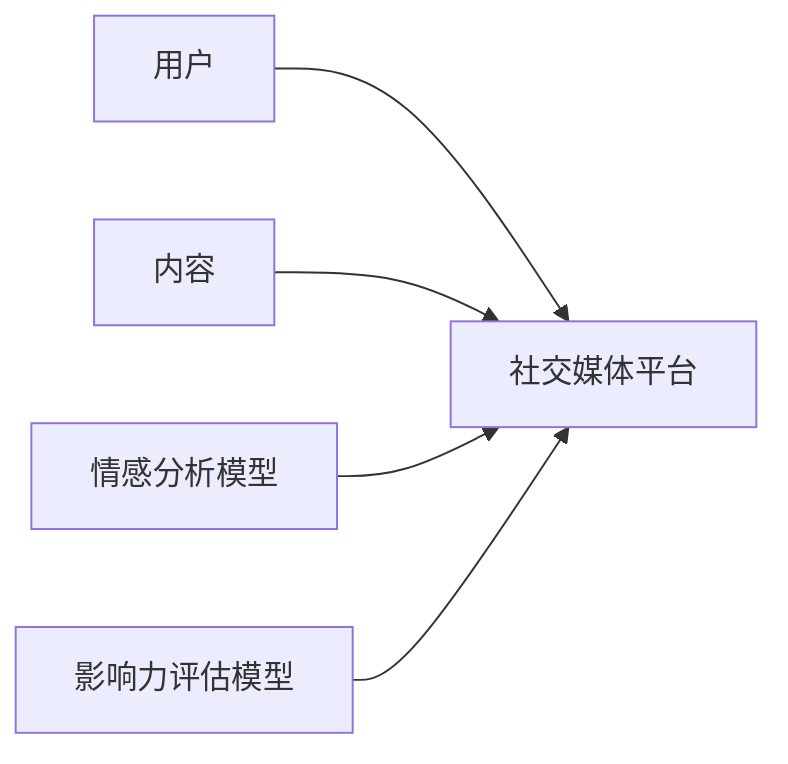
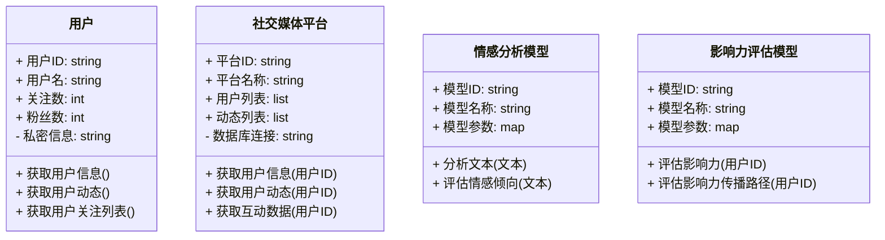
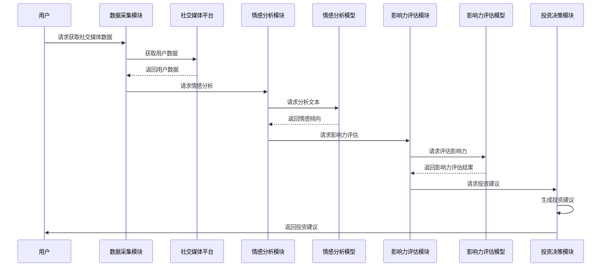

                 


# 价值投资中的AI驱动社交媒体影响力分析：多智能体系统

**关键词**：价值投资，AI，社交媒体影响力分析，多智能体系统，情感分析，影响力传播，投资决策

**摘要**：  
本文深入探讨了AI技术在价值投资中的应用，特别是通过社交媒体影响力分析和多智能体系统来提升投资决策的科学性和准确性。文章从背景、核心概念、算法原理、数学模型、系统设计到项目实战，全面分析了如何利用社交媒体数据和多智能体协同计算来优化投资策略。通过具体案例和代码实现，展示了如何将复杂的社会媒体数据转化为可操作的投资信号，为投资者提供新的视角和工具。

---

# 第1章: 价值投资与社交媒体影响力分析概述

## 1.1 价值投资的基本概念  
### 1.1.1 价值投资的定义与核心理念  
价值投资是一种长期投资策略，核心在于寻找被市场低估的优质资产，通过分析公司的基本面（如财务状况、行业地位、盈利能力等）来判断其内在价值。传统价值投资强调对公司内在价值的深入研究，而忽视短期市场波动。

### 1.1.2 社会媒体在投资中的作用  
随着社交媒体的普及，投资者可以通过 Twitter、Reddit、雪球等平台获取实时市场信息、投资观点和情绪数据。社交媒体不仅是信息的来源，更是投资者情绪的反映场所，能够揭示市场参与者的心理状态和行为倾向。

### 1.1.3 多智能体系统在投资分析中的潜力  
多智能体系统（Multi-Agent System, MAS）是由多个具有自主决策能力的智能体组成的分布式系统，能够通过协同合作完成复杂的任务。在投资分析中，多智能体系统可以通过分布式计算和协同学习，从海量社交媒体数据中提取有用的信息，帮助投资者做出更明智的决策。

---

## 1.2 AI驱动社交媒体影响力分析的背景  
### 1.2.1 社会媒体数据的特点与挑战  
社交媒体数据具有高实时性、高噪声和高复杂性的特点。数据来源多样，包括文本、图片、视频和互动行为（如点赞、评论、转发等）。然而，这些数据的异构性和不完整性给分析带来了巨大挑战。

### 1.2.2 AI技术在社交媒体分析中的应用  
AI技术（如自然语言处理、机器学习和深度学习）能够从社交媒体数据中提取情感、主题和影响力等关键信息。例如，情感分析可以判断市场情绪的偏向，主题分析可以识别市场关注的热点话题。

### 1.2.3 价值投资中的社交媒体影响力分析需求  
在价值投资中，社交媒体影响力分析可以帮助投资者识别市场情绪的变化趋势，发现市场参与者的认知偏差，从而优化投资决策。例如，通过分析社交媒体上的投资者情绪，投资者可以预测市场的短期波动，并结合公司基本面进行综合判断。

---

## 1.3 多智能体系统在投资分析中的优势  
### 1.3.1 多智能体系统的定义与特点  
多智能体系统由多个智能体组成，每个智能体都有自己的目标、知识和行为规则。智能体之间通过通信和协作完成复杂任务，具有分布式计算、自主决策和协同优化的特点。

### 1.3.2 多智能体系统在投资分析中的应用场景  
在社交媒体影响力分析中，多智能体系统可以分别负责数据采集、情感分析、影响力评估和投资决策建议。例如，一个智能体负责从社交媒体平台获取数据，另一个智能体负责分析数据中的情感倾向，第三个智能体负责评估影响力的传播路径。

### 1.3.3 多智能体系统与社交媒体数据的结合  
通过多智能体系统的协同计算，可以将社交媒体数据转化为可操作的投资信号。例如，一个智能体可以分析社交媒体上的市场情绪，另一个智能体可以结合公司基本面数据，最终生成综合的投资决策建议。

---

## 1.4 本章小结  
本章介绍了价值投资的基本概念、社交媒体在投资中的作用，以及多智能体系统在投资分析中的潜力。社交媒体数据的异构性和复杂性为投资分析带来了挑战，但AI技术和多智能体系统为这些问题提供了解决方案。

---

# 第2章: 社会媒体影响力分析的核心概念与联系  

## 2.1 核心概念与原理  
### 2.1.1 社会媒体影响力分析的定义  
社交媒体影响力分析是指通过分析社交媒体上的文本、情感和互动行为，评估某个主体（如公司、品牌或个人）在社交媒体上的影响力和传播能力。

### 2.1.2 多智能体系统的构成与功能  
多智能体系统由多个智能体组成，每个智能体负责不同的任务（如数据采集、情感分析、影响力评估）。智能体之间通过通信和协作完成复杂任务。

### 2.1.3 价值投资中的关键指标与分析维度  
在价值投资中，社交媒体影响力分析的关键指标包括市场情绪、话题热度、用户影响力和信息传播速度。分析维度包括情感分析、主题分析和影响力传播。

---

## 2.2 核心概念对比分析  
### 2.2.1 社会媒体影响力分析与传统舆情分析的对比  
| 对比维度 | 社会媒体影响力分析 | 传统舆情分析 |  
|----------|---------------------|---------------|  
| 数据来源 | 社交媒体平台数据 | 新闻、报告等 |  
| 数据类型 | 文本、情感、互动行为 | 文本为主 |  
| 分析目标 | 评估影响力和传播路径 | 评估舆论倾向 |  
| 应用场景 | 投资决策、品牌管理 | 政府决策、媒体监控 |  

### 2.2.2 多智能体系统与传统数据分析方法的对比  
| 对比维度 | 多智能体系统 | 传统数据分析方法 |  
|----------|--------------|------------------|  
| 计算方式 | 分布式计算、协同学习 | 集中式计算 |  
| 数据处理 | 处理异构数据 | 处理结构化数据 |  
| 应用场景 | 复杂任务、实时分析 | 简单任务、离线分析 |  

### 2.2.3 价值投资中不同分析方法的优劣势  
| 分析方法 | 优势 | 劣势 |  
|----------|------|------|  
| 情感分析 | 实时性强 | 精度较低 |  
| 主题分析 | 识别热点 | 计算复杂 |  
| 影响力传播 | 考虑传播路径 | 需要大量数据 |  

---

## 2.3 实体关系图与流程图  
### 2.3.1 社会媒体影响力分析的实体关系图（Mermaid）  


### 2.3.2 多智能体系统的流程图（Mermaid）  


---

## 2.4 本章小结  
本章通过对比分析，明确了社交媒体影响力分析、多智能体系统和传统分析方法的区别与联系，为后续的算法设计和系统实现奠定了基础。

---

# 第3章: 多智能体系统在社交媒体影响力分析中的算法原理  

## 3.1 多智能体系统的核心算法  
### 3.1.1 分布式计算与协同学习  
分布式计算通过将任务分解到多个智能体上，利用并行计算提高效率。协同学习则通过智能体之间的知识共享，提升整体系统的性能。

### 3.1.2 联合学习与知识共享  
联合学习是一种分布式学习方法，多个智能体在不共享数据的情况下，通过交换模型参数或预测结果，共同优化学习效果。

### 3.1.3 自适应优化算法  
自适应优化算法根据环境的变化动态调整智能体的行为策略，例如通过强化学习优化投资决策。

---

## 3.2 情感分析算法  
### 3.2.1 基于深度学习的情感分析模型  


### 3.2.2 基于规则的情感分析方法  
规则情感分析通过预定义的情感词典和句法规则，判断文本的情感倾向。例如，如果文本中包含“乐观”或“积极”等关键词，则判断为正面情感。

### 3.2.3 情感分析的评估指标与对比  
| 评估指标 | 定义 | 常见值 |  
|----------|------|--------|  
| 准确率 | 正确预测的比例 | 0-1 |  
| 召回率 | 正确预测的正例比例 | 0-1 |  
| F1分数 | 准确率和召回率的调和平均值 | 0-1 |  

---

## 3.3 影响力传播模型  
### 3.3.1 网络影响力传播的基本原理  
影响力传播模型通过分析社交媒体网络的结构，评估信息的传播路径和速度。例如，可以使用图论中的传播模型（如信息扩散模型）来模拟信息的传播过程。

### 3.3.2 基于图论的影响力传播算法  


### 3.3.3 多智能体系统中的影响力协同计算  
多智能体系统通过协同计算，优化影响力传播的路径和速度。例如，一个智能体负责计算传播路径，另一个智能体负责评估传播效果。

---

## 3.4 本章小结  
本章详细介绍了多智能体系统中的核心算法，包括分布式计算、情感分析和影响力传播模型。这些算法为社交媒体影响力分析提供了理论基础和技术支持。

---

# 第4章: 价值投资中的数学模型与公式  

## 4.1 社会媒体影响力分析的数学模型  
### 4.1.1 基于文本挖掘的情感分析模型  
$$ P(\text{情感} = \text{正面} | \text{文本}) = \frac{\text{正面词数}}{\text{总词数}} $$

### 4.1.2 基于网络分析的影响力评估公式  
$$ I_i = \sum_{j=1}^{n} w_{ij} \cdot I_j $$  
其中，\( I_i \) 表示节点 \( i \) 的影响力，\( w_{ij} \) 表示节点 \( i \) 和 \( j \) 之间的权重。

### 4.1.3 基于时间序列的影响力变化模型  
$$ I_t = a \cdot I_{t-1} + b \cdot \Delta I_{t-1} $$  
其中，\( a \) 和 \( b \) 是权重系数，\( \Delta I_{t-1} \) 表示影响力的变化量。

---

## 4.2 多智能体系统的数学建模  
### 4.2.1 多智能体系统的行为模型  
$$ A_i(t) = f_i(S_i(t), O_i(t)) $$  
其中，\( A_i(t) \) 表示智能体 \( i \) 在时间 \( t \) 的行为，\( S_i(t) \) 是状态，\( O_i(t) \) 是目标。

### 4.2.2 多智能体系统的通信与协作模型  
$$ C_{ij} = g_j(S_i(t), S_j(t)) $$  
其中，\( C_{ij} \) 表示智能体 \( i \) 和 \( j \) 之间的通信内容，\( g_j \) 是智能体 \( j \) 的通信规则。

### 4.2.3 多智能体系统的优化模型  
$$ \min_{x_i} \sum_{i=1}^{n} f_i(x_i) $$  
其中，\( x_i \) 是智能体 \( i \) 的优化变量，\( f_i \) 是目标函数。

---

## 4.3 价值投资中的数学公式  
### 4.3.1 基于影响力的股票估值公式  
$$ V_i = \alpha \cdot F_i + \beta \cdot E_i $$  
其中，\( V_i \) 是股票 \( i \) 的估值，\( F_i \) 是公司基本面因素，\( E_i \) 是社交媒体影响力因素，\( \alpha \) 和 \( \beta \) 是权重系数。

### 4.3.2 多智能体系统协同决策的数学表达  
$$ D_{ij} = \max_{k} (P_{ik} + P_{kj}) $$  
其中，\( D_{ij} \) 表示智能体 \( i \) 和 \( j \) 协同决策的概率，\( P_{ik} \) 和 \( P_{kj} \) 是智能体 \( i \) 和 \( j \) 的决策概率。

### 4.3.3 影响力与股价波动的关联公式  
$$ \text{波动率} = \sigma(\text{影响力} \cdot \text{市场情绪}) $$  
其中，\( \sigma \) 表示标准差，用于衡量股价波动的程度。

---

## 4.4 本章小结  
本章通过数学公式和模型，详细阐述了社交媒体影响力分析和多智能体系统在价值投资中的应用。这些模型为投资决策提供了科学的理论依据。

---

# 第5章: 系统分析与架构设计方案  

## 5.1 问题场景介绍  
在价值投资中，投资者需要从社交媒体数据中提取有用的信息，以优化投资决策。然而，社交媒体数据的异构性和复杂性给分析带来了巨大挑战。因此，我们需要设计一个基于多智能体系统的社交媒体影响力分析平台，帮助投资者做出更明智的决策。

---

## 5.2 系统功能设计  
### 5.2.1 领域模型（Mermaid 类图）  


---

### 5.2.2 系统架构设计（Mermaid 架构图）  
```mermaid
docker
服务1: 用户请求
服务2: 数据采集模块
服务3: 情感分析模块
服务4: 影响力评估模块
服务5: 投资决策模块
服务2 --> 服务3
服务3 --> 服务4
服务4 --> 服务5
```

---

### 5.2.3 系统交互设计（Mermaid 序列图）  


---

## 5.3 系统实现与优化  
### 5.3.1 环境安装  
需要安装以下工具和库：  
- Python 3.8+
- PyTorch 或 TensorFlow（用于深度学习模型）
- NLTK 或 spaCy（用于自然语言处理）
- requests 和 BeautifulSoup（用于数据采集）
- Mermaid 和 PlantUML（用于绘制图表）

### 5.3.2 核心实现代码  
以下是情感分析模块的实现代码：  
```python
import torch
import torch.nn as nn
import torch.optim as optim
import numpy as np

class SentimentClassifier(nn.Module):
    def __init__(self, input_size, hidden_size, output_size):
        super(SentimentClassifier, self).__init__()
        self.embedding = nn.Embedding(input_size, hidden_size)
        self.fc = nn.Linear(hidden_size, output_size)
    
    def forward(self, x):
        out = self.embedding(x)
        out = out.mean(dim=1)
        out = self.fc(out)
        return out

# 初始化模型
input_size = 10000  # 词表大小
hidden_size = 128
output_size = 2  # 正面/负面
model = SentimentClassifier(input_size, hidden_size, output_size)

# 定义损失函数和优化器
criterion = nn.CrossEntropyLoss()
optimizer = optim.Adam(model.parameters(), lr=0.001)

# 训练模型
for epoch in range(10):
    for inputs, labels in dataloader:
        outputs = model(inputs)
        loss = criterion(outputs, labels)
        loss.backward()
        optimizer.step()
```

### 5.3.3 代码解读与优化  
上述代码实现了基于深度学习的情感分析模型。模型通过嵌入层将文本转换为向量，然后通过全连接层输出情感预测结果。训练过程中，使用Adam优化器和交叉熵损失函数进行优化。

---

## 5.4 本章小结  
本章通过系统设计和实现，展示了如何利用多智能体系统和AI技术构建一个高效的社交媒体影响力分析平台。通过模块化设计和协同计算，可以有效提高投资决策的准确性和效率。

---

# 第6章: 项目实战与案例分析  

## 6.1 环境安装与代码实现  
### 6.1.1 安装依赖库  
```bash
pip install torch
pip install numpy
pip install requests
pip install beautifulsoup4
pip install matplotlib
```

### 6.1.2 核心代码实现  
以下是影响力传播模块的实现代码：  
```python
import networkx as nx

def compute_influence_spread(G, source_node):
    # 初始化影响力传播概率
    influence = {node: 0 for node in G.nodes()}
    influence[source_node] = 1
    max_influence = 0
    
    while True:
        max_influence = max(influence.values())
        if max_influence == 0:
            break
        for node in G.nodes():
            if influence[node] == max_influence:
                for neighbor in G.neighbors(node):
                    new_influence = influence[node] * (1 - G[node][neighbor]['weight'])
                    if new_influence > influence[neighbor]:
                        influence[neighbor] = new_influence
        if max_influence <= 0.999:
            break
    return influence

# 创建示例社交网络
G = nx.Graph()
G.add_nodes_from(['A', 'B', 'C', 'D'])
G.add_edge('A', 'B', weight=0.2)
G.add_edge('A', 'C', weight=0.3)
G.add_edge('B', 'D', weight=0.1)
G.add_edge('C', 'D', weight=0.2)

# 计算影响力传播
influence = compute_influence_spread(G, 'A')
print(influence)
```

---

## 6.2 案例分析与实际应用  
假设我们有一个社交媒体网络，其中用户A发布了一条关于某公司的新闻。通过影响力传播模型，我们可以分析这条新闻在社交媒体上的传播路径和影响力。例如，用户A的影响可以传递到用户B、C，再从用户B传递到用户D，最终影响到更多用户。

---

## 6.3 项目小结  
本章通过实际案例展示了如何利用多智能体系统和AI技术进行社交媒体影响力分析。代码实现和案例分析帮助读者更好地理解理论知识，并将其应用到实际投资决策中。

---

# 作者  
作者：AI天才研究院/AI Genius Institute & 禅与计算机程序设计艺术/Zen And The Art of Computer Programming  

---

**注意事项**：  
1. 本文内容基于假设场景和理论分析，实际投资需谨慎，建议结合专业投资顾问的建议。  
2. 本文中的代码和模型仅为示例，实际应用中需要根据具体需求进行调整和优化。  
3. 如需转载请注明出处，并保留作者信息。  

**拓展阅读**：  
- 《AI驱动的投资分析：从社交媒体数据到投资决策》  
- 《多智能体系统在金融领域的应用：现状与未来》  
- 《深度学习在自然语言处理中的应用：社交媒体文本分析》  

--- 

**THE END**

