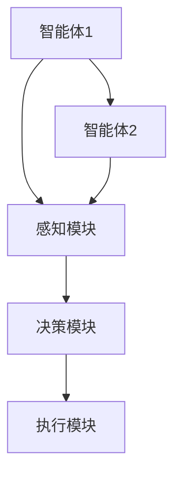
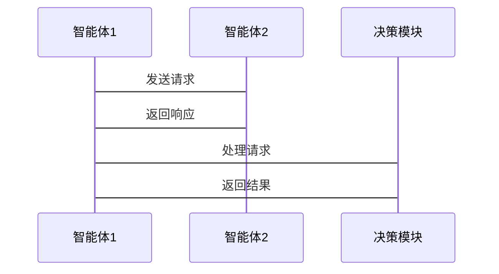
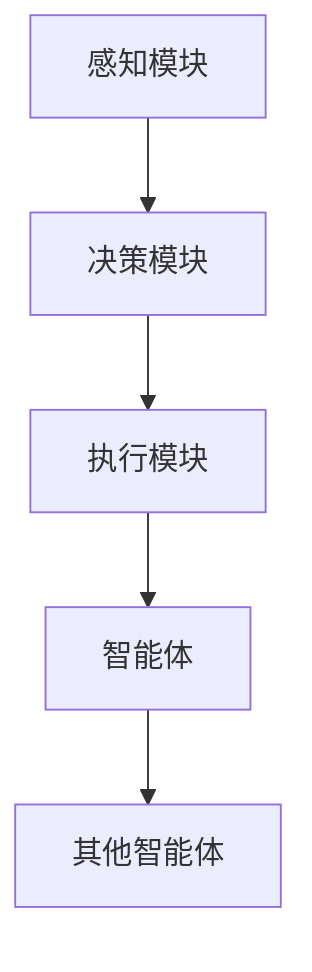

                 


# 多智能体系统实现智能化行业比较分析

> **关键词**：多智能体系统、行业智能化、分布式计算、共识算法、博弈论、系统架构

> **摘要**：本文系统地分析了多智能体系统在实现行业智能化中的应用，通过对不同行业的比较，探讨了多智能体系统的核心概念、算法原理、系统架构及其在实际应用中的优势与挑战。文章从背景、概念、算法、数学模型、系统设计、项目实战等多方面展开，旨在为读者提供一个多维度的视角，深入了解多智能体系统如何推动行业智能化进程。

---

## 第1章: 多智能体系统实现智能化行业的背景

### 1.1 多智能体系统的基本概念

#### 1.1.1 多智能体系统的定义
多智能体系统（Multi-Agent System, MAS）是由多个智能体（Agent）组成的系统，这些智能体能够通过环境感知、信息处理和自主决策，协同完成复杂任务。智能体可以是软件程序、机器人或其他具备感知和行动能力的实体。

#### 1.1.2 多智能体系统的核心特征
- **自主性**：智能体能够自主决策，无需外部干预。
- **反应性**：能够实时感知环境变化并做出反应。
- **协作性**：多个智能体之间能够协同工作，共同完成任务。
- **分布式性**：智能体分布在不同的位置，通过通信进行协作。

#### 1.1.3 多智能体系统与单智能体系统的区别
| 特性         | 单智能体系统            | 多智能体系统            |
|--------------|------------------------|-------------------------|
| 结构         | 单一结构                | 分布式结构              |
| 决策方式     | 单一决策                | 分布式决策              |
| 通信         | 无需通信                | 需要通信                |
| 协作能力     | 单一任务                | 协同完成复杂任务          |

### 1.2 行业智能化的背景与趋势

#### 1.2.1 行业智能化的基本概念
行业智能化是指通过引入人工智能、大数据、物联网等技术，将传统行业数字化、智能化，提升效率、降低成本并创造新的价值。

#### 1.2.2 行业智能化的发展趋势
- **数据驱动**：行业智能化依赖于数据的采集、分析和应用。
- **智能化升级**：从自动化向智能化转变，实现更高效的生产和服务。
- **多技术融合**：结合人工智能、大数据、区块链等技术，打造综合解决方案。

#### 1.2.3 多智能体系统在行业智能化中的作用
多智能体系统能够协调多个智能体，实现复杂任务的分解与协作，提升行业智能化的效率和灵活性。

### 1.3 多智能体系统实现智能化行业的必要性

#### 1.3.1 行业智能化对多智能体系统的需求
行业智能化需要处理复杂的任务，如实时监控、多目标优化等，单个智能体难以完成，需要多个智能体协同工作。

#### 1.3.2 多智能体系统在行业智能化中的优势
- **分布式计算能力**：能够处理大规模数据和复杂任务。
- **高可用性**：多个智能体协作，单点故障风险降低。
- **灵活性**：能够根据环境变化快速调整策略。

#### 1.3.3 行业智能化对多智能体系统的挑战
- **通信延迟**：智能体之间的通信可能引入延迟。
- **协同复杂性**：多个智能体协作需要复杂的协调机制。
- **安全性**：系统需要防止恶意攻击和数据泄露。

### 1.4 本章小结
本章介绍了多智能体系统的定义、核心特征以及与单智能体系统的区别，分析了行业智能化的背景、趋势及其对多智能体系统的需求。通过对比，明确了多智能体系统在行业智能化中的重要性及其面临的挑战。

---

## 第2章: 多智能体系统的组成与核心要素

### 2.1 多智能体系统的组成结构

#### 2.1.1 智能体的基本组成
智能体由感知模块、决策模块和行动模块组成，能够感知环境、做出决策并采取行动。

#### 2.1.2 多智能体系统的层次结构
多智能体系统通常分为感知层、决策层和执行层，每一层负责不同的功能。

#### 2.1.3 多智能体系统与分布式系统的关系
多智能体系统与分布式系统在结构上相似，但多智能体系统强调智能体的自主性和协作性，而分布式系统更注重任务的分解和资源的分配。

### 2.2 多智能体系统的核心要素

#### 2.2.1 智能体的属性与行为
智能体具有自主性、反应性、目标导向性和学习能力，能够执行感知、推理、规划和行动等行为。

#### 2.2.2 多智能体系统的通信机制
智能体之间的通信需要通过消息传递或共享数据库实现，通信机制的效率直接影响系统的性能。

#### 2.2.3 多智能体系统的协作机制
协作机制包括任务分配、协调和冲突解决，确保多个智能体能够协同工作。

### 2.3 多智能体系统的特征对比

#### 2.3.1 分布式系统与多智能体系统的对比
| 特性         | 分布式系统            | 多智能体系统            |
|--------------|------------------------|-------------------------|
| 节点         | 无智能性               | 具有智能性               |
| 任务         | 数据处理              | 复杂任务处理             |
| 协作方式     | 数据共享              | 智能体协作               |

#### 2.3.2 群智系统与多智能体系统的对比
群智系统强调群体智能的涌现，多智能体系统强调个体智能的协作，两者在目标和实现方式上有一定差异。

#### 2.3.3 其他相关概念的对比分析
其他相关概念如分布式计算、区块链等，均在不同程度上与多智能体系统有交集和区别。

### 2.4 本章小结
本章详细分析了多智能体系统的组成结构、核心要素及其与分布式系统、群智系统的区别，帮助读者理解多智能体系统的独特性和复杂性。

---

## 第3章: 多智能体系统的算法原理

### 3.1 多智能体系统的共识算法

#### 3.1.1 共识算法的基本概念
共识算法用于确保多个智能体在分布式系统中达成一致，如区块链中的共识机制。

#### 3.1.2 常见的共识算法
- **PBFT（ Practical Byzantine Fault Tolerance）**：拜占庭容错共识算法。
- **RAFT**：Raft一致性算法。

#### 3.1.3 共识算法在多智能体系统中的应用
通过共识算法，多智能体系统能够确保数据的一致性和可靠性。

### 3.2 多智能体系统的分布式计算

#### 3.2.1 分布式计算的基本原理
分布式计算将任务分解到多个节点并行处理，提高计算效率。

#### 3.2.2 分布式计算在多智能体系统中的实现
通过消息传递接口（MPI）或分布式计算框架（如Spark）实现任务分发和结果汇总。

#### 3.2.3 分布式计算的优缺点分析
- **优点**：提高计算能力，降低单点故障风险。
- **缺点**：通信开销大，协调复杂。

### 3.3 多智能体系统的博弈论算法

#### 3.3.1 博弈论的基本概念
博弈论研究多个参与者的策略选择及其结果，适用于多智能体系统的决策优化。

#### 3.3.2 博弈论在多智能体系统中的应用
- **纳什均衡**：确保多个智能体在博弈中达到稳定状态。
- **囚徒困境**：分析智能体之间的合作与背叛。

#### 3.3.3 博弈论算法的优缺点分析
- **优点**：能够模拟复杂的决策过程，找到最优策略。
- **缺点**：计算复杂，需要大量计算资源。

### 3.4 本章小结
本章介绍了多智能体系统中的共识算法、分布式计算和博弈论算法，分析了它们的原理和应用，帮助读者理解多智能体系统的算法基础。

---

## 第4章: 多智能体系统的数学模型

### 4.1 多智能体系统的状态空间与动作空间

#### 4.1.1 状态空间的定义
状态空间表示系统所有可能的状态，每个状态代表一个特定的配置。

#### 4.1.2 动作空间的定义
动作空间表示智能体可以执行的所有动作，每个动作能够改变系统的状态。

#### 4.1.3 状态转移方程
$$ s' = f(s, a) $$
其中，$s$是当前状态，$a$是智能体的动作，$s'$是转移后的状态。

### 4.2 多智能体系统的协作机制数学模型

#### 4.2.1 协作机制的定义
协作机制定义了智能体之间如何协同工作，包括任务分配和资源分配。

#### 4.2.2 协作机制的数学表达
$$ C = \sum_{i=1}^{n} c_i $$
其中，$c_i$表示第$i$个智能体的贡献。

#### 4.2.3 协作机制的优化目标
最大化协作机制的效率和公平性，确保每个智能体的贡献得到合理分配。

### 4.3 多智能体系统的博弈论模型

#### 4.3.1 博弈论模型的定义
博弈论模型定义了智能体之间的策略选择和结果，通常用支付矩阵表示。

#### 4.3.2 博弈论模型的数学表达
$$ P = (S, A, u) $$
其中，$S$是状态空间，$A$是动作空间，$u$是支付函数。

#### 4.3.3 纳什均衡的数学表达
$$ \forall i, u_i(a_i^*, a_{-i}^*) \geq u_i(a_i, a_{-i}^*) $$
其中，$a_i^*$是第$i$个智能体的纳什均衡策略，$a_{-i}^*$是其他智能体的策略。

### 4.4 本章小结
本章通过数学模型详细分析了多智能体系统的状态空间、协作机制和博弈论模型，为读者提供了理论基础。

---

## 第5章: 多智能体系统的系统分析与架构设计

### 5.1 系统分析

#### 5.1.1 问题场景介绍
以智能制造为例，分析多智能体系统在生产优化中的应用。

#### 5.1.2 系统功能设计
设计系统的功能模块，包括感知、决策和执行模块。

#### 5.1.3 系统架构设计
使用Mermaid图展示系统的架构设计。



#### 5.1.4 系统接口设计
定义智能体之间的接口，确保通信和协作的顺利进行。

#### 5.1.5 系统交互设计
使用Mermaid序列图展示智能体之间的交互流程。



### 5.2 系统架构设计

#### 5.2.1 系统功能模块设计
- **感知模块**：负责数据采集和环境感知。
- **决策模块**：负责策略制定和任务分配。
- **执行模块**：负责具体任务的执行和反馈。

#### 5.2.2 系统架构图


### 5.3 本章小结
本章通过系统分析和架构设计，展示了多智能体系统在实际应用中的结构和协作方式。

---

## 第6章: 多智能体系统的项目实战

### 6.1 环境安装与配置

#### 6.1.1 系统环境
- 操作系统：Linux/Windows
- 开发工具：Python、Jupyter Notebook
- 依赖库：numpy、pandas、scikit-learn

#### 6.1.2 网络环境
- 网络拓扑：星型拓扑
- 通信协议：TCP/IP

### 6.2 核心代码实现

#### 6.2.1 智能体类的实现
```python
class Agent:
    def __init__(self, id):
        self.id = id
        self.state = 'idle'
    
    def感知(self, environment):
        # 实现感知逻辑
        pass
    
    def 决策(self, environment):
        # 实现决策逻辑
        pass
    
    def 执行(self, action):
        # 实现执行逻辑
        pass
```

#### 6.2.2 系统核心算法实现
```python
def共识算法(agents):
    for agent in agents:
        agent.感知(environment)
    for agent in agents:
        agent.决策(environment)
    for agent in agents:
        agent.执行(action)
```

#### 6.2.3 通信模块实现
```python
import socket

class Communicator:
    def __init__(self, host, port):
        self.host = host
        self.port = port
        self.socket = socket.socket(socket.AF_INET, socket.SOCK_STREAM)
    
    def connect(self):
        self.socket.connect((self.host, self.port))
    
    def send(self, message):
        self.socket.send(message.encode())
    
    def receive(self):
        data = self.socket.recv(1024)
        return data.decode()
```

### 6.3 代码应用解读与分析

#### 6.3.1 系统环境配置
- 安装必要的依赖库。
- 配置网络环境，确保智能体之间能够通信。

#### 6.3.2 核心算法实现
- 智能体感知环境，决策并执行动作。
- 通过通信模块实现智能体之间的信息交换。

### 6.4 实际案例分析

#### 6.4.1 案例背景
以智能制造为例，分析多智能体系统在生产优化中的应用。

#### 6.4.2 案例实现
实现多个智能体协同优化生产流程，提高效率。

### 6.5 项目小结
本章通过实际项目实战，展示了多智能体系统在具体应用中的实现过程，帮助读者更好地理解理论知识。

---

## 第7章: 多智能体系统的最佳实践

### 7.1 最佳实践经验

#### 7.1.1 系统设计经验
- 明确系统目标，合理设计架构。
- 选择合适的算法和工具。

#### 7.1.2 开发与部署经验
- 使用容器化技术（如Docker）部署系统。
- 定期进行系统测试和优化。

### 7.2 小结与总结

#### 7.2.1 本文总结
本文从多智能体系统的背景、核心概念、算法原理、系统架构和项目实战等多个方面进行了详细分析，帮助读者全面理解多智能体系统在行业智能化中的应用。

#### 7.2.2 未来展望
随着人工智能和分布式技术的不断发展，多智能体系统将在更多行业得到广泛应用，推动行业智能化的进一步发展。

### 7.3 注意事项

#### 7.3.1 系统设计中的常见问题
- 通信延迟问题
- 协作机制的复杂性
- 系统安全性问题

#### 7.3.2 系统优化建议
- 使用高效的通信协议
- 优化协作算法
- 加强系统安全性设计

### 7.4 拓展阅读

#### 7.4.1 推荐书籍
- 《多智能体系统》
- 《分布式系统：概念与设计》

#### 7.4.2 推荐博客与文章
- 多智能体系统的最新研究进展
- 分布式计算的技术博客

---

## 作者：AI天才研究院/AI Genius Institute & 禅与计算机程序设计艺术/Zen And The Art of Computer Programming

---

通过本文的系统分析和详细讲解，读者可以全面理解多智能体系统在行业智能化中的实现方法和应用效果。希望本文能为读者提供一个多维度的视角，帮助他们在实际应用中更好地设计和实现多智能体系统。

