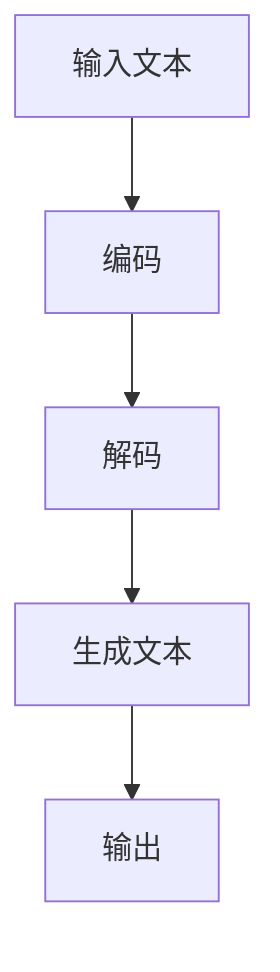
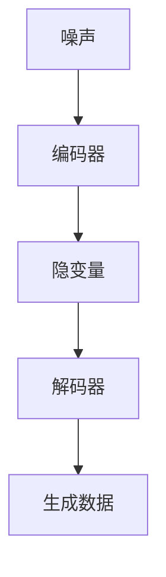
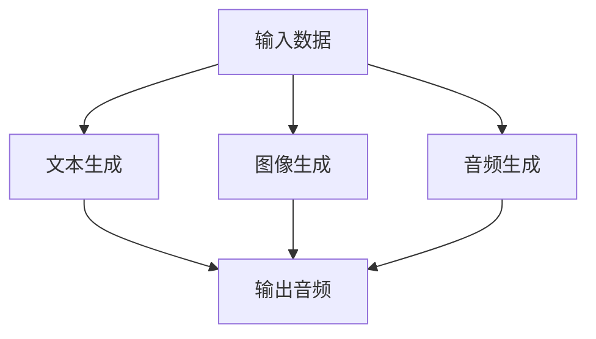
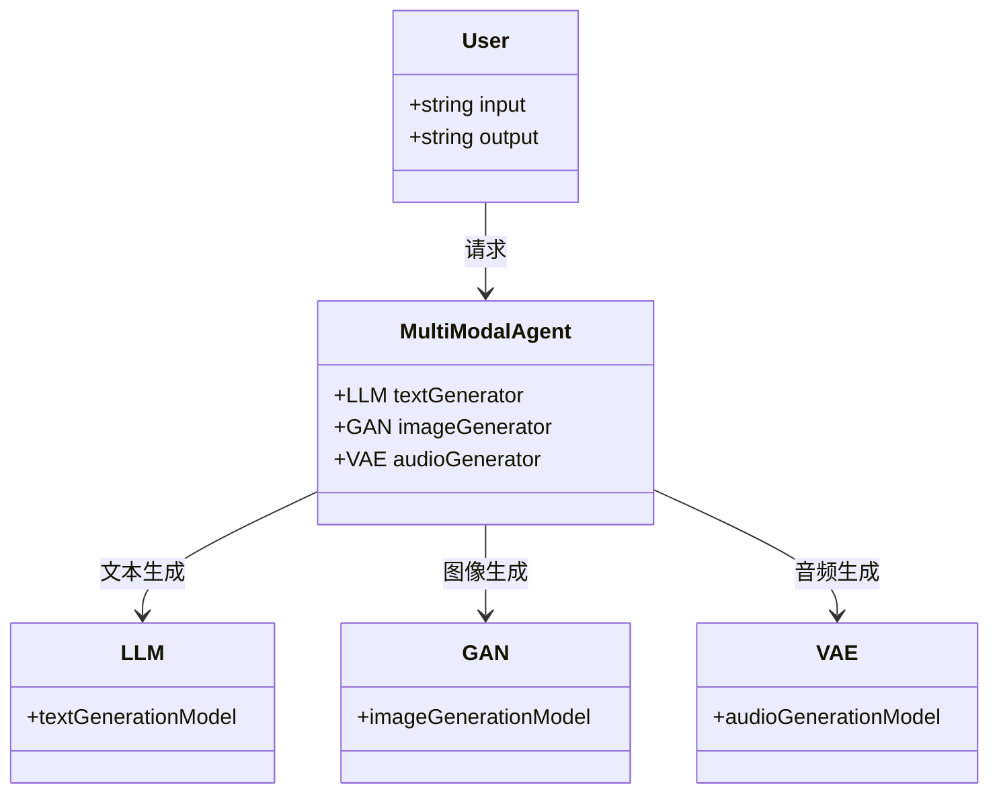
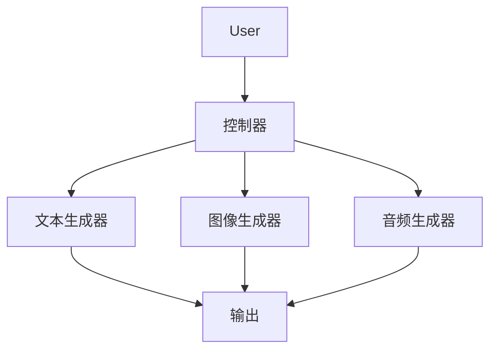
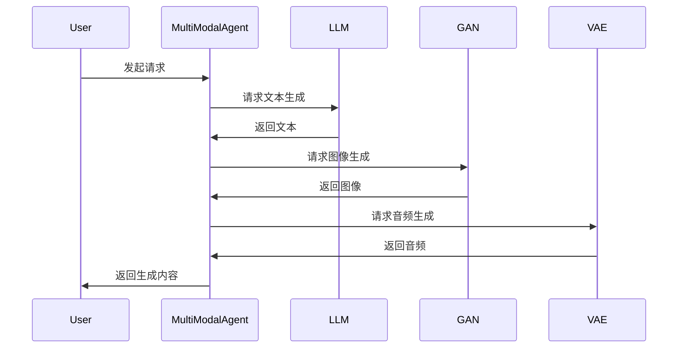

                 


# 多模态内容生成AI Agent：整合LLM与其他生成模型

## 关键词：多模态生成、AI Agent、LLM、生成模型、整合方法

## 摘要：本文探讨了多模态内容生成AI Agent的设计与实现，重点介绍了如何整合大语言模型（LLM）与其他生成模型（如GAN、VAE）的技术。文章从背景、核心概念、算法原理、数学模型、系统架构、项目实战到最佳实践，全面解析了多模态生成AI Agent的构建过程，为读者提供了详实的技术指导。

---

## 第1章: 多模态内容生成AI Agent的背景介绍

### 1.1 多模态生成AI Agent的背景

#### 1.1.1 多模态生成技术的发展历程
- 多模态生成技术起源于2010年代中期，随着深度学习的兴起，逐渐从单一模态生成向多模态生成发展。
- 早期的生成模型主要集中在单一模态（如文本或图像），难以满足复杂的多模态生成需求。
- 近年来，多模态生成技术在自然语言处理、计算机视觉、音频处理等领域取得了显著进展。

#### 1.1.2 AI Agent的概念与特点
- AI Agent是一种智能体，能够感知环境、执行任务并做出决策。
- 多模态生成AI Agent具备多模态输入处理能力，能够生成多种类型的内容（如文本、图像、音频）。

#### 1.1.3 多模态内容生成的定义与目标
- 多模态内容生成是指通过AI Agent生成多种模态的内容，目标是实现更丰富、更自然的交互体验。

### 1.2 多模态生成AI Agent的问题背景

#### 1.2.1 当前内容生成技术的局限性
- 单一模态生成模型难以应对复杂的多模态任务。
- 不同生成模型的性能和适用场景存在差异，难以有效整合。

#### 1.2.2 多模态生成的需求与挑战
- 用户需求日益多样化，对多模态生成的需求不断增加。
- 多模态生成需要处理不同类型的数据，技术实现复杂。

#### 1.2.3 整合LLM与其他生成模型的意义
- 利用LLM的强大文本生成能力，结合其他生成模型的优势，提升多模态生成的效果。

### 1.3 多模态生成AI Agent的核心要素

#### 1.3.1 LLM的作用与优势
- LLM擅长处理文本数据，生成高质量的文本内容。
- LLM具备上下文理解和生成能力，适合多模态任务中的文本部分。

#### 1.3.2 其他生成模型的特点与应用
- GAN（生成对抗网络）：擅长生成高质量的图像和音频。
- VAE（变分自编码器）：适合生成具有多样性的内容。
- 每种生成模型在特定场景下有其独特的优势。

#### 1.3.3 多模态生成的整合方式
- 基于LLM的多模态生成：将文本生成与其他生成模型相结合。
- 多模态联合生成：同时生成多种模态的内容，如文本和图像。

---

## 第2章: 多模态生成AI Agent的核心概念与联系

### 2.1 多模态生成AI Agent的核心原理

#### 2.1.1 LLM的原理与工作机制
- LLM通过大规模预训练，学习语言的分布规律。
- 在生成阶段，基于输入的上下文，预测下一个词的概率分布。

#### 2.1.2 其他生成模型的原理与工作机制
- GAN通过生成器和判别器的对抗训练，生成逼真的样本。
- VAE通过概率建模和重参数化技巧，生成多样化的样本。

#### 2.1.3 多模态生成的整合原理
- 统一输入输出接口：将多种模态的数据统一处理。
- 模型协同工作：不同生成模型协同生成多模态内容。

### 2.2 核心概念对比

#### 2.2.1 LLM与其他生成模型的对比分析
| 特性 | LLM | GAN | VAE |
|------|-----|-----|-----|
| 优势 | 文本生成能力强 | 图像生成效果好 | 具备多样性 |
| 劣势 | 不擅长图像生成 | �易模式坍缩 | 训练不稳定 |

#### 2.2.2 多模态生成与单模态生成的对比分析
| 特性 | 单模态生成 | 多模态生成 |
|------|-----------|-----------|
| 输入 | 单一模态数据 | 多种模态数据 |
| 输出 | 单一模态内容 | 多种模态内容 |

#### 2.2.3 生成模型的优缺点对比表格
| 模型 | 优点 | 缺点 |
|------|------|------|
| LLM | 文本生成能力强 | 不擅长图像生成 |
| GAN | 生成质量高 | 易模式坍缩 |
| VAE | 具备多样性 | 训练不稳定 |

### 2.3 实体关系图

#### 2.3.1 多模态生成AI Agent的ER实体关系图
```mermaid
erDiagram
    actor User {
        <text> Input
        <text> Output
    }
    agent MultiModalAgent {
        <text> TextGenerator
        <text> ImageGenerator
        <text> AudioGenerator
    }
    model LLM {
        <text> TextGenerationModel
    }
    model GAN {
        <text> ImageGenerationModel
    }
    model VAE {
        <text> AudioGenerationModel
    }
    User -->> MultiModalAgent : 交互指令
    MultiModalAgent --> LLM : 文本生成
    MultiModalAgent --> GAN : 图像生成
    MultiModalAgent --> VAE : 音频生成
```

---

## 第3章: 多模态生成AI Agent的算法原理

### 3.1 LLM的算法原理

#### 3.1.1 变量定义与概率分布
- 输入序列 \( x_{1..n} \)
- 输出序列 \( y_{1..m} \)
- 条件概率 \( P(y|x) \)

#### 3.1.2 损失函数与优化目标
- 损失函数：交叉熵损失
  $$ \mathcal{L} = -\sum_{i=1}^{m} \log P(y_i|x) $$
- 优化目标：最小化损失函数

#### 3.1.3 算法流程图


### 3.2 其他生成模型的算法原理

#### 3.2.1 GAN的生成器与判别器
- 生成器：将噪声映射到数据空间
- 判别器：判别样本是否为真实数据

#### 3.2.2 VAE的概率建模与重参数化技巧
- 编码器：将数据映射到隐变量空间
- 解码器：将隐变量映射回数据空间
- 重参数化：将随机变量表示为确定性变量

#### 3.2.3 算法流程图


### 3.3 多模态生成的整合算法

#### 3.3.1 整合方法与流程
1. 输入多模态数据
2. 分别生成每种模态的内容
3. 综合生成内容，输出最终结果

#### 3.3.2 算法优化与改进
- 多任务学习：同时优化多种模态生成任务
- 跨模态对齐：确保不同模态生成内容的协调一致

#### 3.3.3 整合算法流程图


---

## 第4章: 多模态生成AI Agent的数学模型与公式

### 4.1 LLM的数学模型

#### 4.1.1 概率分布公式
$$ P(y|x) = \prod_{i=1}^{m} P(y_i|x_{<i}) $$

#### 4.1.2 损失函数公式
$$ \mathcal{L} = -\sum_{i=1}^{m} \log P(y_i|x_{<i}) $$

#### 4.1.3 优化目标公式
$$ \arg \min \mathcal{L} $$

### 4.2 其他生成模型的数学模型

#### 4.2.1 GAN的损失函数
生成器损失：
$$ \mathcal{L}_G = \mathbb{E}_{z}[ -\log D(G(z))] $$
判别器损失：
$$ \mathcal{L}_D = \mathbb{E}_{x}[ -\log D(x)] + \mathbb{E}_{z}[ \log D(G(z))] $$

#### 4.2.2 VAE的损失函数
重构损失：
$$ \mathcal{L}_R = \mathbb{E}_{x}[ \log P(x|z)] $$
正则化损失：
$$ \mathcal{L}_K = \mathbb{E}_{z}[ \text{KL}(Q(z|x)||P(z))] $$

---

## 第5章: 多模态生成AI Agent的系统分析与架构设计

### 5.1 问题场景介绍

#### 5.1.1 问题场景
- 用户输入多模态数据，AI Agent生成相应内容。

### 5.2 系统功能设计

#### 5.2.1 领域模型类图


### 5.3 系统架构设计

#### 5.3.1 系统架构图


### 5.4 系统接口设计

#### 5.4.1 接口设计
- 输入接口：接收多模态数据
- 输出接口：输出生成内容

### 5.5 系统交互流程图

#### 5.5.1 交互流程图


---

## 第6章: 多模态生成AI Agent的项目实战

### 6.1 项目介绍

#### 6.1.1 项目背景
- 开发一个多模态生成AI Agent，能够生成文本、图像和音频。

### 6.2 核心代码实现

#### 6.2.1 环境安装
- 安装必要的库：PyTorch、TensorFlow、Keras等。

#### 6.2.2 核心代码实现

##### 文本生成代码（基于LLM）
```python
import torch
import torch.nn as nn
import torch.optim as optim

class TextGenerator(nn.Module):
    def __init__(self, vocab_size):
        super().__init__()
        self.embedding = nn.Embedding(vocab_size, 512)
        self.lstm = nn.LSTM(512, 512, 2)
        self.fc = nn.Linear(512, vocab_size)
        
    def forward(self, input, hidden):
        embedded = self.embedding(input)
        output, hidden = self.lstm(embedded, hidden)
        output = self.fc(output.view(-1, 512))
        return output, hidden

# 训练代码
vocab_size = 10000
model = TextGenerator(vocab_size)
optimizer = optim.Adam(model.parameters(), lr=0.001)
criterion = nn.CrossEntropyLoss()

for epoch in range(100):
    for input, target in dataloader:
        outputs, hidden = model(input, None)
        loss = criterion(outputs, target)
        optimizer.zero_grad()
        loss.backward()
        optimizer.step()
```

##### 图像生成代码（基于GAN）
```python
import torch
import torch.nn as nn
import torch.optim as optim

class Generator(nn.Module):
    def __init__(self, latent_dim=100):
        super().__init__()
        self.l1 = nn.Linear(latent_dim, 128*128*8)
        self.bn1 = nn.BatchNorm2d(8)
        self.conv2 = nn.ConvTranspose2d(8, 4, kernel_size=4, stride=2, padding=1)
        self.bn2 = nn.BatchNorm2d(4)
        self.conv3 = nn.ConvTranspose2d(4, 1, kernel_size=4, stride=2, padding=1)
        
    def forward(self, z):
        x = self.l1(z).view(-1, 8, 128, 128)
        x = self.bn1(x)
        x = nn.ReLU()(x)
        x = self.conv2(x)
        x = self.bn2(x)
        x = nn.ReLU()(x)
        x = self.conv3(x)
        return x

class Discriminator(nn.Module):
    def __init__(self):
        super().__init__()
        self.conv1 = nn.Conv2d(1, 64, kernel_size=4, stride=2, padding=1)
        self.bn1 = nn.BatchNorm2d(64)
        self.conv2 = nn.Conv2d(64, 128, kernel_size=4, stride=2, padding=1)
        self.bn2 = nn.BatchNorm2d(128)
        self.fc = nn.Linear(128*64*64, 1)
        
    def forward(self, x):
        x = self.conv1(x)
        x = self.bn1(x)
        x = nn.ReLU()(x)
        x = self.conv2(x)
        x = self.bn2(x)
        x = nn.ReLU()(x)
        x = x.view(-1, 128*64*64)
        x = self.fc(x)
        return x

# 训练代码
latent_dim = 100
G = Generator(latent_dim)
D = Discriminator()
opt_g = optim.Adam(G.parameters(), lr=0.0002)
opt_d = optim.Adam(D.parameters(), lr=0.0002)

for epoch in range(100):
    for _ in range(2):
        z = torch.randn(batch_size, latent_dim)
        g_output = G(z)
        d_output_real = D(real_images)
        d_output_fake = D(g_output.detach())
        loss_d_real = criterion(d_output_real, torch.ones_like(d_output_real))
        loss_d_fake = criterion(d_output_fake, torch.zeros_like(d_output_fake))
        loss_d = (loss_d_real + loss_d_fake) / 2
        D.zero_grad()
        loss_d.backward()
        opt_d.step()
        
    z = torch.randn(batch_size, latent_dim)
    g_output = G(z)
    d_output_fake = D(g_output)
    loss_g = criterion(d_output_fake, torch.ones_like(d_output_fake))
    G.zero_grad()
    loss_g.backward()
    opt_g.step()
```

##### 音频生成代码（基于VAE）
```python
import torch
import torch.nn as nn
import torch.optim as optim

class VAE(nn.Module):
    def __init__(self, input_dim=128, latent_dim=50):
        super().__init__()
        self.encoder = nn.Sequential(
            nn.Linear(input_dim, 256),
            nn.ReLU(),
            nn.Linear(256, latent_dim*2)
        )
        self.decoder = nn.Sequential(
            nn.Linear(latent_dim, 256),
            nn.ReLU(),
            nn.Linear(256, input_dim)
        )
        
    def forward(self, x):
        mu, log_var = self.encoder(x).chunk(2, dim=-1)
        z = mu + torch.exp(0.5*log_var) * torch.randn_like(log_var)
        return self.decoder(z), mu, log_var

# 训练代码
vae = VAE()
opt = optim.Adam(vae.parameters(), lr=0.001)
criterion = nn.MSELoss()

for epoch in range(100):
    for x, _ in dataloader:
        x_recon, mu, log_var = vae(x)
        loss_recon = criterion(x_recon, x)
        loss_kl = -0.5 * torch.mean(1 + log_var - mu**2 - torch.exp(log_var))
        loss = loss_recon + loss_kl
        opt.zero_grad()
        loss.backward()
        opt.step()
```

### 6.3 代码解读与分析

#### 6.3.1 文本生成代码解读
- 使用LSTM结构进行文本生成，优化目标是最小化交叉熵损失。
- 代码展示了如何构建模型和训练过程。

#### 6.3.2 图像生成代码解读
- 使用GAN结构，分别定义生成器和判别器。
- 代码展示了生成器和判别器的网络结构，以及对抗训练的流程。

#### 6.3.3 音频生成代码解读
- 使用VAE结构，编码器和解码器均为多层感知机。
- 代码展示了如何计算重构损失和KL散度。

### 6.4 案例分析

#### 6.4.1 案例分析
- 输入文本描述，生成对应的图像和音频。
- 展示生成效果，分析优缺点。

---

## 第7章: 多模态生成AI Agent的最佳实践

### 7.1 小结

#### 7.1.1 小结
- 多模态生成AI Agent整合了多种生成模型，具备强大的生成能力。
- 不同生成模型的协同工作是实现多模态生成的关键。

### 7.2 注意事项

#### 7.2.1 模型选择与优化
- 根据任务需求选择合适的生成模型。
- 模型的优化需要考虑计算效率和生成效果。

### 7.3 拓展阅读

#### 7.3.1 拓展阅读
- 推荐阅读相关领域的最新论文和书籍，了解前沿技术。

---

## 作者：AI天才研究院/AI Genius Institute & 禅与计算机程序设计艺术 /Zen And The Art of Computer Programming

