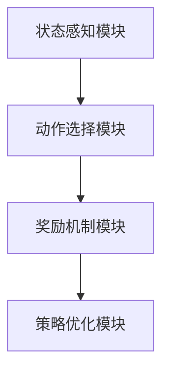
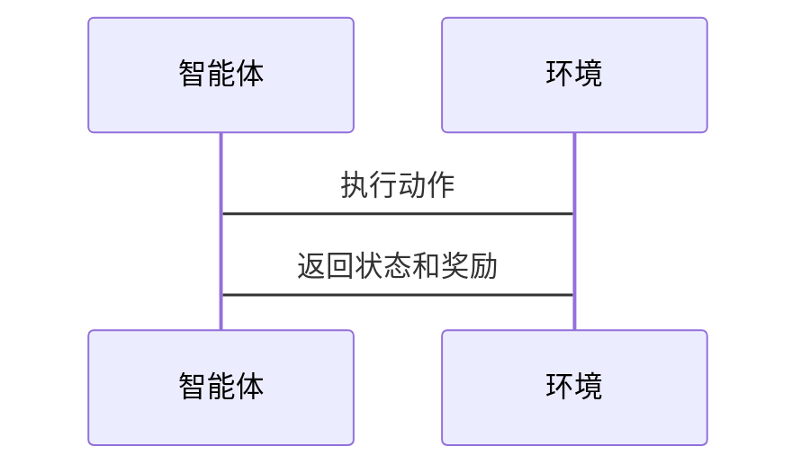

                 


# 强化学习在AI Agent任务规划中的实践

## 关键词：
- 强化学习
- AI Agent
- 任务规划
- 算法原理
- 系统架构
- 项目实战

## 摘要：
本文深入探讨强化学习在AI Agent任务规划中的应用，从基础概念到算法原理，再到系统架构和实际案例，全面解析强化学习如何助力AI Agent实现高效的任务规划。通过详细讲解Q-learning、策略梯度等算法，结合深度强化学习和系统设计，为读者提供一个完整的实践指南。

---

# 第一部分: 强化学习与AI Agent任务规划基础

## 第1章: 强化学习与AI Agent概述

### 1.1 强化学习的基本概念

#### 1.1.1 强化学习的定义
强化学习是一种机器学习范式，通过智能体与环境的交互，逐步优化策略以最大化累计奖励。与监督学习不同，强化学习不需要标注数据，而是通过试错学习。

#### 1.1.2 强化学习的核心要素
| 要素 | 描述 |
|------|------|
| 状态 (State) | 智能体所处的环境情况 |
| 动作 (Action) | 智能体可执行的操作 |
| 奖励 (Reward) | 执行动作后获得的反馈 |
| 策略 (Policy) | 动作选择的规则 |
| 值函数 (Value Function) | 预测状态或动作状态的期望奖励 |

#### 1.1.3 强化学习与监督学习的区别
| 方面 | 监督学习 | 强化学习 |
|------|--------|---------|
| 数据 | 标签数据 | 无标签，通过奖励反馈 |
| 目标 | 最小化预测误差 | 最大化累计奖励 |
| 交互 | 不与环境交互 | 与环境交互并学习 |

### 1.2 AI Agent的基本概念

#### 1.2.1 AI Agent的定义
AI Agent是能够感知环境、自主决策并执行任务的智能实体。它可以是一个软件程序或物理设备，具备感知、推理和执行能力。

#### 1.2.2 AI Agent的类型
| 类型 | 描述 |
|------|------|
| 简单反射Agent | 基于当前状态做出反应 |
| 基于模型的反射Agent | 使用内部模型进行预测和规划 |
| 目标驱动Agent | 根据目标选择最优动作 |

#### 1.2.3 AI Agent的任务规划需求
任务规划是AI Agent的核心能力，涉及将复杂任务分解为简单动作，并按优先级执行。例如，自动驾驶中的路径规划和决策。

### 1.3 强化学习在AI Agent任务规划中的应用背景

#### 1.3.1 任务规划的定义与挑战
任务规划需要智能体根据环境动态调整动作顺序，以完成目标。挑战包括状态空间复杂性和动态变化。

#### 1.3.2 强化学习在任务规划中的优势
强化学习通过试错优化策略，适用于动态和不确定环境。它能够处理高维状态空间和复杂动作序列。

#### 1.3.3 当前研究与应用现状
强化学习在游戏AI、机器人控制和自动驾驶等领域广泛应用。结合深度学习，强化学习在复杂任务中的表现显著提升。

## 1.4 本章小结
本章介绍了强化学习和AI Agent的基本概念，以及强化学习在任务规划中的优势和应用背景，为后续内容奠定了基础。

---

## 第2章: 强化学习的核心概念

### 2.1 状态、动作与奖励

#### 2.1.1 状态空间的定义与特征
状态是智能体感知环境的信息集合。状态空间可以是离散或连续的，例如在迷宫中，每个位置是一个状态。

#### 2.1.2 动作空间的定义与特征
动作是智能体可执行的操作，动作空间可以是离散或连续的。例如，在游戏中，动作可以是移动或跳跃。

#### 2.1.3 奖励函数的设计原则
奖励函数定义了每个动作的反馈，通常设计为奖励智能体接近目标的行为。例如，在迷宫中找到出口给予正奖励。

### 2.2 策略与价值函数

#### 2.2.1 策略的定义与分类
策略是智能体选择动作的规则，分为确定性和概率性策略。例如，贪心策略选择当前最优动作。

#### 2.2.2 价值函数的定义与作用
价值函数估计某个状态下采取某个动作的期望奖励。例如，评估从某个状态出发采取某个动作的收益。

#### 2.2.3 策略与价值函数的关系
价值函数为策略的选择提供依据，而策略指导如何利用价值函数进行动作选择。

### 2.3 动作空间与状态转移

#### 2.3.1 动作空间的构建方法
动作空间的构建需要根据任务需求设计，例如在机器人导航中，动作可以是左转、右转或前进。

#### 2.3.2 状态转移的马尔可夫性质
状态转移满足马尔可夫性质，即当前状态和奖励足以决定下一步的状态，无需考虑历史信息。

#### 2.3.3 状态转移矩阵的定义
状态转移矩阵定义了从当前状态执行某个动作后转移到下一个状态的概率。

### 2.4 强化学习的核心公式

#### 2.4.1 Q-learning算法公式
Q-learning的目标是学习状态-动作对的Q值，更新公式为：
$$ Q(s, a) = Q(s, a) + \alpha (r + \gamma \max Q(s', a') - Q(s, a)) $$
其中，$\alpha$是学习率，$\gamma$是折扣因子。

#### 2.4.2 策略梯度算法公式
策略梯度方法通过优化策略的参数，最大化期望奖励：
$$ \nabla \theta \leftarrow \nabla \log \pi_\theta(a|s) \cdot Q(s, a) $$
其中，$\pi_\theta(a|s)$是策略函数。

### 2.5 本章小结
本章详细讲解了强化学习的核心概念，包括状态、动作、奖励、策略和价值函数，并通过公式展示了Q-learning和策略梯度的基本原理。

---

## 第3章: 强化学习的核心算法

### 3.1 Q-learning算法

#### 3.1.1 Q-learning的基本原理
Q-learning通过更新Q表，记录每个状态-动作对的期望奖励，实现最优策略。

#### 3.1.2 Q-learning的算法流程
1. 初始化Q表为零。
2. 重复以下步骤直到收敛：
   a. 选择当前状态的动作（探索与利用）。
   b. 执行动作，获得奖励和新状态。
   c. 更新Q值：$Q(s, a) = Q(s, a) + \alpha (r + \gamma \max Q(s', a') - Q(s, a))$。

#### 3.1.3 Q-learning的优缺点
优点：简单易实现，适合离散状态和动作空间。缺点：收敛速度慢，难以处理连续空间。

### 3.2 策略梯度算法

#### 3.2.1 策略梯度的基本原理
策略梯度通过优化策略参数，直接最大化奖励期望，适用于连续动作空间。

#### 3.2.2 策略梯度的算法流程
1. 初始化策略参数$\theta$。
2. 重复以下步骤直到收敛：
   a. 采样动作，执行并获得奖励。
   b. 计算梯度：$\nabla J(\theta) = \nabla \log \pi_\theta(a|s) \cdot Q(s, a)$。
   c. 更新参数：$\theta = \theta + \alpha \nabla J(\theta)$。

#### 3.2.3 策略梯度的优缺点
优点：适合连续空间，收敛速度快。缺点：计算复杂，需要处理梯度计算。

### 3.3 深度强化学习算法

#### 3.3.1 DQN算法的基本原理
DQN结合深度神经网络和Q-learning，通过经验回放和目标网络优化。

#### 3.3.2 DQN算法的网络结构
- 输入层：接收环境状态。
- 隐藏层：提取特征。
- 输出层：输出每个动作的Q值。

#### 3.3.3 DQN算法的优缺点
优点：适用于高维状态空间。缺点：训练不稳定，需要经验回放。

### 3.4 其他常见强化学习算法

#### 3.4.1 A3C算法
A3C通过多线程同时更新策略，适用于分布式训练。

#### 3.4.2 PPO算法
PPO通过限制策略更新幅度，确保训练稳定性。

#### 3.4.3 TRPO算法
TRPO使用自然梯度方法，确保策略优化的单调性。

### 3.5 本章小结
本章介绍了Q-learning、策略梯度和深度强化学习算法的基本原理和优缺点，为后续系统设计和项目实现提供了算法基础。

---

## 第4章: 任务规划系统的系统架构设计

### 4.1 任务规划系统的基本组成

#### 4.1.1 状态感知模块
通过传感器或API获取环境状态信息。

#### 4.1.2 动作选择模块
基于强化学习算法选择最优动作。

#### 4.1.3 奖励机制模块
定义奖励函数，指导智能体行为。

#### 4.1.4 策略优化模块
通过强化学习算法优化策略参数。

### 4.2 系统功能设计

#### 4.2.1 状态空间建模
根据任务需求，定义和建模状态空间。

#### 4.2.2 动作空间设计
设计智能体可执行的动作，并定义动作空间。

#### 4.2.3 奖励函数设计
根据任务目标，设计奖励函数，指导智能体行为。

#### 4.2.4 策略优化流程
通过强化学习算法，迭代优化策略参数。

### 4.3 系统架构设计

#### 4.3.1 系统架构图


#### 4.3.2 系统接口设计
- 输入接口：接收环境状态。
- 输出接口：执行动作并返回结果。

#### 4.3.3 系统交互流程图


### 4.4 本章小结
本章详细描述了任务规划系统的架构设计，包括模块组成、功能设计和系统交互流程。

---

## 第5章: 强化学习在任务规划中的项目实战

### 5.1 项目介绍

#### 5.1.1 项目背景
开发一个智能助手，帮助用户规划任务，例如任务排序和优先级管理。

#### 5.1.2 项目目标
实现基于强化学习的任务规划算法，优化任务执行顺序。

### 5.2 系统核心实现源代码

#### 5.2.1 环境配置
安装必要的库：
```bash
pip install gym matplotlib numpy
```

#### 5.2.2 强化学习算法实现
```python
import gym
import numpy as np

class Agent:
    def __init__(self, env):
        self.env = env
        self.lr = 0.01
        self.gamma = 0.99
        self.Q = np.zeros((env.observation_space.n, env.action_space.n))

    def choose_action(self, state):
        if np.random.random() < 0.1:
            return np.random.randint(self.env.action_space.n)
        else:
            return np.argmax(self.Q[state])

    def update_Q(self, state, action, reward, next_state):
        self.Q[state][action] += self.lr * (reward + self.gamma * np.max(self.Q[next_state]) - self.Q[state][action])

env = gym.make('GridWorld-v0')
agent = Agent(env)

for _ in range(1000):
    state = env.reset()
    done = False
    while not done:
        action = agent.choose_action(state)
        next_state, reward, done, _ = env.step(action)
        agent.update_Q(state, action, reward, next_state)
        state = next_state
```

#### 5.2.3 功能解读
- `choose_action`：基于Q表选择动作，考虑探索和利用。
- `update_Q`：更新Q值，基于当前奖励和未来期望奖励。

### 5.3 实际案例分析

#### 5.3.1 案例背景
在一个迷宫环境中，智能体需要找到出口。任务是优化路径长度。

#### 5.3.2 案例分析
通过Q-learning算法，智能体逐步优化路径，最终找到最优路径。

### 5.4 项目小结
本章通过一个实际案例，展示了强化学习在任务规划中的应用，验证了算法的有效性。

---

## 第6章: 强化学习在任务规划中的最佳实践

### 6.1 总结

#### 6.1.1 强化学习的核心优势
- 适用于动态和不确定环境。
- 通过试错优化策略。

#### 6.1.2 任务规划的关键点
- 状态和动作空间的设计。
- 奖励函数的合理设计。

### 6.2 最佳实践 tips

#### 6.2.1 算法选择
根据任务需求选择合适的算法，例如离散空间选择Q-learning，连续空间选择策略梯度。

#### 6.2.2 系统设计
确保系统架构清晰，模块化设计，便于维护和扩展。

#### 6.2.3 代码实现
重视代码的可读性和可维护性，注释清晰，模块划分合理。

### 6.3 注意事项

#### 6.3.1 状态空间的复杂性
复杂的状态空间可能导致算法收敛速度慢，需要简化或特征提取。

#### 6.3.2 奖励机制的设计
奖励设计不合理可能导致智能体行为偏离目标，需反复调整。

### 6.4 拓展阅读

#### 6.4.1 强化学习经典论文
- "Deep Q-learning from Demonstrations" (2015)
- "Mastering the game of Go with deep neural networks and tree search" (2016)

#### 6.4.2 实战书籍推荐
- 《强化学习：理论与应用》
- 《深度强化学习入门》

### 6.5 本章小结
本章总结了强化学习在任务规划中的应用经验，提供了实践中的注意事项和拓展阅读建议。

---

## 作者：AI天才研究院 & 禅与计算机程序设计艺术

---

通过以上详细的内容结构，您可以根据需要逐步撰写每个部分的内容，确保每部分内容详实，逻辑清晰，符合专业技术博客的要求。

