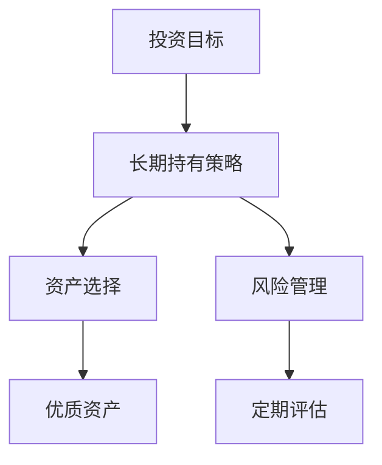
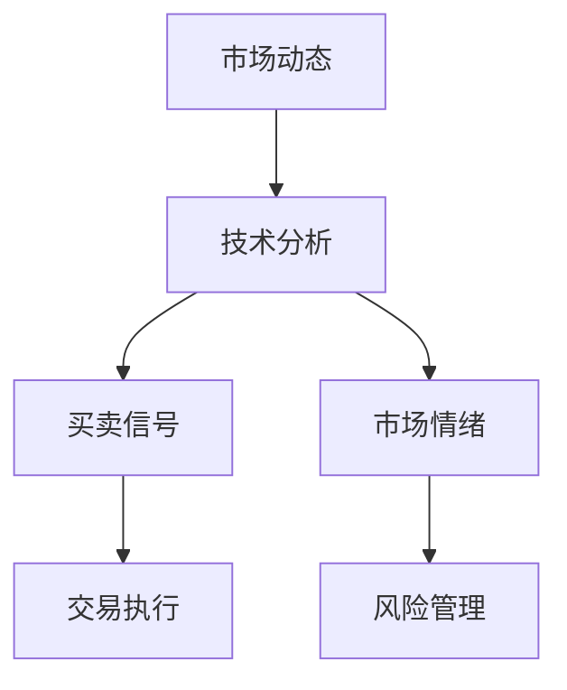
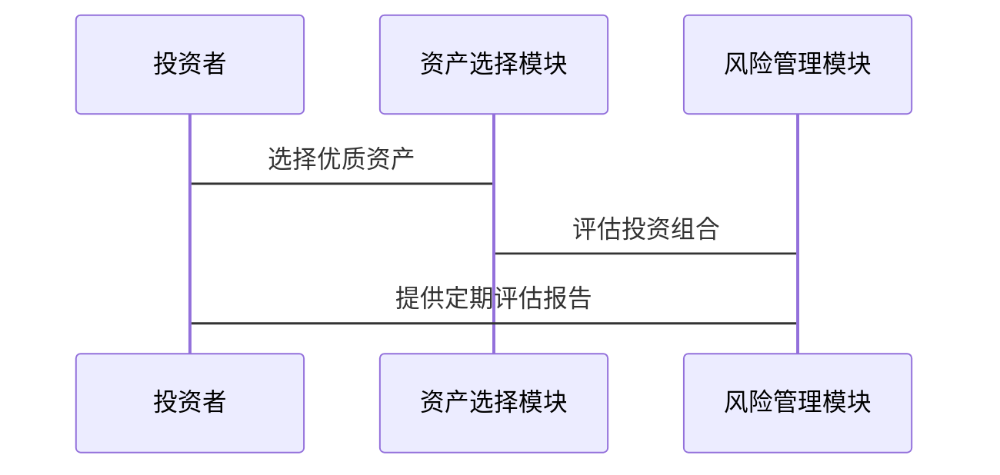
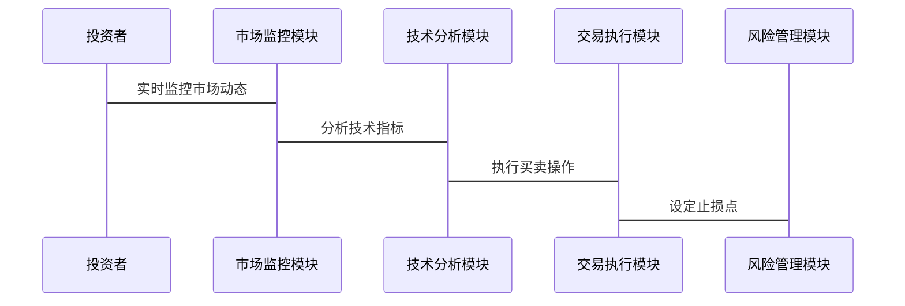

                 


# 彼得林奇的"长期持有"vs"战术性调整"

> 关键词：彼得林奇、投资策略、长期持有、战术性调整、投资分析、风险管理

> 摘要：本文深入探讨了彼得·林奇的两种投资策略——长期持有与战术性调整，分析了它们的核心理念、优缺点、适用场景以及两者之间的对比。通过详细的算法原理、数学模型和系统架构设计，结合实际案例，帮助读者理解如何在不同市场环境下选择合适的投资策略。

---

## 第一章：投资的基本概念与彼得林奇的背景

### 1.1 投资的基本概念

#### 1.1.1 什么是投资
投资是指将资金投入到某一资产或项目中，期望在未来获得超过初始投入的收益。投资的核心目标是通过资产配置和风险管理，实现财富的保值与增值。

#### 1.1.2 投资的基本原则
- **分散投资**：不要将所有资金投入到单一资产中，以降低风险。
- **长期视角**：投资不是短期交易，而是长期价值的积累。
- **风险管理**：识别并控制可能的投资风险，避免重大损失。

#### 1.1.3 投资的分类与特点
- **股票投资**：通过购买公司股份获得收益。
- **债券投资**：通过购买政府或企业债券获取固定利息。
- **基金投资**：通过购买基金间接投资于多种资产。
- **短期投资**：在较短时间内买卖资产以获利。
- **长期投资**：持有资产数年以上，注重价值增长。

### 1.2 彼得林奇的背景与投资理念

#### 1.2.1 彼得林奇的生平简介
彼得·林奇（Peter Lynch）是美国著名的职业基金经理人，曾任管理着麦哲伦基金（Fidelity Magellan Fund）的经理。他以卓越的投资业绩和独特的投资策略闻名，被誉为“股神”。

#### 1.2.2 彼得林奇的投资哲学
彼得林奇的核心理念是“长期持有优质资产”。他认为，成功的投资需要选择优秀的公司，并长期持有这些公司股票，等待其价值增长。

#### 1.2.3 彼得林奇的成功案例
在管理麦哲伦基金期间，彼得林奇创造了年均29%的收益，远超市场平均水平。他的成功主要归功于对市场趋势的精准判断和对优质企业的长期持有。

---

## 第二章：长期持有与战术性调整的定义与区别

### 2.1 长期持有的定义与特点

#### 2.1.1 长期持有的核心理念
长期持有是指投资者买入优质资产后，长期持有这些资产，不因短期市场波动而频繁买卖。这种策略注重企业的长期价值，而非短期价格波动。

#### 2.1.2 长期持有的优势
- **避免交易成本**：频繁交易会产生佣金和税费，长期持有可以减少这些成本。
- **降低市场波动影响**：长期持有能够过滤短期市场波动，专注于企业的长期增长。
- **简化决策过程**：不需要频繁关注市场动态，减少了决策疲劳。

#### 2.1.3 长期持有的劣势
- **错失短期机会**：在市场快速上涨时，长期持有可能无法及时获利。
- **无法应对突发事件**：如果市场出现系统性风险，长期持有可能无法及时规避。

### 2.2 战术性调整的定义与特点

#### 2.2.1 战术性调整的核心理念
战术性调整是指根据市场环境的变化，频繁买卖资产以抓住短期市场机会或规避风险。这种策略强调灵活性和对市场趋势的敏锐捕捉。

#### 2.2.2 战术性调整的优势
- **抓住短期机会**：在市场快速上涨或下跌时，战术性调整可以迅速获利或规避损失。
- **应对突发事件**：在市场出现突发事件时，战术性调整可以及时调整投资组合，降低风险。

#### 2.2.3 战术性调整的劣势
- **增加交易成本**：频繁买卖会产生较高的佣金和税费。
- **决策疲劳**：需要投资者持续关注市场动态，增加了心理压力。

### 2.3 长期持有与战术性调整的对比

#### 2.3.1 两者的异同点对比

| 对比维度           | 长期持有                | 战术性调整             |
|--------------------|-------------------------|------------------------|
| 投资目标           | 长期价值增长            | 短期收益最大化          |
| 交易频率           | 低                      | 高                    |
| 风险承受能力       | 高                      | 低                    |
| 适用场景           | 稳定增长的市场           | 波动较大的市场          |

#### 2.3.2 适用场景的差异
- **长期持有**：适用于市场环境稳定、企业基本面良好且长期增长潜力大的情况。
- **战术性调整**：适用于市场波动较大、突发事件频发或短期市场机会较多的情况。

#### 2.3.3 投资目标的差异
- **长期持有**：目标是通过持有优质资产实现长期财富增长。
- **战术性调整**：目标是通过频繁买卖实现短期收益最大化。

---

## 第三章：长期持有的策略分析

### 3.1 长期持有的核心原理

#### 3.1.1 长期持有的投资逻辑
长期持有的核心逻辑是基于企业的长期价值。投资者需要选择那些具有强大竞争优势、良好财务状况和持续增长潜力的企业。

#### 3.1.2 长期持有的选股标准
- **行业地位**：选择行业龙头或具有竞争优势的企业。
- **财务状况**：关注企业的盈利能力、资产负债表和现金流。
- **管理团队**：选择管理团队稳定且有良好业绩的企业。
- **估值**：关注企业的市盈率、市净率等估值指标。

#### 3.1.3 长期持有的风险管理
- **分散投资**：不要将所有资金投入到单一资产。
- **定期评估**：定期检查投资组合，确保符合长期目标。
- **避免过度杠杆**：不要使用过高杠杆，避免因市场波动导致的重大损失。

### 3.2 长期持有的优势与劣势

#### 3.2.1 长期持有的优势
- **避免交易成本**：长期持有可以减少佣金和税费。
- **降低市场波动影响**：长期持有能够过滤短期波动，专注于长期增长。
- **简化决策过程**：不需要频繁关注市场动态。

#### 3.2.2 长期持有的劣势
- **错失短期机会**：在市场快速上涨时，长期持有可能无法及时获利。
- **无法应对突发事件**：在市场出现突发事件时，长期持有可能无法及时规避风险。

---

## 第四章：战术性调整策略的深入分析

### 4.1 战术性调整的核心原理

#### 4.1.1 战术性调整的投资逻辑
战术性调整的核心逻辑是基于市场环境的变化，通过频繁买卖资产来抓住短期市场机会或规避风险。

#### 4.1.2 战术性调整的选股标准
- **市场趋势**：关注市场的短期走势，抓住上涨或下跌趋势。
- **技术分析**：使用K线图、均线、MACD等技术指标进行判断。
- **市场情绪**：关注市场的买卖情绪，抓住市场波动带来的机会。

#### 4.1.3 战术性调整的风险管理
- **止损策略**：设定止损点，避免亏损过大。
- **仓位控制**：根据市场环境调整持仓比例，避免过度集中。
- **资金管理**：合理分配资金，避免因短期波动导致的重大损失。

### 4.2 战术性调整的优势与劣势

#### 4.2.1 战术性调整的优势
- **抓住短期机会**：在市场快速上涨或下跌时，战术性调整可以迅速获利或规避损失。
- **应对突发事件**：在市场出现突发事件时，战术性调整可以及时调整投资组合，降低风险。

#### 4.2.2 战术性调整的劣势
- **增加交易成本**：频繁买卖会产生较高的佣金和税费。
- **决策疲劳**：需要投资者持续关注市场动态，增加了心理压力。

---

## 第五章：长期持有与战术性调整的对比

### 5.1 长期持有与战术性调整的对比

#### 5.1.1 投资目标的对比
- **长期持有**：目标是通过持有优质资产实现长期财富增长。
- **战术性调整**：目标是通过频繁买卖实现短期收益最大化。

#### 5.1.2 交易频率的对比
- **长期持有**：交易频率低，注重长期价值。
- **战术性调整**：交易频率高，注重短期机会。

#### 5.1.3 风险承受能力的对比
- **长期持有**：能够承受较高的市场波动，注重长期价值。
- **战术性调整**：风险承受能力低，注重规避短期风险。

### 5.2 何时选择长期持有，何时选择战术性调整

#### 5.2.1 长期持有的适用场景
- **市场环境稳定**：市场波动小，企业基本面良好。
- **长期增长潜力大**：选择具有长期增长潜力的优质企业。

#### 5.2.2 战术性调整的适用场景
- **市场波动较大**：市场短期波动剧烈，存在短期机会。
- **突发事件频发**：市场出现突发事件，需要及时规避风险。

---

## 第六章：长期持有与战术性调整的数学模型与算法原理

### 6.1 长期持有的数学模型

#### 6.1.1 估值模型
长期持有的核心是选择具有合理估值的企业。常用的方法包括市盈率（P/E）和市净率（P/B）。

- **市盈率（P/E）**：公式为 $P/E = \frac{\text{股价}}{\text{每股收益}}$。
- **市净率（P/B）**：公式为 $P/B = \frac{\text{股价}}{\text{每股净资产}}$。

#### 6.1.2 增长模型
长期持有的另一个重要指标是企业的增长潜力。常用的方法包括资本资产定价模型（CAPM）和股利折现模型（DDM）。

- **资本资产定价模型（CAPM）**：公式为 $r = r_f + \beta (r_m - r_f)$。
- **股利折现模型（DDM）**：公式为 $P = \frac{D}{k - g}$。

### 6.2 战术性调整的算法原理

#### 6.2.1 技术分析算法
战术性调整的核心是技术分析，常用的技术指标包括移动平均线、MACD、RSI等。

- **移动平均线（MA）**：公式为 $MA_n = \frac{1}{n} \sum_{i=1}^{n} \text{收盘价}_i$。
- **MACD**：公式为 $\text{MACD} = \text{短期均线} - \text{长期均线}$。
- **RSI**：公式为 $\text{RSI} = \frac{\text{上涨天数}}{\text{总天数}} \times 100$。

#### 6.2.2 市场情绪算法
战术性调整还关注市场情绪的变化，常用的方法包括成交量分析和市场情绪指标。

- **成交量分析**：通过成交量判断市场的买卖力量。
- **市场情绪指标**：如恐慌指数（VIX）。

---

## 第七章：长期持有与战术性调整的系统架构设计

### 7.1 问题场景介绍

#### 7.1.1 长期持有系统的应用场景
- **稳定的市场环境**：适合长期持有的场景，如经济增长稳定、企业基本面良好。
- **长期增长潜力大的资产**：如优质股票、房地产等。

#### 7.1.2 战术性调整系统的应用场景
- **波动较大的市场环境**：如股市波动剧烈、突发事件频发。
- **短期市场机会较多**：如短期趋势明确、交易活跃的市场。

### 7.2 系统功能设计

#### 7.2.1 长期持有系统的功能模块
- **资产选择模块**：根据企业的基本面和估值指标选择优质资产。
- **风险管理模块**：定期评估投资组合，调整持仓比例。
- **长期持有模块**：买入优质资产后长期持有，避免频繁交易。

#### 7.2.2 战术性调整系统的功能模块
- **市场监控模块**：实时监控市场动态，捕捉短期机会。
- **技术分析模块**：使用技术指标进行买卖信号判断。
- **风险管理模块**：设定止损点，规避短期风险。

### 7.3 系统架构设计

#### 7.3.1 长期持有系统的架构图


#### 7.3.2 战术性调整系统的架构图


### 7.4 系统接口设计

#### 7.4.1 长期持有系统的接口设计
- **输入**：企业的财务数据、市场环境。
- **输出**：优质资产列表、投资组合建议。

#### 7.4.2 战术性调整系统的接口设计
- **输入**：市场数据、技术指标。
- **输出**：买卖信号、交易建议。

### 7.5 系统交互流程图

#### 7.5.1 长期持有系统的交互流程图


#### 7.5.2 战术性调整系统的交互流程图


---

## 第八章：长期持有与战术性调整的项目实战

### 8.1 环境安装

#### 8.1.1 长期持有的环境安装
- **工具**：使用Excel或股票分析软件进行基本面分析。
- **数据源**：获取企业的财务数据和市场数据。

#### 8.1.2 战术性调整的环境安装
- **工具**：使用交易软件（如TradingView）进行技术分析。
- **数据源**：获取实时市场数据和交易信号。

### 8.2 核心实现

#### 8.2.1 长期持有的核心实现
```python
def calculate_valuation(company_financials):
    # 计算市盈率
    pe_ratio = company_financials['股价'] / company_financials['每股收益']
    # 计算市净率
    pb_ratio = company_financials['股价'] / company_financials['每股净资产']
    return pe_ratio, pb_ratio
```

#### 8.2.2 战术性调整的核心实现
```python
def generate_macd_signal(closing_prices):
    # 计算短期均线
    short_ma = closing_prices.rolling(10).mean()
    # 计算长期均线
    long_ma = closing_prices.rolling(20).mean()
    # 生成MACD信号
    macd_signal = short_ma - long_ma
    return macd_signal
```

### 8.3 案例分析

#### 8.3.1 长期持有的案例分析
假设我们选择苹果公司（AAPL）作为长期持有的目标。通过基本面分析，苹果具有强大的竞争优势和增长潜力，因此适合长期持有。

#### 8.3.2 战术性调整的案例分析
假设市场出现突发事件，如某公司发布重大负面新闻。战术性调整需要迅速判断市场反应，决定是否卖出该公司的股票以规避风险。

---

## 第九章：长期持有与战术性调整的最佳实践

### 9.1 长期持有与战术性调整的对比总结

#### 9.1.1 长期持有的总结
长期持有是一种适合长期稳健增长的投资策略，特别适合那些能够长期持有的优质资产。但其缺点是需要较高的风险承受能力和较长的时间周期。

#### 9.1.2 战术性调整的总结
战术性调整是一种适合短期市场机会的投资策略，特别适合那些能够频繁交易并捕捉短期市场机会的投资者。但其缺点是需要较高的交易成本和心理压力。

### 9.2 长期持有与战术性调整的结合

#### 9.2.1 组合投资
- **策略结合**：将长期持有与战术性调整结合起来，根据市场环境动态调整投资组合。
- **风险控制**：通过分散投资和风险管理，降低投资组合的整体风险。

#### 9.2.2 时间管理
- **长期视角**：注重长期投资目标，避免因短期波动影响决策。
- **短期应对**：在市场出现突发事件时，及时采取战术性调整规避风险。

### 9.3 长期持有与战术性调整的风险管理

#### 9.3.1 风险控制措施
- **分散投资**：不要将所有资金投入到单一策略或资产。
- **止损策略**：设定止损点，避免亏损过大。
- **定期评估**：定期检查投资组合，确保符合投资目标。

#### 9.3.2 心理管理
- **保持耐心**：长期持有需要耐心等待市场波动的平息和长期价值的实现。
- **避免情绪化决策**：战术性调整需要避免因情绪化决策导致的错误操作。

### 9.4 小结

---

## 第十章：附录

### 10.1 术语表

- **市盈率（P/E）**：股价与每股收益的比率。
- **市净率（P/B）**：股价与每股净资产的比率。
- **MACD**：移动平均收敛散度指标，用于判断市场趋势。

### 10.2 参考文献

- 彼得·林奇：《彼得·林奇的投资策略》
- 技术分析经典教材：《技术分析实战指南》
- 价值投资经典教材：《巴菲特的选股艺术》

---

## 作者信息

作者：AI天才研究院/AI Genius Institute & 禅与计算机程序设计艺术/Zen And The Art of Computer Programming

