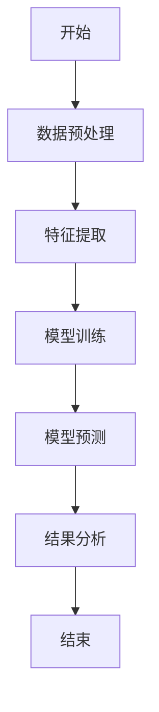
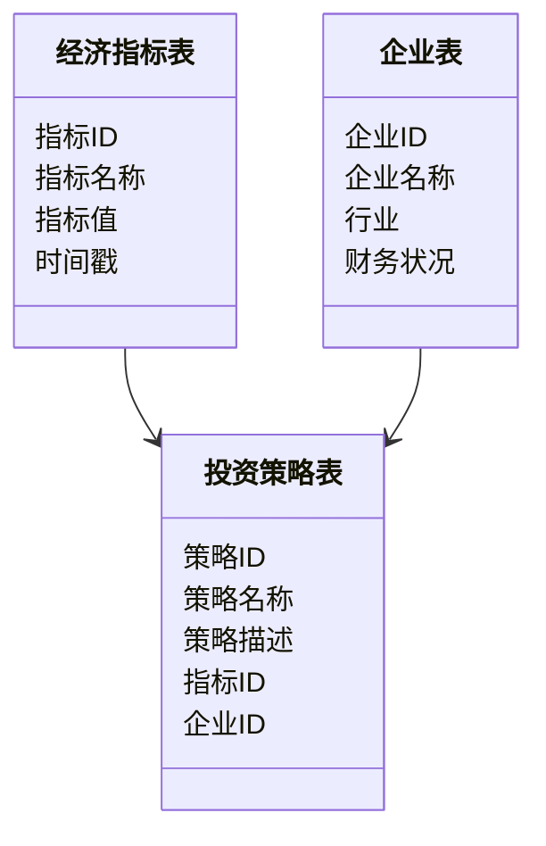
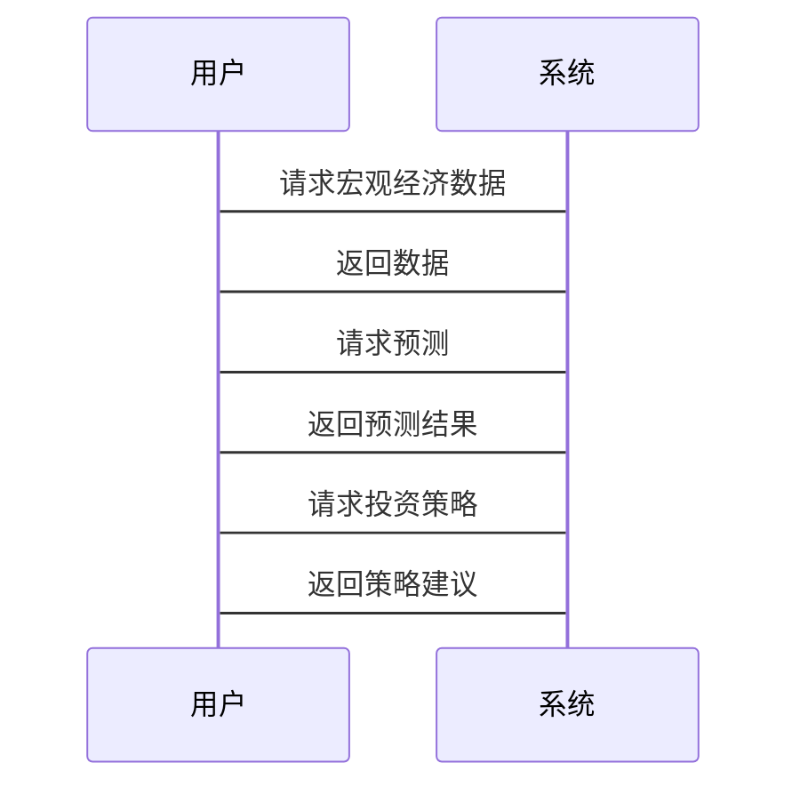

                 


```markdown
# 智能体系统提升价值投资的宏观经济指标领先性分析

> 关键词：智能体系统，价值投资，宏观经济指标，领先性分析，投资策略

> 摘要：本文系统地探讨了智能体系统在价值投资中的应用，特别是其对宏观经济指标的领先性分析。通过详细分析宏观经济指标的属性及其对投资决策的影响，本文提出了一种基于智能体系统的领先性分析方法，并通过实际案例展示了该方法在价值投资中的应用效果。本文旨在为投资者提供一种高效、准确的宏观经济指标分析工具，以提升投资决策的科学性和准确性。

---

## 第1章: 背景介绍

### 1.1 智能体系统的基本概念
#### 1.1.1 智能体系统的定义
智能体系统是一种能够感知环境、自主决策并执行任务的智能系统，具备学习、推理和自适应能力。

#### 1.1.2 智能体系统的特征
- **自主性**：无需外部干预，自主完成任务。
- **反应性**：能实时感知环境变化并做出反应。
- **学习性**：通过数据学习和优化模型。
- **协作性**：能与其他智能体或系统协同工作。

#### 1.1.3 智能体系统与传统投资分析的区别
- **数据处理能力**：智能体系统能够处理更大规模、更复杂的数据。
- **决策速度**：智能体系统能够快速做出决策，适应市场变化。
- **自适应性**：智能体系统能够根据市场反馈不断优化策略。

### 1.2 宏观经济指标的定义与分类
#### 1.2.1 宏观经济指标的定义
宏观经济指标是衡量经济整体表现的关键数据，包括GDP、失业率、通胀率等。

#### 1.2.2 宏观经济指标的分类
- **总量指标**：如GDP、工业增加值。
- **结构指标**：如产业构成比例。
- **价格指标**：如CPI、PPI。
- **劳动力指标**：如失业率、就业率。

#### 1.2.3 宏观经济指标的领先性与滞后性
- **领先性**：某些指标能够提前预示经济趋势，如工业产值。
- **滞后性**：某些指标在经济变化后才显现，如GDP增长率。

### 1.3 价值投资的核心原理
#### 1.3.1 价值投资的定义
价值投资是一种投资策略，通过分析企业的内在价值，寻找被市场低估的投资标的。

#### 1.3.2 价值投资的关键要素
- **企业基本面**：包括盈利能力、财务状况、行业地位等。
- **市场估值**：包括市盈率、市净率等估值指标。
- **管理层素质**：企业高层的管理能力和战略眼光。

#### 1.3.3 价值投资与宏观经济的关系
宏观经济环境直接影响企业的经营状况和股票价格，因此宏观经济指标是价值投资的重要参考依据。

### 1.4 智能体系统在价值投资中的应用背景
#### 1.4.1 宏观经济指标分析的挑战
- 数据复杂性：宏观经济指标种类繁多，相互关联性强。
- 数据滞后性：部分指标发布滞后，影响投资决策的及时性。
- 数据噪声：数据中存在大量噪声，影响分析准确性。

#### 1.4.2 智能体系统的优势
- **数据处理能力**：智能体系统能够高效处理海量数据。
- **实时性**：智能体系统能够实时分析数据，提供及时的投资建议。
- **自适应性**：智能体系统能够根据市场变化动态调整分析模型。

#### 1.4.3 智能体系统在价值投资中的应用前景
- **提升分析效率**：通过智能体系统快速分析宏观经济指标，辅助投资决策。
- **增强决策准确性**：利用智能体系统的深度学习能力，提高分析结果的准确性。
- **实现智能化投资**：通过智能体系统的自主决策能力，推动投资决策的智能化。

---

## 第2章: 核心概念与联系

### 2.1 智能体系统的核心原理
#### 2.1.1 智能体系统的组成要素
- **感知模块**：负责数据的采集和处理。
- **推理模块**：负责数据的分析和推理。
- **决策模块**：负责基于分析结果做出决策。
- **执行模块**：负责执行决策并反馈结果。

#### 2.1.2 智能体系统的运行机制
- 数据采集：通过多种渠道获取宏观经济指标数据。
- 数据分析：利用机器学习算法对数据进行深度分析。
- 模型推理：基于分析结果，推理宏观经济趋势。
- 决策制定：根据推理结果，制定投资策略。
- 执行反馈：执行决策并收集反馈，优化模型。

#### 2.1.3 智能体系统的数学模型
$$
\text{投资决策} = f(\text{宏观经济指标}, \text{企业基本面}, \text{市场情绪})
$$

### 2.2 宏观经济指标与价值投资的关系
#### 2.2.1 宏观经济指标对价值投资的影响
- **行业影响**：宏观经济指标影响企业的行业地位和盈利能力。
- **市场情绪**：宏观经济指标影响市场的整体情绪，进而影响股票价格。
- **政策变化**：宏观经济指标影响政府的政策制定，进而影响市场。

#### 2.2.2 领先性分析的理论基础
领先性分析是指通过分析某些宏观经济指标的变化趋势，提前预判经济走势和市场变化。

#### 2.2.3 领先性分析的实践意义
- **提前预警**：通过领先性分析，提前发现潜在风险。
- **抓住机会**：通过领先性分析，抓住市场机会。
- **优化决策**：通过领先性分析，优化投资决策。

### 2.3 智能体系统与宏观经济指标的联系
#### 2.3.1 智能体系统如何处理宏观经济数据
- **数据清洗**：去除噪声数据，确保数据质量。
- **特征提取**：提取关键特征，降低计算复杂度。
- **模型训练**：利用机器学习算法训练模型，预测经济趋势。

#### 2.3.2 智能体系统如何预测宏观经济走势
- **时间序列分析**：利用时间序列模型预测未来走势。
- **机器学习算法**：利用深度学习算法提高预测准确性。
- **多模型融合**：通过融合多个模型的结果，提高预测的稳定性。

#### 2.3.3 智能体系统如何辅助价值投资
- **数据支持**：提供宏观经济数据支持投资决策。
- **模型支持**：提供宏观经济模型支持投资分析。
- **决策支持**：提供基于宏观经济分析的投资建议。

### 2.4 核心概念对比与ER实体

#### 2.4.1 核心概念对比表

| 概念       | 定义与特征                     | 与智能体系统的关联                   |
|------------|--------------------------------|--------------------------------------|
| 智能体系统   | 具备自主性、反应性、学习性的智能系统 | 能够实时分析宏观经济数据，提供投资建议 |
| 宏观经济指标 | 衡量经济整体表现的关键数据       | 通过领先性分析，辅助投资决策         |
| 价值投资    | 通过分析企业内在价值进行投资     | 利用宏观经济指标和智能体系统优化投资策略 |

#### 2.4.2 ER实体关系图

```mermaid
erd
    经济指标表
    -----------------
    指标ID (PK)
    指标名称
    指标值
    时间戳
    -----------------
    企业表
    -----------------
    企业ID (PK)
    企业名称
    行业
    财务状况
    -----------------
    投资策略表
    -----------------
    策略ID (PK)
    策略名称
    策略描述
    指标ID (FK)
    企业ID (FK)
```

---

## 第3章: 智能体系统的算法原理

### 3.1 算法原理概述
智能体系统通过感知环境、分析数据、推理结果、制定决策和执行反馈的循环过程，实现对宏观经济指标的领先性分析。

### 3.2 数据预处理
#### 3.2.1 数据清洗
- 去除缺失值
- 处理异常值
- 标准化数据

#### 3.2.2 数据特征提取
- 时间序列特征
- 统计特征（均值、方差等）
- 频率域特征

### 3.3 模型训练
#### 3.3.1 机器学习算法
- 线性回归
- 支持向量机（SVM）
- 随机森林
- LSTM网络

#### 3.3.2 模型评估
- 均方误差（MSE）
- R平方值
- 回归系数

### 3.4 领先性分析
#### 3.4.1 时间序列分析
- ARIMA模型
- GARCH模型

#### 3.4.2 机器学习预测
- 使用XGBoost进行预测
- 使用神经网络进行预测

### 3.5 算法流程图



### 3.6 Python代码实现

#### 3.6.1 数据加载与预处理

```python
import pandas as pd
import numpy as np

# 加载数据
data = pd.read_csv('macroeconomic.csv')

# 数据清洗
data = data.dropna()
data = (data - data.mean()) / data.std()

# 特征提取
features = data[['GDP', ' unemployment', ' inflation']]
labels = data[' stock_price']
```

#### 3.6.2 模型训练与预测

```python
from sklearn.ensemble import RandomForestRegressor
from sklearn.metrics import mean_squared_error

# 训练模型
model = RandomForestRegressor()
model.fit(features, labels)

# 预测结果
predictions = model.predict(features)
print(mean_squared_error(labels, predictions))
```

#### 3.6.3 模型评估

```python
from sklearn.metrics import r2_score

print(r2_score(labels, predictions))
```

### 3.7 数学模型与公式

#### 3.7.1 线性回归模型
$$
y = \beta_0 + \beta_1 x + \epsilon
$$

#### 3.7.2 时间序列模型
$$
y_t = \alpha y_{t-1} + \beta x_t + \gamma
$$

---

## 第4章: 智能体系统的系统架构设计

### 4.1 系统功能设计
#### 4.1.1 领域模型



#### 4.1.2 系统架构


### 4.2 接口设计
#### 4.2.1 REST API接口
- `/api/macrodata`：获取宏观经济数据
- `/api/predict`：进行预测
- `/api/strategy`：获取投资策略

### 4.3 交互流程



---

## 第5章: 项目实战

### 5.1 环境安装
- 安装Python
- 安装必要的库（如pandas、numpy、scikit-learn、mermaid等）

### 5.2 核心功能实现
#### 5.2.1 数据采集与处理
```python
import requests
import pandas as pd

# 数据采集
response = requests.get('https://api.example.com/macrodata')
data = pd.DataFrame(response.json())
```

#### 5.2.2 模型训练与预测
```python
from sklearn.ensemble import RandomForestRegressor
from sklearn.metrics import mean_squared_error

# 训练模型
model = RandomForestRegressor()
model.fit(X_train, y_train)

# 预测结果
y_pred = model.predict(X_test)
print(mean_squared_error(y_test, y_pred))
```

### 5.3 案例分析
#### 5.3.1 数据分析结果
- 经济指标与股票价格的相关性分析
- 领先性分析结果展示

#### 5.3.2 投资策略制定
- 基于领先性分析的买入卖出信号
- 投资组合优化建议

### 5.4 项目小结
- 项目成果总结
- 经验与教训
- 改进建议

---

## 第6章: 最佳实践与注意事项

### 6.1 最佳实践
- 数据质量管理：确保数据的准确性和完整性。
- 模型优化：定期更新模型，提高预测准确性。
- 风险管理：制定风险管理策略，降低投资风险。

### 6.2 小结
智能体系统通过其强大的数据处理能力和深度学习算法，能够有效地提升价值投资的宏观经济指标领先性分析的准确性和效率。

### 6.3 注意事项
- 数据隐私保护
- 模型解释性
- 系统稳定性

### 6.4 拓展阅读
- 推荐相关书籍和论文
- 提供进一步学习的方向

---

## 第7章: 总结与展望

### 7.1 总结
本文详细探讨了智能体系统在价值投资中的应用，特别是其对宏观经济指标的领先性分析。通过理论分析和实践案例，证明了智能体系统在提升投资决策科学性和准确性方面的优势。

### 7.2 展望
未来，随着人工智能技术的不断发展，智能体系统在价值投资中的应用将更加广泛和深入，宏观经济指标的领先性分析也将更加精确和实时。

---

## 作者：AI天才研究院/AI Genius Institute & 禅与计算机程序设计艺术 /Zen And The Art of Computer Programming
```

