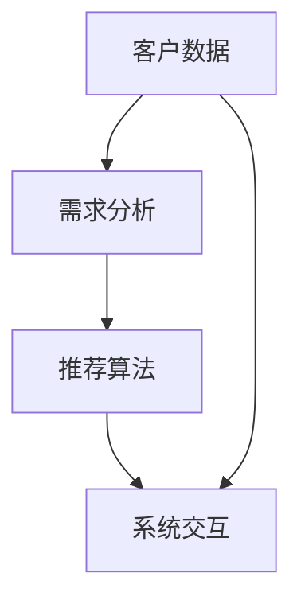
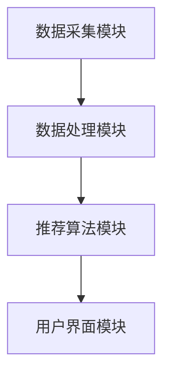
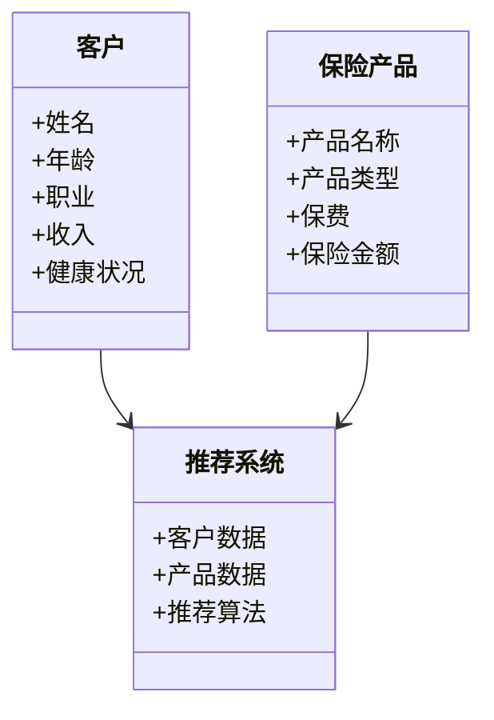
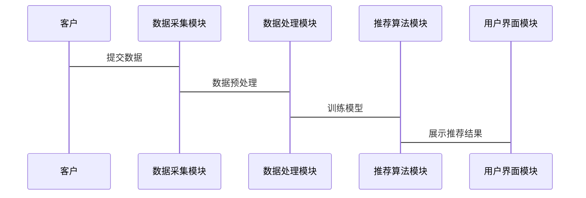
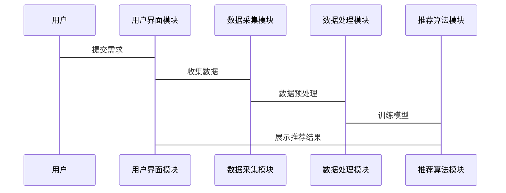
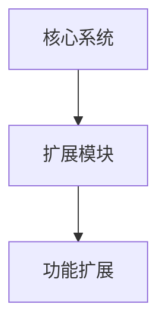

                 


# 智能保险产品个性化定制系统

> 关键词：智能保险，个性化定制，保险产品，人工智能，大数据，推荐系统

> 摘要：智能保险产品个性化定制系统是一种基于人工智能和大数据技术的创新解决方案，旨在通过智能化手段为用户提供个性化的保险产品定制服务。本文将从系统背景、核心概念、算法原理、系统设计、项目实战、优化与扩展以及总结与展望等多方面，详细阐述智能保险产品个性化定制系统的实现与应用。

---

# 第1章: 智能保险产品个性化定制系统背景

## 1.1 智能保险的发展背景

### 1.1.1 传统保险产品的局限性
传统保险产品往往采用标准化设计，难以满足客户的个性化需求。客户在购买保险时，通常只能选择现成的保险产品，缺乏灵活性和定制化选项。这种“一刀切”的方式不仅难以满足客户的多样化需求，还可能导致客户体验不佳，甚至流失。

### 1.1.2 智能化技术对保险行业的推动
随着人工智能（AI）、大数据、机器学习等技术的快速发展，保险行业迎来了智能化转型的契机。通过智能化技术，保险公司可以更精准地理解客户需求，提供个性化的保险产品和服务，从而提升客户满意度和市场竞争力。

### 1.1.3 个性化定制的需求与趋势
客户对个性化服务的需求日益增长，尤其是在保险领域。个性化定制不仅能够提高客户的满意度，还能帮助保险公司更好地匹配客户需求，降低运营成本，提高效率。因此，智能保险产品个性化定制系统逐渐成为行业趋势。

## 1.2 保险产品个性化定制的必要性

### 1.2.1 客户需求的多样化
现代客户对保险产品的需求日益多样化。不同客户有不同的风险承受能力、经济状况和家庭结构，这些差异使得标准化的保险产品难以满足所有客户的需求。

### 1.2.2 市场竞争的加剧
保险行业的竞争日益激烈，保险公司需要通过差异化服务来吸引客户。个性化定制不仅能够帮助保险公司脱颖而出，还能增强客户忠诚度。

### 1.2.3 个性化定制对保险公司价值的提升
通过个性化定制，保险公司可以更精准地定位客户群体，优化产品设计，降低销售成本，同时提高客户满意度和忠诚度。

## 1.3 本章小结

本章从背景出发，介绍了智能保险的发展现状，分析了传统保险产品的局限性，以及智能化技术对保险行业的推动作用。同时，重点阐述了个性化定制的需求与趋势，强调了保险产品个性化定制的必要性。

---

# 第2章: 智能保险产品个性化定制系统的核心概念

## 2.1 系统架构与核心要素

### 2.1.1 系统架构层次划分
智能保险产品个性化定制系统可以分为以下几个层次：
1. **数据采集层**：负责收集客户数据，包括基本资料、风险偏好、历史投保记录等。
2. **数据处理与分析层**：对收集到的数据进行清洗、建模和分析，提取客户画像和需求特征。
3. **算法与推荐层**：基于分析结果，利用推荐算法生成个性化的保险产品方案。
4. **用户界面层**：通过友好的用户界面，向客户展示推荐的产品方案，并支持交互。

### 2.1.2 核心要素的定义与属性
以下是智能保险产品个性化定制系统的核心要素及其属性：
- **客户数据**：包括客户的基本信息、财务状况、健康状况、家庭结构等。
- **需求分析**：通过分析客户数据，识别客户的保险需求和偏好。
- **推荐算法**：基于客户需求和历史数据，生成个性化的保险产品推荐方案。
- **系统交互**：通过用户界面与客户互动，实时调整推荐方案。

### 2.1.3 系统核心要素之间的关系
以下是系统核心要素之间的关系图（使用 Mermaid 绘制）：



## 2.2 个性化定制系统的关键技术

### 2.2.1 人工智能技术在保险产品定制中的应用
人工智能技术在保险产品定制中的应用主要体现在以下几个方面：
1. **自然语言处理（NLP）**：用于分析客户的语言偏好和需求描述。
2. **机器学习**：用于训练推荐模型，生成个性化的保险产品方案。
3. **深度学习**：用于处理复杂的客户数据和需求模式。

### 2.2.2 大数据技术对个性化需求的支撑
大数据技术在个性化需求支撑中的作用包括：
1. **数据采集**：通过多种渠道（如线上问卷、线下咨询）收集客户数据。
2. **数据清洗**：对采集到的数据进行去重、补全和标准化处理。
3. **数据建模**：利用大数据分析技术，构建客户画像和需求模型。

### 2.2.3 保险产品定制系统的核心算法
以下是保险产品定制系统的核心算法：
- **协同过滤算法**：基于客户相似性推荐保险产品。
- **基于内容的推荐算法**：基于保险产品的特征推荐相关产品。
- **混合推荐算法**：结合协同过滤和基于内容的推荐算法，提高推荐准确率。

## 2.3 个性化定制系统的实现流程

### 2.3.1 需求分析与数据收集
1. **需求分析**：通过问卷调查、客户访谈等方式，了解客户的保险需求和偏好。
2. **数据收集**：收集客户的基本信息、财务状况、健康状况等数据。

### 2.3.2 数据处理与特征提取
1. **数据清洗**：对收集到的数据进行去重、补全和标准化处理。
2. **特征提取**：从数据中提取关键特征，如年龄、职业、收入水平等。

### 2.3.3 系统设计与算法实现
1. **系统设计**：基于客户需求和数据特征，设计系统的功能模块和交互流程。
2. **算法实现**：选择合适的推荐算法，训练模型并生成个性化的保险产品方案。

## 2.4 本章小结

本章详细阐述了智能保险产品个性化定制系统的核心概念，包括系统架构、核心要素、关键技术以及实现流程。通过这些内容，读者可以对系统的设计和实现有一个全面的了解。

---

# 第3章: 个性化定制系统的算法原理

## 3.1 推荐算法概述

### 3.1.1 推荐算法的分类与特点
推荐算法主要分为以下几类：
1. **协同过滤算法**：基于用户相似性推荐产品。
2. **基于内容的推荐算法**：基于产品特征推荐相关产品。
3. **混合推荐算法**：结合协同过滤和基于内容的推荐算法，提高推荐准确率。

### 3.1.2 基于协同过滤的推荐算法
协同过滤算法的核心思想是“相似的用户喜欢相似的产品”。以下是协同过滤算法的实现步骤：
1. **数据预处理**：对用户数据进行标准化和归一化处理。
2. **相似度计算**：计算用户之间的相似度，常用余弦相似度。
3. **推荐生成**：基于相似用户的偏好，推荐相似的产品。

### 3.1.3 基于内容的推荐算法
基于内容的推荐算法的核心思想是“推荐与当前用户已感兴趣的产品相似的产品”。以下是其实现步骤：
1. **特征提取**：提取产品的特征表示。
2. **相似度计算**：计算当前产品与已有的产品的相似度。
3. **推荐生成**：基于相似度，推荐最相似的产品。

### 3.1.4 基于混合模型的推荐算法
混合推荐算法结合了协同过滤和基于内容的推荐算法的优点，通过集成学习的方法，提高推荐准确率。

## 3.2 保险产品推荐系统的实现流程

### 3.2.1 数据预处理与特征提取
1. **数据预处理**：对客户数据进行清洗和标准化处理。
2. **特征提取**：从数据中提取关键特征，如年龄、职业、收入水平等。

### 3.2.2 模型训练与参数优化
1. **模型训练**：基于特征数据，训练推荐模型。
2. **参数优化**：通过交叉验证和网格搜索，优化模型的参数。

### 3.2.3 推荐结果的生成与展示
1. **推荐生成**：基于训练好的模型，生成个性化的保险产品推荐方案。
2. **结果展示**：通过用户友好的界面，展示推荐结果。

## 3.3 基于机器学习的保险产品推荐模型

### 3.3.1 线性回归模型
线性回归模型是一种简单的回归模型，适用于连续型目标变量的预测。

### 3.3.2 支持向量机模型
支持向量机模型是一种强大的分类模型，适用于二分类或多分类问题。

### 3.3.3 神经网络模型
神经网络模型是一种深度学习模型，适用于复杂的非线性分类和回归问题。

## 3.4 算法实现的数学模型与公式

### 3.4.1 协同过滤算法的数学公式
协同过滤算法的核心公式是相似度计算公式：

$$
\text{相似度} = \frac{\sum_{i=1}^{n} (x_i - \mu_x)(y_i - \mu_y)}{\sqrt{\sum_{i=1}^{n} (x_i - \mu_x)^2} \cdot \sqrt{\sum_{i=1}^{n} (y_i - \mu_y)^2}}
$$

其中，$x_i$ 和 $y_i$ 分别是两个用户的评分，$\mu_x$ 和 $\mu_y$ 分别是两个用户的平均评分。

### 3.4.2 机器学习模型的数学公式
以下是一个简单的线性回归模型的数学公式：

$$
y = \beta_0 + \beta_1 x + \epsilon
$$

其中，$y$ 是目标变量，$x$ 是自变量，$\beta_0$ 和 $\beta_1$ 是模型参数，$\epsilon$ 是误差项。

---

# 第4章: 个性化定制系统的系统设计

## 4.1 系统架构设计

### 4.1.1 系统功能模块划分
智能保险产品个性化定制系统的功能模块包括：
1. **数据采集模块**：负责收集客户数据。
2. **数据处理模块**：对数据进行清洗和建模。
3. **推荐算法模块**：基于客户需求生成个性化推荐方案。
4. **用户界面模块**：展示推荐结果并支持交互。

### 4.1.2 系统架构图
以下是系统架构图（使用 Mermaid 绘制）：



## 4.2 系统功能设计

### 4.2.1 领域模型设计
以下是领域模型设计图（使用 Mermaid 绘制）：



## 4.3 系统接口设计

### 4.3.1 接口设计
以下是系统接口设计图（使用 Mermaid 绘制）：



## 4.4 系统交互设计

### 4.4.1 交互流程
以下是系统交互流程图（使用 Mermaid 绘制）：



## 4.5 本章小结

本章详细阐述了智能保险产品个性化定制系统的系统设计，包括系统架构、功能模块、接口设计和交互流程。通过这些内容，读者可以对系统的整体结构和实现细节有一个清晰的了解。

---

# 第5章: 个性化定制系统的项目实战

## 5.1 项目环境搭建

### 5.1.1 开发工具安装
以下是开发工具安装步骤：
1. **安装 Python**：推荐使用 Anaconda 分发版。
2. **安装机器学习库**：如 Scikit-learn、XGBoost、TensorFlow 等。
3. **安装数据处理工具**：如 Pandas、NumPy 等。
4. **安装可视化工具**：如 Matplotlib、Seaborn 等。

## 5.2 系统核心代码实现

### 5.2.1 数据预处理代码
以下是数据预处理代码示例：

```python
import pandas as pd
import numpy as np

# 加载数据
data = pd.read_csv('customer_data.csv')

# 数据清洗
data.dropna(inplace=True)
data['年龄'].fillna(data['年龄'].mean(), inplace=True)

# 数据标准化
from sklearn.preprocessing import StandardScaler
scaler = StandardScaler()
data_scaled = scaler.fit_transform(data[['年龄', '收入', '健康状况']])
```

### 5.2.2 推荐算法实现代码
以下是推荐算法实现代码示例：

```python
from sklearn.neighbors import NearestNeighbors

# 初始化模型
model = NearestNeighbors(n_neighbors=5, algorithm='ball_tree')

# 训练模型
model.fit(data_scaled)

# 查询相似用户
distances, indices = model.kneighbors(data_scaled[:5, :])
```

## 5.3 项目案例分析

### 5.3.1 案例背景
假设我们有一个客户数据集，包括客户的年龄、职业、收入和健康状况等信息。

### 5.3.2 推荐结果分析
通过训练好的模型，我们可以为每个客户推荐最合适的保险产品。

## 5.4 系统优化与调优

### 5.4.1 系统优化策略
1. **数据预处理优化**：采用更高效的算法进行数据清洗和特征提取。
2. **模型优化**：通过网格搜索和交叉验证优化模型参数。
3. **系统性能优化**：采用分布式计算和并行处理提高系统的运行效率。

## 5.5 本章小结

本章通过具体的项目实战，详细阐述了智能保险产品个性化定制系统的实现过程，包括环境搭建、代码实现、案例分析和系统优化等。通过这些内容，读者可以更好地理解和应用智能保险产品个性化定制系统的相关技术。

---

# 第6章: 个性化定制系统的优化与扩展

## 6.1 系统优化策略

### 6.1.1 数据层面优化
1. **数据清洗优化**：采用更高效的算法进行数据清洗和特征提取。
2. **数据存储优化**：采用分布式存储和索引优化技术，提高数据查询效率。

### 6.1.2 算法层面优化
1. **模型优化**：通过网格搜索和交叉验证优化模型参数。
2. **算法优化**：采用更高效的推荐算法，如基于深度学习的推荐算法。

### 6.1.3 系统层面优化
1. **系统性能优化**：通过分布式计算和并行处理提高系统的运行效率。
2. **系统扩展性优化**：采用微服务架构，提高系统的可扩展性和可维护性。

## 6.2 系统扩展性设计

### 6.2.1 系统扩展性分析
智能保险产品个性化定制系统可以通过以下方式实现扩展：
1. **横向扩展**：增加更多的服务器节点，提高系统的处理能力。
2. **纵向扩展**：增加更多的功能模块，如客户反馈模块、产品评价模块等。

### 6.2.2 系统扩展性实现
以下是系统扩展性实现示意图（使用 Mermaid 绘制）：



## 6.3 系统安全性设计

### 6.3.1 数据安全性保障
1. **数据加密**：采用加密算法对敏感数据进行加密存储和传输。
2. **访问控制**：通过权限控制，确保只有授权用户才能访问敏感数据。

### 6.3.2 系统安全性优化
1. **身份认证**：采用多因素认证技术，提高系统的安全性。
2. **日志审计**：通过日志审计，追踪和监控系统中的异常行为。

## 6.4 本章小结

本章详细阐述了智能保险产品个性化定制系统的优化与扩展策略，包括数据优化、算法优化、系统优化以及安全性设计等方面。通过这些内容，读者可以更好地理解和实现系统的优化与扩展。

---

# 第7章: 个性化定制系统的总结与展望

## 7.1 本章总结

智能保险产品个性化定制系统是一种基于人工智能和大数据技术的创新解决方案，旨在通过智能化手段为用户提供个性化的保险产品定制服务。本文从系统背景、核心概念、算法原理、系统设计、项目实战、优化与扩展以及总结与展望等多方面，详细阐述了智能保险产品个性化定制系统的实现与应用。

## 7.2 未来展望

随着人工智能和大数据技术的不断发展，智能保险产品个性化定制系统将更加智能化和个性化。未来的研究方向包括：
1. **深度学习技术的应用**：采用更深度的深度学习模型，进一步提高推荐的准确率。
2. **多模态数据的融合**：结合文本、图像等多种数据源，提高系统的智能化水平。
3. **实时推荐的实现**：通过实时数据处理和动态推荐算法，实现实时的个性化推荐。

---

# 作者：AI天才研究院/AI Genius Institute & 禅与计算机程序设计艺术 /Zen And The Art of Computer Programming

