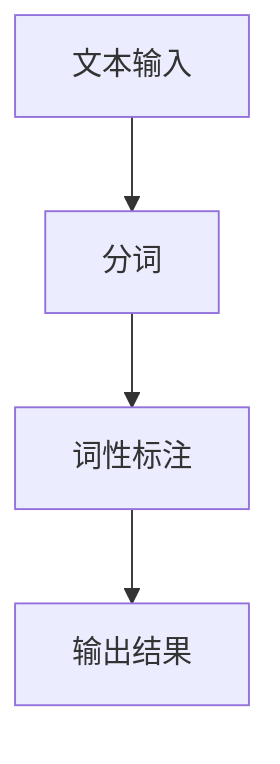
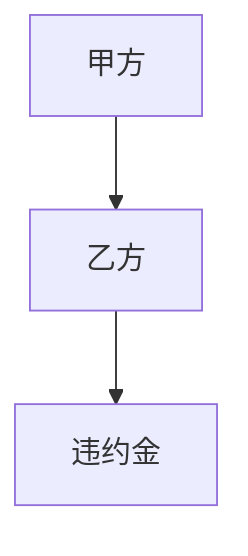
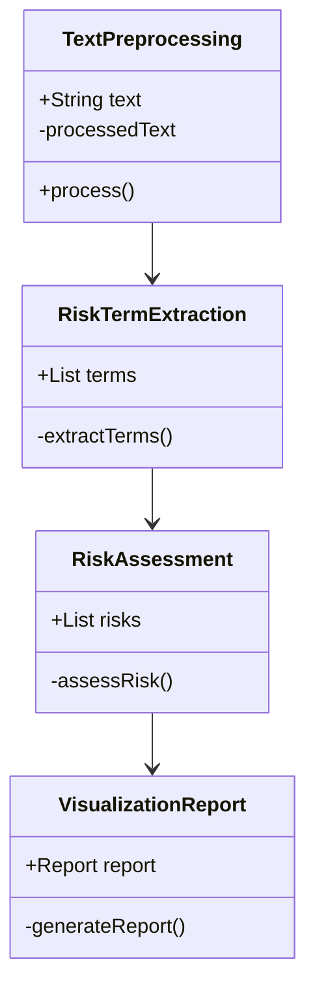
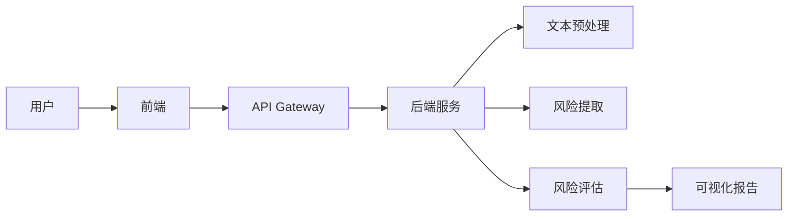
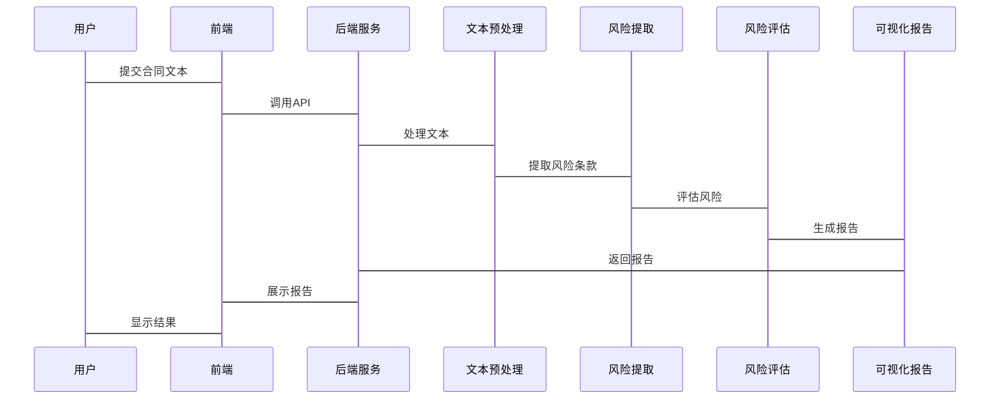

                 


# 构建基于NLP的金融合同风险条款自动化提取与评估系统

> 关键词：NLP，金融合同，风险条款提取，文本挖掘，机器学习，自然语言处理

> 摘要：本文系统地探讨了如何利用自然语言处理技术，构建一个高效的金融合同风险条款自动化提取与评估系统。文章首先分析了传统金融合同处理的痛点和难点，提出了基于NLP的解决方案；接着详细阐述了系统的架构设计、核心算法原理及实现；最后通过实际案例展示了系统的应用效果。本文旨在为金融行业提供一种创新的合同风险管理工具，提高效率和准确性。

---

## 第一部分: 金融合同风险条款自动化提取与评估系统概述

### 第1章: 问题背景与目标

#### 1.1 问题背景介绍

##### 1.1.1 传统金融合同处理的痛点
传统的金融合同处理主要依赖人工审核，存在效率低、成本高、易出错等问题。合同条款繁多且复杂，人工提取和评估风险条款不仅耗时，而且容易遗漏关键信息，导致潜在的法律风险和经济损失。

##### 1.1.2 金融合同风险条款的重要性
金融合同中的风险条款通常涉及违约责任、担保条款、争议解决等关键内容。这些条款的准确提取和评估对于金融机构规避风险、保障权益至关重要。

##### 1.1.3 自动化提取与评估的必要性
随着金融业务的复杂化和数据量的激增，手动处理合同已难以满足需求。自动化提取与评估系统能够显著提高效率，降低人为错误，同时支持快速决策。

#### 1.2 问题描述与解决思路

##### 1.2.1 金融合同文本的主要特点
金融合同文本通常具有高度结构化的特点，但同时也包含大量法律术语和复杂的语法规则。这些特点使得自动化处理具有一定的挑战性。

##### 1.2.2 风险条款的定义与分类
风险条款是指合同中可能导致风险的条款，主要包括违约责任、担保条款、争议解决等。根据其性质和影响程度，可以将风险条款分为高、中、低三个等级。

##### 1.2.3 自动化提取与评估的核心问题
如何准确识别风险条款，并对其进行量化评估，是系统设计的核心问题。这需要结合自然语言处理技术和法律知识库，实现智能化的风险评估。

#### 1.3 系统目标与功能概述

##### 1.3.1 系统的主要目标
系统旨在实现金融合同中风险条款的自动提取与评估，提供可视化报告和风险预警功能。

##### 1.3.2 系统的核心功能模块
- 文本预处理模块：对合同文本进行清洗、分词和词性标注。
- 风险条款提取模块：基于NLP技术识别关键风险条款。
- 风险评估模块：对提取的条款进行风险等级评估。
- 可视化报告模块：生成风险评估报告并提供预警功能。

##### 1.3.3 系统的预期输出与应用场景
系统输出包括风险评估报告、风险分布图表和风险预警信息。应用场景包括银行贷款审核、保险合同评估、企业风险管理等。

#### 1.4 系统的边界与外延

##### 1.4.1 系统的输入与输出范围
输入：金融合同文本；输出：风险评估报告。

##### 1.4.2 系统与其他系统的接口关系
系统可与金融业务系统、法律知识库等进行数据交互。

##### 1.4.3 系统的适用范围与限制
适用于各类金融合同，但对特定领域的合同可能需要定制化处理。

#### 1.5 本章小结
本章分析了传统金融合同处理的痛点，明确了系统的目标和功能，并界定了系统的边界。

---

## 第二部分: 核心概念与技术原理

### 第2章: 自然语言处理（NLP）基础

#### 2.1 NLP的核心概念

##### 2.1.1 什么是自然语言处理
自然语言处理是指计算机对人类语言进行理解、生成和处理的技术，旨在实现人机交互和信息处理的自动化。

##### 2.1.2 NLP的主要任务与技术
- 分词：将文本分割为词或短语，如“分词”和“词性标注”。
- 实体识别：识别文本中的命名实体，如人名、地名、组织名等。
- 关系抽取：识别文本中的实体关系，如“X是Y的一部分”。
- 文本分类：将文本分为不同的类别，如情感分析、主题分类。

##### 2.1.3 NLP在金融领域的应用
- 风险评估：通过分析合同文本识别潜在风险。
- 资信评估：利用新闻和报告评估企业信用。
- 金融咨询：智能问答系统辅助客户咨询。

#### 2.2 金融合同文本的特点与挑战

##### 2.2.1 金融合同文本的结构特点
- 高度结构化：合同条款通常有明确的编号和标题。
- 专业术语多：包含大量法律术语和行业术语。
- 文本长度长：合同通常包含多个条款和附录。

##### 2.2.2 风险条款的多样性与复杂性
- 条款内容多样：包括违约责任、担保条款等。
- 法律关系复杂：条款之间可能存在相互依赖关系。
- 表达方式灵活：条款可能使用不同的表达方式。

##### 2.2.3 NLP在金融合同处理中的难点
- 术语识别：准确识别法律术语和专业术语。
- 关系抽取：识别复杂的法律关系和条款之间的相互作用。
- 领域适应：不同金融领域的合同可能有不同的处理方式。

#### 2.3 金融合同风险评估的流程

##### 2.3.1 合同文本预处理
- 文本清洗：去除多余空格、特殊字符等。
- 分词与词性标注：将文本分割为词并标注词性。
- 停用词处理：去除无意义的词汇，如“的、是”等。

##### 2.3.2 风险条款提取
- 基于规则的提取：利用预定义的规则识别特定术语。
- 基于机器学习的提取：使用分类模型识别风险条款。
- 混合方法：结合规则和机器学习进行提取。

##### 2.3.3 风险评估与结果输出
- 风险评分：根据提取的条款内容进行风险评分。
- 可视化报告：生成风险分布图表和风险预警信息。
- 输出报告：提供详细的评估结果和建议。

#### 2.4 本章小结
本章介绍了NLP的基本概念和技术，分析了金融合同文本的特点和处理难点，并总结了风险评估的基本流程。

---

## 第三部分: 算法原理与数学模型

### 第3章: 基于NLP的风险条款提取算法

#### 3.1 分词与词性标注

##### 3.1.1 分词算法的原理与实现
分词是NLP的基础任务之一，常用的算法包括基于规则的分词（如jieba）和基于统计的分词（如结巴分词）。

##### 3.1.2 词性标注的常见方法
词性标注通常使用隐马尔可夫模型（HMM）或条件随机场（CRF）进行。

##### 3.1.3 示例代码与流程图
以下是一个简单的分词和词性标注的代码示例：

```python
import jieba
from jieba import posseg

text = "甲方应向乙方支付合同金额的10%作为违约金。"
words = jieba.lcut(text)
for word in words:
    print(word)

words_with_pos = posseg.lcut(text)
for word in words_with_pos:
    print(word.word, word.flag)
```

流程图如下：



#### 3.2 实体识别与关系抽取

##### 3.2.1 实体识别的常用模型
常用的实体识别模型包括CRF和LSTM。以下是一个简单的CRF实现示例：

```python
from sklearn.feature_extraction.text import TfidfVectorizer
from sklearn.model_selection import train_test_split
from sklearn.metrics import classification_report
from sklearn.linear_model import LogisticRegression

# 数据预处理
texts = [...]  # 文本列表
labels = [...]  # 实体标签

# 特征提取
vectorizer = TfidfVectorizer()
X = vectorizer.fit_transform(texts)
y = labels

# 划分训练集和测试集
X_train, X_test, y_train, y_test = train_test_split(X, y, test_size=0.2)

# 训练模型
model = LogisticRegression()
model.fit(X_train, y_train)

# 预测与评估
y_pred = model.predict(X_test)
print(classification_report(y_test, y_pred))
```

##### 3.2.2 关系抽取的算法原理
关系抽取通常采用基于规则的方法或基于模型的方法。以下是一个基于规则的关系抽取示例：

```python
def extract_relations(text):
    relations = []
    # 提取主语和宾语
    for sentence in text.split('.'):
        tokens = sentence.split()
        for i, token in enumerate(tokens):
            if token == '是':
                subject = tokens[i-1]
                object = tokens[i+1]
                relations.append((subject, 'is', object))
    return relations

text = "甲是乙的代理。"
relations = extract_relations(text)
print(relations)  # 输出：[('甲', 'is', '乙的代理')]
```

##### 3.2.3 实体关系图的构建与展示
实体关系图可以通过Mermaid图表示：



#### 3.3 文本分类与风险评估

##### 3.3.1 文本分类的数学模型
文本分类常用的模型包括朴素贝叶斯、支持向量机（SVM）和随机森林。以下是一个简单的SVM分类示例：

```python
from sklearn.svm import SVC
from sklearn.feature_extraction.text import TfidfVectorizer

# 特征提取
vectorizer = TfidfVectorizer()
X = vectorizer.fit_transform(texts)
y = labels

# 训练模型
model = SVC()
model.fit(X, y)

# 预测
y_pred = model.predict(X)
print("准确率:", model.score(X, y))
```

##### 3.3.2 风险评估的指标与方法
风险评估的常用指标包括准确率、召回率和F1值。风险评估的方法包括基于规则的评估和基于机器学习的评估。

##### 3.3.3 分类算法的实现与优化
分类算法的优化可以通过网格搜索（Grid Search）实现：

```python
from sklearn.model_selection import GridSearchCV

# 参数设置
param_grid = {'C': [1, 10, 100], 'gamma': [0.1, 0.01, 0.001]}

# 网格搜索优化
grid_search = GridSearchCV(SVC(), param_grid, cv=5)
grid_search.fit(X, y)

# 最佳参数
best_params = grid_search.best_params_
print("最佳参数:", best_params)
```

#### 3.4 本章小结
本章详细讲解了分词、实体识别和文本分类的算法原理和实现方法，并通过示例代码展示了具体的应用。

---

## 第四部分: 系统设计与架构

### 第4章: 系统分析与架构设计

#### 4.1 系统功能模块划分

##### 4.1.1 文本预处理模块
文本预处理模块负责对输入的合同文本进行清洗、分词和词性标注。

##### 4.1.2 风险条款提取模块
风险条款提取模块利用NLP技术识别合同中的风险条款，并进行分类。

##### 4.1.3 风险评估模块
风险评估模块对提取的条款进行风险评分，并生成风险评估报告。

##### 4.1.4 可视化报告模块
可视化报告模块将风险评估结果以图表和报告的形式展示给用户。

#### 4.2 系统功能设计

##### 4.2.1 领域模型类图
以下是一个领域模型类图：



#### 4.3 系统架构设计

##### 4.3.1 系统架构图
以下是一个系统架构图：



#### 4.4 系统接口设计

##### 4.4.1 输入接口
- 输入：金融合同文本
- 输出：预处理后的文本

##### 4.4.2 输出接口
- 输入：风险评估结果
- 输出：可视化报告

#### 4.5 系统交互序列图

##### 4.5.1 用户与系统交互
以下是一个用户与系统交互的序列图：



#### 4.6 本章小结
本章详细设计了系统的功能模块、架构和接口，并通过序列图展示了系统的交互流程。

---

## 第五部分: 项目实战

### 第5章: 项目实战与实现

#### 5.1 项目环境安装

##### 5.1.1 安装Python环境
建议使用Anaconda或虚拟环境。

##### 5.1.2 安装依赖库
安装以下依赖库：

```bash
pip install jieba
pip install scikit-learn
pip install matplotlib
```

#### 5.2 系统核心实现源代码

##### 5.2.1 文本预处理模块

```python
import jieba
from jieba import posseg

def preprocess_text(text):
    words = jieba.lcut(text)
    words_with_pos = posseg.lcut(text)
    processed = []
    for word in words_with_pos:
        processed.append((word.word, word.flag))
    return processed

# 示例
text = "甲方应向乙方支付合同金额的10%作为违约金。"
print(preprocess_text(text))
```

##### 5.2.2 风险条款提取模块

```python
from sklearn.feature_extraction.text import TfidfVectorizer
from sklearn.svm import SVC

def extract_risk_terms(texts, labels):
    vectorizer = TfidfVectorizer()
    X = vectorizer.fit_transform(texts)
    model = SVC()
    model.fit(X, labels)
    return model

# 示例
texts = ["违约金", "担保条款", "争议解决"]
labels = [1, 1, 0]
model = extract_risk_terms(texts, labels)
print(model)
```

##### 5.2.3 风险评估模块

```python
from sklearn.metrics import classification_report

def assess_risk(model, X_test, y_test):
    y_pred = model.predict(X_test)
    print(classification_report(y_test, y_pred))

# 示例
texts = ["违约金", "担保条款", "争议解决"]
labels = [1, 1, 0]
X_test = ["违约金条款"]
y_test = [1]
assess_risk(model, X_test, y_test)
```

##### 5.2.4 可视化报告模块

```python
import matplotlib.pyplot as plt

def generate_report(risks):
    plt.figure(figsize=(10, 6))
    plt.bar(risks.keys(), risks.values())
    plt.title("风险评估报告")
    plt.xlabel("风险类型")
    plt.ylabel("风险等级")
    plt.show()

# 示例
risks = {'违约金': 0.8, '担保条款': 0.7, '争议解决': 0.3}
generate_report(risks)
```

#### 5.3 代码应用解读与分析

##### 5.3.1 文本预处理模块解读
文本预处理模块通过分词和词性标注，将合同文本转化为结构化的数据，为后续的风险条款提取提供基础。

##### 5.3.2 风险条款提取模块解读
风险条款提取模块使用支持向量机（SVM）进行分类，能够准确识别合同中的风险条款。

##### 5.3.3 风险评估模块解读
风险评估模块基于分类结果，对提取的条款进行风险评分，并生成风险评估报告。

##### 5.3.4 可视化报告模块解读
可视化报告模块将风险评估结果以图表形式展示，便于用户快速理解和决策。

#### 5.4 实际案例分析和详细讲解剖析

##### 5.4.1 案例背景
假设我们有一份银行贷款合同，需要提取违约金条款并进行风险评估。

##### 5.4.2 数据准备
合同文本：

```
甲方应向乙方支付合同金额的10%作为违约金。如甲方未能按期偿还贷款，乙方有权收取违约金。
```

##### 5.4.3 实现步骤
1. 文本预处理：分词和词性标注。
2. 风险条款提取：识别违约金条款。
3. 风险评估：评估违约金条款的风险等级。
4. 可视化报告：生成风险评估报告。

##### 5.4.4 结果展示
风险评估报告：

违约金条款风险等级为高，需特别注意。

##### 5.4.5 代码实现
```python
text = "甲方应向乙方支付合同金额的10%作为违约金。如甲方未能按期偿还贷款，乙方有权收取违约金。"
processed = preprocess_text(text)
print(processed)
```

#### 5.5 项目小结
本章通过实际案例展示了系统的实现过程，详细解读了各个模块的功能和代码实现，并通过可视化报告展示了系统的应用效果。

---

## 第六部分: 总结与展望

### 第6章: 总结与展望

#### 6.1 系统总结

##### 6.1.1 系统实现成果
成功构建了一个基于NLP的金融合同风险条款自动化提取与评估系统，实现了文本预处理、风险提取、风险评估和可视化报告等功能。

##### 6.1.2 系统的主要特点
- 高效性：自动化处理合同文本，显著提高效率。
- 准确性：基于NLP技术，准确提取风险条款。
- 可视化：提供直观的风险评估报告，便于用户理解和决策。

#### 6.2 系统优化与扩展

##### 6.2.1 系统性能优化
- 优化分词和词性标注算法，提高处理速度。
- 使用更先进的机器学习模型，如深度学习模型（如BERT），提高分类准确率。

##### 6.2.2 系统功能扩展
- 增加合同生成功能，支持自动生成标准化合同。
- 增加风险预警功能，实时监控合同风险。

##### 6.2.3 系统扩展方向
- 支持多语言处理，适应国际化需求。
- 与金融业务系统集成，提供一站式风险管理解决方案。

#### 6.3 系统的局限性与注意事项

##### 6.3.1 系统的局限性
- 对于复杂和多样化的合同文本，可能需要定制化处理。
- 依赖高质量的训练数据，数据不足可能影响模型性能。

##### 6.3.2 使用注意事项
- 确保数据隐私和合规性，遵守相关法律法规。
- 定期更新模型和知识库，保持系统的准确性和适用性。

#### 6.4 未来研究方向

##### 6.4.1 深度学习在NLP中的应用
探索深度学习模型（如BERT、GPT）在金融合同处理中的应用，提高模型的准确性和鲁棒性。

##### 6.4.2 多模态数据融合
结合结构化数据和非结构化数据，提升系统的综合分析能力。

##### 6.4.3 智能合约与自动化处理
研究智能合约技术，实现合同的自动化履行和风险管理。

#### 6.5 本章小结
本章总结了系统的实现成果和主要特点，分析了系统的优化方向和未来研究方向。

---

## 作者信息

作者：AI天才研究院/AI Genius Institute & 禅与计算机程序设计艺术/Zen And The Art of Computer Programming

---

# 结语

本文系统地探讨了基于NLP的金融合同风险条款自动化提取与评估系统的构建过程，从问题背景到系统设计，从算法实现到项目实战，全面分析了系统的各个方面。通过本文的阐述，读者可以深入了解该系统的核心技术原理和实现方法，并能够将其应用于实际的金融合同风险管理中。未来，随着NLP和机器学习技术的不断发展，该系统将进一步优化和扩展，为金融行业提供更加智能化和高效的合同风险管理工具。

