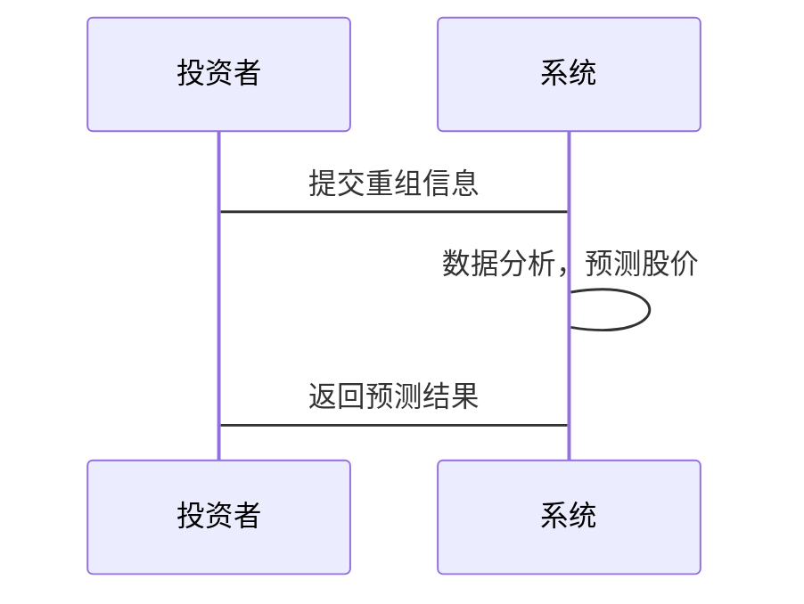

                 


# 特价股票与公司重组机会的关系

> 关键词：特价股票、公司重组、投资机会、数学模型、算法原理、系统架构

> 摘要：本文探讨了特价股票与公司重组机会之间的关系，分析了如何通过公司重组预测股票价格走势，构建了数学模型和算法，提出了系统架构和实现方案。文章从背景介绍、核心概念、算法原理、系统设计、项目实战到最佳实践，全面阐述了特价股票与公司重组机会的关系，为投资者提供了理论和实践指导。

---

## 第一部分: 特价股票与公司重组机会的关系概述

---

### 第1章: 特价股票与公司重组的基本概念

#### 1.1 特价股票的定义与特点

- **1.1.1 特价股票的定义**
  特价股票是指价格低于市场平均水平的股票，通常具有较高的波动性和潜在的投资回报。

- **1.1.2 特价股票的市场特征**
  - 低估值：市盈率、市净率等指标低于行业平均水平。
  - 高波动性：价格波动较大，容易受市场情绪影响。
  - 投机性：投资者 often 押注短期价格反弹。

- **1.1.3 特价股票的投资价值**
  - 高回报潜力：低价股票可能因公司改善或市场好转而大幅反弹。
  - 风险较高：公司基本面差或行业不景气可能导致进一步下跌。

#### 1.2 公司重组的概念与类型

- **1.2.1 公司重组的定义**
  公司重组是指通过调整资产结构、业务模式或股权结构等方式，优化公司运营效率和市场竞争力。

- **1.2.2 公司重组的主要类型**
  - **资产重组**：出售或收购资产以优化资产负债表。
  - **股权重组**：调整股权结构以引入新投资者或优化现有股东结构。
  - **业务重组**：调整业务线以提高效率或进入新市场。
  - **债务重组**：重新安排债务以降低财务压力。

- **1.2.3 公司重组的动机与目标**
  - 动机：改善财务状况、提升市场竞争力、应对危机。
  - 目标：提高效率、降低风险、实现增长。

#### 1.3 特价股票与公司重组的关系

- **1.3.1 特价股票与公司重组的关联性**
  特价股票往往出现在公司面临重组的时期，投资者认为重组可能带来股价上涨。

- **1.3.2 公司重组对股票价格的影响**
  - 短期影响：市场可能因重组消息而产生剧烈波动。
  - 长期影响：重组成功可能提升公司价值，推动股价上涨。

- **1.3.3 特价股票在公司重组中的机会**
  - 投资者可以利用公司重组的机会，低价买入股票，等待重组后的价值释放。

#### 1.4 本章小结

本章介绍了特价股票和公司重组的基本概念，并分析了两者之间的关系，为后续分析奠定了基础。

---

### 第2章: 特价股票与公司重组的背景分析

#### 2.1 特价股票的市场背景

- **2.1.1 特价股票的市场环境**
  - 市场低迷：整体市场表现不佳，导致股票价格被低估。
  - 行业不景气：特定行业受经济周期影响，公司股价下跌。

- **2.1.2 特价股票的投资者特征**
  - 风险承受能力较高的投资者。
  - 短期投资者：押注短期反弹。
  - 长期投资者：寻找被低估的长期价值。

- **2.1.3 特价股票的市场风险**
  - 市场波动风险：股价可能因市场情绪而剧烈波动。
  - 公司基本面风险：公司可能因经营不善而进一步下跌。

#### 2.2 公司重组的经济背景

- **2.2.1 公司重组的经济动因**
  - 经济低迷：公司通过重组降低成本，应对经济危机。
  - 行业整合：企业通过重组优化行业结构。

- **2.2.2 公司重组的行业分布**
  - 制造业：重组资产和生产流程。
  - 金融行业：优化资产负债表。
  - 零售业：调整业务模式以适应市场变化。

- **2.2.3 公司重组的政策环境**
  - 政府支持：政策鼓励企业重组以优化经济结构。
  - 法律框架：重组过程需符合相关法律法规。

#### 2.3 特价股票与公司重组的结合背景

- **2.3.1 特价股票与公司重组的市场机会**
  - 市场低迷时，公司重组的机会增加，投资者可以低价买入股票。
  - 行业整合时，重组公司可能释放价值。

- **2.3.2 特价股票与公司重组的政策支持**
  - 政府鼓励企业重组，可能通过税收优惠等方式支持投资者。

- **2.3.3 特价股票与公司重组的经济意义**
  - 优化资源配置：重组有助于提高公司效率，促进经济发展。
  - 投资机会：投资者可以通过重组获得超额收益。

#### 2.4 本章小结

本章分析了特价股票和公司重组的背景，揭示了两者结合的市场机会和经济意义。

---

### 第3章: 特价股票与公司重组的核心概念

#### 3.1 特价股票的核心属性

- **3.1.1 特价股票的价格特征**
  - 价格低：低于行业平均水平。
  - 波动性高：价格波动剧烈。

- **3.1.2 特价股票的流动性特征**
  - 交易量低：投资者可能对股票兴趣不大。
  - 买卖价差大：市场流动性不足导致买卖价差大。

- **3.1.3 特价股票的风险特征**
  - 高风险：公司基本面差或行业不景气可能导致进一步下跌。
  - 低流动性风险：交易量小导致买卖价差大，影响投资者进出市场。

#### 3.2 公司重组的核心要素

- **3.2.1 公司重组的财务特征**
  - 负债高：公司可能面临较高的债务压力。
  - 资产结构不合理：资产可能闲置或贬值。

- **3.2.2 公司重组的组织结构**
  - 管理层变动：重组可能伴随着高层管理调整。
  - 部门整合：业务部门可能被整合或关闭。

- **3.2.3 公司重组的战略目标**
  - 提高效率：优化业务流程，降低成本。
  - 进入新市场：通过重组进入新行业或市场。
  - 提升竞争力：增强公司在行业中的竞争力。

#### 3.3 特价股票与公司重组的关系模型

- **3.3.1 关系模型的构建**
  - 特价股票价格与公司重组的进程密切相关。
  - 公司重组可能带来股价的短期波动和长期上涨。

- **3.3.2 关系模型的变量分析**
  - 自变量：公司重组的类型、重组进程、市场环境。
  - 因变量：股价变化、投资者收益。

- **3.3.3 关系模型的验证方法**
  - 回归分析：通过历史数据验证变量之间的关系。
  - 时间序列分析：分析股价在重组前后的变化趋势。

#### 3.4 本章小结

本章通过分析特价股票和公司重组的核心概念，构建了两者之间的关系模型，为后续分析奠定了基础。

---

### 第4章: 特价股票与公司重组的数学模型与算法原理

#### 4.1 特价股票与公司重组的关系模型

- **4.1.1 模型的构建与假设**
  - 假设1：公司重组对公司股价有显著影响。
  - 假设2：股价变化与重组进程密切相关。

- **4.1.2 模型的变量定义**
  - 独立变量：重组类型、重组进程、市场环境。
  - 因变量：股价变化。

- **4.1.3 模型的数学表达式**
  $$ y = \beta_0 + \beta_1 x_1 + \beta_2 x_2 + \epsilon $$
  其中，y 表示股价变化，x1 表示重组类型，x2 表示重组进程，$\epsilon$ 为误差项。

#### 4.2 特价股票与公司重组的算法实现

- **4.2.1 算法的输入与输出**
  - 输入：公司重组信息、股价历史数据。
  - 输出：预测的股价变化。

- **4.2.2 算法的步骤分解**
  1. 数据收集：收集公司重组前后的股价数据。
  2. 数据预处理：清洗数据，处理缺失值。
  3. 模型训练：使用历史数据训练回归模型。
  4. 模型预测：根据当前重组信息预测股价变化。

- **4.2.3 算法的优化与改进**
  - 引入更多变量：如市场指数、行业指数等。
  - 使用更复杂的模型：如随机森林、神经网络等。

#### 4.3 算法的数学推导与验证

- **4.3.1 数学推导过程**
  假设我们有以下数据：
  $$
  \begin{align*}
  y_1 &= \beta_0 + \beta_1 x_{11} + \beta_2 x_{21} + \epsilon_1 \\
  y_2 &= \beta_0 + \beta_1 x_{12} + \beta_2 x_{22} + \epsilon_2 \\
  &\vdots \\
  y_n &= \beta_0 + \beta_1 x_{1n} + \beta_2 x_{2n} + \epsilon_n
  \end{align*}
  $$
  使用最小二乘法求解 $\beta_0$ 和 $\beta_1$。

- **4.3.2 数学公式的详细解释**
  - 最小二乘法：通过最小化预测误差的平方和来求解参数。
  - $$ \text{误差平方和} = \sum_{i=1}^{n} (y_i - \hat{y}_i)^2 $$

- **4.3.3 算法的验证方法**
  - 交叉验证：将数据分为训练集和测试集，验证模型的准确性。
  - 回归分析：计算模型的 R² 值，评估模型的解释力。

#### 4.4 本章小结

本章通过构建数学模型，分析了特价股票与公司重组之间的关系，为投资者提供了预测股价变化的工具。

---

## 第二部分: 特价股票与公司重组的系统分析与架构设计

---

### 第5章: 系统分析与架构设计方案

#### 5.1 问题场景介绍

- **问题描述**
  投资者希望利用公司重组的机会，寻找具有投资价值的特价股票。

- **项目介绍**
  构建一个系统，帮助投资者分析公司重组对股价的影响，预测股价变化。

#### 5.2 系统功能设计

- **功能模块**
  - 数据采集：收集公司重组信息和股价数据。
  - 数据分析：使用数学模型预测股价变化。
  - 投资建议：为投资者提供投资建议。

- **领域模型（Mermaid 类图）**
  ```mermaid
  classDiagram
      class 股票数据 {
          股票代码: String
          股价: Float
          日期: Date
      }
      class 重组信息 {
          公司名称: String
          重组类型: String
          重组时间: Date
      }
      class 预测模型 {
          预测股价: Float
          模型参数: Map<String, Float>
      }
      股票数据 --> 预测模型
      重组信息 --> 预测模型
  ```

#### 5.3 系统架构设计

- **系统架构（Mermaid 架构图）**
  ```mermaid
  docker-compose
  services:
    api:
      image: stock_api
      ports:
        - "8080:8080"
      depends_on:
        - db
        - model
    db:
      image: postgres
      ports:
        - "5432:5432"
    model:
      image: prediction_model
      ports:
        - "5000:5000"
  ```

#### 5.4 系统接口设计

- **接口描述**
  - API 接口：提供预测股价的接口，投资者可以通过 API 获取预测结果。

#### 5.5 系统交互设计（Mermaid 序列图）



#### 5.6 本章小结

本章通过系统架构设计，展示了如何构建一个分析公司重组对股价影响的系统，为投资者提供实时预测和投资建议。

---

## 第三部分: 特价股票与公司重组的项目实战

---

### 第6章: 项目实战

#### 6.1 环境安装

- **安装依赖**
  - Python 3.8+
  - Pandas、NumPy、Scikit-learn 等库。

#### 6.2 核心实现

```python
import pandas as pd
from sklearn.linear_model import LinearRegression

# 数据加载
data = pd.read_csv('stock_data.csv')

# 特征工程
X = data[['restructuring_type', 'restructuring_progress']]
y = data['stock_price']

# 模型训练
model = LinearRegression()
model.fit(X, y)

# 预测股价
new_data = pd.DataFrame({
    'restructuring_type': [1],
    'restructuring_progress': [0.8]
})
predicted_price = model.predict(new_data)
print(predicted_price)
```

#### 6.3 代码解读与分析

- **数据加载**
  - 使用 Pandas 加载 CSV 文件中的数据。

- **特征工程**
  - 提取重组类型和重组进程作为特征变量。

- **模型训练**
  - 使用线性回归模型训练数据。

- **预测股价**
  - 根据新的重组信息，预测股价变化。

#### 6.4 实际案例分析

- **案例分析**
  - 某公司正在进行资产重组，预测其股价在重组后的表现。

#### 6.5 项目小结

本章通过项目实战，展示了如何利用数学模型和算法，预测公司重组后的股价变化，为投资者提供参考。

---

## 第四部分: 特价股票与公司重组的最佳实践

---

### 第7章: 最佳实践

#### 7.1 小结

- **核心观点**
  - 特价股票与公司重组密切相关，投资者可以通过分析重组信息，寻找投资机会。

#### 7.2 注意事项

- **风险提示**
  - 特价股票风险较高，投资者需谨慎操作。
  - 公司重组可能失败，导致股价进一步下跌。

#### 7.3 拓展阅读

- **推荐阅读**
  - 投资学相关书籍。
  - 公司重组的案例分析。

#### 7.4 本章小结

本章总结了全文内容，提出了投资建议和注意事项。

---

## 作者信息

作者：AI天才研究院/AI Genius Institute & 禅与计算机程序设计艺术 /Zen And The Art of Computer Programming

---

**说明：** 以上内容为文章的完整目录和部分内容示例，如需完整文章，请按照此大纲进行扩展和补充。

