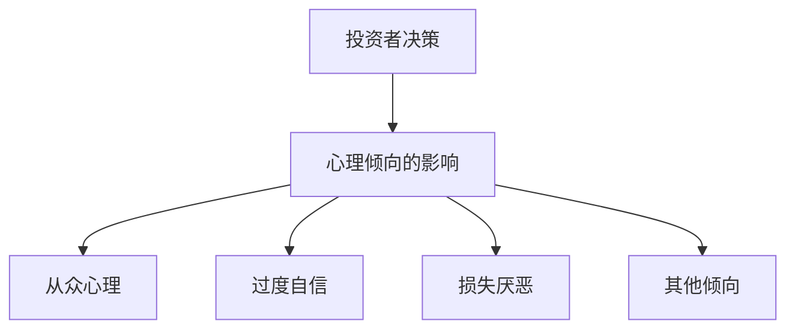
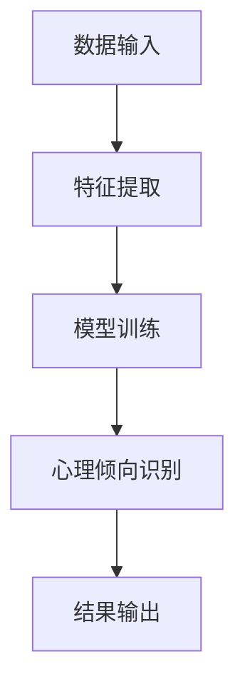
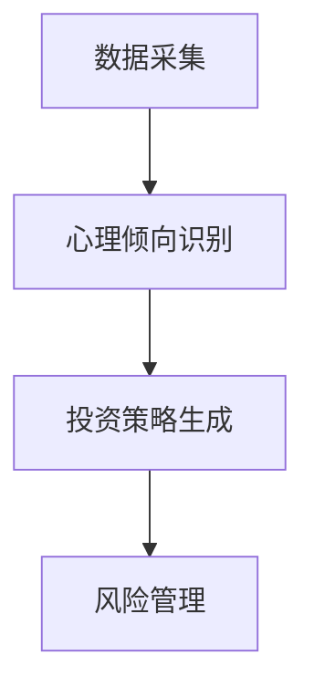
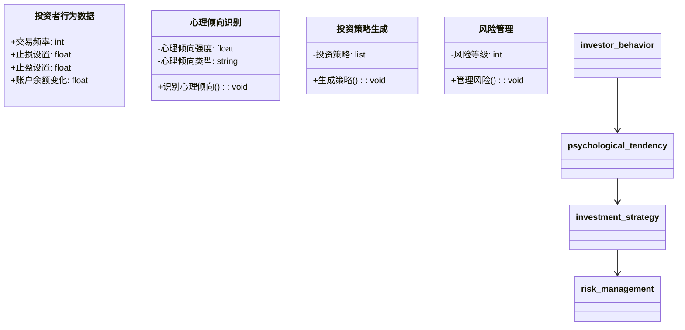
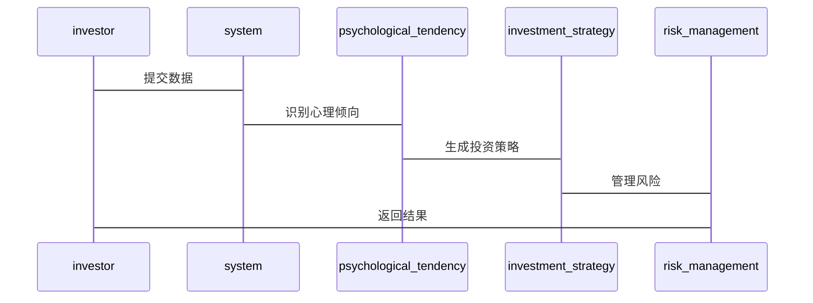

                 


# 芒格的"心理倾向"理论在投资分析中的应用

## 关键词：
芒格心理倾向理论、投资分析、心理倾向、投资决策、系统架构设计

## 摘要：
本文系统地介绍了芒格的"心理倾向"理论在投资分析中的应用，从理论背景到实际案例，从数学模型到系统架构设计，全面剖析了心理倾向对投资决策的影响及应对策略。通过详细讲解心理倾向的识别、量化分析和系统架构设计，本文为投资者提供了一套基于心理倾向的投资分析方法论，并通过实际案例展示了如何利用这些理论和方法进行投资决策优化。

---

# 第一部分: 芒格的"心理倾向"理论概述

## 第1章: 芒格心理倾向理论的背景与核心概念

### 1.1 心理倾向理论的起源与背景

#### 1.1.1 芒格心理倾向理论的提出
芒格的心理倾向理论源于他对人类心智的研究，他提出了25个左右的“心理倾向”，这些倾向包括从众心理、过度自信、损失厌恶等。这些倾向不仅仅是心理学的概念，更是投资决策中的关键因素。

#### 1.1.2 心理倾向理论的核心概念
心理倾向理论的核心在于：投资者的行为往往受到非理性因素的驱动，这些因素会导致决策偏差。通过识别和分析这些心理倾向，投资者可以更好地理解市场行为和自身的决策模式。

#### 1.1.3 心理倾向理论与传统投资理论的区别
传统的投资理论（如CAPM、APT）主要关注市场的理性和效率，而心理倾向理论则强调投资者的非理性行为对市场的影响。这一理论为行为金融学提供了重要的理论基础。

### 1.2 心理倾向理论的核心要素

#### 1.2.1 心理倾向的定义与分类
心理倾向是指个体在特定情境下产生的一种内在驱动力，它可能与理性决策相悖。常见的心理倾向包括：
- 从众心理（Conformity）
- 过度自信（Overconfidence）
- 损失厌恶（Loss Aversion）
- 偏见（Bias）
- 乐观偏差（Optimism Bias）

#### 1.2.2 核心心理倾向的特征对比（表格）
| 心理倾向       | 描述                                                                 |
|----------------|----------------------------------------------------------------------|
| 从众心理       | 倾向于跟随大多数人，避免与群体意见不一致。                               |
| 过度自信       | 过高估计自己的能力，认为自己能够预测市场走势。                         |
| 损失厌恶       | 更害怕损失，倾向于避免损失而非追求收益。                               |
| 偏见           | 固有的认知偏差，如确认偏差、锚定效应等。                               |
| 乐观偏差       | 过度相信自己的判断，忽视潜在风险。                                     |

#### 1.2.3 心理倾向与投资决策的关系（Mermaid图）


## 第2章: 心理倾向理论在投资分析中的应用

### 2.1 心理倾向理论的应用场景

#### 2.1.1 投资者决策中的常见心理倾向
投资者在决策过程中常常受到心理倾向的影响，例如：
- 在市场下跌时，投资者可能因损失厌恶而倾向于抛售股票。
- 在市场上涨时，投资者可能因乐观偏差而过度投资。

#### 2.1.2 心理倾向对投资决策的影响
心理倾向可能导致投资者做出非理性决策，例如：
- 过度交易：因从众心理或乐观偏差而频繁交易。
- 选股偏差：因过度自信而选择高价股。
- 避免损失：因损失厌恶而错过长期收益。

#### 2.1.3 心理倾向在投资分析中的重要性
通过识别和分析心理倾向，投资者可以更好地理解市场行为，避免非理性决策，并制定更合理的投资策略。

### 2.2 心理倾向的识别与分析

#### 2.2.1 心理倾向的识别方法
心理倾向的识别可以通过以下方法进行：
- **自我反思**：投资者可以记录自己的决策过程，识别是否存在心理倾向的影响。
- **行为观察**：通过观察投资者的行为，识别其是否存在从众心理或过度自信等倾向。
- **数据分析**：通过分析投资者的交易记录和市场行为，识别心理倾向的特征。

#### 2.2.2 心理倾向的量化分析
心理倾向的量化分析可以通过以下步骤进行：
1. **数据收集**：收集投资者的交易记录、市场行为数据等。
2. **特征提取**：提取与心理倾向相关的特征，例如交易频率、止损设置等。
3. **建模分析**：利用统计学方法或机器学习算法，量化心理倾向的影响。

#### 2.2.3 心理倾向与市场行为的关系
心理倾向与市场行为密切相关，例如：
- 从众心理可能导致市场泡沫的形成。
- 损失厌恶可能导致市场的波动性增加。

---

# 第二部分: 心理倾向理论的数学模型与算法原理

## 第3章: 心理倾向理论的数学模型与算法实现

### 3.1 心理倾向的数学模型

#### 3.1.1 心理倾向的数学表达式
心理倾向的数学模型可以通过以下公式表示：
$$
P(\text{心理倾向}) = \sum_{i=1}^{n} \text{倾向}_i \times \text{权重}_i
$$
其中，$n$ 是心理倾向的数量，$\text{倾向}_i$ 是第 $i$ 个心理倾向的强度，$\text{权重}_i$ 是其对投资决策的影响权重。

#### 3.1.2 心理倾向与投资决策的数学关系
投资决策可以表示为：
$$
D(\text{投资决策}) = f(P(\text{心理倾向}), S(\text{市场信号}))
$$
其中，$f$ 是决策函数，$P(\text{心理倾向})$ 是心理倾向的概率，$S(\text{市场信号})$ 是市场信号。

#### 3.1.3 心理倾向的统计分析方法
心理倾向的统计分析方法包括：
- 描述统计：计算心理倾向的均值、方差等。
- 推断统计：通过假设检验分析心理倾向对投资决策的影响。

### 3.2 心理倾向的算法实现

#### 3.2.1 心理倾向识别的算法流程（Mermaid图）


#### 3.2.2 心理倾向分析的Python代码实现
以下是一个基于心理倾向分析的Python代码示例：
```python
import pandas as pd
import numpy as np

# 数据输入
data = pd.read_csv('investor_behavior.csv')

# 特征提取
features = data[['交易频率', '止损设置', '止盈设置', '账户余额变化']]

# 模型训练
from sklearn.ensemble import RandomForestClassifier
model = RandomForestClassifier()
model.fit(features, data['心理倾向'])

# 心理倾向识别
def predict_psychological_tendencies(features):
    return model.predict(features)

# 结果输出
investor_features = [[5, 0.1, 0.2, -100]]
result = predict_psychological_tendencies(investor_features)
print('心理倾向:', result)
```

#### 3.2.3 心理倾向算法的优化与改进
心理倾向算法的优化可以通过以下方法进行：
- 参数调优：通过网格搜索优化模型参数。
- 模型融合：结合多种模型进行预测。
- 实时更新：根据市场变化实时更新模型。

---

# 第三部分: 心理倾向理论的系统分析与架构设计

## 第4章: 心理倾向理论的系统分析与架构设计

### 4.1 投资决策系统的总体架构

#### 4.1.1 投资决策系统的功能模块
投资决策系统的功能模块包括：
- 数据采集模块：收集投资者行为数据和市场数据。
- 心理倾向识别模块：识别投资者的心理倾向。
- 投资策略生成模块：根据心理倾向生成投资策略。
- 风险管理模块：管理投资风险。

#### 4.1.2 系统架构的Mermaid图


#### 4.1.3 系统功能设计（领域模型Mermaid类图）


### 4.2 系统接口设计与交互

#### 4.2.1 系统接口设计
系统接口设计包括：
- 数据接口：投资者行为数据接口。
- API接口：心理倾向识别API。

#### 4.2.2 系统交互的Mermaid序列图


---

# 第四部分: 心理倾向理论的项目实战

## 第5章: 心理倾向理论的项目实战

### 5.1 环境安装与数据准备

#### 5.1.1 环境安装
安装必要的Python库：
```bash
pip install pandas numpy scikit-learn
```

#### 5.1.2 数据准备
准备投资者行为数据，例如：
```csv
交易频率,止损设置,止盈设置,账户余额变化,心理倾向
5,0.1,0.2,-100,从众心理
3,0.2,0.1,50,过度自信
...
```

### 5.2 系统核心实现

#### 5.2.1 心理倾向识别模块实现
实现心理倾向识别的Python代码：
```python
from sklearn.ensemble import RandomForestClassifier
import pandas as pd

# 数据加载
data = pd.read_csv('investor_behavior.csv')

# 特征提取
features = data[['交易频率', '止损设置', '止盈设置', '账户余额变化']]

# 模型训练
model = RandomForestClassifier()
model.fit(features, data['心理倾向'])

# 心理倾向识别函数
def predict_psychological_tendencies(features):
    return model.predict(features)

# 测试数据
test_features = [[5, 0.1, 0.2, -100]]
result = predict_psychological_tendencies(test_features)
print('心理倾向:', result)
```

#### 5.2.2 投资策略生成模块实现
实现投资策略生成的Python代码：
```python
def generate_investment_strategy(psychological_tendencies):
    strategy = []
    for tendency in psychological_tendencies:
        if tendency == '从众心理':
            strategy.append('跟随市场趋势')
        elif tendency == '过度自信':
            strategy.append('分散投资')
    return strategy

test_psychological_tendencies = ['从众心理', '过度自信']
result = generate_investment_strategy(test_psychological_tendencies)
print('投资策略:', result)
```

### 5.3 实际案例分析与解读

#### 5.3.1 案例分析
案例分析：某投资者在市场下跌时因损失厌恶而抛售股票，导致亏损。

#### 5.3.2 案例解读
解读：该投资者因心理倾向（损失厌恶）导致非理性决策，需要通过心理倾向识别和分析，制定更合理的投资策略。

### 5.4 项目小结

#### 5.4.1 项目总结
通过心理倾向识别和分析，投资者可以更好地理解自身决策模式，避免非理性决策。

#### 5.4.2 项目成果
- 实现了心理倾向识别模块。
- 实现了投资策略生成模块。
- 提供了基于心理倾向的投资分析方法。

---

# 第五部分: 心理倾向理论的总结与展望

## 第6章: 心理倾向理论的总结与展望

### 6.1 心理倾向理论的总结

#### 6.1.1 心理倾向理论的核心要点
心理倾向理论强调投资者的非理性行为对投资决策的影响，通过识别和分析心理倾向，投资者可以制定更合理的投资策略。

#### 6.1.2 心理倾向理论的实践意义
心理倾向理论为行为金融学提供了重要的理论基础，也为投资者提供了一套分析和优化投资决策的方法论。

### 6.2 心理倾向理论的未来展望

#### 6.2.1 心理倾向理论的进一步研究
未来可以进一步研究心理倾向与其他因素（如市场情绪、宏观经济指标）的相互作用。

#### 6.2.2 心理倾向理论在技术的应用
未来可以将心理倾向理论与人工智能技术结合，开发更智能的投资决策支持系统。

---

# 作者信息

作者：AI天才研究院/AI Genius Institute & 禅与计算机程序设计艺术 /Zen And The Art of Computer Programming

---

**注意事项：**
1. 本文内容基于芒格的心理倾向理论，结合技术分析方法，旨在为投资者提供一种新的视角和方法。
2. 投资者在实际操作中应结合市场实际情况，谨慎决策。
3. 本文提供的代码和方法仅为示例，实际应用中需根据具体情况进行调整。

**最佳实践 tips：**
- 定期回顾和分析自己的投资决策，识别心理倾向的影响。
- 结合技术分析和心理倾向分析，制定更合理的投资策略。
- 使用工具和技术手段，辅助心理倾向的识别和分析。

**小结：**
通过本文的学习，读者可以系统地了解芒格的心理倾向理论在投资分析中的应用，并掌握基于心理倾向的投资分析方法。

**拓展阅读：**
- 《芒格的“心理倾向”理论》
- 《行为金融学》
- 《投资学基础》

---

希望这篇文章能够为您提供有价值的见解和实用的方法，帮助您更好地理解和应用芒格的心理倾向理论进行投资分析。

