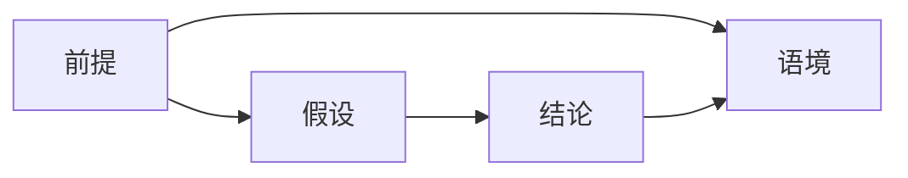

                 


# AI Agent的自然语言推理能力增强

> 关键词：AI Agent, 自然语言推理, 逻辑推理, 机器学习, 人工智能

> 摘要：本文系统地探讨了AI Agent的自然语言推理能力的增强方法，从背景、核心概念、算法原理、系统架构到项目实战和最佳实践，全面分析了如何提升AI Agent在自然语言推理方面的性能和能力。

---

# 第一部分: AI Agent的自然语言推理能力增强基础

# 第1章: 自然语言推理与AI Agent概述

## 1.1 自然语言推理的定义与背景

自然语言推理（Natural Language Inference, NLI）是人工智能领域中的一个核心任务，旨在通过理解文本的语义和逻辑关系，推断出文本之间的关系。AI Agent作为能够与人类交互的智能体，其自然语言推理能力是实现人机高效协作的关键。

### 1.1.1 自然语言推理的核心概念

自然语言推理的核心目标是理解文本的含义，并在此基础上进行逻辑推理。例如，在给定两个句子“今天下雨了”和“我带了伞”，AI Agent需要推断出“我需要带伞”的结论。

### 1.1.2 AI Agent在自然语言推理中的角色

AI Agent通过自然语言推理能力，可以更好地理解用户的需求和意图，从而提供更准确的服务。例如，在智能客服系统中，AI Agent需要通过推理用户的问题和上下文信息，提供合适的解决方案。

### 1.1.3 自然语言推理的应用场景

自然语言推理广泛应用于智能对话系统、文本分类、信息提取等领域。例如，在智能音箱中，AI Agent需要通过理解用户的指令，推理出具体的操作步骤。

## 1.2 AI Agent的定义与特点

AI Agent是一种智能体，能够感知环境并采取行动以实现目标。它具有自主性、反应性、目标导向性和社会性等特点。

### 1.2.1 AI Agent的基本定义

AI Agent是一个能够感知环境、采取行动并实现目标的智能实体。它可以与用户进行交互，理解需求并提供服务。

### 1.2.2 AI Agent的核心特点

- **自主性**：AI Agent可以在没有外部干预的情况下自主运行。
- **反应性**：AI Agent能够根据环境的变化调整其行为。
- **目标导向性**：AI Agent的行为旨在实现特定目标。
- **社会性**：AI Agent能够与其他智能体或人类进行交互。

### 1.2.3 AI Agent与传统程序的区别

AI Agent与传统程序的主要区别在于其自主性和智能性。传统程序通常按照固定的规则执行任务，而AI Agent能够根据环境和上下文做出动态决策。

## 1.3 自然语言推理的挑战与机遇

### 1.3.1 自然语言推理的挑战

- **语义理解的复杂性**：自然语言具有歧义性和模糊性，如何准确理解文本的含义是一个挑战。
- **逻辑推理的复杂性**：推理过程需要考虑多种逻辑关系，例如蕴含、矛盾、中立等。
- **数据和计算资源的需求**：训练高效的自然语言推理模型需要大量的数据和计算资源。

### 1.3.2 AI Agent在自然语言推理中的优势

AI Agent可以通过整合多种技术（如自然语言处理、机器学习）来提升自然语言推理能力。例如，结合知识图谱和上下文理解，AI Agent可以更准确地推理出文本的关系。

### 1.3.3 自然语言推理的未来发展方向

未来，自然语言推理将朝着更智能化、更个性化和更实用化的方向发展。例如，结合多模态数据（如图像、语音）进行推理，将使AI Agent在更多场景中发挥作用。

## 1.4 本章小结

本章介绍了自然语言推理的核心概念和AI Agent的基本特点，分析了自然语言推理的挑战与机遇，并展望了其未来的发展方向。这些内容为后续章节的深入探讨奠定了基础。

---

# 第二部分: 自然语言推理的核心概念与原理

# 第2章: 自然语言推理的核心概念

## 2.1 语义理解与推理的关系

### 2.1.1 语义理解的定义与特点

语义理解是自然语言处理的核心任务之一，旨在理解文本的深层含义。例如，理解“狗咬猫”不仅需要识别词语，还需要理解其语义关系。

### 2.1.2 推理的定义与特点

推理是基于已有的信息推导出新的结论的过程。在自然语言推理中，推理通常基于文本内容进行。

### 2.1.3 语义理解与推理的联系与区别

语义理解是推理的基础，推理是对语义理解的深化。两者相辅相成，共同构成了自然语言推理的核心能力。

## 2.2 自然语言推理的逻辑框架

### 2.2.1 推理的基本逻辑框架

自然语言推理通常基于蕴含、矛盾和中立三种关系。例如：
- “所有鸟都会飞”蕴含“鸵鸟会飞”。
- “所有鸟都会飞”与“鸵鸟不会飞”矛盾。
- “所有鸟都会飞”与“鱼会飞”中立。

### 2.2.2 自然语言推理的逻辑规则

自然语言推理的逻辑规则包括命题逻辑和谓词逻辑。例如，命题逻辑中，“如果A则B”是一个蕴含关系。

### 2.2.3 推理过程中的不确定性处理

在实际应用中，推理过程往往存在不确定性。例如，模糊逻辑和概率推理是常用的处理方法。

## 2.3 自然语言推理的属性特征对比

### 2.3.1 不同推理方法的特征对比

| 推理方法 | 确定性 | 复杂度 | 应用场景 |
|----------|--------|--------|----------|
| 命题逻辑 | 高     | 中     | 逻辑推理 |
| 概率推理 | 低     | 高     | 不确定性场景 |
| 模糊推理 | 低     | 中     | 模糊场景 |

### 2.3.2 不同模型的性能对比

| 模型类型 | 准确率 | 训练时间 | 资源需求 |
|----------|--------|----------|-----------|
| 传统逻辑 | 中     | 短       | 低         |
| 统计模型 | 高     | 长       | 高         |
| 深度学习 | 高     | 长       | 高         |

### 2.3.3 不同应用场景的需求对比

| 场景 | 数据需求 | 推理复杂度 | 对实时性的要求 |
|------|----------|------------|---------------|
| 智能音箱 | 中       | 中          | 高             |
| 智能客服 | 高       | 中          | 中             |
| 医疗咨询 | 高       | 高          | 高             |

## 2.4 自然语言推理的ER实体关系图



---

# 第三部分: 自然语言推理的算法原理

# 第3章: 自然语言推理的算法原理

## 3.1 基于编码器-解码器的推理模型

### 3.1.1 编码器-解码器的基本结构

编码器-解码器模型通常用于机器翻译任务，但在自然语言推理中也有应用。编码器将输入文本编码为向量表示，解码器根据编码向量生成输出。

### 3.1.2 注意力机制在推理中的应用

注意力机制可以帮助模型关注输入文本中的关键部分，从而提高推理的准确性。例如，在文本蕴含任务中，注意力机制可以聚焦于相关句子部分。

### 3.1.3 编码器-解码器的训练流程

1. 输入前处理：对输入文本进行分词、词向量化等预处理。
2. 编码阶段：将输入文本编码为向量表示。
3. 解码阶段：根据编码向量生成输出。
4. 损失计算：使用交叉熵等损失函数进行训练。
5. 模型优化：通过反向传播更新模型参数。

### 3.1.4 注意力机制的数学模型

注意力机制的计算公式如下：

$$
\text{Attention}(Q, K, V) = \text{softmax}\left(\frac{QK^T}{\sqrt{d_k}}\right)V
$$

其中，\( Q \) 是查询向量，\( K \) 是键向量，\( V \) 是值向量，\( d_k \) 是维度。

## 3.2 基于图结构的推理模型

### 3.2.1 图结构的基本概念

图结构可以用来表示实体之间的关系。例如，知识图谱中的节点表示实体，边表示实体之间的关系。

### 3.2.2 图神经网络在推理中的应用

图神经网络可以通过聚合邻居节点的信息，推断出节点之间的关系。例如，在知识图谱推理中，可以通过图神经网络推断实体之间的关系。

### 3.2.3 图结构推理模型的训练方法

1. 数据准备：构建知识图谱或语义图。
2. 模型训练：使用图神经网络进行训练。
3. 推理阶段：根据图结构推断实体之间的关系。

### 3.2.4 图神经网络的数学模型

图神经网络的聚合函数可以表示为：

$$
h_i^{(l+1)} = \text{aggregate}\left(\{h_j^{(l)} | j \in N(i)\}\right)
$$

其中，\( h_i^{(l+1)} \) 是节点 \( i \) 在第 \( l+1 \) 层的表示，\( N(i) \) 是节点 \( i \) 的邻居节点集合。

## 3.3 基于符号逻辑的推理模型

### 3.3.1 符号逻辑的基本概念

符号逻辑是基于符号和规则的推理方法。例如，使用命题逻辑或谓词逻辑进行推理。

### 3.3.2 符号逻辑在自然语言推理中的应用

符号逻辑可以用于形式化推理任务，例如法律文书分析和数学推理。

### 3.3.3 符号逻辑推理模型的训练方法

1. 规则制定：制定推理规则。
2. 数据准备：构建符合规则的训练数据。
3. 推理阶段：根据规则进行推理。

### 3.3.4 符号逻辑的数学模型

命题逻辑的蕴含关系可以表示为：

$$
A \rightarrow B
$$

其中，\( A \) 和 \( B \) 是命题。

---

# 第四部分: 系统分析与架构设计

# 第4章: 自然语言推理的系统架构设计

## 4.1 系统应用场景

AI Agent的自然语言推理能力可以应用于智能对话系统、智能客服、医疗咨询等领域。

## 4.2 系统功能设计

### 4.2.1 领域模型设计

领域模型需要涵盖实体、关系和事件等核心要素。例如，在医疗咨询中，实体包括疾病、症状、药物等。

### 4.2.2 系统架构设计

系统的架构设计通常包括数据输入、模型推理和结果输出三个部分。

## 4.3 系统架构图


---

# 第五部分: 项目实战

# 第5章: 自然语言推理的项目实战

## 5.1 项目环境安装

安装必要的依赖库，例如Python、TensorFlow、Keras等。

## 5.2 系统核心实现源代码

```python
import tensorflow as tf
from tensorflow.keras import layers

# 定义编码器
def encoder(input_shape):
    encoder_input = layers.Input(shape=input_shape)
    encoder_lstm = layers.LSTM(128)(encoder_input)
    return encoder_input, encoder_lstm

# 定义解码器
def decoder(encoder_output, input_length):
    decoder_input = layers.Input(shape=(input_length,))
    decoder_lstm = layers.LSTM(128)(decoder_input)
    decoder_dense = layers.Dense(1, activation='sigmoid')(decoder_lstm)
    return decoder_input, decoder_dense

# 组合模型
encoder_input, encoder_output = encoder((None, 100))
decoder_input, decoder_output = decoder(encoder_output, None)
model = tf.keras.Model(inputs=[encoder_input, decoder_input], outputs=decoder_output)
model.compile(optimizer='adam', loss='binary_crossentropy', metrics=['accuracy'])
```

## 5.3 代码应用解读与分析

上述代码定义了一个编码器-解码器模型，用于自然语言推理任务。编码器将输入文本编码为向量表示，解码器根据编码向量生成输出。

## 5.4 实际案例分析

以医疗咨询为例，AI Agent需要根据用户提供的症状，推断出可能的疾病。

## 5.5 项目小结

本章通过一个具体的项目实战，展示了如何实现自然语言推理能力。代码示例和案例分析帮助读者更好地理解理论知识。

---

# 第六部分: 最佳实践

# 第6章: 自然语言推理的最佳实践

## 6.1 小结

本文系统地探讨了AI Agent的自然语言推理能力的增强方法，从背景、核心概念、算法原理、系统架构到项目实战和最佳实践，全面分析了如何提升AI Agent在自然语言推理方面的性能和能力。

## 6.2 注意事项

- 数据质量对模型性能至关重要。
- 模型的选择需要根据具体场景进行调整。
- 推理过程中的不确定性需要适当处理。

## 6.3 拓展阅读

建议读者进一步阅读以下内容：
- 自然语言处理的经典论文。
- 最新的自然语言推理研究成果。

---

# 作者

作者：AI天才研究院/AI Genius Institute & 禅与计算机程序设计艺术 /Zen And The Art of Computer Programming

---

通过以上结构，我们可以看到，AI Agent的自然语言推理能力增强是一个复杂的任务，需要从多个角度进行分析和设计。希望本文能为相关领域的研究者和实践者提供有价值的参考。

