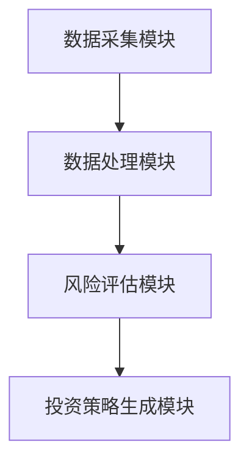

                 


# AI agents协作分析地缘政治风险：全球价值投资的必备工具

---

## 关键词
- AI代理
- 地缘政治风险
- 全球价值投资
- 算法原理
- 系统架构
- 项目实战

---

## 摘要
随着全球化进程的加速和国际形势的复杂化，地缘政治风险对全球价值投资的影响日益显著。传统的地缘政治风险分析方法依赖于人工经验和主观判断，难以应对快速变化的国际局势和海量信息的处理需求。AI代理作为人工智能领域的前沿技术，具备高效的数据处理能力、实时分析能力和协作能力，为地缘政治风险的分析与评估提供了新的解决方案。本文将系统阐述AI代理在地缘政治风险分析中的核心概念、算法原理、系统架构，并通过实际案例展示AI代理在全球价值投资中的应用，为投资者提供一种全新的风险管理工具。

---

# 第1章: 地缘政治风险与AI代理协作分析概述

## 1.1 地缘政治风险的定义与特征

### 1.1.1 地缘政治风险的定义
地缘政治风险是指由于政治、经济、军事、文化等多方面因素的变化，可能对国家、地区或企业利益造成不利影响的风险。这种风险通常与国际关系、主权争端、资源分配、政策变化等因素密切相关。

### 1.1.2 地缘政治风险的主要特征
- **复杂性**：地缘政治风险涉及多个利益相关者，具有多层次和多维度的特点。
- **不确定性**：风险的发生往往具有突发性和不可预测性。
- **长期性**：地缘政治风险的影响可能持续多年，甚至影响几代人。
- **连锁反应**：局部风险可能迅速扩散到全球范围，产生连锁反应。

### 1.1.3 地缘政治风险对企业的影响
- **经济损失**：企业可能因为政策变化、贸易限制、资源短缺等面临直接经济损失。
- **声誉风险**：企业在地缘政治冲突中的立场可能影响其品牌形象。
- **运营中断**：地缘政治冲突可能导致企业供应链中断、员工安全问题等。

## 1.2 全球价值投资的背景与挑战

### 1.2.1 全球价值投资的基本概念
全球价值投资是指投资者在全球范围内寻找被低估的资产或企业进行投资，以实现长期的超额收益。这种投资策略强调对公司基本面的深入分析和对市场估值的准确判断。

### 1.2.2 全球价值投资的主要挑战
- **信息不对称**：投资者需要获取全球范围内的多源信息，信息的获取和处理成本较高。
- **市场波动**：全球市场受多种因素影响，价格波动剧烈，增加了投资决策的难度。
- **地缘政治风险**：地缘政治冲突可能对投资标的的价值产生重大影响，增加投资风险。

### 1.2.3 地缘政治风险对全球价值投资的影响
地缘政治风险可能影响企业的经营环境、市场需求和政策支持，进而影响企业的财务表现和股票价格。投资者需要将地缘政治风险纳入投资决策，以避免重大损失。

## 1.3 AI代理在地缘政治风险分析中的作用

### 1.3.1 AI代理的基本概念
AI代理（Artificial Intelligence Agent）是指能够感知环境、自主决策并采取行动的智能实体。AI代理具备学习、推理、规划和自适应能力，能够在复杂环境中完成特定任务。

### 1.3.2 AI代理在地缘政治风险分析中的优势
- **高效性**：AI代理能够快速处理海量数据，提供实时的风险评估。
- **准确性**：通过机器学习和自然语言处理技术，AI代理能够从多源数据中提取有价值的信息，提高风险分析的准确性。
- **协作性**：多个AI代理可以协同工作，共同完成复杂的风险分析任务。

### 1.3.3 AI代理协作分析地缘政治风险的必要性
地缘政治风险的复杂性和不确定性要求投资者具备快速响应和精准判断的能力。AI代理通过协作分析，能够帮助投资者及时发现潜在风险，并制定应对策略。

## 1.4 本章小结
本章介绍了地缘政治风险的定义、特征及其对企业的影响，分析了全球价值投资面临的挑战，最后阐述了AI代理在地缘政治风险分析中的作用和必要性。

---

# 第2章: 地缘政治风险分析的核心概念

## 2.1 地缘政治风险分析的基本框架

### 2.1.1 地缘政治风险的构成要素
- **政治因素**：包括政府政策、选举、政治稳定性等。
- **经济因素**：包括经济制裁、贸易政策、资源分配等。
- **军事因素**：包括军事冲突、领土争端、军事合作等。
- **文化因素**：包括民族主义、宗教冲突、文化传播等。

### 2.1.2 地缘政治风险的分析维度
- **国家层面**：分析国家间的外交关系、军事部署、经济合作等。
- **区域层面**：分析地区冲突、资源争夺、恐怖主义等。
- **全球层面**：分析全球化背景下的地缘政治趋势和多边关系。

### 2.1.3 地缘政治风险的评估指标
- **风险概率**：评估某一地缘政治事件发生的可能性。
- **风险影响**：评估某一事件对企业或投资标的的影响程度。
- **风险缓解措施**：制定应对地缘政治风险的具体策略。

## 2.2 AI代理在地缘政治风险分析中的核心概念

### 2.2.1 AI代理协作的基本原理
AI代理通过协作完成复杂任务，通常包括以下几个步骤：
1. **感知环境**：通过数据采集和信息处理，获取地缘政治风险的相关数据。
2. **任务分解**：将复杂任务分解为多个子任务，分配给不同的AI代理完成。
3. **协同推理**：各AI代理通过信息共享和协同推理，完成风险分析。
4. **行动决策**：根据分析结果，制定应对策略并执行。

### 2.2.2 AI代理协作的实现机制
- **通信机制**：AI代理之间通过通信协议共享信息。
- **协调机制**：通过协调算法确保各代理的任务分配和协作效率。
- **决策机制**：基于多目标优化算法，制定最优的行动方案。

### 2.2.3 AI代理协作的优化策略
- **分布式计算**：通过分布式计算提高数据处理效率。
- **自适应学习**：利用机器学习算法，动态优化风险分析模型。
- **多模态数据融合**：结合文本、图像、语音等多种数据源，提高分析的全面性。

## 2.3 地缘政治风险与全球价值投资的关联

### 2.3.1 地缘政治风险对全球价值投资的影响路径
1. **直接影响**：地缘政治冲突可能直接导致投资标的的价值下降。
2. **间接影响**：通过影响市场情绪、政策变化等间接影响投资价值。
3. **连锁反应**：局部风险可能迅速扩散，影响全球市场。

### 2.3.2 地缘政治风险的量化与投资决策的关系
通过量化地缘政治风险，投资者可以更好地评估投资风险，制定合理的投资策略。

### 2.3.3 地缘政治风险的长期与短期影响
- **短期影响**：地缘政治事件可能导致市场短期波动。
- **长期影响**：长期的地缘政治不稳定可能影响经济结构和投资环境。

## 2.4 本章小结
本章详细阐述了地缘政治风险分析的核心概念，包括风险的构成要素、分析维度和评估指标，探讨了AI代理在地缘政治风险分析中的核心概念和优化策略，并分析了地缘政治风险与全球价值投资的关联。

---

# 第3章: AI代理协作分析地缘政治风险的算法原理

## 3.1 基于图论的地缘政治风险网络构建

### 3.1.1 图论的基本概念
图论是研究图的结构和性质的数学分支，广泛应用于网络分析、路径规划等领域。

### 3.1.2 地缘政治风险网络的构建
通过构建地缘政治风险网络，可以分析各国之间的关系和风险传导路径。

### 3.1.3 地缘政治风险网络的分析方法
- **网络中心性分析**：识别网络中的关键节点。
- **社区检测**：发现具有相似风险特征的国家或地区。

## 3.2 基于机器学习的地缘政治风险预测

### 3.2.1 机器学习的基本概念
机器学习是一种通过数据训练模型，使其能够从数据中学习规律并进行预测的技术。

### 3.2.2 地缘政治风险预测的机器学习模型
- **支持向量机（SVM）**：适用于分类问题。
- **随机森林（Random Forest）**：适用于特征重要性分析。
- **长短期记忆网络（LSTM）**：适用于时间序列预测。

### 3.2.3 机器学习模型的训练与优化
- **数据预处理**：清洗数据、特征选择。
- **模型训练**：使用训练数据训练模型。
- **模型优化**：通过交叉验证调整模型参数。

## 3.3 基于自然语言处理的地缘政治风险分析

### 3.3.1 自然语言处理的基本概念
自然语言处理（NLP）是研究计算机如何处理人类语言的技术。

### 3.3.2 地缘政治风险分析的NLP方法
- **情感分析**：分析新闻文本中的情感倾向。
- **实体识别**：识别文本中的国家、组织等实体。
- **事件抽取**：提取文本中的事件信息。

## 3.4 本章小结
本章详细介绍了基于图论、机器学习和自然语言处理的地缘政治风险分析算法，探讨了这些算法在AI代理协作中的应用。

---

# 第4章: AI代理协作分析地缘政治风险的系统架构设计

## 4.1 问题场景介绍

### 4.1.1 系统目标
设计一个基于AI代理协作的地缘政治风险分析系统，为全球价值投资者提供实时风险评估和投资建议。

### 4.1.2 系统需求
- 实时数据采集
- 多源数据融合
- 风险评估与预测
- 投资策略生成

## 4.2 系统功能设计

### 4.2.1 数据采集模块
- 数据来源：新闻、社交媒体、政府公告等。
- 数据类型：文本、图像、表格等。

### 4.2.2 数据处理模块
- 数据清洗：去除噪声数据。
- 数据融合：整合多源数据，构建统一的数据模型。

### 4.2.3 风险评估模块
- 风险预测：基于机器学习模型预测地缘政治风险。
- 风险量化：评估风险的概率和影响程度。

### 4.2.4 投资策略生成模块
- 策略生成：根据风险评估结果生成投资建议。
- 策略优化：动态调整投资策略，应对风险变化。

## 4.3 系统架构设计

### 4.3.1 系统架构图


### 4.3.2 模块交互流程
1. 数据采集模块从多源数据中采集地缘政治相关信息。
2. 数据处理模块对采集到的数据进行清洗和融合。
3. 风险评估模块基于处理后的数据，利用机器学习模型进行风险预测。
4. 投资策略生成模块根据风险评估结果，生成投资策略并输出建议。

## 4.4 本章小结
本章详细设计了基于AI代理协作的地缘政治风险分析系统的架构，包括功能模块设计和系统交互流程。

---

# 第5章: AI代理协作分析地缘政治风险的项目实战

## 5.1 项目背景

### 5.1.1 项目目标
开发一个基于AI代理协作的地缘政治风险分析系统，为全球价值投资者提供实时风险评估和投资建议。

### 5.1.2 项目需求
- 实时数据采集
- 多源数据融合
- 风险评估与预测
- 投资策略生成

## 5.2 项目环境安装

### 5.2.1 安装Python
```bash
# 安装Python
sudo apt-get install python3 python3-pip
```

### 5.2.2 安装依赖库
```bash
pip install numpy pandas scikit-learn
```

## 5.3 系统核心实现

### 5.3.1 数据采集模块实现
```python
import requests
import bs4

def fetch_data(url):
    response = requests.get(url)
    soup = bs4.BeautifulSoup(response.text, 'html.parser')
    return soup.text
```

### 5.3.2 数据处理模块实现
```python
import pandas as pd

def preprocess_data(data):
    df = pd.DataFrame(data)
    df = df.dropna()
    return df
```

### 5.3.3 风险评估模块实现
```python
from sklearn.svm import SVC
from sklearn.model_selection import train_test_split

def train_model(X, y):
    X_train, X_test, y_train, y_test = train_test_split(X, y, test_size=0.2)
    model = SVC()
    model.fit(X_train, y_train)
    return model
```

### 5.3.4 投资策略生成模块实现
```python
def generate_strategy(model, X):
    prediction = model.predict(X)
    return prediction
```

## 5.4 项目案例分析

### 5.4.1 数据采集与处理
假设我们从新闻网站和社交媒体获取地缘政治相关的文本数据，使用数据处理模块进行清洗和融合。

### 5.4.2 风险评估与预测
使用训练好的机器学习模型，对处理后的数据进行风险预测，并评估风险的概率和影响程度。

### 5.4.3 投资策略生成
根据风险评估结果，生成投资策略并输出建议，帮助投资者规避风险或抓住机会。

## 5.5 本章小结
本章通过实际案例展示了AI代理协作分析地缘政治风险的项目实现过程，包括环境安装、核心代码实现和案例分析。

---

# 第6章: 最佳实践与注意事项

## 6.1 最佳实践

### 6.1.1 数据质量管理
确保数据的准确性和完整性，避免噪声数据对分析结果的影响。

### 6.1.2 模型优化
通过交叉验证和超参数调优，提高机器学习模型的预测精度。

### 6.1.3 模型解释性
选择具有可解释性的模型，帮助投资者理解风险分析的结果。

## 6.2 注意事项

### 6.2.1 数据隐私
在数据采集和处理过程中，注意保护数据隐私，遵守相关法律法规。

### 6.2.2 模型鲁棒性
确保模型具备良好的鲁棒性，能够应对数据分布的变化。

### 6.2.3 人机协同
AI代理分析结果需要结合人类专家的判断，避免过度依赖算法。

## 6.3 拓展阅读

### 6.3.1 推荐书籍
- 《算法导论》
- 《机器学习实战》

### 6.3.2 推荐论文
- "A Survey on Geopolitical Risk Analysis"
- "Deep Learning for Text Analysis"

## 6.4 本章小结
本章总结了AI代理协作分析地缘政治风险的最佳实践，提出了相关注意事项，并为读者提供了拓展阅读的建议。

---

# 作者：AI天才研究院/AI Genius Institute & 禅与计算机程序设计艺术 /Zen And The Art of Computer Programming

