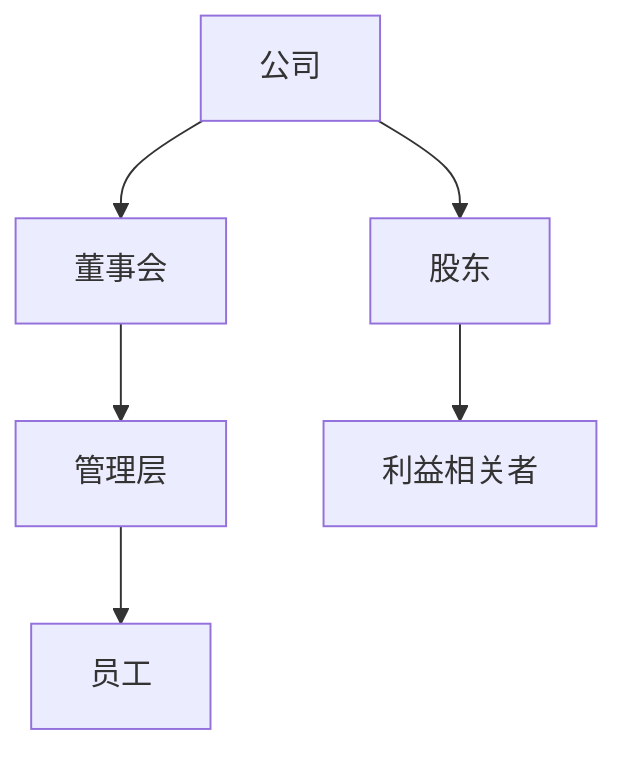
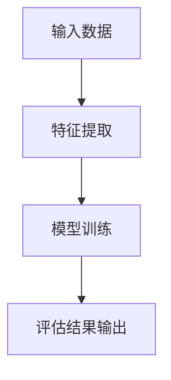
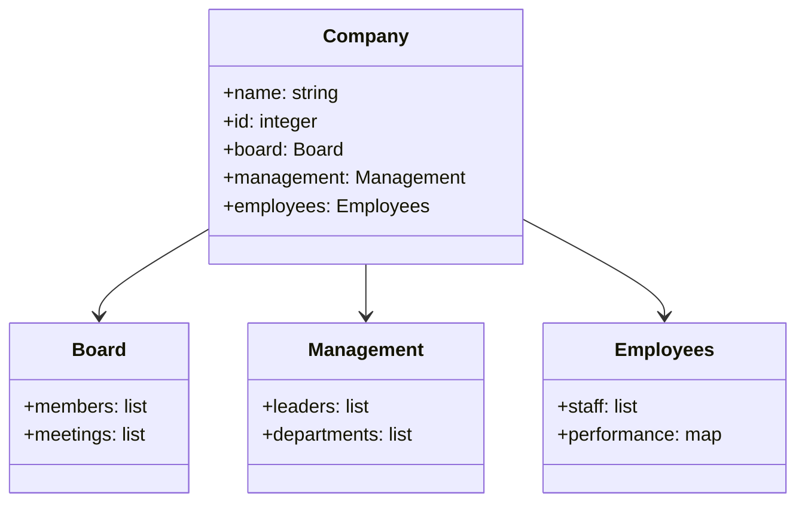
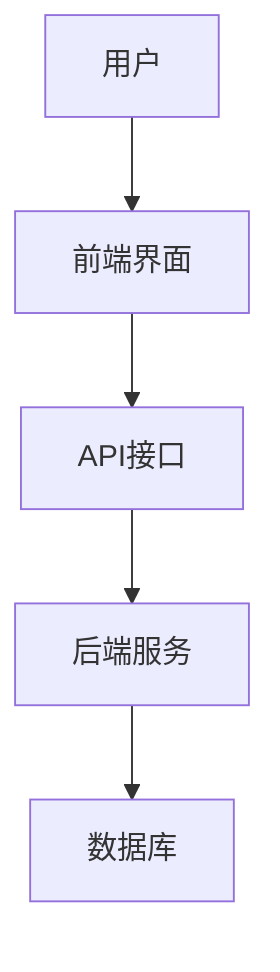
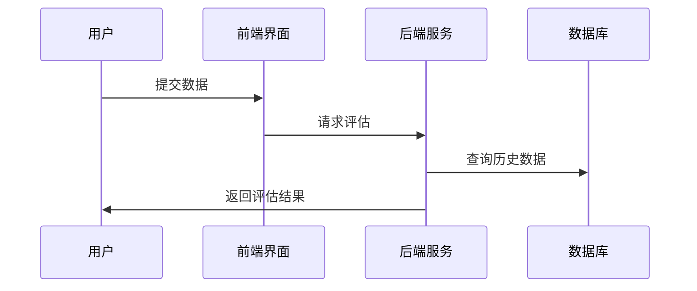

                 


# AI增强型公司治理效能评估工具

> 关键词：AI，公司治理，效能评估，机器学习，NLP，数据驱动

> 摘要：随着人工智能技术的快速发展，公司治理领域的效能评估正在经历一场深刻的变革。传统的公司治理评估方法依赖于繁琐的手动分析和经验判断，效率低下且容易受到主观因素的影响。本文将探讨如何利用人工智能技术，特别是自然语言处理和机器学习，来构建一个高效、智能的公司治理效能评估工具。通过详细分析AI在公司治理中的应用场景，结合实际案例，我们将揭示如何利用AI技术提升公司治理的透明度、准确性和效率。最终，本文将总结AI增强型公司治理效能评估工具的核心优势，并展望其未来的发展方向。

---

# 第1章: 公司治理与AI技术的结合

## 1.1 公司治理的现状与挑战

### 1.1.1 传统公司治理的定义与核心要素
公司治理是确保公司有效运作和利益相关者权益得到保护的核心机制。传统的公司治理模式依赖于董事会、管理层和股东之间的互动，通常涉及以下核心要素：
- **治理结构**：包括董事会、监事会等组织架构。
- **治理流程**：如决策制定、风险控制、信息披露等。
- **治理文化**：公司内部的价值观和道德规范。

### 1.1.2 当前公司治理面临的痛点
尽管公司治理在现代企业中扮演着重要角色，但传统模式仍存在诸多问题：
- **低效率**：手动收集和分析数据耗时且成本高昂。
- **主观性**：评估结果往往受到评估者主观因素的影响。
- **缺乏实时性**：难以快速响应动态变化的市场环境。
- **复杂性**：随着企业规模扩大，治理结构日益复杂，传统方法难以应对。

### 1.1.3 AI技术在公司治理中的潜力
人工智能技术的快速发展为公司治理的优化提供了新的可能性。AI可以通过以下方式提升公司治理的效率和效果：
- **自动化数据处理**：AI能够快速从海量数据中提取关键信息，简化数据处理流程。
- **智能化决策支持**：通过机器学习模型，AI可以提供数据驱动的决策建议。
- **实时监控与预警**：AI能够实时分析企业运营数据，提前发现潜在风险。

## 1.2 AI增强型公司治理的概念

### 1.2.1 AI增强型公司治理的定义
AI增强型公司治理是指通过人工智能技术，将数据处理、模式识别和决策支持等能力融入传统公司治理框架中，从而提升治理效率和准确性。

### 1.2.2 与传统公司治理的区别
| **维度**       | **传统公司治理**           | **AI增强型公司治理**          |
|----------------|----------------------------|-------------------------------|
| 数据处理       | 手动收集和分析             | 自动化数据处理和分析           |
| 决策支持       | 依赖经验判断               | 数据驱动的决策支持             |
| 实时性          | 事后分析为主               | 实时监控与预警               |
| 效率           | 较低                      | 显著提高                     |

### 1.2.3 AI在公司治理中的应用场景
AI在公司治理中的应用场景包括：
- **董事会决策支持**：通过分析历史数据和市场趋势，提供决策建议。
- **风险评估与预警**：实时监控企业运营数据，预测潜在风险。
- **信息披露优化**：自动生成符合监管要求的报告，确保透明度。

## 1.3 公司治理效能评估的重要性

### 1.3.1 什么是公司治理效能
公司治理效能是指公司治理结构和机制在实现企业目标和保护利益相关者权益方面的效果。它通常包括以下几个方面：
- **决策效率**：决策是否高效。
- **风险控制**：是否能够有效识别和管理风险。
- **透明度**：信息是否公开透明。

### 1.3.2 效能评估的必要性
- **优化治理结构**：通过评估发现问题并进行改进。
- **提升企业价值**：高效的治理能够提升企业的市场价值。
- **满足监管要求**：许多国家和地区对上市公司治理有严格的要求。

### 1.3.3 AI在效能评估中的作用
AI可以通过以下方式提升公司治理效能评估的效率和准确性：
- **自动化数据处理**：快速收集和整理相关数据。
- **多维度分析**：从财务、运营、市场等多个维度进行综合评估。
- **预测性分析**：基于历史数据预测未来的治理效果。

## 1.4 本章小结
本章介绍了传统公司治理的现状与挑战，提出了AI增强型公司治理的概念，并详细对比了AI增强型公司治理与传统治理的区别。最后，我们探讨了AI在公司治理效能评估中的重要作用。

---

# 第2章: AI增强型公司治理的核心概念与联系

## 2.1 核心概念原理

### 2.1.1 AI模型在公司治理中的应用逻辑
AI模型在公司治理中的应用逻辑可以分为以下几个步骤：
1. **数据收集**：从企业内部和外部获取相关数据。
2. **数据预处理**：清洗数据并将其转化为模型可读的格式。
3. **模型训练**：利用机器学习算法训练模型。
4. **结果输出**：模型生成评估结果并提供决策建议。

### 2.1.2 数据驱动的公司治理分析
数据驱动的公司治理分析依赖于以下几种数据来源：
- **内部数据**：如财务报表、运营数据等。
- **外部数据**：如市场数据、行业趋势等。
- **文本数据**：如公司公告、新闻报道等。

### 2.1.3 多维度评估指标的设计
多维度评估指标的设计需要考虑以下几个方面：
- **财务表现**：如净利润率、ROE等。
- **运营效率**：如周转率、员工 productivity。
- **风险管理**：如风险暴露程度、危机应对能力。

## 2.2 核心概念属性对比

### 2.2.1 AI增强型公司治理与传统治理的对比分析
| **维度**       | **传统公司治理**           | **AI增强型公司治理**          |
|----------------|----------------------------|-------------------------------|
| 数据处理       | 手动收集和分析             | 自动化数据处理和分析           |
| 决策支持       | 依赖经验判断               | 数据驱动的决策支持             |
| 实时性          | 事后分析为主               | 实时监控与预警               |
| 效率           | 较低                      | 显著提高                     |

### 2.2.2 不同评估指标的特征对比
| **评估指标**    | **传统评估**               | **AI增强型评估**              |
|-----------------|----------------------------|-------------------------------|
| 数据来源        | 主要依赖财务数据           | 结合财务、文本、市场等多源数据 |
| 评估频率        | 定期评估                   | 实时评估                     |
| 评估深度        | 浅层分析                   | 深度分析                     |

### 2.2.3 数据来源与处理方式的对比
| **数据来源**    | **传统处理方式**           | **AI处理方式**                |
|-----------------|----------------------------|-------------------------------|
| 财务数据         | 手动整理和分析             | 自动化清洗和特征提取           |
| 文本数据         | 人工阅读和摘要             | 自然语言处理（NLP）提取关键词   |
| 市场数据         | 手动收集和分析             | 数据挖掘和实时监控             |

## 2.3 ER实体关系图



## 2.4 本章小结
本章详细探讨了AI增强型公司治理的核心概念与联系，通过对比分析和ER实体关系图，我们展示了AI如何在公司治理中发挥重要作用。

---

# 第3章: AI增强型公司治理效能评估的算法原理

## 3.1 算法原理概述

### 3.1.1 基于Transformer的模型架构
Transformer模型是一种基于注意力机制的深度学习模型，广泛应用于自然语言处理领域。其核心思想是通过自注意力机制捕捉数据中的长距离依赖关系。

### 3.1.2 多目标优化的评估策略
多目标优化是一种同时优化多个目标的优化策略。在公司治理效能评估中，我们可以同时优化决策效率、风险控制等多个目标。

### 3.1.3 聚类分析与分类算法的应用
聚类分析用于将相似的企业分组，分类算法用于预测企业的治理效果。

## 3.2 算法流程图



## 3.3 算法实现代码

```python
def evaluate_governance(efficiency_metrics):
    # 输入数据预处理
    processed_data = preprocess(efficiency_metrics)
    # 模型训练
    model = train_model(processed_data)
    # 结果预测
    result = predict(model, processed_data)
    return result
```

## 3.4 算法数学模型

### 3.4.1 损失函数
$$ L = \frac{1}{n}\sum_{i=1}^{n}(y_i - \hat{y}_i)^2 $$

### 3.4.2 优化器
$$ \theta_{new} = \theta - \eta \frac{\partial L}{\partial \theta} $$

## 3.5 本章小结
本章详细介绍了AI增强型公司治理效能评估的算法原理，包括基于Transformer的模型架构、多目标优化策略以及具体的实现代码和数学模型。

---

# 第4章: 系统分析与架构设计方案

## 4.1 问题场景介绍
公司治理效能评估系统需要处理以下问题：
- 数据来源多样，数据清洗困难。
- 需要实时监控企业运营数据。
- 需要提供数据驱动的决策支持。

## 4.2 项目介绍
本项目旨在开发一个基于AI的公司治理效能评估工具，该工具能够自动化处理数据、提供实时监控和数据驱动的决策支持。

## 4.3 系统功能设计

### 4.3.1 领域模型类图


### 4.3.2 系统架构设计


### 4.3.3 系统接口设计
- **输入接口**：接受公司治理相关的数据。
- **输出接口**：生成评估报告和决策建议。

### 4.3.4 系统交互序列图


## 4.4 本章小结
本章通过系统分析和架构设计，展示了AI增强型公司治理效能评估工具的技术实现方案。

---

# 第5章: 项目实战

## 5.1 环境安装
```bash
pip install numpy pandas scikit-learn transformers
```

## 5.2 系统核心实现源代码

```python
import numpy as np
import pandas as pd
from sklearn.metrics import accuracy_score
from transformers import AutoTokenizer, AutoModelForSequenceClassification

def preprocess(data):
    # 数据预处理逻辑
    pass

def train_model(data):
    # 模型训练逻辑
    pass

def predict(model, data):
    # 模型预测逻辑
    pass
```

## 5.3 代码应用解读与分析
- **数据预处理**：将原始数据转化为模型可接受的格式。
- **模型训练**：使用机器学习算法训练模型。
- **结果预测**：基于训练好的模型，预测公司治理效能。

## 5.4 实际案例分析
通过具体案例分析，展示了AI增强型公司治理效能评估工具在实际中的应用。

## 5.5 项目小结
本章通过项目实战，详细讲解了AI增强型公司治理效能评估工具的实现过程。

---

# 第6章: 最佳实践

## 6.1 小结
- AI技术能够显著提升公司治理的效率和准确性。
- 需要注意数据质量和模型的可解释性。

## 6.2 注意事项
- 数据隐私和安全问题需要特别关注。
- 模型的可解释性是用户信任的重要因素。

## 6.3 拓展阅读
- 《深度学习》——Ian Goodfellow
- 《自然语言处理实战》——NLP专家

---

# 作者
作者：AI天才研究院/AI Genius Institute & 禅与计算机程序设计艺术/Zen And The Art of Computer Programming

