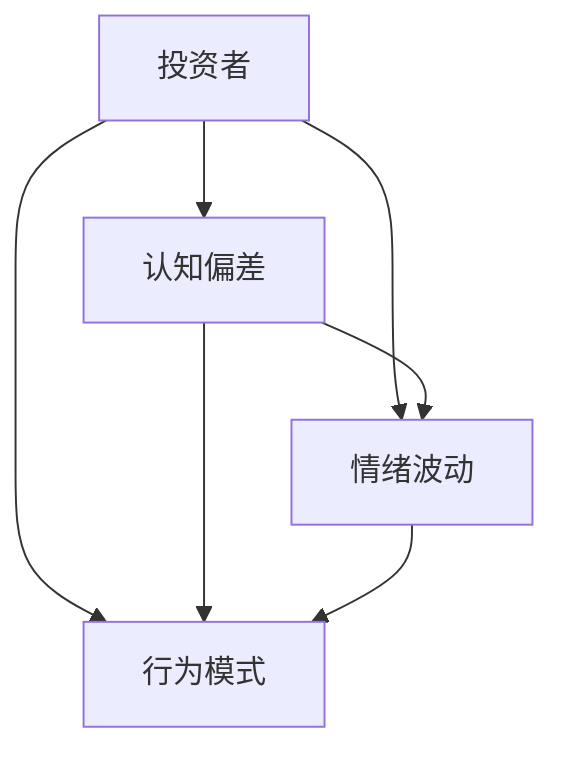
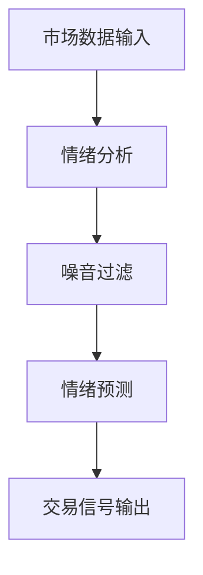
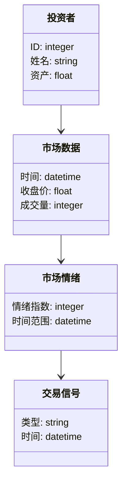
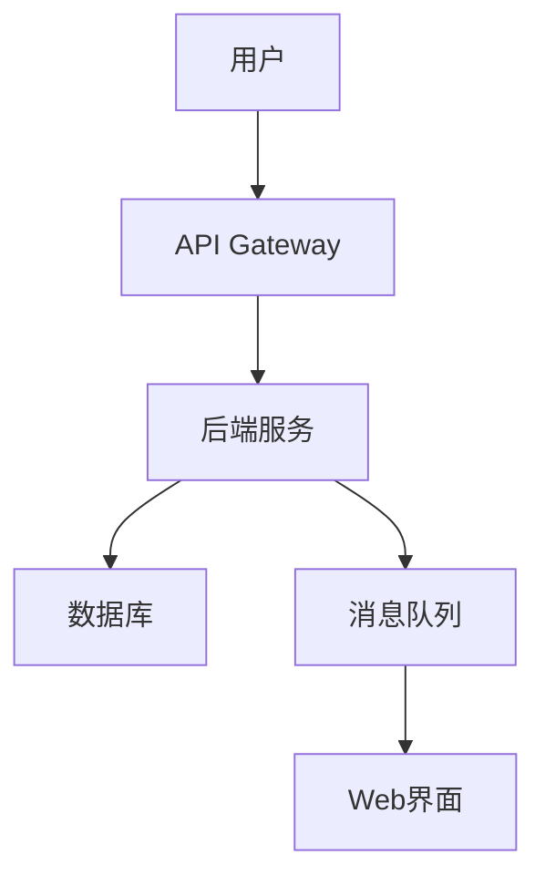
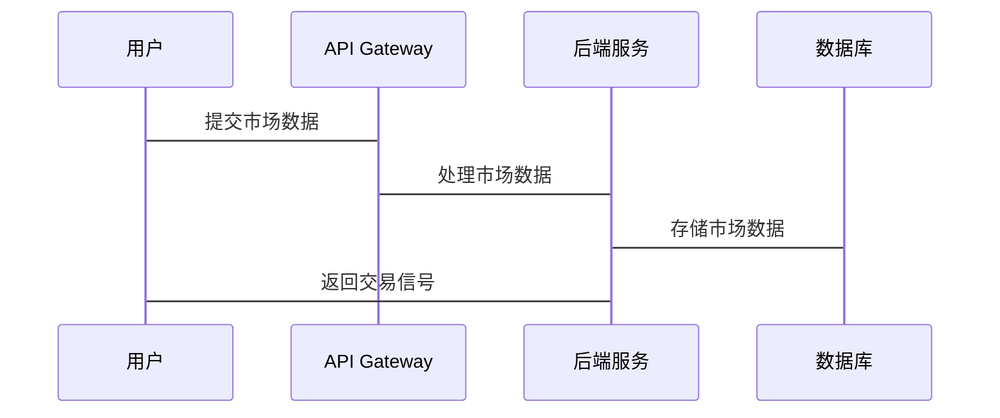

                 


# 价值投资中的心理因素：克服市场噪音

## 关键词：价值投资，心理因素，市场噪音，投资决策，情绪管理

## 摘要：  
价值投资是一种以基本面分析为核心的长期投资策略，但其成功与否不仅取决于对市场的理解和分析，更取决于投资者的心理状态和情绪管理。在市场中，噪音信息无处不在，这些信息往往干扰投资者的决策过程，导致非理性的投资行为。本文从心理因素的角度出发，深入分析认知偏差、情绪波动等心理因素对投资决策的影响，并探讨如何通过算法和系统设计来克服市场噪音，帮助投资者做出更理性的决策。

---

# 第1章: 价值投资与心理因素的背景介绍

## 1.1 价值投资的基本概念  
### 1.1.1 价值投资的定义  
价值投资是一种以分析企业的内在价值为基础的投资策略，强调以低于内在价值的价格买入优质资产，长期持有，等待市场的合理估值。其核心在于寻找被市场低估的公司，并通过时间的推移获得收益。  

### 1.1.2 价值投资的核心理念  
- **安全边际**：买入价格低于内在价值，以降低投资风险。  
- **长期视角**：关注企业的长期盈利能力，而非短期市场波动。  
- **逆向思维**：在市场恐慌时寻找机会，在市场狂热时保持冷静。  

### 1.1.3 价值投资与市场噪音的关系  
市场噪音（如媒体炒作、市场传言）常常干扰投资者的决策，导致短期情绪波动。价值投资者需要过滤这些噪音，专注于企业的基本面，避免被市场情绪左右。

## 1.2 心理因素在投资中的重要性  
### 1.2.1 投资者心理的基本构成  
投资者的心理由认知、情感和行为模式三部分构成：  
1. **认知**：投资者对市场的理解和判断。  
2. **情感**：情绪波动对决策的影响。  
3. **行为模式**：基于认知和情感的决策行为。  

### 1.2.2 心理因素对投资决策的影响  
- **认知偏差**：投资者倾向于相信自己是对的，忽视反面信息。  
- **情绪波动**：市场下跌时的恐慌、上涨时的贪婪，影响理性决策。  
- **行为模式**：习惯性行为可能导致盲目跟风或过度保守。  

### 1.2.3 价值投资中的常见心理陷阱  
1. **过度自信**：认为自己能准确预测市场走势。  
2. **从众心理**：跟随市场潮流，忽视独立判断。  
3. **损失厌恶**：对潜在亏损的过度关注，导致错失投资机会。  

## 1.3 市场噪音的定义与特征  
### 1.3.1 市场噪音的定义  
市场噪音是指那些对市场实际价值影响不大，但可能引起短期波动的信息，例如媒体炒作、市场传言、情绪化评论等。  

### 1.3.2 市场噪音的来源  
1. **媒体传播**：新闻、社交媒体等渠道的不实信息。  
2. **投资者情绪**：市场参与者的情绪化言论。  
3. **市场谣言**：未经证实的信息传播。  

### 1.3.3 市场噪音对投资者的影响  
- **干扰判断**：噪音信息可能导致投资者误判市场走势。  
- **情绪波动**：噪音引发的恐慌或兴奋情绪影响理性决策。  
- **交易成本**：频繁交易增加佣金等成本。  

## 1.4 价值投资中的心理因素框架  
### 1.4.1 心理因素的分类  
1. **认知因素**：包括知识水平、信息处理能力等。  
2. **情感因素**：包括贪婪、恐惧、焦虑等情绪。  
3. **行为因素**：包括决策风格、交易频率等。  

### 1.4.2 心理因素之间的相互作用  
认知偏差和情绪波动共同作用，可能导致投资者低估风险或过度冒险。例如，过度自信的认知偏差可能导致投资者忽视潜在风险，而贪婪的情绪则可能使其追涨杀跌。  

### 1.4.3 心理因素与市场噪音的关系  
市场噪音通过影响投资者的认知和情绪，进而影响其行为。例如，负面噪音可能导致投资者产生恐惧情绪，从而做出卖出决策。  

## 1.5 本章小结  
本章介绍了价值投资的基本概念、心理因素的重要性以及市场噪音的定义与特征。心理因素在投资决策中起着关键作用，而市场噪音则通过干扰投资者的认知和情绪，影响其理性决策。接下来，我们将深入分析心理因素的核心概念及其与市场噪音的关系。

---

# 第2章: 心理因素的核心概念与联系  

## 2.1 心理因素的核心概念  
### 2.1.1 认知偏差  
认知偏差是指人们在信息处理过程中产生的系统性错误。例如，**确认偏差**（confirmation bias）是指投资者倾向于寻找与自己观点一致的信息，而忽视反面证据。  

### 2.1.2 情绪波动  
情绪波动是投资者在面对市场波动时的常见反应，例如在市场下跌时产生恐慌情绪，在市场上涨时产生贪婪情绪。  

### 2.1.3 行为模式  
行为模式是指投资者在长期投资过程中形成的行为习惯，例如频繁交易或长期持有。  

## 2.2 心理因素的属性特征对比表  
以下表格对比了认知偏差、情绪波动和行为模式的属性特征：  

| 心理因素   | 主体性 | 时间稳定性 | 可控性 |  
|------------|--------|------------|--------|  
| 认知偏差    | 高     | 稳定       | 中     |  
| 情绪波动    | 高     | 不稳定     | 低     |  
| 行为模式    | 中     | 稳定       | 高     |  

## 2.3 心理因素的ER实体关系图  
以下是一个简单的ER实体关系图，展示了投资者心理因素之间的关系：  



## 2.4 本章小结  
本章通过对比分析，明确了认知偏差、情绪波动和行为模式的属性特征，并展示了它们之间的相互作用关系。认知偏差和情绪波动共同影响行为模式，进而影响投资决策。接下来，我们将探讨如何通过算法和系统设计来克服市场噪音的影响。

---

# 第3章: 克服市场噪音的算法原理  

## 3.1 基于情绪分析的交易信号生成  
### 3.1.1 情绪分析算法  
情绪分析算法通过对文本数据（如新闻、社交媒体评论）进行处理，判断市场情绪的正负。例如，使用自然语言处理（NLP）技术分析新闻标题的情绪倾向。  

### 3.1.2 市场情绪指数计算  
市场情绪指数是将市场情绪量化的一种指标，通常基于文本数据的情绪分析结果。例如，可以将市场情绪分为五个等级：极度恐慌、恐慌、中性、贪婪、极度贪婪。  

### 3.1.3 交易信号生成规则  
根据市场情绪指数生成交易信号：  
- 当市场情绪为“极度恐慌”时，生成买入信号。  
- 当市场情绪为“极度贪婪”时，生成卖出信号。  

## 3.2 市场噪音过滤算法  
### 3.2.1 基于统计的过滤方法  
基于统计的过滤方法通过分析数据的分布特征，剔除异常值。例如，使用均值-方差法剔除偏离正常波动范围的数据。  

### 3.2.2 基于机器学习的过滤方法  
基于机器学习的过滤方法通过训练模型识别噪音信息。例如，使用支持向量机（SVM）对新闻标题进行分类，剔除与市场无关的信息。  

### 3.2.3 基于时间序列的过滤方法  
基于时间序列的过滤方法通过分析数据的时间特征，识别周期性噪音。例如，使用ARIMA模型预测并剔除不符合预期的波动。  

## 3.3 市场情绪预测模型  
### 3.3.1 线性回归模型  
线性回归模型用于预测市场情绪指数。例如，建立以下模型：  
$$ y = \beta_0 + \beta_1x_1 + \beta_2x_2 + \cdots + \beta_nx_n + \epsilon $$  
其中，$y$是市场情绪指数，$x_i$是自变量（如历史情绪数据）。  

### 3.3.2 支持向量机模型  
支持向量机模型用于分类市场情绪。例如，将市场情绪分为“积极”、“消极”两类，并使用SVM进行分类。  

### 3.3.3 随机森林模型  
随机森林模型用于预测市场情绪，通过集成学习提高预测准确性。  

## 3.4 算法流程图  
以下是一个算法流程图，展示了从市场数据输入到交易信号输出的流程：  



## 3.5 本章小结  
本章介绍了基于情绪分析和机器学习的算法，展示了如何通过这些方法克服市场噪音，生成有效的交易信号。接下来，我们将深入分析系统的架构设计和实现细节。

---

# 第4章: 系统分析与架构设计  

## 4.1 问题场景介绍  
在价值投资中，投资者需要实时监控市场情绪，分析市场噪音，并做出理性的投资决策。为此，我们需要设计一个系统来实现这些功能。  

## 4.2 项目介绍  
本项目旨在开发一个克服市场噪音的投资决策支持系统，帮助投资者做出更理性的投资决策。  

## 4.3 系统功能设计  
### 4.3.1 领域模型类图  
以下是一个领域模型类图，展示了系统的主要功能模块：  



### 4.3.2 系统架构设计  
以下是一个系统架构设计图，展示了系统的模块划分：  



## 4.4 系统接口设计  
系统接口包括：  
1. 用户接口：提供市场数据输入和交易信号输出的界面。  
2. API接口：供其他系统调用的接口。  

## 4.5 系统交互序列图  
以下是一个系统交互序列图，展示了用户与系统的交互流程：  



## 4.6 本章小结  
本章通过系统分析与架构设计，展示了如何将克服市场噪音的理念转化为实际的系统实现。接下来，我们将通过项目实战部分，详细介绍系统的具体实现和应用案例。

---

# 第5章: 项目实战  

## 5.1 环境安装  
项目实战部分需要以下环境：  
1. Python 3.8及以上版本  
2. 必要的Python库（如pandas、numpy、scikit-learn、nltk）  

## 5.2 系统核心实现源代码  
以下是一个简单的Python代码示例，展示了如何实现市场情绪分析和交易信号生成：  

```python
import pandas as pd
from sklearn.svm import SVC
from sklearn.metrics import accuracy_score
import nltk

# 数据加载
data = pd.read_csv('market_data.csv')

# 情绪分析
nltk.download('vader_lexicon')
from nltk.sentiment import SentimentIntensityAnalyzer
sia = SentimentIntensityAnalyzer()
data['sentiment'] = data['news_headline'].apply(lambda x: sia.polarity_scores(x)['compound'])

# 噪音过滤
from sklearn.ensemble import IsolationForest
model = IsolationForest(contamination=0.1)
data['is_noise'] = model.fit_predict(data[['sentiment']])

# 市场情绪预测
X = data[['sentiment']]
y = data['is_noise']
model = SVC()
model.fit(X, y)

# 交易信号生成
data['交易信号'] = model.predict(X)
data.to_csv('output.csv', index=False)
```

## 5.3 代码应用解读与分析  
上述代码实现了以下功能：  
1. 数据加载：从CSV文件中读取市场数据。  
2. 情绪分析：使用自然语言处理技术分析新闻标题的情绪倾向。  
3. 噪音过滤：使用Isolation Forest算法剔除异常值。  
4. 市场情绪预测：使用SVM模型预测市场情绪。  
5. 交易信号生成：根据预测结果生成交易信号。  

## 5.4 实际案例分析  
以某次市场波动为例，分析系统的实际应用效果。例如，当市场情绪为“极度恐慌”时，系统生成买入信号，投资者可以据此买入低估资产。  

## 5.5 本章小结  
本章通过项目实战部分，展示了如何将理论应用于实际投资决策中。通过代码实现和案例分析，帮助投资者更好地理解和应用克服市场噪音的方法。

---

# 第6章: 最佳实践与总结  

## 6.1 最佳实践  
1. **情绪管理**：投资者应学会控制情绪，避免被市场噪音左右。  
2. **独立思考**：坚持独立判断，避免从众心理。  
3. **持续学习**：通过学习和实践提高自己的投资能力。  

## 6.2 投资中的心理陷阱  
- **过度自信**：认为自己能预测市场走势。  
- **从众心理**：跟随市场潮流，忽视独立判断。  
- **损失厌恶**：对潜在亏损的过度关注，导致错失投资机会。  

## 6.3 注意事项  
1. **风险管理**：合理配置资产，降低投资风险。  
2. **长期视角**：关注企业的长期价值，避免短期波动的干扰。  
3. **系统优化**：定期优化投资策略和系统，适应市场变化。  

## 6.4 拓展阅读  
推荐阅读以下书籍：  
1. 《价值投资实战策略》  
2. 《心理学与投资决策》  
3. 《机器学习在金融中的应用》  

## 6.5 本章小结  
本章总结了价值投资中的心理因素克服市场噪音的最佳实践，并提出了投资中的注意事项和拓展阅读建议。通过本文的系统分析和实战案例，读者可以更好地理解和应用价值投资的策略。

---

# 作者：AI天才研究院/AI Genius Institute & 禅与计算机程序设计艺术/Zen And The Art of Computer Programming

