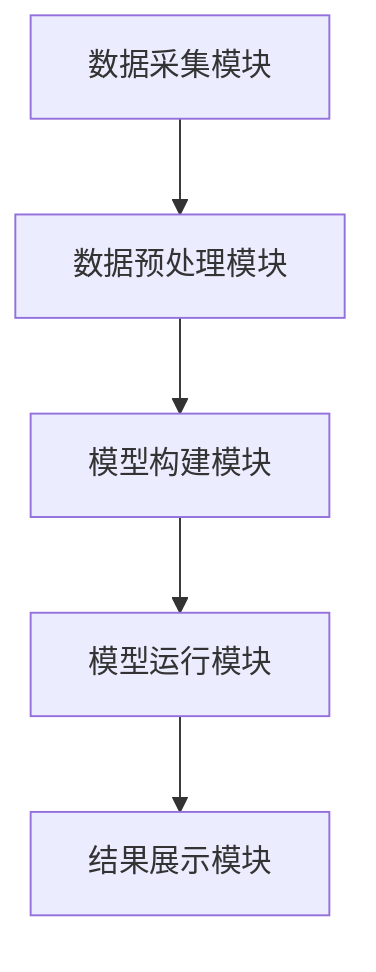
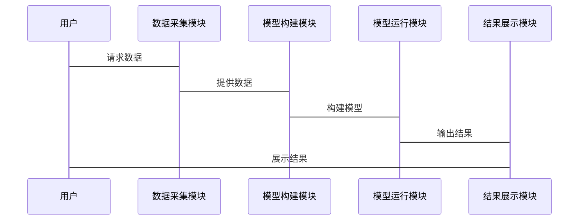

                 


# 利用多智能体系统构建动态竞争格局模型：把握行业变迁

## 关键词：多智能体系统, 动态竞争格局模型, 行业分析, 竞争分析, 人工智能, 系统架构

## 摘要：本文通过介绍多智能体系统的核心概念和动态竞争格局模型的构建方法，详细分析了如何利用多智能体系统在不同行业中的竞争分析与市场预测。文章从基础概念入手，深入探讨了多智能体系统的通信与协作机制、分布式计算与协调、自适应与学习能力等核心内容，并结合实际案例，展示了动态竞争格局模型的构建与实现过程。最后，本文总结了多智能体系统在动态竞争格局模型中的优势，并展望了未来的发展方向。

---

## 第1章: 多智能体系统与动态竞争格局模型概述

### 1.1 多智能体系统的基本概念

#### 1.1.1 多智能体系统的定义
多智能体系统（Multi-Agent System, MAS）是由多个智能体（Agent）组成的分布式系统，这些智能体能够通过协作完成复杂的任务。智能体是具有感知、决策、执行能力的实体，可以是软件程序或物理设备。

#### 1.1.2 多智能体系统的组成部分
多智能体系统由以下部分组成：
- **智能体（Agent）**：具有感知、决策和执行能力的实体。
- **环境（Environment）**：智能体所处的外部世界，可以是物理环境或虚拟环境。
- **通信机制（Communication Mechanism）**：智能体之间交换信息的方式。
- **协作机制（Cooperation Mechanism）**：智能体之间协调合作的规则。

#### 1.1.3 多智能体系统与传统单智能体系统的对比
| 对比维度       | 单智能体系统               | 多智能体系统               |
|----------------|--------------------------|--------------------------|
| 系统结构       | 单一中心化结构             | 分布式结构，多个智能体协作 |
| 任务处理       | 由单一智能体完成           | 多个智能体协同完成任务     |
| 灵活性          | 较低，依赖中心化控制       | 较高，智能体可自主决策     |

### 1.2 动态竞争格局模型的定义与特点

#### 1.2.1 动态竞争格局模型的定义
动态竞争格局模型是一种用于分析和预测行业竞争态势的模型，能够根据市场变化实时更新竞争格局。

#### 1.2.2 动态竞争格局模型的核心特点
- **动态性**：能够实时更新竞争信息。
- **多维性**：考虑多个竞争维度，如市场份额、技术创新等。
- **可扩展性**：适用于不同规模和行业的竞争分析。

#### 1.2.3 动态竞争格局模型的应用场景
- **行业分析**：帮助企业了解行业竞争格局，制定战略。
- **市场预测**：预测市场趋势，优化企业决策。
- **竞争模拟**：模拟竞争情景，评估不同策略的效果。

### 1.3 多智能体系统在动态竞争格局模型中的作用

#### 1.3.1 多智能体系统的优势
- **分布式计算**：多个智能体协同工作，提高计算效率。
- **自主决策**：智能体能够自主决策，适应复杂环境。
- **灵活性**：系统能够根据环境变化动态调整。

#### 1.3.2 多智能体系统在竞争分析中的应用
- **市场分析**：分析市场趋势，预测竞争对手行为。
- **策略制定**：制定企业竞争策略，优化资源配置。
- **风险评估**：评估市场风险，制定应对策略。

#### 1.3.3 多智能体系统与动态竞争格局模型的结合
通过多智能体系统的协作机制，动态竞争格局模型能够实时更新市场信息，提供更准确的竞争分析。

### 1.4 本章小结
本章介绍了多智能体系统的基本概念和动态竞争格局模型的定义与特点，探讨了多智能体系统在动态竞争格局模型中的作用。

---

## 第2章: 多智能体系统的核心概念与原理

### 2.1 多智能体系统的通信与协作机制

#### 2.1.1 智能体之间的通信方式
- **直接通信**：智能体之间直接交换信息。
- **间接通信**：通过中间媒介传递信息。

#### 2.1.2 协作机制的分类与特点
- **基于规则的协作机制**：根据预定义规则进行协作。
- **基于目标的协作机制**：根据目标进行协作。

#### 2.1.3 协作机制在动态竞争格局模型中的应用
- **信息共享**：智能体共享市场信息，提高分析准确性。
- **任务分配**：根据智能体的能力分配任务。

### 2.2 多智能体系统的分布式计算与协调

#### 2.2.1 分布式计算的基本概念
分布式计算是指将计算任务分布在多个计算节点上，通过协作完成任务。

#### 2.2.2 分布式计算在多智能体系统中的应用
- **负载均衡**：通过分布式计算优化系统性能。
- **容错机制**：分布式计算能够提高系统的容错能力。

#### 2.2.3 协调算法的实现与优化
- **协调算法**：如一致性算法、共识算法等。
- **优化方法**：如负载均衡算法、容错机制优化。

### 2.3 多智能体系统的自适应与学习能力

#### 2.3.1 自适应机制的定义与实现
自适应机制是指系统能够根据环境变化自动调整自身行为。

#### 2.3.2 学习算法在多智能体系统中的应用
- **强化学习**：智能体通过与环境互动，学习最优策略。
- **监督学习**：通过监督信号调整智能体行为。

#### 2.3.3 自适应与学习能力对动态竞争格局模型的影响
- **实时更新**：模型能够根据市场变化实时更新。
- **准确性提高**：通过学习算法，模型预测更准确。

### 2.4 本章小结
本章详细介绍了多智能体系统的通信与协作机制、分布式计算与协调以及自适应与学习能力。

---

## 第3章: 动态竞争格局模型的构建与实现

### 3.1 动态竞争格局模型的构建方法

#### 3.1.1 数据采集与处理
- **数据源**：市场数据、竞争对手数据等。
- **数据预处理**：清洗、转换、归一化。

#### 3.1.2 模型构建的步骤与流程
1. **数据采集**：收集相关市场数据。
2. **数据预处理**：清洗数据，确保数据质量。
3. **模型训练**：训练模型，优化参数。
4. **模型验证**：验证模型准确性。

#### 3.1.3 模型验证与优化
- **验证方法**：如交叉验证、留出法。
- **优化方法**：如超参数调优。

### 3.2 多智能体系统在动态竞争格局模型中的实现

#### 3.2.1 多智能体系统的初始化与配置
- **智能体初始化**：定义智能体的初始状态。
- **环境配置**：定义环境的初始状态。

#### 3.2.2 智能体行为的定义与实现
- **行为规则**：定义智能体的行为规则。
- **决策逻辑**：定义智能体的决策逻辑。

#### 3.2.3 模型运行与结果分析
- **模型运行**：模拟市场环境，运行模型。
- **结果分析**：分析模型输出结果，优化模型。

### 3.3 动态竞争格局模型的应用案例

#### 3.3.1 行业竞争分析案例
- **案例背景**：某行业的竞争分析。
- **分析过程**：使用动态竞争格局模型进行分析。
- **结果解读**：解读分析结果，制定竞争策略。

#### 3.3.2 市场动态预测案例
- **案例背景**：预测某市场的未来趋势。
- **分析过程**：使用动态竞争格局模型进行预测。
- **结果解读**：解读预测结果，优化企业策略。

### 3.4 本章小结
本章介绍了动态竞争格局模型的构建方法，并通过案例展示了模型的应用。

---

## 第4章: 动态竞争格局模型的算法实现

### 4.1 动态竞争格局模型的算法原理

#### 4.1.1 算法概述
动态竞争格局模型的算法基于多智能体系统的协作机制，通过分布式计算和自适应学习实现模型的动态更新。

#### 4.1.2 算法流程
1. **初始化**：定义智能体和环境的初始状态。
2. **信息采集**：智能体采集市场信息。
3. **信息处理**：处理信息，生成决策。
4. **决策执行**：智能体根据决策执行操作。
5. **结果反馈**：根据结果反馈，优化模型。

#### 4.1.3 算法实现的数学模型
$$
\text{模型更新公式：} \quad y_{t+1} = f(y_t, x_t)
$$

其中，\( y_t \) 表示第 \( t \) 步的状态，\( x_t \) 表示输入，\( f \) 表示模型更新函数。

### 4.2 算法实现的具体步骤

#### 4.2.1 环境初始化
- **环境参数**：定义环境的参数，如市场规则、竞争对手数量等。

#### 4.2.2 智能体初始化
- **智能体数量**：定义智能体的数量。
- **智能体属性**：定义智能体的属性，如市场份额、创新能力等。

#### 4.2.3 算法实现代码
```python
class Agent:
    def __init__(self, id, market_share, innovation):
        self.id = id
        self.market_share = market_share
        self.innovation = innovation

    def update(self, competitors):
        # 更新市场份额和创新能力
        pass

def model_simulation(agents, steps):
    for step in range(steps):
        for agent in agents:
            agent.update([a for a in agents if a.id != agent.id])
        print(f"Step {step}: Market shares = {[a.market_share for a in agents]}")
```

#### 4.2.4 算法优化
- **优化目标**：提高模型的运行效率和准确性。
- **优化方法**：如参数调优、算法优化。

### 4.3 本章小结
本章详细介绍了动态竞争格局模型的算法实现，包括算法原理、实现步骤和优化方法。

---

## 第5章: 动态竞争格局模型的系统分析与架构设计

### 5.1 系统分析与设计

#### 5.1.1 问题场景介绍
- **问题背景**：行业竞争分析的需求。
- **目标**：构建动态竞争格局模型，实时分析行业竞争态势。

#### 5.1.2 系统功能设计
- **数据采集模块**：采集市场数据。
- **模型构建模块**：构建动态竞争格局模型。
- **模型运行模块**：运行模型，生成分析结果。
- **结果展示模块**：展示分析结果。

#### 5.1.3 系统架构设计
- **分层架构**：数据采集层、模型构建层、模型运行层、结果展示层。
- **模块划分**：数据采集模块、模型构建模块、模型运行模块、结果展示模块。

### 5.2 系统架构设计

#### 5.2.1 系统功能模块设计
- **数据采集模块**：负责数据的采集和预处理。
- **模型构建模块**：负责模型的构建和训练。
- **模型运行模块**：负责模型的运行和结果生成。
- **结果展示模块**：负责结果的可视化展示。

#### 5.2.2 系统架构图


#### 5.2.3 系统接口设计
- **数据接口**：与数据源对接，获取市场数据。
- **模型接口**：与其他系统对接，调用模型进行分析。
- **结果接口**：输出分析结果，供用户查看。

#### 5.2.4 系统交互设计


### 5.3 本章小结
本章详细介绍了动态竞争格局模型的系统分析与架构设计，包括系统功能模块、系统架构图和系统交互设计。

---

## 第6章: 动态竞争格局模型的项目实战

### 6.1 项目环境安装与配置

#### 6.1.1 环境需求
- **操作系统**：Windows/Mac/Linux
- **编程语言**：Python 3.6+
- **依赖库**：numpy, pandas, matplotlib, scikit-learn

#### 6.1.2 安装步骤
```bash
pip install numpy pandas matplotlib scikit-learn
```

### 6.2 系统核心实现

#### 6.2.1 核心代码实现
```python
import numpy as np
import pandas as pd
from sklearn import metrics

class Agent:
    def __init__(self, id, market_share, innovation):
        self.id = id
        self.market_share = market_share
        self.innovation = innovation

    def update(self, competitors):
        # 简单的市场份额更新逻辑
        avg_innovation = np.mean([a.innovation for a in competitors])
        self.market_share += (self.innovation - avg_innovation) * 0.1
        self.market_share = max(0, min(1, self.market_share))

def model_simulation(agents, steps):
    for step in range(steps):
        for agent in agents:
            agent.update([a for a in agents if a.id != agent.id])
        print(f"Step {step}: Market shares = {[a.market_share for a in agents]}")
```

#### 6.2.2 代码解读与分析
- **Agent类**：定义智能体类，包含初始化和更新方法。
- **model_simulation函数**：模拟模型运行，更新智能体的市场份额。

### 6.3 项目实战案例

#### 6.3.1 案例背景
假设我们有三个竞争对手，市场份额分别为0.3、0.4、0.3，创新能力分别为0.5、0.6、0.5。

#### 6.3.2 模型运行与结果分析
```python
agent1 = Agent(1, 0.3, 0.5)
agent2 = Agent(2, 0.4, 0.6)
agent3 = Agent(3, 0.3, 0.5)
agents = [agent1, agent2, agent3]
model_simulation(agents, 10)
```

#### 6.3.3 结果解读
- **市场份额变化**：随着时间的推移，市场份额会根据创新能力的变化而调整。
- **竞争优势分析**：创新能力高的智能体市场份额增长更快。

### 6.4 本章小结
本章通过项目实战，展示了动态竞争格局模型的实现过程，包括环境安装、代码实现和案例分析。

---

## 第7章: 总结与展望

### 7.1 总结
本文详细介绍了多智能体系统和动态竞争格局模型的基本概念、核心原理和实现方法，并通过实际案例展示了模型的应用。通过多智能体系统的协作机制，动态竞争格局模型能够实时更新市场信息，提供更准确的竞争分析。

### 7.2 展望
未来，随着人工智能技术的发展，动态竞争格局模型将更加智能化和自动化。多智能体系统在动态竞争格局模型中的应用将更加广泛，帮助企业在复杂多变的市场环境中保持竞争优势。

---

## 作者：AI天才研究院/AI Genius Institute & 禅与计算机程序设计艺术 /Zen And The Art of Computer Programming

---

本文通过详细的步骤和实际案例，全面探讨了多智能体系统在动态竞争格局模型中的应用，为读者提供了从理论到实践的完整指导。希望本文能帮助读者更好地理解动态竞争格局模型的构建与实现，并在实际应用中取得成功。

