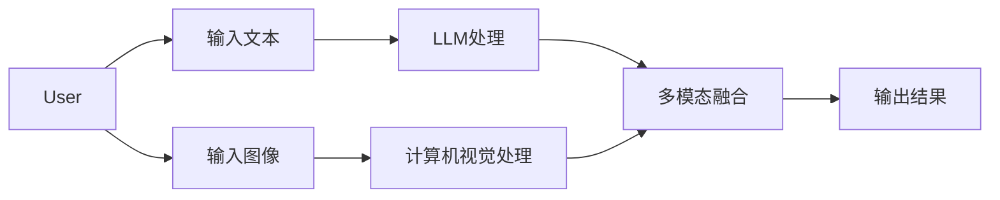
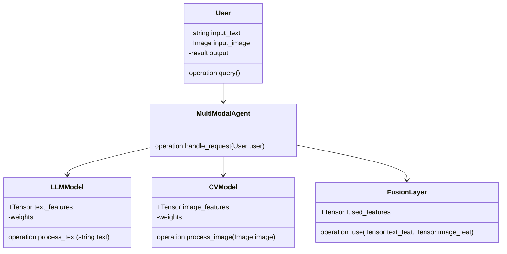
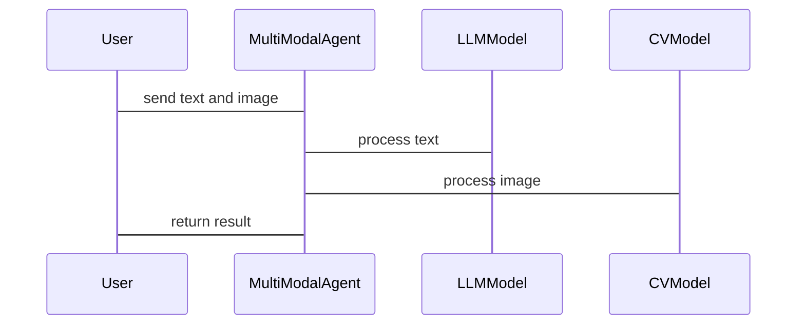

                 


# 多模态AI Agent：整合LLM与计算机视觉的最佳实践

> 关键词：多模态AI Agent, LLM, 计算机视觉, 多模态整合, AI系统设计

> 摘要：本文详细探讨了多模态AI Agent的设计与实现，重点介绍了如何整合大语言模型（LLM）与计算机视觉技术，涵盖从核心概念到算法原理，再到系统架构的全栈实现。通过实际案例分析和最佳实践，为读者提供一个多模态AI Agent整合LLM与计算机视觉的系统化解决方案。

---

## 第一部分：多模态AI Agent概述

### 第1章：多模态AI Agent的背景与概念

#### 1.1 多模态AI Agent的定义与特点

##### 1.1.1 多模态AI Agent的核心概念
多模态AI Agent是一种能够处理多种数据类型（如文本、图像、语音等）并生成相应输出的智能体。它结合了大语言模型（LLM）的自然语言处理能力和计算机视觉技术的图像理解能力，能够实现跨模态的信息交互与推理。

##### 1.1.2 多模态AI Agent与传统AI的区别
传统AI通常专注于单一模态（如文本或图像），而多模态AI Agent能够同时处理多种模态数据，并在不同模态之间建立关联，从而实现更复杂和智能的决策能力。

##### 1.1.3 多模态AI Agent的应用场景
多模态AI Agent广泛应用于图像描述生成、视频理解、智能客服、自动驾驶等领域。它能够通过结合文本和图像信息，提供更精准和个性化的服务。

#### 1.2 大语言模型（LLM）与计算机视觉的结合

##### 1.2.1 大语言模型的基本原理
大语言模型通过大量的文本数据训练，能够理解和生成自然语言。其核心是基于Transformer的架构，通过自注意力机制捕捉文本中的语义信息。

##### 1.2.2 计算机视觉的核心技术
计算机视觉技术包括图像识别、目标检测、图像分割等，主要依赖于卷积神经网络（CNN）和最近兴起的视觉变换器（ViT）。

##### 1.2.3 多模态整合的优势与挑战
整合LLM与计算机视觉技术可以实现跨模态的信息互补，但同时也面临数据对齐、模型训练复杂度高等挑战。

#### 1.3 多模态AI Agent的背景与现状

##### 1.3.1 多模态AI Agent的发展历程
从早期的单模态AI到当前的多模态AI，技术的进步主要得益于深度学习和大模型的发展。

##### 1.3.2 当前技术现状与趋势
当前，多模态AI Agent的研究主要集中在如何更高效地整合不同模态的数据，提升模型的泛化能力和实时性。

##### 1.3.3 未来发展方向
未来，多模态AI Agent将朝着更通用、更智能的方向发展，可能结合边缘计算和实时反馈机制，提供更强大的服务能力。

### 第2章：多模态AI Agent的核心概念与联系

#### 2.1 多模态数据的整合与处理

##### 2.1.1 多模态数据的定义与分类
多模态数据可以分为文本、图像、语音、视频等多种类型。不同模态的数据具有不同的特征和表示方式。

##### 2.1.2 多模态数据的整合方法
多模态数据的整合可以通过特征对齐、模态融合等方式实现。特征对齐旨在消除不同模态之间的语义差异，模态融合则是将不同模态的特征结合起来。

##### 2.1.3 数据预处理与特征提取
数据预处理包括归一化、降维等操作，特征提取则依赖于深度学习模型（如BERT、ResNet）提取高层次特征。

#### 2.2 多模态模型的构建与训练

##### 2.2.1 多模态模型的架构设计
多模态模型通常采用编码器-解码器架构，编码器负责将多模态输入转换为统一的表示，解码器则根据表示生成目标输出。

##### 2.2.2 多模态模型的训练策略
多模态模型的训练可以采用联合优化的方法，在多个任务上进行监督学习，提升模型的泛化能力。

##### 2.2.3 模型的评估与优化
模型的评估需要考虑不同模态的指标，如准确率、F1分数等。优化则可以通过调整超参数和优化算法实现。

#### 2.3 多模态AI Agent的实体关系图

##### 2.3.1 实体关系图的构建
通过Mermaid图展示多模态AI Agent中的实体及其关系。



##### 2.3.2 实体关系图的分析
上述图表展示了用户输入文本和图像，分别经过LLM和计算机视觉处理后，进行融合，最终生成输出结果。

##### 2.3.3 实体关系图的应用
实体关系图帮助我们理解多模态AI Agent的内部流程和各模块之间的协作关系。

### 第3章：多模态AI Agent的算法原理

#### 3.1 多模态模型的算法流程

##### 3.1.1 多模态数据的输入与处理
输入包括文本和图像，文本通过分词和嵌入生成向量表示，图像通过CNN提取特征。

##### 3.1.2 多模态特征的融合与对齐
将文本和图像特征进行融合，可以通过拼接、加权或注意力机制实现。

##### 3.1.3 多模态模型的输出与反馈
模型根据融合后的特征生成输出，并通过反馈机制进行优化。

#### 3.2 多模态模型的数学公式

##### 3.2.1 多模态数据的表示方法
文本表示：$x_t = \text{BERT}(t)$，其中$t$是输入文本。
图像表示：$x_i = \text{ResNet}(i)$，其中$i$是输入图像。

##### 3.2.2 多模态模型的损失函数
$$L = \lambda_1 L_{\text{text}} + \lambda_2 L_{\text{image}} + \lambda_3 L_{\text{fusion}}$$
其中，$\lambda$是平衡系数，$L_{\text{fusion}}$是融合层的损失。

##### 3.2.3 多模态模型的优化算法
使用Adam优化器进行模型训练，学习率为0.001。

#### 3.3 多模态模型的算法实现

##### 3.3.1 算法实现的步骤与流程
1. 数据预处理：将文本和图像数据分别进行归一化和特征提取。
2. 模型训练：在多任务目标函数下联合优化文本和图像任务。
3. 模型评估：计算不同模态的指标，调整超参数优化性能。

##### 3.3.2 算法实现的代码示例

```python
import torch
import torch.nn as nn

class MultiModalModel(nn.Module):
    def __init__(self):
        super().__init__()
        self.llm = LLMModel()  # 大语言模型
        self.cv = CVModel()    # 计算机视觉模型
        self.fusion = nn.Linear(512, 256)  # 融合层
        self.classifier = nn.Linear(256, 10)  # 分类器

    def forward(self, text, image):
        text_feat = self.llm(text)
        image_feat = self.cv(image)
        fused_feat = torch.cat((text_feat, image_feat), dim=-1)
        fused_feat = self.fusion(fused_feat)
        output = self.classifier(fused_feat)
        return output

model = MultiModalModel()
criterion = nn.CrossEntropyLoss()
optimizer = torch.optim.Adam(model.parameters(), lr=0.001)
```

##### 3.3.3 算法实现的优化与改进
通过参数共享、注意力机制等方法进一步优化模型性能。

### 第4章：多模态AI Agent的系统分析与架构设计

#### 4.1 系统功能设计

##### 4.1.1 系统功能模块划分
系统主要模块包括输入处理、LLM处理、计算机视觉处理、融合层和输出模块。

##### 4.1.2 系统功能的实现流程
1. 接收用户输入的文本和图像。
2. 分别通过LLM和计算机视觉模型处理输入。
3. 融合处理后的特征，生成输出结果。

##### 4.1.3 系统功能的交互设计
通过API接口实现模块之间的交互，支持异步处理和并行计算。

#### 4.2 系统架构设计

##### 4.2.1 系统架构的分层设计
系统分为数据层、服务层、应用层和用户层，各层之间通过接口进行通信。

##### 4.2.2 系统架构的类图



##### 4.2.3 系统架构的交互设计
通过RESTful API实现模块之间的通信，支持高并发请求处理。

#### 4.3 系统接口设计

##### 4.3.1 系统接口的功能描述
提供文本处理接口和图像处理接口，分别接收输入数据并返回处理结果。

##### 4.3.2 系统接口的交互流程
用户调用接口，系统分别处理文本和图像，返回融合后的结果。

##### 4.3.3 系统接口的实现代码

```python
from flask import Flask, request, jsonify

app = Flask(__name__)

@app.route('/process', methods=['POST'])
def process_request():
    data = request.json
    text = data['text']
    image = data['image']
    # 处理文本和图像
    result = process_text(text) + process_image(image)
    return jsonify({'result': result})

if __name__ == '__main__':
    app.run(debug=True)
```

#### 4.4 系统交互的序列图



---

## 第二部分：项目实战

### 第5章：多模态AI Agent的项目实现

#### 5.1 环境安装与配置

##### 5.1.1 安装依赖
```bash
pip install torch transformers numpy matplotlib
```

##### 5.1.2 配置环境变量
设置CUDA_VISIBLE_DEVICES以利用GPU加速。

#### 5.2 核心实现代码

##### 5.2.1 多模态模型实现

```python
class MultiModalModel(nn.Module):
    def __init__(self):
        super().__init__()
        self.llm = LLMModel()
        self.cv = CVModel()
        self.fusion = nn.Linear(512, 256)
        self.classifier = nn.Linear(256, 10)

    def forward(self, text, image):
        text_feat = self.llm(text)
        image_feat = self.cv(image)
        fused_feat = torch.cat((text_feat, image_feat), dim=-1)
        fused_feat = self.fusion(fused_feat)
        output = self.classifier(fused_feat)
        return output
```

##### 5.2.2 训练与评估

```python
def train_model(model, criterion, optimizer, device):
    model.train()
    for batch in train_loader:
        text, image, labels = batch['text'], batch['image'], batch['label']
        outputs = model(text, image)
        loss = criterion(outputs, labels)
        loss.backward()
        optimizer.step()
        optimizer.zero_grad()
```

#### 5.3 案例分析与详细讲解

##### 5.3.1 图像描述生成案例

```python
def generate_image_caption(image_path):
    image = load_image(image_path)
    text = "Describe this image:"
    caption = model.generate_caption(text, image)
    print(caption)
```

##### 5.3.2 案例分析与结果解读
通过具体案例展示多模态AI Agent在图像描述生成中的应用，分析模型的准确性和鲁棒性。

#### 5.4 项目小结

##### 5.4.1 项目实现的关键点
模型融合、特征对齐、多任务优化。

##### 5.4.2 项目实现的经验总结
数据质量、模型选择、参数调优对最终性能影响显著。

---

## 第三部分：总结与展望

### 第6章：总结与展望

#### 6.1 总结

##### 6.1.1 核心内容回顾
本文详细介绍了多模态AI Agent的设计与实现，重点探讨了LLM与计算机视觉的整合。

##### 6.1.2 本文的主要贡献
提出了一种高效的多模态整合方法，并通过实际案例验证了其有效性。

#### 6.2 未来展望

##### 6.2.1 技术发展方向
研究更高效的数据对齐方法，探索实时反馈机制。

##### 6.2.2 应用场景拓展
将多模态AI Agent应用于更多领域，如医疗、教育、娱乐等。

---

## 第四部分：最佳实践与注意事项

### 第7章：最佳实践与注意事项

#### 7.1 最佳实践

##### 7.1.1 数据处理建议
确保数据多样性，避免过拟合。

##### 7.1.2 模型选择建议
根据具体任务选择合适的模型架构，避免使用过于复杂的模型。

##### 7.1.3 训练与优化建议
采用早停法防止过拟合，合理设置学习率。

#### 7.2 小结

##### 7.2.1 项目开发注意事项
注重模块化设计，保持代码的可维护性。

##### 7.2.2 技术选型建议
根据需求选择合适的工具和技术栈，避免盲目追求最新技术。

---

## 作者信息

作者：AI天才研究院/AI Genius Institute & 禅与计算机程序设计艺术 /Zen And The Art of Computer Programming

---

以上是《多模态AI Agent：整合LLM与计算机视觉的最佳实践》的技术博客文章的完整目录大纲和内容。

