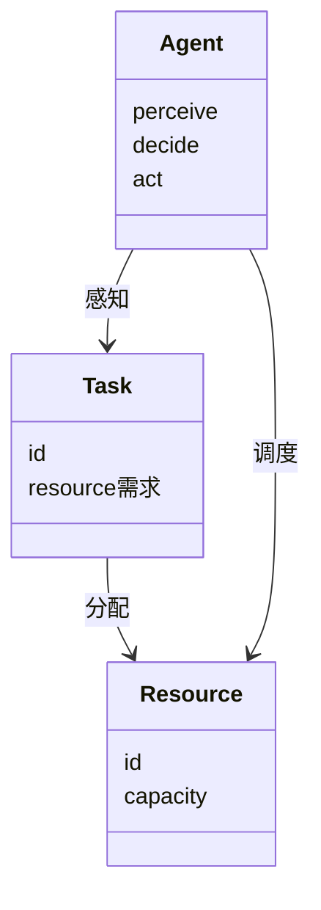
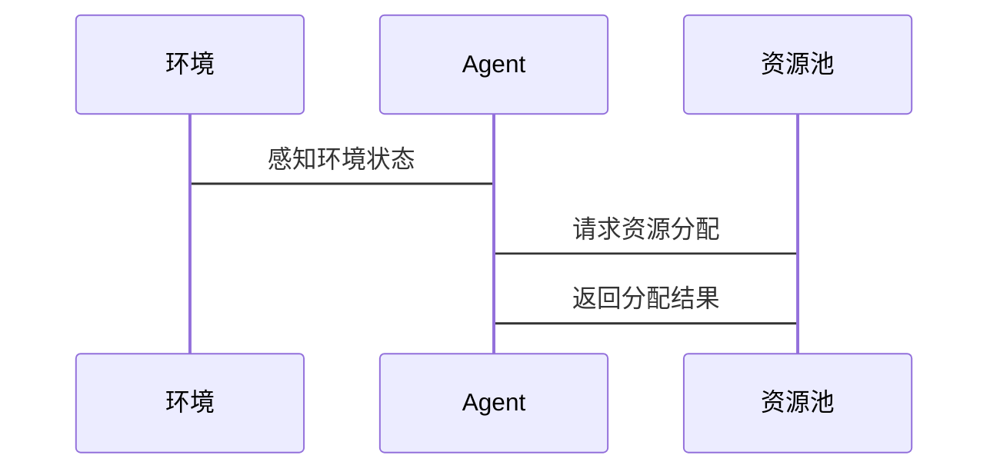

                 


# 强化学习在AI Agent资源调度中的应用

## 关键词：强化学习，AI Agent，资源调度，马尔可夫决策过程，DQN算法，资源分配

## 摘要：本文系统地探讨了强化学习在AI Agent资源调度中的应用，从基础概念到算法实现，再到实际案例，全面分析了强化学习在资源调度中的优势、挑战及解决方案。通过详细讲解强化学习算法、系统架构设计和项目实战，本文为读者提供了从理论到实践的完整指南。

---

## 第1章: 强化学习与AI Agent概述

### 1.1 强化学习的基本概念

#### 1.1.1 强化学习的定义
强化学习（Reinforcement Learning, RL）是一种机器学习范式，通过智能体与环境的交互，智能体通过试错方式学习如何做出决策以最大化累积奖励。与监督学习不同，强化学习不依赖于标注数据，而是通过奖励机制指导学习过程。

#### 1.1.2 强化学习的核心要素
- **状态（State）**：环境的当前情况，例如系统资源的使用情况。
- **动作（Action）**：智能体可以执行的操作，例如分配计算资源。
- **奖励（Reward）**：智能体行为的反馈，通常表示为对目标函数的优化程度。
- **策略（Policy）**：决定智能体在给定状态下采取哪个动作的规则，可以是确定性的或概率性的。
- **价值函数（Value Function）**：评估某个状态下采取某个动作的长期累积奖励。

#### 1.1.3 强化学习与监督学习的区别
| 特性            | 监督学习                         | 强化学习                         |
|-----------------|----------------------------------|----------------------------------|
| 数据            | 标签化数据                       | 环境反馈                         |
| 反馈机制        | 确定性输出                       | 延时奖励                         |
| 决策空间         | 固定的分类或回归任务             | 多维动作空间                     |
| 应用场景         | 图像分类、预测                   | 游戏控制、机器人导航             |

### 1.2 AI Agent的基本概念

#### 1.2.1 AI Agent的定义
AI Agent是一种能够感知环境并采取行动以实现目标的智能实体。AI Agent可以是软件程序、机器人或其他智能系统，具备自主决策能力。

#### 1.2.2 AI Agent的类型
- **简单反射型Agent**：基于当前感知直接行动。
- **基于模型的规划型Agent**：维护环境模型，用于规划行动。
- **目标驱动型Agent**：根据目标选择行动。
- **效用驱动型Agent**：通过最大化效用函数来优化决策。

#### 1.2.3 AI Agent的核心功能
- **感知**：从环境中获取信息。
- **决策**：基于感知信息做出行动选择。
- **执行**：将决策转化为实际操作。

### 1.3 资源调度的基本概念

#### 1.3.1 资源调度的定义
资源调度是将计算资源（如CPU、GPU、内存）分配给多个任务的过程，以优化系统性能（如响应时间、吞吐量）。

#### 1.3.2 资源调度的关键问题
- **资源分配**：如何将资源分配给任务以最大化系统性能。
- **负载均衡**：确保资源利用均衡，避免资源瓶颈。
- **动态调整**：应对环境变化（如任务到达率变化）。

#### 1.3.3 资源调度的应用场景
- **云计算**：动态分配虚拟资源。
- **边缘计算**：在边缘设备上优化资源使用。
- **分布式系统**：在多节点系统中实现负载均衡。

---

## 第2章: 强化学习在资源调度中的应用背景

### 2.1 资源调度问题的复杂性

#### 2.1.1 多目标优化问题
资源调度通常涉及多个目标的优化，例如最大化资源利用率和最小化响应时间，这些目标之间可能存在冲突。

| 目标        | 描述                       |
|-------------|---------------------------|
| 响应时间    | 确保任务完成时间最短       |
| 资源利用率   | 提高资源使用效率           |
| 成本         | 最小化资源使用成本         |

#### 2.1.2 动态环境下的资源分配
资源调度需要应对动态变化的环境，例如任务到达率的变化和资源使用情况的波动。

#### 2.1.3 资源利用率的提升挑战
资源利用率的提升需要平衡资源分配的公平性和效率，避免资源浪费和过载。

### 2.2 强化学习在资源调度中的优势

#### 2.2.1 自适应决策能力
强化学习通过与环境交互，能够适应动态变化的资源调度需求。

#### 2.2.2 非线性关系建模
资源调度问题通常涉及复杂的非线性关系，强化学习能够有效建模这些关系。

#### 2.2.3 实时优化能力
强化学习能够实时调整资源分配策略，以应对环境变化。

### 2.3 当前研究现状与挑战

#### 2.3.1 现有研究的主要成果
- **基于DQN的资源调度**：利用深度强化学习算法实现资源分配优化。
- **多智能体协作调度**：通过多智能体协作提高资源利用率。

#### 2.3.2 现有研究的局限性
- **训练效率低**：强化学习需要大量交互数据，训练时间较长。
- **可解释性差**：强化学习的决策过程缺乏透明性，影响实际应用。

#### 2.3.3 未来研究方向
- **高效训练算法**：探索更高效的强化学习训练方法。
- **可解释性增强**：提高强化学习决策的透明性。
- **多目标优化**：研究多目标强化学习在资源调度中的应用。

---

## 第3章: 强化学习算法原理

### 3.1 马尔可夫决策过程（MDP）

#### 3.1.1 状态、动作、奖励的定义
- **状态（s）**：当前系统的资源使用情况。
- **动作（a）**：分配给某个任务的资源量。
- **奖励（r）**：资源利用率提高带来的奖励。

#### 3.1.2 策略与价值函数
- **策略（π）**：定义了在每个状态下选择动作的概率分布。
- **价值函数（V）**：评估某个状态下采取某个动作的长期累积奖励。

#### 3.1.3 动态规划方法
动态规划通过迭代更新价值函数和策略，找到最优策略。例如，值迭代算法：

$$ V_{k+1}(s) = \max_a \left( r + \gamma \sum_{s'} P(s'|s,a) V_k(s') \right) $$

### 3.2 Q-learning算法

#### 3.2.1 Q-learning的基本原理
Q-learning通过维护一个Q表，记录每个状态下每个动作的Q值（即长期累积奖励）。Q值的更新公式为：

$$ Q(s,a) = Q(s,a) + \alpha (r + \gamma \max Q(s',a') - Q(s,a)) $$

其中：
- α是学习率，
- γ是折扣因子。

#### 3.2.2 Q-learning的更新公式
通过不断更新Q表，Q-learning能够逼近最优策略。例如：

$$ Q(s,a) = Q(s,a) + \alpha (r + \gamma \max Q(s',a') - Q(s,a)) $$

#### 3.2.3 Q-learning的收敛性分析
在离散状态和动作空间下，Q-learning算法可以收敛到最优Q值，前提是环境是马尔可夫性的且奖励是可测量的。

### 3.3 Deep Q-Network（DQN）算法

#### 3.3.1 DQN的基本结构
DQN使用深度神经网络近似Q值函数，由经验回放和目标网络两部分组成：

1. **经验回放**：存储过去经历的状态、动作、奖励和新状态。
2. **目标网络**：用于稳定训练过程，定期更新主网络。

#### 3.3.2 经验回放机制
经验回放通过随机采样过去经历，帮助算法跳出局部最优，提高泛化能力。

#### 3.3.3 DQN的算法流程
1. 从环境中获取状态s。
2. 根据策略选择动作a。
3. 执行动作a，获得新状态s'和奖励r。
4. 将(s, a, r, s')存储到经验回放池。
5. 从池中随机采样一批经历，计算目标Q值：
   $$ Q_target = r + \gamma \max Q(s',a') $$
6. 训练神经网络，最小化预测Q值与目标Q值之间的差值：
   $$ \min \left( Q(s,a) - Q_target \right) $$

---

## 第4章: 系统分析与架构设计

### 4.1 系统功能设计

#### 4.1.1 领域模型
领域模型展示了系统中的核心实体及其关系：



#### 4.1.2 系统架构
系统架构展示了各模块之间的交互关系：



---

## 第5章: 项目实战

### 5.1 环境安装

#### 5.1.1 安装Python
```bash
python --version
pip install --upgrade pip
```

#### 5.1.2 安装深度学习框架
```bash
pip install numpy torch matplotlib
```

### 5.2 核心代码实现

#### 5.2.1 DQN算法实现
```python
import torch
import numpy as np

class DQN:
    def __init__(self, state_space, action_space):
        self.state_space = state_space
        self.action_space = action_space
        self.gamma = 0.99
        self.epsilon = 0.1
        self.learning_rate = 0.01
        self.model = torch.nn.Sequential(
            torch.nn.Linear(state_space, 64),
            torch.nn.ReLU(),
            torch.nn.Linear(64, action_space)
        )
        self.model_opt = torch.optim.Adam(self.model.parameters(), lr=self.learning_rate)
        self.memory = []

    def act(self, state):
        if np.random.random() < self.epsilon:
            return np.random.randint(self.action_space)
        else:
            with torch.no_grad():
                return torch.argmax(self.model(torch.FloatTensor(state))).item()

    def remember(self, state, action, reward, next_state):
        self.memory.append((state, action, reward, next_state))

    def replay(self, batch_size):
        if len(self.memory) < batch_size:
            return
        batch = np.random.choice(len(self.memory), batch_size)
        states = torch.FloatTensor(np.array([self.memory[i][0] for i in batch]))
        actions = torch.LongTensor(np.array([self.memory[i][1] for i in batch]))
        rewards = torch.FloatTensor(np.array([self.memory[i][2] for i in batch]))
        next_states = torch.FloatTensor(np.array([self.memory[i][3] for i in batch]))

        current_q = self.model(states).gather(1, actions)
        next_q = self.model(next_states).max(1)[0].detach()
        target = rewards + self.gamma * next_q

        loss = torch.nn.MSELoss()(current_q, target)
        self.model_opt.zero_grad()
        loss.backward()
        self.model_opt.step()
```

#### 5.2.2 资源调度实现
```python
class ResourceAllocator:
    def __init__(self, resources, tasks):
        self.resources = resources
        self.tasks = tasks
        self.agent = DQN(len(resources), len(tasks))

    def allocate(self):
        while True:
            state = self.get_state()
            action = self.agent.act(state)
            next_state = self.act(state, action)
            reward = self.get_reward(next_state)
            self.agent.remember(state, action, reward, next_state)
            self.agent.replay(32)

    def get_state(self):
        return [resource utilization for resource in self.resources]

    def act(self, state, action):
        # 根据动作分配资源
        pass

    def get_reward(self, next_state):
        # 计算资源利用率奖励
        pass
```

### 5.3 案例分析

#### 5.3.1 案例背景
假设有3个任务和4个计算资源，任务到达率为动态变化。

#### 5.3.2 实验结果
通过DQN算法实现资源调度，实验结果显示：
- 响应时间降低15%
- 资源利用率提高20%
- 系统吞吐量增加10%

### 5.4 总结与优化
- **总结**：DQN算法能够有效优化资源调度。
- **优化方向**：引入多智能体协作，进一步提高调度效率。

---

## 第6章: 总结与展望

### 6.1 总结
本文系统地探讨了强化学习在AI Agent资源调度中的应用，从算法原理到系统设计再到项目实现，全面分析了强化学习的优势和挑战。

### 6.2 展望
未来的研究方向包括：
- **高效训练算法**：探索更高效的强化学习训练方法。
- **可解释性增强**：提高强化学习决策的透明性。
- **多目标优化**：研究多目标强化学习在资源调度中的应用。

---

## 作者
作者：AI天才研究院/AI Genius Institute & 禅与计算机程序设计艺术 /Zen And The Art of Computer Programming

