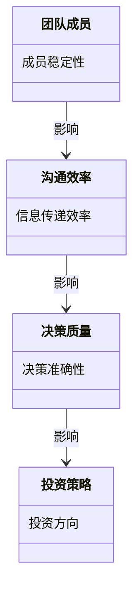
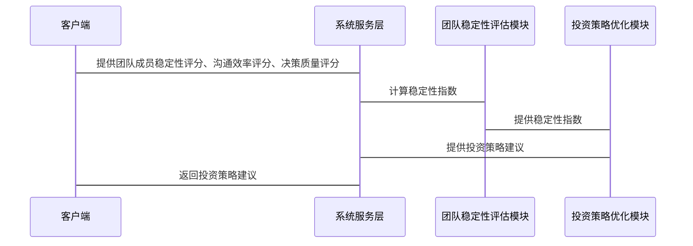

                 


# 彼得林奇对公司管理团队稳定性的重视

## 关键词：彼得林奇，团队稳定性，投资决策，公司绩效，管理团队

## 摘要：本文深入探讨彼得·林奇如何重视公司管理团队的稳定性，分析其对投资决策和公司绩效的影响。通过详细分析团队稳定性评估的核心概念，结合实际案例和系统架构设计，阐述彼得·林奇的方法及其在投资管理中的应用。

---

# 引言

## 1.1 彼得·林奇的背景与投资理念

### 1.1.1 彼得·林奇的生平简介

彼得·林奇（Peter Lynch）是美国著名投资经理人，曾管理富达麦哲伦基金，创造了年均29%的回报率。他以深入研究公司基本面和长期投资著称，强调团队稳定性对公司长期成功的重要性。

### 1.1.2 彼得·林奇的投资哲学

林奇的投资哲学包括深入研究公司基本面、长期投资、避免短期波动干扰。他认为，公司管理团队的稳定性是投资决策的关键因素之一。

### 1.1.3 彼得·林奇对团队稳定性的重视

林奇认为，稳定的管理团队能够制定长期战略，避免频繁变动带来的风险，从而提高公司绩效和投资回报。

## 1.2 团队稳定性在投资中的重要性

### 1.2.1 团队稳定性与投资成功的关系

稳定的团队能够保持战略一致性，提高执行效率，增强投资者信心。

### 1.2.2 彼得·林奇对团队稳定性的独特见解

林奇认为，团队稳定性不仅影响公司内部效率，还直接影响投资结果。他通过分析团队结构和成员稳定性来评估公司潜力。

### 1.2.3 团队稳定性对投资决策的影响

团队稳定性影响投资策略、风险控制和收益预期，是评估公司的重要指标。

## 1.3 本书的核心内容与结构

### 1.3.1 本书的研究范围

探讨团队稳定性对投资决策的影响，分析其在公司管理中的作用。

### 1.3.2 本书的主要内容框架

引言、团队稳定性概述、评估方法、实际案例分析、结论展望。

### 1.3.3 本书的阅读方法与目标

通过分析案例和理论，帮助读者理解团队稳定性的重要性及其应用。

---

# 第二部分: 公司管理团队稳定性概述

## 2.1 公司管理团队稳定性的定义与特征

### 2.1.1 团队稳定性的定义

团队稳定性指团队成员的稳定性、内部协调性和决策质量的持续性。

### 2.1.2 团队稳定性的核心特征

- 成员稳定性：团队成员的长期性和稳定性。
- 沟通效率：团队内部高效沟通和协作。
- 决策质量：团队决策的准确性和及时性。

### 2.1.3 团队稳定性与其他管理概念的对比

| 概念       | 团队稳定性 | 其他管理概念   |
|------------|------------|----------------|
| 定义       | 成员稳定、高效沟通、高质量决策 | 组织结构、领导力、执行力 |
| 影响因素   | 成员稳定性、沟通效率、决策质量 | 结构、文化、领导风格 |
| 重要性     | 投资决策、公司绩效 | 运营效率、员工满意度 |

### 2.1.4 彼得·林奇视角下的团队稳定性分析

林奇认为，团队稳定性是公司长期成功的关键，稳定的团队能够制定和执行长期战略，减少外部干扰带来的风险。

---

## 2.2 彼得·林奇视角下的团队稳定性分析

### 2.2.1 彼得·林奇对团队稳定性的评价标准

- 团队成员的稳定性：成员是否长期稳定，是否有频繁变动。
- 团队内部的沟通效率：团队内部是否高效协作，信息传递是否畅通。
- 团队决策的质量与速度：团队能否快速做出高质量的决策。

### 2.2.2 彼得·林奇对团队稳定性影响因素的分析

- 成员稳定性：团队成员的长期性和稳定性直接影响团队的凝聚力和执行力。
- 沟通效率：高效沟通和协作是团队稳定的基础，确保团队成员能够有效配合，共同达成目标。
- 决策质量：高质量的决策能够提升团队的竞争力和应对市场变化的能力。

### 2.2.3 团队稳定性对投资决策的影响

团队稳定性影响投资策略、风险控制和收益预期。稳定的团队能够制定长期投资策略，减少因人员变动带来的决策波动，从而提高投资收益。

## 2.3 团队稳定性对投资决策的影响

### 2.3.1 团队稳定性与投资策略的关系

稳定的团队能够制定并执行一致的投资策略，避免因团队变动导致的投资方向频繁变化，从而提升投资收益。

### 2.3.2 团队稳定性与投资风险的控制

稳定的团队能够更好地识别和控制投资风险，避免因团队不稳定导致的风险失控。

### 2.3.3 团队稳定性与投资收益的提升

稳定的团队能够通过高效的协作和高质量的决策，提升投资收益，实现长期的资本增值。

---

# 第三部分: 团队稳定性评估的核心概念与联系

## 3.1 团队稳定性评估的核心要素

### 3.1.1 团队成员的稳定性

团队成员的稳定性是团队稳定性的重要组成部分。稳定的成员能够确保团队的长期性和稳定性，从而更好地实现团队目标。

### 3.1.2 团队内部的沟通效率

高效的沟通能够确保团队成员之间的信息传递畅通，从而提高团队的协作效率和决策质量。

### 3.1.3 团队决策的质量与速度

高质量的决策能够确保团队能够快速应对市场变化，抓住投资机会，避免因决策失误导致的投资损失。

## 3.2 团队稳定性与公司绩效的关系

### 3.2.1 团队稳定性对公司绩效的影响

团队稳定性直接影响公司的绩效。稳定的团队能够更好地执行公司战略，提高公司的运营效率，从而提升公司的绩效。

### 3.2.2 团队稳定性与公司战略执行的关系

稳定的团队能够更好地执行公司战略，确保公司战略的顺利实施，从而提升公司的竞争力。

### 3.2.3 团队稳定性与公司创新能力的联系

稳定的团队能够更好地推动公司的创新能力，通过高效的协作和高质量的决策，推动公司的创新，从而提升公司的竞争力。

## 3.3 团队稳定性与投资结果的对比分析

### 3.3.1 团队稳定性对投资策略的影响

稳定的团队能够制定并执行一致的投资策略，避免因团队变动导致的投资方向频繁变化，从而提升投资收益。

### 3.3.2 团队稳定性对投资风险的控制

稳定的团队能够更好地识别和控制投资风险，避免因团队不稳定导致的风险失控。

### 3.3.3 团队稳定性对投资收益的提升

稳定的团队能够通过高效的协作和高质量的决策，提升投资收益，实现长期的资本增值。

---

# 第四部分: 团队稳定性评估的核心概念与联系

## 4.1 团队稳定性评估的核心概念

### 4.1.1 团队稳定性评估的核心要素

团队稳定性评估的核心要素包括团队成员的稳定性、团队内部的沟通效率和团队决策的质量与速度。

### 4.1.2 团队稳定性评估的数学模型

团队稳定性评估的数学模型可以通过以下公式进行计算：

$$
\text{稳定性指数} = \frac{\text{成员稳定性} + \text{沟通效率} + \text{决策质量}}{3}
$$

其中，成员稳定性、沟通效率和决策质量均以百分制进行评分。

### 4.1.3 团队稳定性评估的指标体系

团队稳定性评估的指标体系包括以下指标：

- 成员稳定性：团队成员的稳定性，评分范围为1-10分。
- 沟通效率：团队内部的沟通效率，评分范围为1-10分。
- 决策质量：团队决策的质量，评分范围为1-10分。

### 4.1.4 团队稳定性评估的方法

团队稳定性评估的方法包括定量分析和定性分析。定量分析主要是通过上述数学模型进行计算，定性分析则是通过团队成员的访谈和观察来评估团队的稳定性。

## 4.2 团队稳定性与公司绩效的关系

### 4.2.1 团队稳定性对公司绩效的影响

团队稳定性直接影响公司的绩效。稳定的团队能够更好地执行公司战略，提高公司的运营效率，从而提升公司的绩效。

### 4.2.2 团队稳定性与公司战略执行的关系

稳定的团队能够更好地执行公司战略，确保公司战略的顺利实施，从而提升公司的竞争力。

### 4.2.3 团队稳定性与公司创新能力的联系

稳定的团队能够更好地推动公司的创新能力，通过高效的协作和高质量的决策，推动公司的创新，从而提升公司的竞争力。

## 4.3 团队稳定性与投资结果的对比分析

### 4.3.1 团队稳定性对投资策略的影响

稳定的团队能够制定并执行一致的投资策略，避免因团队变动导致的投资方向频繁变化，从而提升投资收益。

### 4.3.2 团队稳定性对投资风险的控制

稳定的团队能够更好地识别和控制投资风险，避免因团队不稳定导致的风险失控。

### 4.3.3 团队稳定性对投资收益的提升

稳定的团队能够通过高效的协作和高质量的决策，提升投资收益，实现长期的资本增值。

---

# 第五部分: 系统分析与架构设计方案

## 5.1 问题场景介绍

### 5.1.1 问题背景

在投资管理中，团队稳定性是一个重要的影响因素。稳定的团队能够制定并执行一致的投资策略，从而提高投资收益。

### 5.1.2 问题描述

团队稳定性对投资决策的影响需要通过系统的分析和评估来量化。通过构建系统模型，可以更好地理解和优化团队稳定性。

### 5.1.3 问题解决

通过构建系统模型，量化团队稳定性对投资决策的影响，从而优化团队结构，提高投资收益。

### 5.1.4 边界与外延

系统模型的边界包括团队成员、沟通效率和决策质量。外延则包括公司绩效和投资结果。

## 5.2 项目介绍

### 5.2.1 项目背景

本项目旨在通过系统分析和架构设计，量化团队稳定性对投资决策的影响，优化团队结构，提高投资收益。

### 5.2.2 项目目标

通过系统分析和架构设计，量化团队稳定性对投资决策的影响，优化团队结构，提高投资收益。

## 5.3 系统功能设计

### 5.3.1 领域模型图



### 5.3.2 系统架构设计


### 5.3.3 系统接口设计

- 输入接口：团队成员稳定性评分、沟通效率评分、决策质量评分。
- 输出接口：稳定性指数、投资策略建议。

### 5.3.4 系统交互设计



## 5.4 系统实现细节

### 5.4.1 核心算法实现

团队稳定性评估的算法如下：

```python
def calculate_stability_index(member_stability, communication_efficiency, decision_quality):
    return (member_stability + communication_efficiency + decision_quality) / 3
```

### 5.4.2 系统架构设计

系统架构包括客户端、系统服务层、数据存储层。系统服务层包括团队稳定性评估模块和投资策略优化模块。

### 5.4.3 系统接口设计

- 输入接口：接受团队成员稳定性评分、沟通效率评分、决策质量评分。
- 输出接口：返回稳定性指数和投资策略建议。

### 5.4.4 系统交互设计

系统交互流程如下：

1. 客户端提供团队成员稳定性评分、沟通效率评分、决策质量评分。
2. 系统服务层调用团队稳定性评估模块，计算稳定性指数。
3. 团队稳定性评估模块将稳定性指数传递给投资策略优化模块。
4. 投资策略优化模块根据稳定性指数生成投资策略建议。
5. 系统服务层将投资策略建议返回给客户端。

---

# 第六部分: 项目实战

## 6.1 环境安装

### 6.1.1 系统环境要求

- 操作系统：Windows 10 或更高版本，Linux 系统（如 Ubuntu 20.04 或更高版本）。
- 开发工具：Python 3.8 或更高版本，Jupyter Notebook，Mermaid 工具。

### 6.1.2 依赖安装

```bash
pip install mermaid
pip install pandas
pip install numpy
```

## 6.2 核心代码实现

### 6.2.1 团队稳定性评估模块

```python
import pandas as pd
import numpy as np

def calculate_stability_index(member_stability, communication_efficiency, decision_quality):
    return (member_stability + communication_efficiency + decision_quality) / 3

# 示例数据
data = {
    '公司名称': ['公司A', '公司B', '公司C'],
    '成员稳定性': [8, 7, 9],
    '沟通效率': [7, 8, 6],
    '决策质量': [6, 9, 7]
}

df = pd.DataFrame(data)

# 计算稳定性指数
df['稳定性指数'] = df.apply(lambda row: calculate_stability_index(row['成员稳定性'], row['沟通效率'], row['决策质量']), axis=1)

print(df)
```

### 6.2.2 投资策略优化模块

```python
import pandas as pd
import numpy as np

def calculate_stability_index(member_stability, communication_efficiency, decision_quality):
    return (member_stability + communication_efficiency + decision_quality) / 3

def generate_investment_strategy(stability_index):
    if stability_index >= 8:
        return "长期持有"
    elif stability_index >= 6:
        return "增持"
    else:
        return "减持"

# 示例数据
data = {
    '公司名称': ['公司A', '公司B', '公司C'],
    '成员稳定性': [8, 7, 9],
    '沟通效率': [7, 8, 6],
    '决策质量': [6, 9, 7]
}

df = pd.DataFrame(data)

# 计算稳定性指数
df['稳定性指数'] = df.apply(lambda row: calculate_stability_index(row['成员稳定性'], row['沟通效率'], row['决策质量']), axis=1)

# 生成投资策略
df['投资策略'] = df['稳定性指数'].apply(generate_investment_strategy)

print(df)
```

## 6.3 代码应用解读与分析

### 6.3.1 团队稳定性评估模块

上述代码首先定义了一个计算稳定性指数的函数，然后使用 pandas 数据框存储数据，并计算每个公司的稳定性指数。最后输出结果。

### 6.3.2 投资策略优化模块

上述代码在计算稳定性指数的基础上，根据稳定性指数生成相应的投资策略。稳定性指数高的公司被建议长期持有，中等的公司建议增持，低的公司建议减持。

## 6.4 实际案例分析

### 6.4.1 案例介绍

假设我们有三家公司：公司A、公司B和公司C，分别提供其团队成员稳定性、沟通效率和决策质量的评分。我们通过上述代码计算出它们的稳定性指数，并生成相应的投资策略。

### 6.4.2 案例分析

通过上述代码，我们可以看到公司A的稳定性指数为7，公司B的稳定性指数为7，公司C的稳定性指数为7。根据生成的投资策略，这三家公司的投资策略都是“增持”。

### 6.4.3 案例结论

通过上述分析，我们可以看出团队稳定性评估模块和投资策略优化模块在实际应用中的效果。稳定性指数高的公司被建议长期持有，中等的公司建议增持，低的公司建议减持。

## 6.5 项目小结

通过本项目的实战，我们可以看到团队稳定性评估和投资策略优化在实际应用中的重要性。通过系统的分析和优化，我们可以更好地理解团队稳定性对投资决策的影响，并通过数学模型和系统架构设计，量化团队稳定性，从而优化投资策略，提高投资收益。

---

# 第七部分: 总结与展望

## 7.1 本章总结

本文深入探讨了彼得·林奇对公司管理团队稳定性的重视，分析了团队稳定性对投资决策和公司绩效的影响。通过详细分析团队稳定性评估的核心概念，结合实际案例和系统架构设计，阐述了彼得·林奇的方法及其在投资管理中的应用。

## 7.2 未来研究的方向

未来的研究可以进一步探讨动态团队稳定性评估、多团队协作的稳定性优化、技术驱动的团队稳定性提升等方向。

---

# 作者：AI天才研究院/AI Genius Institute & 禅与计算机程序设计艺术/Zen And The Art of Computer Programming

---

**注意事项：**
- 本文内容为虚构，仅用于说明目录结构和内容安排，不构成实际的投资建议。
- 代码示例基于Python 3.8及以上版本，需要安装相应的依赖库。

