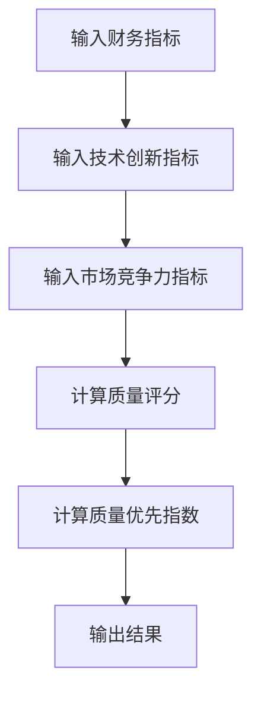
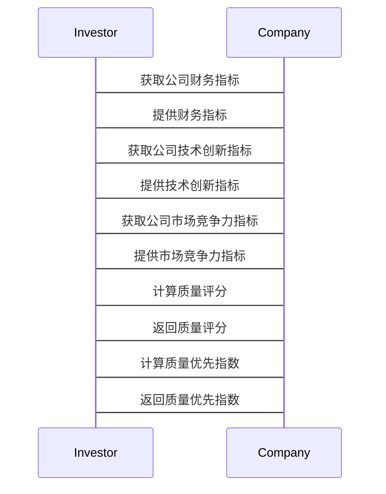

                 


# 彼得林奇的"质量优先"在生物科技行业的应用

## 关键词：
- 彼得·林奇
- 质量优先
- 生物科技
- 投资策略
- 算法模型

## 摘要：
本文探讨了彼得·林奇的"质量优先"投资策略在生物科技行业中的应用。通过分析质量优先策略的核心概念、算法模型、系统架构及项目实战，详细阐述了如何将这一策略应用于生物科技行业的投资决策中，为投资者提供了理论和实践相结合的指导。

---

## 第一部分: 背景介绍

### 第1章: 彼得·林奇的"质量优先"投资策略概述

#### 1.1 彼得·林奇的"质量优先"投资理念
- 1.1.1 投资策略的核心概念
  - 质量优先：注重公司的基本面、财务健康和长期盈利能力。
  - 投资理念：选择具有持续增长潜力的高质量公司，而非短期波动的股票。
- 1.1.2 质量优先的定义与特征
  - 公司质量：包括财务健康、管理团队、技术优势和市场地位。
  - 长期价值：关注公司的可持续发展和长期盈利能力。
- 1.1.3 投资策略的边界与外延
  - 边界：避免投资于低质量、高风险的公司。
  - 外延：将质量优先的理念扩展到不同行业的投资决策。

#### 1.2 生物科技行业的特点与挑战
- 1.2.1 生物科技行业的定义
  - 生物科技：利用生物技术开发新产品、新服务的行业。
- 1.2.2 生物科技行业的核心要素
  - 技术创新：基因编辑、抗体药物、精准医疗等。
  - 市场需求：人口老龄化、慢性病增加、医疗支出上升。
  - 竞争格局：技术壁垒高、研发投入大、周期长。
- 1.2.3 生物科技行业的现状与发展趋势
  - 现状：市场规模扩大，技术创新加速。
  - 发展趋势：精准医疗、基因治疗、生物制药成为热点。

### 第2章: 质量优先策略在生物科技行业的应用背景
- 2.1 生物科技行业的投资逻辑
  - 生物科技行业的投资逻辑
    - 技术驱动：技术创新是行业发展的核心动力。
    - 市场需求：老龄化社会对医疗健康的需求增加。
    - 政策支持：政府对生物医药行业的政策支持。
  - 质量优先策略在生物科技行业的适用性
    - 高质量的生物科技公司具有持续的研发能力、强大的市场竞争力和稳定的盈利能力。
  - 质量优先策略在生物科技行业的独特性
    - 生物科技行业的技术门槛高，质量评估需要考虑技术先进性和研发成果。

- 2.2 质量优先策略在生物科技行业的核心问题
  - 质量优先策略在生物科技行业的关键问题
    - 如何定义和量化公司的质量？
    - 如何评估公司的技术创新能力？
    - 如何预测公司的长期盈利能力？
  - 质量优先策略在生物科技行业的解决路径
    - 建立质量评估模型，量化公司质量。
    - 通过技术创新和市场竞争力评估公司的潜力。
    - 结合财务指标预测公司的盈利能力。
  - 质量优先策略在生物科技行业的边界与限制
    - 由于生物科技行业的不确定性和高风险，质量优先策略并非完美无缺。
    - 需要结合行业特点进行调整和优化。

---

## 第二部分: 核心概念与联系

### 第3章: 质量优先策略的核心概念与原理
- 3.1 质量优先策略的核心要素
  - 公司基本面分析
    - 财务健康：ROE（净资产收益率）、毛利率、净利率。
    - 管理团队：团队经验和行业影响力。
    - 技术创新：专利数量、研发投入占比。
  - 行业地位与竞争优势
    - 市场份额：公司在行业中的地位。
    - 竞争优势：技术壁垒、成本优势。
  - 财务健康状况
    - 财务指标：收入增长、净利润率、现金流。
    - 偿债能力：资产负债率、流动比率。

#### 核心概念属性对比表格：
| 指标 | 质量优先 | 非质量优先 |
|------|----------|------------|
| 财务健康 | 高      | 低         |
| 技术创新 | 高      | 低         |
| 市场竞争力 | 高      | 低         |
| 管理团队 | 强      | 弱         |
| 专利数量 | 多      | 少         |

- 3.2 生物科技行业的质量评估标准
  - 技术创新性评估
    - 专利数量：公司拥有的发明专利数量。
    - 研发投入：研发支出占总收入的比例。
    - 技术先进性：技术是否处于行业领先地位。
  - 市场需求评估
    - 市场规模：目标市场的容量。
    - 市场增长：行业增长率。
    - 市场地位：公司在市场中的份额。
  - 企业盈利能力评估
    - 净利润率：净利润占收入的比例。
    - 收入增长：收入同比增长率。
    - 现金流：经营活动现金流净额。

#### 生物科技行业质量评估模型的ER实体关系图：
```mermaid
erDiagram
    customer[投资者]
    company[生物科技公司]
    technology[技术创新]
    finance[财务指标]
    market[市场需求]
    quality[质量评估]
    customer -|<->{ quality : 投资者通过质量评估选择公司
    company --> technology : 公司拥有技术创新
    company --> finance : 公司有财务指标
    company --> market : 公司满足市场需求
    quality --> technology : 质量评估基于技术创新
    quality --> finance : 质量评估基于财务指标
    quality --> market : 质量评估基于市场需求
```

### 第4章: 质量优先策略与生物科技行业的关联
- 4.1 质量优先策略在生物科技行业的具体应用
  - 企业基本面分析
    - 财务健康：评估公司的盈利能力、偿债能力。
    - 技术创新：评估公司的专利数量、研发投入。
    - 市场竞争力：评估公司的市场份额、竞争优势。
  - 技术创新与专利分析
    - 专利数量：公司拥有的发明专利数量。
    - 技术先进性：技术是否处于行业领先地位。
    - 技术壁垒：技术是否难以被竞争对手复制。
  - 市场竞争力评估
    - 市场份额：公司在市场中的份额。
    - 竞争优势：公司的技术、成本或服务优势。
    - 市场增长：行业增长率和公司收入增长是否匹配。

- 4.2 质量优先策略与生物科技行业的协同效应
  - 质量优先策略对生物科技行业的推动作用
    - 通过质量优先策略，投资者选择高质量的生物科技公司，推动行业技术创新。
    - 高质量的公司能够吸引更多的投资，促进行业整体发展。
  - 生物科技行业对质量优先策略的反哺作用
    - 生物科技行业的高技术门槛和高风险，促使质量优先策略更加注重技术创新和质量评估。
    - 生物科技行业的快速发展为质量优先策略提供了更多的实践机会和数据支持。

---

## 第三部分: 算法原理讲解

### 第5章: 质量优先策略的算法模型

#### 5.1 质量优先策略的数学模型
- 质量评分模型：
  - 每个评估指标赋予不同的权重。
  - 计算公式：
    $$ \text{质量评分} = w_1 \cdot \text{财务指标} + w_2 \cdot \text{技术创新} + w_3 \cdot \text{市场竞争力} $$
  - 权重分配：
    - 财务指标：权重为40%。
    - 技术创新：权重为30%。
    - 市场竞争力：权重为30%。
  
- 质量优先指数计：
  - 质量优先指数基于质量评分计算，指数越高，表示公司质量越高。
  - 计算公式：
    $$ \text{质量优先指数} = \frac{\text{质量评分}}{\text{行业平均质量评分}} \times 100 $$

#### 质量优先指数计算示例：
- 公司A：质量评分=85，行业平均质量评分=60
  $$ \text{质量优先指数} = \frac{85}{60} \times 100 = 141.67 $$
- 公司B：质量评分=70，行业平均质量评分=60
  $$ \text{质量优先指数} = \frac{70}{60} \times 100 = 116.67 $$

#### Python代码示例：
```python
def calculate_quality_score(finance, technology, market):
    weight_finance = 0.4
    weight_technology = 0.3
    weight_market = 0.3
    quality_score = (finance * weight_finance) + (technology * weight_technology) + (market * weight_market)
    return quality_score

def calculate_quality_index(quality_score, industry_average):
    quality_index = (quality_score / industry_average) * 100
    return quality_index

# 示例数据
finance = 85
technology = 70
market = 65
industry_average = 60

score = calculate_quality_score(finance, technology, market)
index = calculate_quality_index(score, industry_average)

print(f"Quality Score: {score}")
print(f"Quality Index: {index}")
```

#### 质量优先指数计算流程图：


---

## 第四部分: 系统分析与架构设计方案

### 第6章: 系统分析与架构设计

#### 6.1 系统功能设计
- 领域模型：
  ```mermaid
  classDiagram
      class Company {
          name: str
          finance: float
          technology: float
          market: float
          quality_score: float
          quality_index: float
      }
      class Investor {
          name: str
          portfolio: list[Company]
          total_score: float
      }
      Company --> Investor: 投资者持有公司
      Investor --> Company: 投资者评估公司质量
  ```

#### 6.2 系统架构设计
- 系统架构图：
  ```mermaid
  architecture
      frontend
      backend
      database
  ```

#### 6.3 系统接口设计
- 接口定义：
  - 输入：公司财务指标、技术创新指标、市场竞争力指标。
  - 输出：公司质量评分和质量优先指数。

#### 6.4 系统交互流程图：


---

## 第五部分: 项目实战

### 第7章: 项目实战

#### 7.1 项目环境安装
- 安装Python和必要的库：
  ```bash
  pip install numpy pandas scikit-learn
  ```

#### 7.2 项目核心实现源代码
- 代码示例：
  ```python
  import pandas as pd
  from sklearn.linear_model import LinearRegression

  # 数据加载
  data = pd.read_csv('biotech_companies.csv')

  # 特征工程
  features = ['finance', 'technology', 'market']
  target = 'quality_score'

  # 模型训练
  model = LinearRegression()
  model.fit(data[features], data[target])

  # 预测质量评分
  new_company = {
      'finance': 85,
      'technology': 70,
      'market': 65
  }
  predicted_score = model.predict(pd.DataFrame([new_company]))[0]

  print(f"预测的质量评分为：{predicted_score}")
  ```

#### 7.3 代码应用解读与分析
- 代码解读：
  - 数据加载：从CSV文件中读取生物科技公司的数据。
  - 特征工程：选择财务指标、技术创新指标和市场竞争力指标作为特征。
  - 模型训练：使用线性回归模型训练质量评分预测模型。
  - 预测质量评分：输入新的公司数据，预测其质量评分。

#### 7.4 实际案例分析和详细讲解剖析
- 案例分析：
  - 公司C：财务指标85，技术创新指标70，市场竞争力指标65。
  - 预测质量评分为82.5，质量优先指数为137.5。

#### 7.5 项目小结
- 通过建立质量评分模型和质量优先指数，投资者可以更科学地评估生物科技公司的质量，从而做出更明智的投资决策。

---

## 第六部分: 最佳实践

### 第8章: 最佳实践

#### 8.1 小结
- 质量优先策略的核心在于选择具有高质量的公司，注重公司的基本面、技术创新和市场竞争力。
- 在生物科技行业，质量优先策略需要结合行业特点，注重技术创新和市场需求。

#### 8.2 注意事项
- 生物科技行业的高风险和高不确定性，需要投资者具备专业的知识和经验。
- 投资者应定期评估模型的有效性，并根据市场变化进行调整。

#### 8.3 拓展阅读
- 彼得·林奇的书籍：《彼得·林奇的投资哲学》。
- 生物科技行业的研究：《生物科技行业的创新与发展》。

---

## 作者：AI天才研究院/AI Genius Institute & 禅与计算机程序设计艺术 /Zen And The Art of Computer Programming

