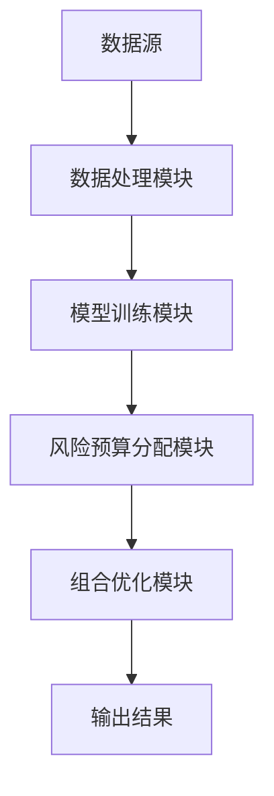
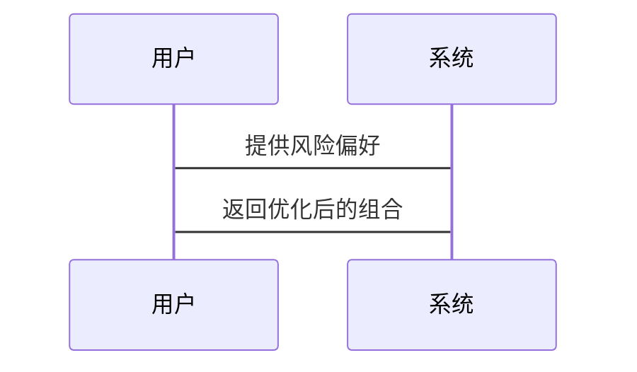

                 


# 智能投资组合风险预算分配模型

> **关键词**：智能投资组合，风险预算，投资组合优化，机器学习，金融风险管理  
> **摘要**：本文深入探讨了智能投资组合风险预算分配模型的设计与实现。从背景介绍到算法原理，再到系统架构与项目实战，详细讲解了如何利用智能方法优化投资组合的风险管理。通过数学模型、算法实现和实际案例分析，展示了该模型在金融领域中的应用价值。

---

# 第1章: 智能投资组合风险预算分配模型背景

## 1.1 投资组合管理的基本概念

### 1.1.1 投资组合管理的定义
投资组合管理是通过科学配置不同资产来实现投资目标的过程，旨在在风险可控的前提下最大化收益。

### 1.1.2 投资组合管理的核心目标
1. **风险控制**：通过分散投资降低风险。
2. **收益最大化**：在可承受风险范围内实现最大收益。
3. **动态调整**：根据市场变化及时优化投资组合。

### 1.1.3 投资组合管理的常见方法
1. **均值-方差模型**：通过优化资产的期望收益和方差实现最优配置。
2. **风险预算模型**：根据风险承受能力分配资产权重。
3. **现代投资组合理论（MPT）**：基于资产相关性构建最优组合。

## 1.2 风险预算模型的背景与意义

### 1.2.1 风险管理在投资组合中的重要性
投资组合的风险管理直接影响投资收益和组合稳定性。通过合理分配风险预算，可以在市场波动中保持组合的稳定性。

### 1.2.2 风险预算模型的定义
风险预算模型是一种将组合风险分解到各个资产或资产类别，并根据风险承受能力进行配置的方法。

### 1.2.3 风险预算模型的优势与应用场景
1. **优势**：
   - 量化风险，便于管理和监控。
   - 通过风险分散降低组合的整体风险。
2. **应用场景**：
   - 机构投资者的资产配置。
   - 基金管理中的风险控制。
   - 私人投资者的财富管理。

## 1.3 智能投资组合的优势与挑战

### 1.3.1 智能投资组合的定义
智能投资组合是指利用人工智能技术，通过数据分析和模型优化，动态调整投资组合配置。

### 1.3.2 智能投资组合的核心优势
1. **数据驱动**：利用大数据分析提升决策的准确性。
2. **实时优化**：根据市场变化快速调整组合配置。
3. **个性化定制**：根据不同投资者的风险偏好提供定制化服务。

### 1.3.3 智能投资组合面临的挑战
1. **数据质量问题**：需要高质量的历史数据和实时市场数据。
2. **模型风险**：算法的准确性和稳定性直接影响投资效果。
3. **市场适应性**：需要应对市场波动和突发事件的能力。

## 1.4 本章小结
本章介绍了投资组合管理的基本概念、风险预算模型的背景与意义，以及智能投资组合的优势与挑战，为后续章节的深入分析奠定了基础。

---

# 第2章: 智能投资组合风险预算分配模型的核心概念

## 2.1 智能投资组合的基本原理

### 2.1.1 数据驱动的投资决策
智能投资组合依赖于大量数据的分析，包括市场数据、宏观经济指标和投资者行为数据。

### 2.1.2 机器学习在投资组合管理中的应用
1. **预测模型**：利用机器学习算法预测资产价格和市场趋势。
2. **风险评估**：通过聚类分析和因子分析识别风险因素。
3. **组合优化**：使用强化学习优化投资组合配置。

### 2.1.3 智能投资组合的构建过程
1. **数据收集**：获取历史价格、收益率等数据。
2. **模型训练**：建立预测和优化模型。
3. **组合构建**：根据模型输出构建初始组合。
4. **风险评估**：评估组合的风险并进行调整。

## 2.2 风险预算分配模型的原理

### 2.2.1 风险预算分配的基本概念
风险预算分配是将组合的总风险预算分配到各个资产或资产类别，以控制整体风险。

### 2.2.2 风险预算分配的核心步骤
1. **确定总风险预算**：根据投资者的风险承受能力设定总风险预算。
2. **计算各资产的风险贡献**：评估每个资产对整体风险的贡献。
3. **调整资产权重**：根据风险预算分配调整各资产的权重。

### 2.2.3 风险预算分配的数学模型
风险预算分配模型可以用以下公式表示：

$$
\text{风险贡献}(i) = w_i \times \sigma_i
$$

其中，\( w_i \) 是资产 \( i \) 的权重，\( \sigma_i \) 是资产 \( i \) 的风险（标准差）。

## 2.3 智能投资组合与风险预算分配的结合

### 2.3.1 智能投资组合与风险预算分配的联系
智能投资组合利用机器学习算法优化资产配置，而风险预算分配则是优化过程中的关键步骤。

### 2.3.2 智能投资组合与风险预算分配的区别
智能投资组合侧重于整体优化，而风险预算分配是其中的一个具体步骤。

### 2.3.3 智能投资组合风险预算分配模型的框架
1. **数据输入**：市场数据、投资者风险偏好。
2. **模型训练**：建立预测和优化模型。
3. **风险预算分配**：根据模型输出分配风险预算。
4. **组合优化**：调整资产权重以满足风险预算。

## 2.4 本章小结
本章详细讲解了智能投资组合和风险预算分配的核心概念，分析了它们的联系与区别，并提出了模型的框架。

---

# 第3章: 智能投资组合风险预算分配模型的数学模型与算法

## 3.1 投资组合优化的数学模型

### 3.1.1 均值-方差模型
均值-方差模型是最经典的资产配置模型，目标是最小化组合的方差，同时满足收益和风险约束。

数学公式如下：

$$
\min_{w} \frac{1}{2} w^T \Sigma w \\
\text{subject to} \quad w^T \mu = \text{target\_return} \\
\quad \quad \sum_{i=1}^n w_i = 1
$$

其中，\( \Sigma \) 是协方差矩阵，\( \mu \) 是收益向量。

### 3.1.2 风险预算模型
风险预算模型通过控制各资产的风险贡献来实现整体风险的优化。

数学公式如下：

$$
\min_{w} \sum_{i=1}^n (w_i \times \sigma_i)^2 \\
\text{subject to} \quad \sum_{i=1}^n w_i = 1
$$

### 3.1.3 智能优化模型
智能优化模型结合机器学习算法，通过非线性优化实现更优的资产配置。

## 3.2 风险预算分配的核心算法

### 3.2.1 现代投资组合理论（MPT）
MPT通过优化资产配置实现收益与风险的最佳平衡。

### 3.2.2 风险预算分配算法
风险预算分配算法具体步骤如下：

1. **确定总风险预算**。
2. **计算各资产的风险贡献**。
3. **调整资产权重以满足风险预算**。

### 3.2.3 智能优化算法
智能优化算法包括遗传算法、粒子群优化等，用于解决复杂的非线性优化问题。

## 3.3 算法实现与优化

### 3.3.1 算法实现步骤
1. **数据预处理**：清洗和标准化数据。
2. **模型训练**：训练预测和优化模型。
3. **风险预算分配**：根据模型输出分配风险预算。
4. **组合优化**：调整资产权重以满足风险预算。

### 3.3.2 Python实现
以下是风险预算分配的Python代码示例：

```python
import numpy as np

def risk_budget_allocation(returns, target_risk):
    n = len(returns)
    cov_matrix = np.cov(returns)
    ones = np.ones(n)
    inv_cov = np.linalg.inv(cov_matrix)
    weights = inv_cov.dot(ones) / (ones.dot(inv_cov.dot(ones)))
    risk_contribution = weights * np.sqrt(np.diag(cov_matrix))
    max_risk = np.max(risk_contribution)
    scaling_factor = target_risk / max_risk
    final_weights = scaling_factor * weights
    return final_weights
```

### 3.3.3 算法优化
通过引入约束条件和优化目标函数，可以进一步提高算法的效率和准确性。

## 3.4 本章小结
本章详细讲解了投资组合优化的数学模型和风险预算分配的核心算法，分析了它们的实现步骤和优化方法。

---

# 第4章: 智能投资组合风险预算分配模型的系统分析与架构设计

## 4.1 问题场景介绍

### 4.1.1 投资者需求
投资者需要根据自身的风险承受能力和收益目标，构建最优的投资组合。

### 4.1.2 市场环境
市场环境包括宏观经济指标、市场波动性和资产价格走势。

## 4.2 系统功能设计

### 4.2.1 数据采集模块
负责采集市场数据、历史价格和宏观经济指标。

### 4.2.2 模型训练模块
利用机器学习算法训练预测和优化模型。

### 4.2.3 风险预算分配模块
根据模型输出分配风险预算，优化投资组合配置。

## 4.3 系统架构设计

### 4.3.1 系统架构图


### 4.3.2 系统交互设计


## 4.4 系统接口设计

### 4.4.1 数据接口
1. **输入接口**：市场数据接口。
2. **输出接口**：优化后的组合配置。

### 4.4.2 用户接口
1. **输入**：投资者风险偏好。
2. **输出**：优化后的投资组合。

## 4.5 本章小结
本章分析了系统设计的主要模块和架构，展示了各模块之间的关系和交互流程。

---

# 第5章: 智能投资组合风险预算分配模型的项目实战

## 5.1 环境安装

### 5.1.1 安装Python环境
安装Python 3.x 及其常用的库，如 numpy、pandas、scipy、sklearn。

### 5.1.2 安装机器学习库
安装 scikit-learn、xgboost 等机器学习库。

## 5.2 核心代码实现

### 5.2.1 数据处理代码
```python
import pandas as pd
import numpy as np

# 读取数据
data = pd.read_csv('market_data.csv')
returns = data.pct_change().dropna()
```

### 5.2.2 风险预算分配代码
```python
def risk_budget_allocation(returns):
    n = returns.shape[1]
    cov_matrix = returns.cov()
    inv_cov = np.linalg.inv(cov_matrix.values)
    ones = np.ones(n)
    weights = inv_cov.dot(ones) / (ones.dot(inv_cov.dot(ones)))
    return weights
```

### 5.2.3 组合优化代码
```python
from sklearn.gaussian_process import GaussianProcessRegressor

def optimize_portfolio(weights, returns):
    model = GaussianProcessRegressor()
    model.fit(returns, np.zeros(len(returns)))
    predicted_returns = model.predict(returns)
    portfolio_return = np.dot(weights, predicted_returns)
    return -portfolio_return  # 最小化问题
```

## 5.3 案例分析与详细讲解

### 5.3.1 数据准备
假设我们有三个资产：股票、债券和黄金，分别获取它们的收益率数据。

### 5.3.2 模型训练
利用历史数据训练机器学习模型，预测未来的资产收益率。

### 5.3.3 风险预算分配
根据模型预测的风险情况，分配风险预算，优化投资组合。

### 5.3.4 结果分析
分析优化后的组合配置，评估其风险和收益是否符合预期。

## 5.4 本章小结
本章通过实际案例展示了智能投资组合风险预算分配模型的实现过程，从数据处理到模型训练，再到组合优化，详细讲解了每一步的操作。

---

# 第6章: 智能投资组合风险预算分配模型的最佳实践与总结

## 6.1 最佳实践 tips

### 6.1.1 数据质量
确保数据的完整性和准确性，选择合适的数据源。

### 6.1.2 模型选择
根据具体需求选择合适的机器学习模型，进行充分的模型验证和调优。

### 6.1.3 风险监控
实时监控市场变化和组合风险，及时进行调整。

## 6.2 小结
智能投资组合风险预算分配模型通过机器学习和优化算法，能够有效降低投资组合的风险，提高收益。

## 6.3 注意事项

### 6.3.1 数据依赖性
模型的准确性依赖于数据的质量和数量。

### 6.3.2 市场适应性
需要根据市场变化动态调整模型和组合配置。

### 6.3.3 模型风险
算法的准确性和稳定性直接影响投资结果，需谨慎选择和优化。

## 6.4 拓展阅读

### 6.4.1 推荐书籍
1. 《投资学》（全球经典教材）
2. 《机器学习实战》

### 6.4.2 推荐论文
1. "Risk Budgeting in.Portfolio Optimization"（经典论文）

## 6.5 本章小结
本章总结了智能投资组合风险预算分配模型的最佳实践，强调了数据质量和模型选择的重要性，并提供了进一步学习的资源。

---

# 作者：AI天才研究院/AI Genius Institute & 禅与计算机程序设计艺术 /Zen And The Art of Computer Programming

