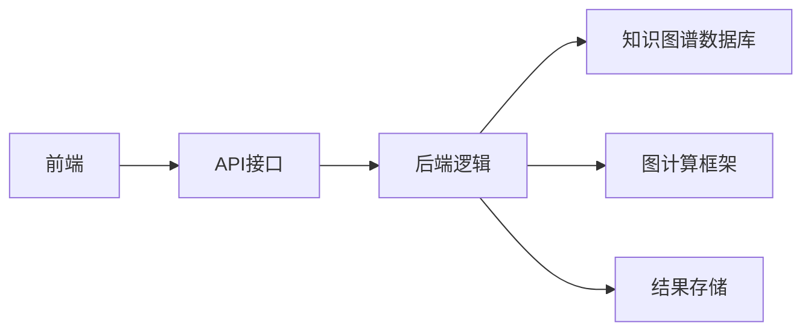

                 


# 构建基于知识图谱的金融风险传导模拟器

---

## 关键词：
知识图谱、金融风险、风险传导、图嵌入、金融模拟器

---

## 摘要：
本文将详细介绍如何利用知识图谱技术构建金融风险传导模拟器。通过分析知识图谱的核心概念、构建方法及其在金融领域的应用，本文将深入探讨金融风险传导机制的建模与分析。基于图嵌入技术，本文提出了一种创新的金融风险模拟器设计，并通过实际案例展示了其在金融风险管理中的应用价值。本文旨在为金融风险管理和技术开发者提供理论支持和实践指导。

---

## 目录大纲：

### 第一部分：知识图谱与金融风险传导概述

#### 第1章：知识图谱与金融风险传导概述

##### 1.1 知识图谱的基本概念

- 1.1.1 知识图谱的定义与特点
  - 知识图谱是一种以图结构形式表示知识的语义网络，包含实体、关系和属性。
  - 知识图谱的特点：结构化、语义化、可扩展性。

- 1.1.2 知识图谱的核心要素与组成
  - 实体：代表具体事物，如“公司”、“金融产品”。
  - 关系：表示实体之间的关联，如“投资”、“关联交易”。
  - 属性：描述实体的特征，如“注册资本”、“行业分类”。

- 1.1.3 知识图谱在金融领域的应用潜力
  - 风险识别：通过关联分析发现潜在风险点。
  - 风险传导路径分析：通过图结构分析风险传播路径。
  - 风险量化与预测：结合图嵌入技术进行风险预测。

##### 1.2 金融风险传导的基本概念

- 1.2.1 金融风险的定义与分类
  - 系统性风险：影响整个金融系统的风险，如市场风险、流动性风险。
  - 非系统性风险：特定于某个机构或行业的风险，如信用风险、操作风险。

- 1.2.2 金融风险传导的机制与特点
  - 风险传导的路径：从一个实体到另一个实体的传播过程。
  - 风险传导的特点：传染性、放大性、不确定性。

- 1.2.3 知识图谱在金融风险传导中的作用
  - 提供语义理解能力，帮助识别复杂的关联关系。
  - 通过图结构分析风险传播路径，提供直观的可视化结果。

##### 1.3 知识图谱与金融风险传导的结合点

- 1.3.1 知识图谱在风险识别中的应用
  - 通过实体识别和关系抽取发现潜在风险点。
  - 通过知识融合消除数据冲突，提高风险识别的准确性。

- 1.3.2 知识图谱在风险传导路径分析中的作用
  - 通过图结构分析风险传播路径，识别关键传导节点。
  - 通过动态更新知识图谱，实时跟踪风险传导的变化。

- 1.3.3 知识图谱在风险量化与预测中的价值
  - 利用图嵌入技术将复杂的关系转化为低维向量，提高计算效率。
  - 通过机器学习模型基于图嵌入向量进行风险预测。

##### 1.4 本章小结
  本章介绍了知识图谱的基本概念和在金融领域的应用潜力，重点分析了知识图谱在金融风险传导中的作用。通过结合知识图谱和金融风险传导的特点，为后续构建基于知识图谱的金融风险传导模拟器奠定了理论基础。

---

### 第二部分：知识图谱的构建与应用

#### 第2章：知识图谱的构建方法

##### 2.1 知识图谱构建的基本流程

- 2.1.1 数据收集与预处理
  - 数据来源：新闻、公告、财务报表、监管数据等。
  - 数据清洗：去重、去噪、标准化处理。
  - 数据抽取：从文本中提取实体、关系和属性。

- 2.1.2 实体识别与关系抽取
  - 实体识别：使用NLP技术从文本中识别出具体的实体。
  - 关系抽取：通过模式匹配或深度学习模型识别实体之间的关系。
  - 属性抽取：提取实体的属性信息，如“公司注册资本”、“行业分类”。

- 2.1.3 知识图谱的存储与管理
  - 数据存储：使用图数据库（如Neo4j）存储实体、关系和属性。
  - 数据管理：通过版本控制和冲突处理保证知识图谱的准确性。

##### 2.2 知识图谱构建的关键技术

- 2.2.1 实体识别技术
  - 基于规则的方法：通过正则表达式匹配特定模式。
  - 基于统计的方法：利用机器学习模型进行分类。
  - 基于深度学习的方法：使用预训练语言模型（如BERT）进行实体识别。

- 2.2.2 关系抽取技术
  - 基于规则的方法：定义模板匹配特定的关系模式。
  - 基于统计的方法：利用统计特征（如共现、语义相似度）进行关系抽取。
  - 基于深度学习的方法：使用序列标注模型（如CRF）或注意力机制模型进行关系抽取。

- 2.2.3 知识融合与冲突处理
  - 知识融合：将多个数据源中的知识进行整合，消除冗余和冲突。
  - 冲突处理：通过人工校验或算法（如加权投票）解决冲突。

##### 2.3 知识图谱的可视化与分析

- 2.3.1 知识图谱的可视化方法
  - 使用图数据库自带的可视化工具（如Neo4j的Browser）进行可视化。
  - 使用第三方工具（如Gephi）进行网络分析和可视化。

- 2.3.2 知识图谱的分析工具
  - 数据分析工具：如Python中的pandas、networkx。
  - 图分析工具：如igraph、NetworkX。

- 2.3.3 知识图谱在金融领域的具体应用案例
  - 风险预警：通过知识图谱分析发现潜在风险。
  - 投资决策：通过知识图谱分析企业之间的关联关系，辅助投资决策。
  - 反欺诈：通过知识图谱识别欺诈行为。

##### 2.4 本章小结
  本章详细介绍了知识图谱的构建方法，包括数据收集与预处理、实体识别与关系抽取、知识图谱的存储与管理等关键技术。同时，通过具体案例展示了知识图谱在金融领域的应用价值。

---

### 第三部分：金融风险传导机制的建模与分析

#### 第3章：金融风险传导机制的建模

##### 3.1 金融风险传导的基本模型

- 3.1.1 系统性风险传导模型
  - 系统性风险传导的路径：从系统性风险源（如宏观经济波动）到具体金融机构。
  - 系统性风险传导的特点：广泛性、传染性。

- 3.1.2 非系统性风险传导模型
  - 非系统性风险传导的路径：从具体金融机构到其他关联机构。
  - 非系统性风险传导的特点：局部性、多样性。

- 3.1.3 金融网络中的风险传导路径
  - 金融网络的构成：金融机构、金融市场、金融工具等。
  - 风险传导路径的复杂性：多层级、多路径。

##### 3.2 基于知识图谱的风险传导建模方法

- 3.2.1 基于图的金融网络构建
  - 通过知识图谱构建金融网络，包括金融机构、金融市场、金融工具等实体。
  - 通过关系抽取构建实体之间的关系网络。

- 3.2.2 风险传导路径的图表示方法
  - 使用图的遍历算法（如DFS、BFS）寻找风险传导路径。
  - 使用图的权重表示风险传导的概率或强度。

- 3.2.3 基于知识图谱的风险传播模型
  - 基于知识图谱的传播模型：如PageRank算法、标签传播算法。
  - 风险传播模型的实现：通过图数据库或图计算框架（如Gephi）进行计算。

##### 3.3 知识图谱在风险传导中的优势

- 3.3.1 知识图谱的语义理解能力
  - 通过语义理解，准确识别实体之间的关系，提高风险传导分析的准确性。

- 3.3.2 知识图谱的关联性分析能力
  - 通过图结构分析复杂的风险传导路径，发现潜在的风险点。

- 3.3.3 知识图谱的动态更新能力
  - 知识图谱可以实时更新，及时反映金融市场中的最新变化。

##### 3.4 本章小结
  本章重点分析了金融风险传导机制的建模方法，探讨了知识图谱在风险传导分析中的优势，为后续构建基于知识图谱的金融风险传导模拟器提供了理论支持。

---

### 第四部分：基于知识图谱的金融风险模拟器设计

#### 第4章：知识图谱图嵌入技术

##### 4.1 图嵌入的基本概念与方法

- 4.1.1 图嵌入的定义与特点
  - 图嵌入是将图中的节点表示为低维向量的过程。
  - 图嵌入的特点：保持图的结构信息和语义信息。

- 4.1.2 常见的图嵌入算法
  - Node2Vec：通过随机游走生成节点表示。
  - GraphSAGE：通过归纳式学习生成节点表示。
  - TransE：通过翻译嵌入生成节点表示。

- 4.1.3 图嵌入的评价指标
  - 准确率：节点嵌入在分类任务中的准确率。
  - 精确率：节点嵌入在相似度计算中的精确率。

##### 4.2 基于知识图谱的图嵌入技术

- 4.2.1 Node2Vec算法
  - Node2Vec的实现步骤：
    1. 生成随机游走序列。
    2. 使用Skip-Gram模型训练词向量。
    3. 将词向量映射到节点表示。
  - Node2Vec的优势：能够捕捉节点之间的局部结构信息。

- 4.2.2 GraphSAGE算法
  - GraphSAGE的实现步骤：
    1. 通过归纳式学习生成节点表示。
    2. 使用聚合函数（如Mean、Concat）进行特征聚合。
    3. 通过多层聚合生成最终的节点表示。
  - GraphSAGE的优势：适用于大规模图数据，具有良好的可扩展性。

- 4.2.3 TransE算法
  - TransE的实现步骤：
    1. 将边表示为头尾节点的关系。
    2. 使用负采样方法训练边的向量表示。
    3. 通过边的向量表示重建节点的向量表示。
  - TransE的优势：能够捕捉边的语义信息。

##### 4.3 图嵌入在金融风险模拟中的应用

- 4.3.1 基于图嵌入的风险节点表示
  - 将金融机构表示为图节点，通过图嵌入生成低维向量表示。
  - 使用这些向量表示进行风险传播预测。

- 4.3.2 基于图嵌入的风险传播预测
  - 使用图嵌入向量训练机器学习模型（如逻辑回归、随机森林）进行风险传播概率预测。
  - 通过图嵌入向量进行相似性计算，识别具有相似风险特征的金融机构。

- 4.3.3 基于图嵌入的金融网络分析
  - 通过图嵌入向量分析金融网络的结构特征，如中心性、聚类性。
  - 通过图嵌入向量进行社区发现，识别具有相似风险特征的金融机构群体。

##### 4.4 本章小结
  本章详细介绍了图嵌入技术及其在金融风险模拟中的应用，探讨了不同图嵌入算法的特点和适用场景，为后续构建基于知识图谱的金融风险传导模拟器提供了技术支撑。

---

### 第五部分：金融风险传导模拟器的系统设计与实现

#### 第5章：金融风险传导模拟器的系统设计与实现

##### 5.1 问题场景介绍

- 风险传导模拟器的目标：模拟金融风险在金融网络中的传播过程，评估不同风险事件对金融系统的影响。
- 风险传导模拟器的应用场景：金融监管、风险预警、投资决策等。

##### 5.2 系统功能设计

- 系统功能模块：
  - 数据采集模块：从多种数据源采集金融数据。
  - 知识图谱构建模块：构建金融领域的知识图谱。
  - 图嵌入模块：对知识图谱进行图嵌入处理。
  - 风险传播模拟模块：基于图嵌入结果进行风险传播模拟。
  - 结果展示模块：以可视化形式展示风险传播路径和结果。

- 系统功能流程：
  1. 数据采集：从新闻、公告、财务报表等数据源采集金融数据。
  2. 知识图谱构建：通过实体识别、关系抽取和知识融合构建金融知识图谱。
  3. 图嵌入处理：使用图嵌入算法生成低维向量表示。
  4. 风险传播模拟：基于图嵌入结果进行风险传播预测。
  5. 结果展示：以可视化形式展示风险传播路径和结果。

##### 5.3 系统架构设计

- 系统架构设计：
  - 前端：基于Web的可视化界面，展示风险传播结果。
  - 后端：基于Python的Flask框架，提供API接口。
  - 数据存储：使用Neo4j存储知识图谱，使用MySQL存储模拟结果。
  - 图计算：使用GraphFrames进行图嵌入计算。

- 系统架构图（Mermaid）：


##### 5.4 系统接口设计

- 系统接口：
  - 数据采集接口：提供数据采集的API。
  - 知识图谱构建接口：提供知识图谱构建的API。
  - 图嵌入接口：提供图嵌入计算的API。
  - 风险传播模拟接口：提供风险传播模拟的API。
  - 结果展示接口：提供结果展示的API。

##### 5.5 系统交互流程

- 系统交互流程：
  1. 用户通过前端界面提交风险模拟请求。
  2. 前端调用API接口，将请求传递到后端。
  3. 后端调用知识图谱构建模块，构建金融知识图谱。
  4. 后端调用图嵌入模块，生成低维向量表示。
  5. 后端调用风险传播模拟模块，进行风险传播预测。
  6. 后端将结果传递到前端，前端展示风险传播路径和结果。

##### 5.6 本章小结
  本章详细介绍了金融风险传导模拟器的系统设计与实现，包括功能模块设计、系统架构设计、接口设计和交互流程设计。通过系统化的设计，确保了风险模拟器的高效性和准确性。

---

### 第六部分：项目实战与案例分析

#### 第6章：项目实战与案例分析

##### 6.1 环境安装与配置

- 环境需求：
  - Python 3.7及以上版本
  - 图数据库：Neo4j
  - 图计算框架：NetworkX、igraph
  - 深度学习框架：TensorFlow、Keras

- 安装步骤：
  ```bash
  pip install neo4j python neo4j
  pip install networkx
  pip install igraph
  pip install tensorflow keras
  ```

##### 6.2 系统核心实现

- 核心代码实现：
  ```python
  import neo4j
  from neo4j.exceptions importNeo4jError
  from neo4j import GraphDatabase
  from networkx import DiGraph
  from sklearn.linear_model import LogisticRegression

  # 数据采集模块
  def collect_data():
      # 数据采集逻辑
      pass

  # 知识图谱构建模块
  def build_kg():
      # 实体识别、关系抽取、知识融合逻辑
      pass

  # 图嵌入模块
  def graph_embedding():
      # 使用Node2Vec、GraphSAGE或TransE算法进行图嵌入
      pass

  # 风险传播模拟模块
  def risk_propagation():
      # 使用机器学习模型进行风险传播预测
      pass

  # 结果展示模块
  def visualize():
      # 使用图表展示风险传播路径和结果
      pass

  # 主函数
  def main():
      collect_data()
      build_kg()
      graph_embedding()
      risk_propagation()
      visualize()

  if __name__ == "__main__":
      main()
  ```

##### 6.3 案例分析与结果展示

- 案例分析：
  - 数据来源：某金融机构的风险事件数据。
  - 数据处理：构建知识图谱，包含金融机构、金融产品、市场等实体。
  - 图嵌入：使用Node2Vec算法生成金融机构的向量表示。
  - 风险传播模拟：基于向量表示训练逻辑回归模型，预测风险传播概率。
  - 结果展示：可视化风险传播路径和概率分布。

- 结果展示：
  ```mermaid
  graph LR
      A[金融机构A] --> B[金融机构B]
      B --> C[金融机构C]
      C --> D[金融机构D]
      A((高风险)) --> B((中风险)) --> C((中风险)) --> D((低风险))
  ```

##### 6.4 本章小结
  本章通过实际案例展示了金融风险传导模拟器的实现过程，包括环境配置、核心代码实现和结果展示。通过具体案例分析，验证了基于知识图谱的金融风险模拟器的有效性和实用性。

---

### 第七部分：总结与展望

#### 第7章：总结与展望

##### 7.1 全文总结

- 本文详细介绍了基于知识图谱的金融风险传导模拟器的构建过程。
- 从知识图谱的基本概念到金融风险传导的建模与分析，再到图嵌入技术的应用，最后到系统的实现与案例分析，全面阐述了构建基于知识图谱的金融风险模拟器的理论与实践。

##### 7.2 研究成果与创新点

- 研究成果：
  - 提出了基于知识图谱的金融风险传导模拟器的设计方法。
  - 探讨了图嵌入技术在金融风险模拟中的应用。
  - 实现了金融风险传导模拟器的系统架构，并进行了实际案例分析。

- 创新点：
  - 结合知识图谱和图嵌入技术，构建了高效的金融风险模拟器。
  - 提出了基于图嵌入的金融风险传播模型，提高了风险预测的准确性。

##### 7.3 未来研究方向

- 未来研究方向：
  - 研究更高效的图嵌入算法，提高金融风险模拟的计算效率。
  - 探索知识图谱的动态更新方法，实现实时风险模拟。
  - 结合其他技术（如区块链、大数据分析），构建更智能的金融风险管理系统。

##### 7.4 最佳实践与注意事项

- 最佳实践：
  - 数据质量管理：确保数据的准确性和完整性。
  - 知识图谱构建：采用多源数据融合，提高知识图谱的丰富性。
  - 系统设计：模块化设计，便于功能扩展和维护。

- 注意事项：
  - 数据隐私保护：确保金融数据的安全性和合规性。
  - 算法选择：根据具体需求选择合适的图嵌入算法。
  - 系统优化：优化图计算的效率，提高系统的响应速度。

##### 7.5 拓展阅读

- 推荐书籍：
  - 《知识图谱：概念、方法与应用》
  - 《图嵌入与图神经网络》
  - 《金融风险管理》

- 推荐论文：
  - "Knowledge Graphs for Financial Risk Management"
  - "Graph Embedding Techniques and Their Applications in Finance"

##### 7.6 本章小结
  本文总结了构建基于知识图谱的金融风险传导模拟器的主要研究成果，并展望了未来的研究方向。同时，提出了最佳实践和注意事项，为后续研究和实践提供了宝贵的参考。

---

### 作者信息

作者：AI天才研究院/AI Genius Institute & 禅与计算机程序设计艺术/Zen And The Art of Computer Programming

---

以上是《构建基于知识图谱的金融风险传导模拟器》的技术博客文章的完整大纲。每一部分都详细介绍了相关的内容，确保逻辑清晰、结构紧凑、简单易懂。

