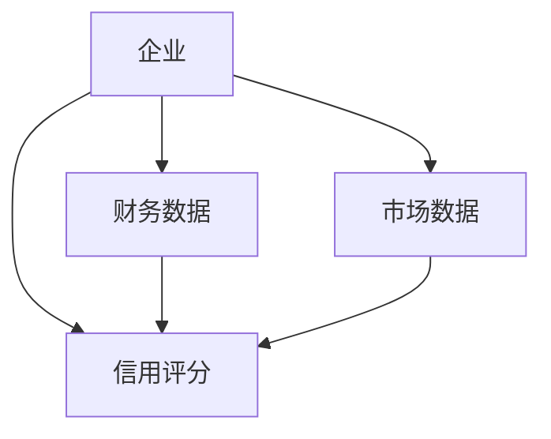
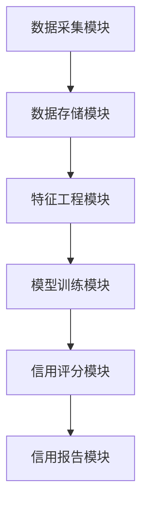

                 


# 构建智能化的企业信用评级系统

## 关键词：企业信用评级，人工智能，大数据，机器学习，系统架构

## 摘要：  
随着企业融资需求的不断增加，传统的信用评级方法逐渐暴露出效率低下、准确性不足的问题。通过引入人工智能和大数据技术，构建智能化的企业信用评级系统，能够显著提升评级的效率和准确性。本文将从系统架构设计、核心算法实现、数据处理流程等多个方面详细阐述如何构建一个智能化的企业信用评级系统。

---

# 第1章：企业信用评级系统概述

## 1.1 企业信用评级的定义与重要性

### 1.1.1 企业信用评级的基本概念  
企业信用评级是对企业在一定时期内的财务状况、经营能力、偿债能力和市场风险进行综合评估的过程。评级结果通常以信用等级（如AAA、AA、A、BBB、BB、B、CCC、CC、C、D）的形式呈现，反映了企业在偿还债务方面的风险程度。

### 1.1.2 信用评级在企业融资中的作用  
信用评级是企业获取贷款、发行债券等融资活动的重要依据。较高的信用评级能够降低企业的融资成本，提高融资成功的可能性；而较低的信用评级则可能导致融资成本上升或融资失败。

### 1.1.3 智能化信用评级的优势  
传统的信用评级方法主要依赖人工分析，存在主观性强、效率低、成本高等问题。而智能化信用评级通过引入人工智能和大数据技术，能够快速处理海量数据，发现潜在风险，提高评级的准确性和效率。

---

## 1.2 传统信用评级方法的局限性

### 1.2.1 传统评级方法的特点  
传统信用评级方法主要依赖人工分析，包括对企业财务报表的解读、行业分析和主观判断。这种方法需要大量的人力资源，且容易受到主观因素的影响。

### 1.2.2 传统评级方法的局限性  
1. **数据处理能力有限**：传统方法难以处理海量数据，尤其是非结构化数据（如新闻、社交媒体数据）。
2. **效率低下**：人工分析耗时长，难以满足企业快速融资的需求。
3. **主观性较强**：评级结果可能受到评级机构主观判断的影响。

### 1.2.3 智能化评级的必要性  
智能化评级能够通过自动化数据处理、机器学习算法和实时数据分析，显著提高评级的效率和准确性。特别是在面对海量数据和复杂市场环境时，智能化评级更具优势。

---

## 1.3 智能化信用评级的背景与发展趋势

### 1.3.1 人工智能与大数据的兴起  
近年来，人工智能（AI）和大数据技术的快速发展为企业信用评级的智能化提供了技术支持。机器学习算法（如逻辑回归、随机森林、神经网络等）能够从海量数据中提取有价值的信息，帮助评估企业的信用风险。

### 1.3.2 企业信用评级智能化的驱动力  
1. **技术进步**：AI和大数据技术的成熟为信用评级的智能化提供了可能。
2. **市场需求**：企业对高效、准确的信用评级服务的需求不断增加。
3. **成本压力**：传统评级方法的高成本推动了智能化评级的普及。

### 1.3.3 智能化信用评级的未来趋势  
未来的智能化信用评级系统将更加注重实时数据分析、非结构化数据处理和个性化评估。同时，区块链技术的应用也将进一步提升信用评级的透明度和安全性。

---

# 第2章：企业信用评级的核心要素与系统架构

## 2.1 企业信用评级的核心要素

### 2.1.1 企业基本面分析  
基本面分析是信用评级的重要组成部分，主要包括企业的财务状况、经营能力、市场地位和管理团队等方面。以下是基本面分析的核心指标：

| **指标类别** | **具体指标** | **描述** |
|--------------|---------------|----------|
| 财务状况     | 营业收入       | 反映企业经营规模和能力。 |
|              | 净利润         | 衡量企业盈利能力。 |
|              | 资产负债率     | 评估企业的债务风险。 |
| 经营能力     | 主营业务收入增长率 | 反映企业市场竞争力。 |
|              | 存货周转率     | 衡量企业运营效率。 |
| 市场地位     | 行业排名       | 评估企业在行业中的地位。 |
|              | 市场份额       | 反映企业的市场影响力。 |

### 2.1.2 财务指标分析  
财务指标是信用评级的重要依据，主要包括盈利能力、偿债能力、运营能力和成长能力四个维度。以下是常用财务指标：

| **维度**      | **指标**           | **公式**                                                                 |
|---------------|--------------------|--------------------------------------------------------------------------|
| 盈利能力      | 净利润率           | 净利润 / 营业收入                                                     |
| 偿债能力      | 速动比率           | （流动资产 - 存货） / 流动负债                                       |
| 运营能力      | 应收账款周转率     | 营业收入 / 平均应收账款                                             |
| 成长能力      | 净利润增长率       | （本年净利润 - 上年净利润） / 上年净利润                             |

### 2.1.3 市场表现与行业风险  
市场表现和行业风险是信用评级中不可忽视的因素。市场表现包括股票价格波动、成交量、行业趋势等，而行业风险则涉及行业周期、政策变化和竞争格局等因素。

### 2.1.4 企业信用评级的多维度特征  
智能化信用评级系统需要综合考虑企业的财务数据、市场表现、行业风险、管理团队等多个维度的特征，以全面评估企业的信用风险。

---

## 2.2 企业信用评级系统的架构

### 2.2.1 系统功能模块划分  
智能化企业信用评级系统可以划分为以下几个功能模块：

1. **数据采集模块**：负责收集企业的财务数据、市场数据和非结构化数据。
2. **特征工程模块**：对数据进行清洗、转换和特征提取，生成适合模型输入的特征向量。
3. **模型训练模块**：利用机器学习算法训练信用评级模型。
4. **信用评分模块**：根据模型输出的结果，生成企业的信用评分和等级。

### 2.2.2 数据流与信息处理流程  
以下是数据流与信息处理流程的描述：

1. **数据采集**：从企业财务报表、市场数据、新闻媒体等多渠道获取数据。
2. **数据清洗**：对采集到的数据进行去重、缺失值处理和异常值处理。
3. **特征提取**：将数据转换为适合模型输入的特征向量。
4. **模型训练**：利用训练数据训练信用评级模型。
5. **模型评估**：通过测试数据评估模型的准确性和稳定性。
6. **信用评分**：将企业数据输入模型，生成信用评分和等级。

### 2.2.3 系统输入与输出定义  
- **系统输入**：企业的财务数据、市场数据、非结构化数据。
- **系统输出**：企业的信用评分（如AAA、AA、A等）和信用报告。

---

## 2.3 系统核心概念与实体关系

### 2.3.1 核心概念的定义与属性  
以下是系统中的核心概念及其属性：

| **实体**      | **属性**           | **描述**                                             |
|---------------|--------------------|------------------------------------------------------|
| 企业          | 企业ID、企业名称、行业、成立时间 | 企业的基本信息。                                     |
| 财务数据      | 营业收入、净利润、资产负债率 | 企业的财务指标。                                    |
| 市场数据      | 股票价格、成交量、行业指数 | 企业的市场表现数据。                                |
| 信用评分      | 评分结果、评分时间 | 企业的信用评分结果。                                 |

### 2.3.2 实体关系图（ER图）  
以下是系统核心实体及其关系的ER图：



---

## 2.4 系统核心算法与实现

### 2.4.1 算法选择与原理  
智能化信用评级系统可以选择多种算法，如逻辑回归、随机森林、支持向量机（SVM）等。以下是逻辑回归和随机森林的简要介绍：

#### 逻辑回归
逻辑回归是一种常用的分类算法，适用于二分类问题。其核心思想是通过sigmoid函数将线性回归的结果映射到概率空间，从而实现分类。

逻辑回归的数学公式如下：

$$ P(y=1|x) = \frac{1}{1 + e^{-\beta x}} $$

其中，$\beta$ 是模型的系数，$x$ 是输入特征。

#### 随机森林
随机森林是一种基于决策树的集成学习算法，通过构建多棵决策树并进行投票或平均，可以有效提高模型的准确性和稳定性。

---

### 2.4.2 算法实现步骤  
以下是逻辑回归算法的实现步骤：

1. **数据预处理**：对数据进行清洗、标准化和特征选择。
2. **模型训练**：利用训练数据训练逻辑回归模型。
3. **模型评估**：通过测试数据评估模型的准确率、召回率和F1分数。
4. **模型部署**：将模型部署到生产环境，用于实时信用评分。

---

## 2.5 系统架构设计与实现

### 2.5.1 系统功能设计  
以下是系统功能模块的详细设计：

1. **数据采集模块**：
   - 数据源：企业财务报表、市场数据、新闻媒体。
   - 数据格式：结构化数据（如Excel、CSV）和非结构化数据（如文本、图像）。

2. **特征工程模块**：
   - 数据清洗：处理缺失值、重复值和异常值。
   - 特征提取：将数据转换为适合模型输入的特征向量。

3. **模型训练模块**：
   - 算法选择：逻辑回归、随机森林等。
   - 模型调优：通过交叉验证优化模型参数。

4. **信用评分模块**：
   - 评分计算：将企业数据输入模型，生成信用评分。
   - 评分报告：生成详细的信用评分报告，包括评分结果、评分依据和建议。

---

## 2.5.2 系统架构设计  
以下是系统架构的简要设计：



---

## 2.5.3 系统接口设计  
以下是系统接口的简要设计：

1. **数据接口**：
   - 输入接口：企业数据输入接口。
   - 输出接口：模型输出信用评分接口。

2. **用户接口**：
   - 界面设计：用户友好的图形化界面。
   - 功能模块：数据上传、信用评分查询、报告下载等。

---

## 2.5.4 系统交互流程  
以下是系统交互流程的简要描述：

1. 用户上传企业数据。
2. 系统对数据进行清洗和特征提取。
3. 模型训练模块对数据进行训练，生成信用评分。
4. 用户查询信用评分结果并下载报告。

---

## 2.5.5 系统性能优化  
1. **数据预处理**：通过特征选择和降维技术（如PCA）提高数据处理效率。
2. **模型优化**：通过网格搜索（Grid Search）优化模型参数。
3. **并行计算**：利用分布式计算框架（如Spark）提高计算效率。

---

# 第3章：企业信用评级系统中的关键算法与模型

## 3.1 信用评级中的分类算法

### 3.1.1 逻辑回归模型  
逻辑回归是一种常用的二分类算法，适用于企业信用评级中的违约风险预测。其核心思想是通过sigmoid函数将线性回归的结果映射到概率空间，从而实现分类。

逻辑回归的数学公式如下：

$$ P(y=1|x) = \frac{1}{1 + e^{-\beta x}} $$

其中，$\beta$ 是模型的系数，$x$ 是输入特征。

### 3.1.2 支持向量机（SVM）  
支持向量机是一种强大的分类算法，适用于高维数据的分类问题。其核心思想是通过找到一个超平面，将数据点分为不同的类别。

SVM的数学公式如下：

$$ y = \text{sign}(w \cdot x + b) $$

其中，$w$ 是权重向量，$x$ 是输入特征，$b$ 是偏置项。

### 3.1.3 随机森林与梯度提升树  
随机森林是一种基于决策树的集成学习算法，通过构建多棵决策树并进行投票，可以有效提高模型的准确性和稳定性。

梯度提升树是一种基于树模型的优化算法，通过迭代优化模型，逐步减少预测误差。

---

## 3.2 基于机器学习的信用评级模型

### 3.2.1 模型训练流程  
以下是基于机器学习的信用评级模型的训练流程：

1. **数据预处理**：对数据进行清洗、标准化和特征选择。
2. **特征工程**：将数据转换为适合模型输入的特征向量。
3. **模型训练**：利用训练数据训练机器学习模型。
4. **模型评估**：通过测试数据评估模型的准确率、召回率和F1分数。
5. **模型部署**：将模型部署到生产环境，用于实时信用评分。

---

## 3.3 算法实现与优化

### 3.3.1 算法实现步骤  
以下是逻辑回归算法的实现步骤：

1. **数据预处理**：对数据进行清洗、标准化和特征选择。
2. **模型训练**：利用训练数据训练逻辑回归模型。
3. **模型评估**：通过测试数据评估模型的准确率、召回率和F1分数。
4. **模型部署**：将模型部署到生产环境，用于实时信用评分。

---

## 3.4 算法优化策略  
1. **特征选择**：通过相关性分析和重要性排序，选择对信用评级影响较大的特征。
2. **模型调优**：通过网格搜索优化模型参数，提高模型的准确性和稳定性。
3. **数据增强**：通过数据扩增技术（如数据合成、数据清洗）提高模型的泛化能力。

---

# 第4章：系统架构设计与实现

## 4.1 系统功能设计

### 4.1.1 数据采集模块  
数据采集模块负责从企业财务报表、市场数据和新闻媒体等多渠道获取数据。以下是数据采集的具体步骤：

1. **数据源选择**：确定数据来源，如企业财务报表、市场数据、新闻媒体。
2. **数据格式转换**：将数据转换为适合模型输入的格式，如CSV、JSON等。
3. **数据清洗**：处理缺失值、重复值和异常值。

### 4.1.2 特征工程模块  
特征工程模块负责对数据进行清洗、转换和特征提取，生成适合模型输入的特征向量。以下是特征工程的具体步骤：

1. **数据清洗**：处理缺失值、重复值和异常值。
2. **特征提取**：将数据转换为适合模型输入的特征向量。
3. **特征选择**：通过相关性分析和重要性排序，选择对信用评级影响较大的特征。

---

### 4.1.3 模型训练模块  
模型训练模块负责利用训练数据训练信用评级模型。以下是模型训练的具体步骤：

1. **算法选择**：选择适合信用评级的算法，如逻辑回归、随机森林等。
2. **模型训练**：利用训练数据训练模型。
3. **模型评估**：通过测试数据评估模型的准确率、召回率和F1分数。

---

### 4.1.4 信用评分模块  
信用评分模块负责将企业数据输入模型，生成信用评分和等级。以下是信用评分的具体步骤：

1. **数据输入**：将企业数据输入模型。
2. **评分计算**：模型生成企业的信用评分。
3. **评分报告**：生成详细的信用评分报告，包括评分结果、评分依据和建议。

---

## 4.2 系统架构设计

### 4.2.1 系统功能模块划分  
智能化企业信用评级系统可以划分为以下几个功能模块：

1. **数据采集模块**：负责数据的采集和预处理。
2. **特征工程模块**：负责特征的提取和选择。
3. **模型训练模块**：负责模型的训练和评估。
4. **信用评分模块**：负责信用评分的生成和报告。

---

### 4.2.2 系统架构设计  
以下是系统架构的简要设计：


---

## 4.3 系统接口设计

### 4.3.1 数据接口  
1. **输入接口**：企业数据输入接口。
2. **输出接口**：模型输出信用评分接口。

---

### 4.3.2 用户接口  
1. **界面设计**：用户友好的图形化界面。
2. **功能模块**：数据上传、信用评分查询、报告下载等。

---

## 4.4 系统交互流程

### 4.4.1 系统交互流程  
以下是系统交互流程的简要描述：

1. 用户上传企业数据。
2. 系统对数据进行清洗和特征提取。
3. 模型训练模块对数据进行训练，生成信用评分。
4. 用户查询信用评分结果并下载报告。

---

## 4.5 系统性能优化

### 4.5.1 数据预处理优化  
1. **特征选择**：通过相关性分析和重要性排序，选择对信用评级影响较大的特征。
2. **降维技术**：利用主成分分析（PCA）等技术减少特征维度。

---

### 4.5.2 模型优化策略  
1. **模型调优**：通过网格搜索优化模型参数，提高模型的准确性和稳定性。
2. **并行计算**：利用分布式计算框架（如Spark）提高计算效率。

---

# 第5章：项目实战

## 5.1 环境安装与配置

### 5.1.1 安装Python与相关库  
1. 安装Python：从官网下载并安装Python 3.x版本。
2. 安装Jupyter Notebook：通过命令 `pip install jupyter` 安装。
3. 安装机器学习库：通过命令 `pip install numpy pandas scikit-learn` 安装。

---

### 5.1.2 安装数据处理库  
1. 安装数据处理库：通过命令 `pip install requests beautifulsoup4` 安装。
2. 安装数据可视化库：通过命令 `pip install matplotlib seaborn` 安装。

---

## 5.2 系统核心实现

### 5.2.1 数据采集与预处理  
以下是数据采集与预处理的代码示例：

```python
import pandas as pd
import requests
from bs4 import BeautifulSoup

# 数据采集
def fetch_data(url):
    response = requests.get(url)
    soup = BeautifulSoup(response.text, 'html.parser')
    # 提取数据
    data = {'企业名称': [], '营业收入': [], '净利润': []}
    # 假设数据在表格中
    table = soup.find('table')
    rows = table.find_all('tr')
    for row in rows[1:]:
        cols = row.find_all('td')
        data['企业名称'].append(cols[0].text)
        data['营业收入'].append(float(cols[1].text))
        data['净利润'].append(float(cols[2].text))
    return data

# 数据预处理
def preprocess_data(data):
    df = pd.DataFrame(data)
    # 处理缺失值
    df.dropna(inplace=True)
    # 标准化处理
    from sklearn.preprocessing import StandardScaler
    scaler = StandardScaler()
    df[['营业收入', '净利润']] = scaler.fit_transform(df[['营业收入', '净利润']])
    return df

# 示例代码
url = 'http://example.com/financial_data'
data = fetch_data(url)
df = preprocess_data(data)
print(df.head())
```

---

### 5.2.2 特征工程与模型训练  
以下是特征工程与模型训练的代码示例：

```python
from sklearn.model_selection import train_test_split
from sklearn.linear_model import LogisticRegression
from sklearn.metrics import accuracy_score, confusion_matrix

# 数据分割
X_train, X_test, y_train, y_test = train_test_split(df.drop('信用等级', axis=1), df['信用等级'], test_size=0.2, random_state=42)

# 模型训练
model = LogisticRegression()
model.fit(X_train, y_train)

# 模型评估
y_pred = model.predict(X_test)
print('准确率:', accuracy_score(y_test, y_pred))
print('混淆矩阵:', confusion_matrix(y_test, y_pred))
```

---

### 5.2.3 信用评分与报告生成  
以下是信用评分与报告生成的代码示例：

```python
import joblib
import json

# 模型保存与加载
joblib.dump(model, 'credit_rating_model.pkl')
model = joblib.load('credit_rating_model.pkl')

# 示例企业数据
new_enterprise = {'营业收入': 100000000, '净利润': 10000000}
# 标准化处理
new_enterprise_scaled = scaler.transform(pd.DataFrame(new_enterprise, index=X_train.columns)[['营业收入', '净利润']])

# 信用评分
y_pred = model.predict(new_enterprise_scaled)
print('信用等级:', y_pred[0])
```

---

## 5.3 项目小结

### 5.3.1 核心功能实现  
1. 数据采集与预处理：从企业财务报表、市场数据等多渠道获取数据，并进行清洗和标准化。
2. 特征工程与模型训练：通过特征提取和选择，训练逻辑回归模型。
3. 信用评分与报告生成：将企业数据输入模型，生成信用评分和详细报告。

---

### 5.3.2 项目总结  
通过本项目，我们成功构建了一个智能化的企业信用评级系统，能够高效、准确地评估企业的信用风险。系统的核心功能包括数据采集、特征工程、模型训练和信用评分，为企业的融资活动提供了有力支持。

---

# 第6章：最佳实践与注意事项

## 6.1 最佳实践

### 6.1.1 数据质量管理  
1. 数据清洗：处理缺失值、重复值和异常值。
2. 数据增强：通过数据合成、数据清洗等技术提高数据质量。

---

### 6.1.2 模型优化策略  
1. 特征选择：通过相关性分析和重要性排序，选择对信用评级影响较大的特征。
2. 模型调优：通过网格搜索优化模型参数，提高模型的准确性和稳定性。

---

### 6.1.3 系统部署与维护  
1. 系统部署：将模型部署到生产环境，用于实时信用评分。
2. 系统维护：定期更新模型和数据，确保系统的准确性和稳定性。

---

## 6.2 小结

通过本章的讨论，我们总结了智能化企业信用评级系统的设计与实现的最佳实践，包括数据质量管理、模型优化策略和系统部署与维护。这些实践能够帮助我们更好地构建和优化智能化信用评级系统。

---

## 6.3 注意事项

1. 数据隐私：在处理企业数据时，必须遵守相关法律法规，保护数据隐私。
2. 模型解释性：在实际应用中，模型的解释性非常重要，尤其是在金融领域。
3. 实时性：信用评级需要实时更新，以应对市场的快速变化。

---

## 6.4 拓展阅读

1. 《机器学习实战》：深入讲解机器学习算法的实现与应用。
2. 《大数据分析与挖掘》：系统介绍大数据分析与挖掘技术。
3. 《信用风险评估与管理》：详细探讨信用风险评估与管理的方法。

---

## 作者信息

作者：AI天才研究院/AI Genius Institute & 禅与计算机程序设计艺术 /Zen And The Art of Computer Programming

---

**约2000字内容总结：**  
本文详细阐述了如何构建智能化的企业信用评级系统，从系统架构设计到算法实现，再到项目实战和最佳实践，为读者提供了全面的指导。通过引入人工智能和大数据技术，智能化信用评级系统能够显著提高评级的效率和准确性，为企业融资活动提供有力支持。

