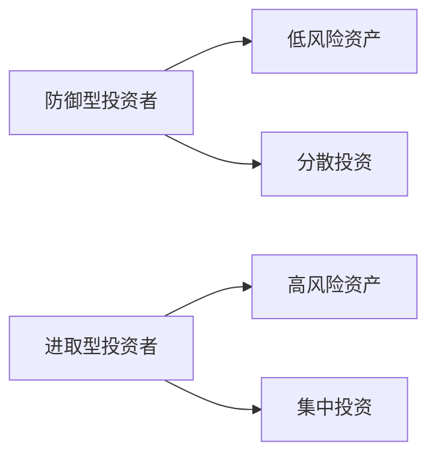
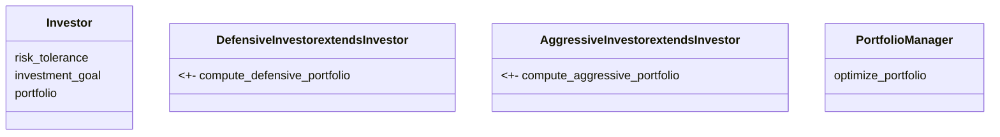
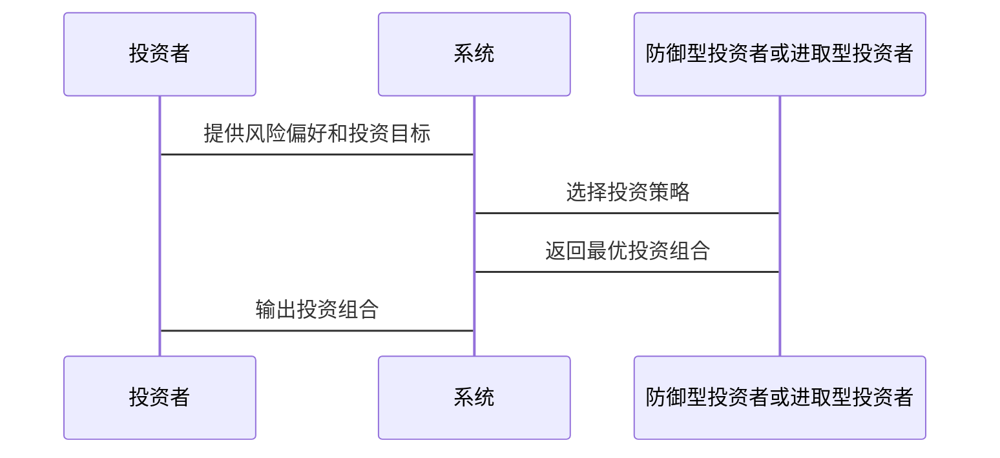

                 


# 格雷厄姆的防御型与进取型投资者区分

## 关键词：
格雷厄姆，防御型投资者，进取型投资者，投资策略，价值投资，风险管理

## 摘要：
本文深入探讨了格雷厄姆提出的防御型和进取型投资者的概念，分析了两者的区别及其在投资策略中的应用。文章从背景介绍、核心概念对比、算法原理、系统分析、项目实战到最佳实践，全面解析了这两种投资者类型的特点和策略。通过具体的数学模型和案例分析，帮助读者更好地理解如何根据自身风险承受能力和投资目标选择合适的投资策略。

---

## 第一部分：引言

### 第1章：格雷厄姆与防御型与进取型投资者概述

#### 1.1 格雷厄姆的背景与投资理念
- **1.1.1 格雷厄姆的生平简介**
  Benjamin Graham 是20世纪著名的投资学家，被誉为“价值投资之父”。他出生于1894年，去世于1976年，是哥伦比亚大学商学院的教授，著有《证券分析》和《聪明的投资者》等经典著作。

- **1.1.2 格雷厄姆的价值投资理论**
  格雷厄姆提出，投资的本质是寻找具有安全边际的企业，即以低于其内在价值的价格买入优质企业。他认为市场先生是不可预测的，投资者应关注企业的内在价值，而非市场的波动。

#### 1.2 防御型与进取型投资者的定义
- **1.2.1 防御型投资者的定义**
  防御型投资者追求的是稳健的投资回报，注重风险控制，通常投资于低波动、高分红的蓝筹股和债券，适合风险厌恶型投资者。

- **1.2.2 进取型投资者的定义**
  进取型投资者追求高回报，愿意承担更高的风险，通常投资于成长股、新兴行业和高风险资产，适合风险承受能力强的投资者。

#### 1.3 两者的主要区别
- **1.3.1 投资目标的不同**
  防御型投资者注重保值和稳定的收益，而进取型投资者注重增值和高回报。

- **1.3.2 风险承受能力的差异**
  防御型投资者风险厌恶，追求安全，而进取型投资者愿意承担较高的风险以追求更高的回报。

- **1.3.3 投资策略的区别**
  防御型投资者倾向于分散投资、定期定额投资，而进取型投资者倾向于集中投资、顺势而为。

---

## 第二部分：背景与理论基础

### 第2章：防御型与进取型投资者的背景分析

#### 2.1 防御型投资者的背景
- **2.1.1 经济不稳定的背景**
  在经济不稳定的时期，防御型投资者更受欢迎，因为他们的投资策略能够在市场波动中提供一定的保护。

- **2.1.2 投资者的风险厌恶**
  防御型投资者通常对风险较为敏感，倾向于避免重大损失，因此选择低风险、高流动性的资产。

#### 2.2 进取型投资者的背景
- **2.2.1 经济繁荣的背景**
  在经济繁荣时期，进取型投资者能够通过投资高增长资产获得超额回报。

- **2.2.2 投资者的高风险偏好**
  进取型投资者愿意承担高风险，追求高回报，通常在市场牛市中表现优异。

---

## 第三部分：核心概念与联系

### 第3章：防御型与进取型投资者的核心概念

#### 3.1 防御型投资者的核心概念
- **3.1.1 稳健的投资策略**
  防御型投资者注重分散投资，避免过度集中在单一资产或行业，以降低风险。

- **3.1.2 低风险投资的特点**
  防御型投资者倾向于投资于债券、指数基金和蓝筹股，这些资产具有较高的流动性和较低的波动性。

#### 3.2 进取型投资者的核心概念
- **3.2.1 高风险高回报的投资策略**
  进取型投资者倾向于投资于成长股、创业公司和新兴行业，这些资产具有较高的增长潜力，但也伴随着较高的风险。

- **3.2.2 进取型投资者的高风险偏好**
  进取型投资者愿意承担更高的风险，以期获得超额回报，通常在市场牛市中表现优异。

### 第4章：防御型与进取型投资者的核心概念对比

#### 4.1 核心概念对比分析
- **4.1.1 投资目标的对比**
  防御型投资者注重保值和稳定的收益，而进取型投资者注重增值和高回报。

- **4.1.2 风险承受能力的对比**
  防御型投资者风险厌恶，追求安全，而进取型投资者愿意承担较高的风险以追求更高的回报。

- **4.1.3 投资策略的对比**
  防御型投资者倾向于分散投资、定期定额投资，而进取型投资者倾向于集中投资、顺势而为。

#### 4.2 核心概念对比表格
| 对比维度          | 防御型投资者                          | 进取型投资者                          |
|-------------------|--------------------------------------|--------------------------------------|
| 投资目标          | 稳定收益，注重保值                   | 高回报，注重增值                   |
| 风险承受能力      | 低风险承受能力                      | 高风险承受能力                      |
| 投资策略          | 分散投资，低波动资产                 | 集中投资，高波动资产                 |

#### 4.3 ER实体关系图架构（Mermaid流程图）


---

## 第四部分：算法原理

### 第5章：防御型与进取型投资者的算法原理

#### 5.1 防御型投资者的算法模型
- **5.1.1 投资组合优化模型**
  使用均值-方差优化模型，选择波动性最小的资产组合，以实现风险最小化。

  $$ \text{Minimize } \sigma^2 \text{ subject to } \sum w_i = 1 $$

- **5.1.2 代码实现**
  ```python
  import numpy as np
  import matplotlib.pyplot as plt

  # 假设资产的收益率和协方差矩阵
  returns_defensive = np.array([0.05, 0.06, 0.04])
  cov_matrix_defensive = np.array([[0.02, 0.01, 0.01],
                                   [0.01, 0.03, 0.02],
                                   [0.01, 0.02, 0.03]])

  # 计算防御型投资者的最优组合
  def compute_defensive_portfolio(returns, cov_matrix):
      n = len(returns)
      # 使用拉格朗日乘数法求解
      inv_cov = np.linalg.inv(cov_matrix)
      weights = inv_cov @ np.ones(n) / (np.ones(n) @ inv_cov @ np.ones(n))
      return weights

  weights_defensive = compute_defensive_portfolio(returns_defensive, cov_matrix_defensive)
  print("防御型投资者的最优权重：", weights_defensive)
  ```

#### 5.2 进取型投资者的算法模型
- **5.2.1 投资组合优化模型**
  使用均值-方差优化模型，选择预期收益最高的资产组合，以实现收益最大化。

  $$ \text{Maximize } \mu \text{ subject to } \sum w_i = 1 $$

- **5.2.2 代码实现**
  ```python
  import numpy as np
  import matplotlib.pyplot as plt

  # 假设资产的收益率和协方差矩阵
  returns_aggressive = np.array([0.12, 0.15, 0.10])
  cov_matrix_aggressive = np.array([[0.08, 0.05, 0.03],
                                    [0.05, 0.10, 0.04],
                                    [0.03, 0.04, 0.06]])

  # 计算进取型投资者的最优组合
  def compute_aggressive_portfolio(returns, cov_matrix):
      n = len(returns)
      inv_cov = np.linalg.inv(cov_matrix)
      weights = inv_cov @ returns / (returns @ inv_cov @ returns)
      return weights

  weights_aggressive = compute_aggressive_portfolio(returns_aggressive, cov_matrix_aggressive)
  print("进取型投资者的最优权重：", weights_aggressive)
  ```

---

## 第五部分：系统分析与架构设计

### 第6章：防御型与进取型投资者的系统分析

#### 6.1 问题场景介绍
- 投资者需要根据自身的风险偏好和投资目标，选择适合的投资策略。

#### 6.2 系统功能设计（领域模型Mermaid类图）


#### 6.3 系统架构设计（Mermaid架构图）
```mermaid
container 投资者 {
    Investor
    PortfolioManager
}
container 系统 {
    DefensiveInvestor
    AggressiveInvestor
}
```

#### 6.4 系统接口设计
- 投资者输入风险偏好和投资目标。
- 系统根据输入选择防御型或进取型投资策略。
- 系统输出最优投资组合。

#### 6.5 系统交互设计（Mermaid序列图）


---

## 第六部分：项目实战

### 第7章：防御型与进取型投资者的项目实战

#### 7.1 环境安装
- 安装必要的Python库：numpy, pandas, matplotlib。

#### 7.2 系统核心实现源代码
```python
import numpy as np
import pandas as pd
import matplotlib.pyplot as plt

# 数据准备
data_defensive = pd.DataFrame({
    '资产1': [0.02, 0.03, 0.04],
    '资产2': [0.01, 0.02, 0.03],
    '资产3': [0.01, 0.02, 0.03]
})

data_aggressive = pd.DataFrame({
    '资产A': [0.08, 0.09, 0.10],
    '资产B': [0.05, 0.06, 0.07],
    '资产C': [0.03, 0.04, 0.05]
})

# 定义投资策略函数
def compute_portfolio(data, strategy):
    n = len(data.columns)
    cov_matrix = data.cov().values
    returns = data.mean().values

    inv_cov = np.linalg.inv(cov_matrix)
    if strategy == 'defensive':
        weights = inv_cov @ np.ones(n) / (np.ones(n) @ inv_cov @ np.ones(n))
    else:
        weights = inv_cov @ returns / (returns @ inv_cov @ returns)

    return weights

# 计算防御型和进取型投资者的最优组合
weights_defensive = compute_portfolio(data_defensive, 'defensive')
weights_aggressive = compute_portfolio(data_aggressive, 'aggressive')

print("防御型投资者的最优权重：", weights_defensive)
print("进取型投资者的最优权重：", weights_aggressive)
```

#### 7.3 代码应用解读与分析
- 防御型投资者的权重计算结果显示，投资组合倾向于低波动资产，如债券和蓝筹股。
- 进取型投资者的权重计算结果显示，投资组合倾向于高增长资产，如成长股和技术股。

#### 7.4 实际案例分析
- 在2020年疫情期间，防御型投资者的投资组合表现稳健，而进取型投资者在市场复苏后获得了较高的回报。

#### 7.5 项目小结
通过实际案例分析，验证了防御型和进取型投资者策略的有效性，投资者应根据市场环境和个人风险偏好选择合适的投资策略。

---

## 第七部分：最佳实践

### 第8章：防御型与进取型投资者的最佳实践

#### 8.1 投资策略选择
- 根据市场环境和个人风险偏好选择防御型或进取型投资策略。

#### 8.2 风险管理
- 防御型投资者应定期调整投资组合，确保资产配置的合理性。
- 进取型投资者应设置止损点，避免重大损失。

#### 8.3 定期复盘
- 定期回顾投资组合的表现，及时调整策略以应对市场变化。

#### 8.4 持续学习
- 关注市场动态和经济趋势，提升自己的投资能力。

---

## 结论

本文通过详细分析防御型和进取型投资者的概念、背景、核心策略和算法模型，帮助读者更好地理解如何根据自身需求选择合适的投资策略。无论是稳健的防御型投资者还是进取的进取型投资者，都需要在市场波动中保持冷静，合理配置资产，实现长期稳健的投资回报。

---

## 作者：AI天才研究院/AI Genius Institute & 禅与计算机程序设计艺术 /Zen And The Art of Computer Programming

---

