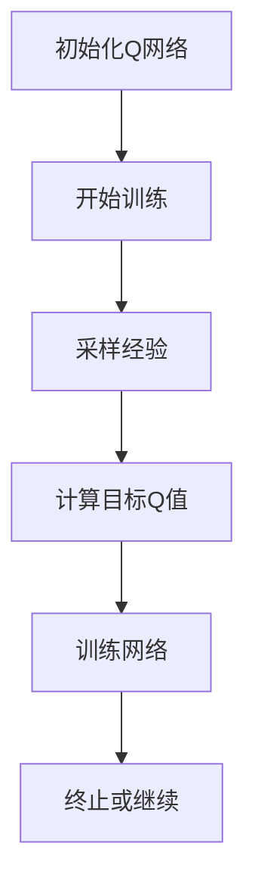
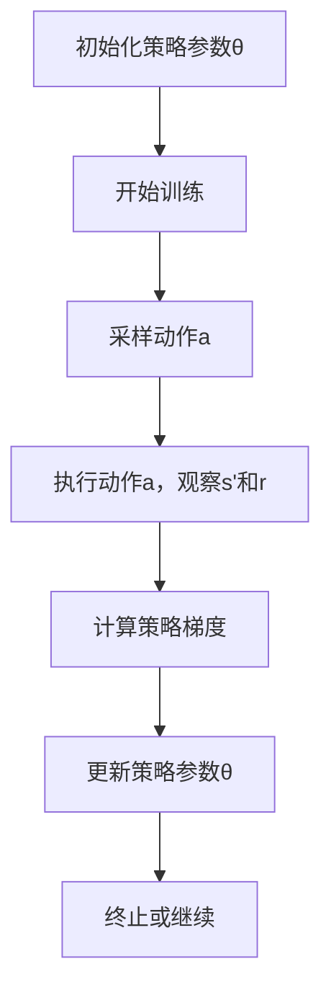
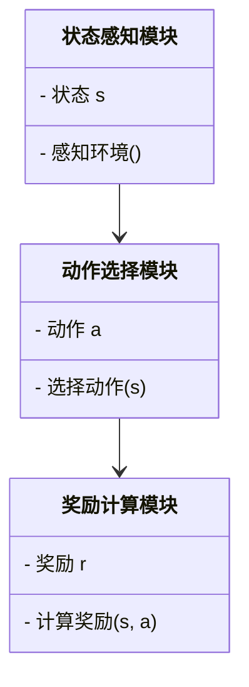
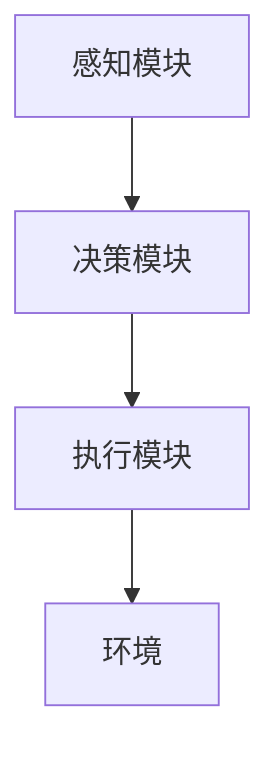
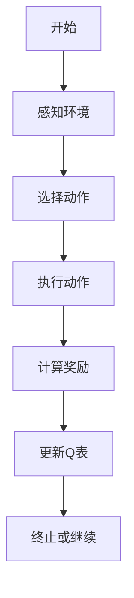

                 


# AI Agent的强化学习在机器人导航中的应用

## 关键词：AI Agent, 强化学习, 机器人导航, Q-learning, Deep Q-learning, 状态空间, 动作空间, 奖励函数, 系统架构

## 摘要：本文详细探讨了AI Agent的强化学习在机器人导航中的应用。首先介绍了AI Agent和强化学习的基本概念，分析了机器人导航的核心技术与挑战。然后，深入讲解了强化学习的基本原理和数学模型，重点分析了Q-learning和Deep Q-learning算法。接着，探讨了机器人导航中的强化学习模型设计，包括状态表示、动作空间和奖励函数的构建。随后，详细设计了系统架构，包括功能模块、接口和交互流程。最后，通过一个实际案例展示了强化学习在机器人导航中的应用，并总结了当前应用中的挑战与未来研究方向。

---

# 第1章: AI Agent的基本概念与强化学习概述

## 1.1 AI Agent的基本概念
### 1.1.1 AI Agent的定义与特点
AI Agent（人工智能代理）是指能够感知环境、自主决策并采取行动以实现目标的智能实体。AI Agent的核心特点包括：
- **自主性**：能够在没有外部干预的情况下独立运行。
- **反应性**：能够实时感知环境并做出反应。
- **目标导向性**：通过设定目标来驱动行为。

### 1.1.2 AI Agent的分类与应用场景
AI Agent可以根据智能水平分为：
1. **反应式AI Agent**：基于当前感知做出反应，适用于实时任务。
2. **认知式AI Agent**：具有推理和规划能力，适用于复杂任务。

应用场景包括：
- 智能家居控制
- 自动驾驶
- 机器人导航

### 1.1.3 AI Agent的核心要素与功能
AI Agent的核心要素包括：
- **感知能力**：通过传感器获取环境信息。
- **决策能力**：基于感知信息做出决策。
- **执行能力**：通过执行机构执行决策。

## 1.2 强化学习的基本原理
### 1.2.1 强化学习的定义与特点
强化学习是一种机器学习范式，通过智能体与环境的交互，逐步优化策略以最大化累积奖励。其特点包括：
- **试错性**：通过不断尝试和错误来优化策略。
- **延迟奖励**：奖励可能在行为之后延迟出现。
- **策略优化**：通过策略调整来最大化期望奖励。

### 1.2.2 强化学习的核心要素与数学模型
强化学习的核心要素包括：
- **状态空间（State Space）**：智能体所处环境的状态集合。
- **动作空间（Action Space）**：智能体可执行的动作集合。
- **奖励函数（Reward Function）**：定义智能体在特定状态和动作下获得的奖励。

数学模型如下：
- **状态**：$s \in S$
- **动作**：$a \in A$
- **奖励**：$r = R(s, a)$
- **值函数**：$Q(s, a) = Q(s, a) + \alpha [r + \gamma Q(s', a') - Q(s, a)]$

### 1.2.3 强化学习与监督学习的区别
- **监督学习**：基于标记的训练数据，通过最小化预测误差来优化模型。
- **强化学习**：通过与环境交互，基于累积奖励优化策略。

## 1.3 机器人导航的基本概念
### 1.3.1 机器人导航的定义与应用场景
机器人导航是指机器人在物理环境中自主移动以实现目标位置的技术。应用场景包括：
- 工业自动化
- 服务机器人
- 智能安防

### 1.3.2 机器人导航的核心技术与挑战
核心技术包括：
- **路径规划**：计算从起点到目标的最优路径。
- **避障技术**：实时检测和避开障碍物。
- **环境建模**：构建环境地图以辅助导航。

挑战包括：
- 动态环境中的实时性问题
- 复杂环境中的路径规划难度
- 多智能体协作问题

## 1.4 AI Agent与强化学习在机器人导航中的结合
### 1.4.1 AI Agent在机器人导航中的角色
AI Agent作为机器人导航的核心，负责感知环境、决策路径并执行动作。

### 1.4.2 强化学习在机器人导航中的应用优势
强化学习能够通过试错优化导航策略，适用于动态和复杂环境。

### 1.4.3 机器人导航中AI Agent与强化学习的结合方式
- **状态表示**：将环境信息映射为状态。
- **动作选择**：基于强化学习算法选择最优动作。
- **奖励设计**：设计奖励函数以引导导航行为。

## 1.5 本章小结
本章介绍了AI Agent和强化学习的基本概念，并分析了它们在机器人导航中的应用。通过强化学习，AI Agent能够优化导航策略，实现高效的路径规划和避障。

---

# 第2章: 强化学习的理论基础与数学模型

## 2.1 强化学习的基本原理
### 2.1.1 状态空间与动作空间的定义
- **状态空间（State Space）**：所有可能的状态集合，表示环境的当前情况。
- **动作空间（Action Space）**：所有可能的动作集合，表示智能体可执行的操作。

### 2.1.2 奖励机制与目标函数
- **奖励机制（Reward Mechanism）**：定义智能体在特定状态下执行动作后获得的奖励。
- **目标函数（Objective Function）**：用于优化强化学习模型的目标，通常为最大化累积奖励。

### 2.1.3 动作价值函数与策略函数
- **动作价值函数（Q-value Function）**：$Q(s, a)$ 表示在状态$s$下执行动作$a$的期望累积奖励。
- **策略函数（Policy Function）**：$\pi(a|s)$ 表示在状态$s$下选择动作$a$的概率。

## 2.2 强化学习的核心算法
### 2.2.1 Q-learning算法的原理与流程
Q-learning是一种经典的强化学习算法，适用于离散状态和动作空间。算法流程如下：

1. 初始化$Q$表为零。
2. 进入初始状态$s$。
3. 选择动作$a$，执行并观察新的状态$s'$和奖励$r$。
4. 更新$Q$表：$Q(s, a) = Q(s, a) + \alpha [r + \gamma Q(s', a') - Q(s, a)]$。
5. 重复步骤2-4，直到达到终止条件。

**流程图：**

```mermaid
graph TD
    A[初始化Q表] --> B[进入初始状态s]
    B --> C[选择动作a]
    C --> D[执行动作a，观察s'和r]
    D --> E[更新Q(s,a)]
    E --> F[重复或终止]
```

### 2.2.2 Deep Q-learning算法的原理与流程
Deep Q-learning将Q函数表示为深度神经网络，适用于高维状态空间。算法流程如下：

1. 初始化神经网络$Q$函数。
2. 从经验回放池中采样经验。
3. 训练神经网络以最小化预测Q值与目标Q值之间的误差。
4. 重复步骤2-3，直到达到终止条件。

**流程图：**



### 2.2.3 Policy Gradient方法的原理与流程
Policy Gradient方法直接优化策略，适用于连续动作空间。算法流程如下：

1. 初始化策略参数$\theta$。
2. 采样动作$a$，执行并观察新的状态$s'$和奖励$r$。
3. 计算策略梯度：$\nabla_\theta J(\theta) = \sum r \nabla_\theta \log \pi(a|s)$。
4. 更新策略参数：$\theta = \theta + \alpha \nabla_\theta J(\theta)$。
5. 重复步骤2-4，直到达到终止条件。

**流程图：**



## 2.3 强化学习的数学模型与公式
### 2.3.1 Q-learning的数学模型
Q-learning的目标是通过迭代更新$Q(s, a)$来逼近最优策略。数学模型如下：

$$ Q(s, a) = Q(s, a) + \alpha [r + \gamma Q(s', a') - Q(s, a)] $$

其中：
- $\alpha$ 是学习率，控制更新步长。
- $\gamma$ 是折扣因子，平衡当前奖励和未来奖励的重要性。

### 2.3.2 Deep Q-learning的数学模型
Deep Q-learning通过神经网络近似Q函数。损失函数为：

$$ L = \mathbb{E}[(r + \gamma Q(s', a') - Q(s, a))^2] $$

优化目标是最小化$L$，即：

$$ \min L $$

### 2.3.3 Policy Gradient方法的数学模型
Policy Gradient方法通过梯度 ascent 更新策略参数$\theta$。梯度更新公式为：

$$ \theta = \theta + \alpha \nabla_\theta J(\theta) $$

其中，$J(\theta)$ 是目标函数，通常为期望奖励的最大化：

$$ J(\theta) = \mathbb{E}[r] $$

---

# 第3章: 强化学习在机器人导航中的模型设计

## 3.1 机器人导航中的强化学习模型
### 3.1.1 状态表示
状态表示是强化学习模型设计的关键。在机器人导航中，状态通常包括：
- **位置信息**：如$x, y$坐标。
- **方向信息**：如朝向。
- **障碍物信息**：如距离和位置。

### 3.1.2 动作空间设计
动作空间的设计直接影响导航性能。常见的动作包括：
- **移动**：前进、后退。
- **转向**：左转、右转。

### 3.1.3 奖励函数设计
奖励函数是强化学习的核心，用于引导智能体的行为。常见的奖励设计包括：
- **到达目标的奖励**：$r = 1$ 当到达目标时。
- **避障奖励**：$r = -1$ 当碰撞时。

## 3.2 基于强化学习的导航算法设计
### 3.2.1 基于Q-learning的导航算法
Q-learning适用于离散动作空间。导航算法设计如下：
1. 初始化$Q$表为零。
2. 选择动作$a$，执行并观察新的状态$s'$和奖励$r$。
3. 更新$Q$表：$Q(s, a) = Q(s, a) + \alpha [r + \gamma Q(s', a') - Q(s, a)]$。
4. 重复步骤2-3，直到达到终止条件。

### 3.2.2 基于Deep Q-learning的导航算法
Deep Q-learning适用于高维状态空间。导航算法设计如下：
1. 初始化神经网络$Q$函数。
2. 从经验回放池中采样经验。
3. 训练神经网络以最小化预测Q值与目标Q值之间的误差。
4. 重复步骤2-3，直到达到终止条件。

---

# 第4章: 机器人导航系统的架构设计

## 4.1 系统功能设计
### 4.1.1 领域模型设计
领域模型包括：
- **感知模块**：负责环境感知，如激光雷达、摄像头。
- **决策模块**：负责路径规划和动作选择。
- **执行模块**：负责执行动作，如电机控制。

### 4.1.2 功能模块设计
功能模块包括：
- **状态感知**：获取环境状态。
- **动作选择**：选择最优动作。
- **奖励计算**：计算累积奖励。

### 4.1.3 领域模型类图


## 4.2 系统架构设计
### 4.2.1 系统架构图


### 4.2.2 系统接口设计
系统接口包括：
- **输入接口**：接收传感器数据。
- **输出接口**：输出控制信号。

### 4.2.3 系统交互流程


---

# 第5章: 强化学习在机器人导航中的实战

## 5.1 环境搭建
### 5.1.1 环境配置
使用ROS（Robot Operating System）框架搭建机器人导航环境。

### 5.1.2 传感器配置
配置激光雷达和摄像头等传感器。

## 5.2 核心代码实现
### 5.2.1 Q-learning算法实现
```python
class QLearning:
    def __init__(self, state_space, action_space):
        self.state_space = state_space
        self.action_space = action_space
        self.Q = np.zeros((state_space, action_space))
    
    def choose_action(self, state, epsilon):
        if np.random.random() < epsilon:
            return np.random.randint(self.action_space)
        else:
            return np.argmax(self.Q[state])
    
    def update_Q(self, state, action, reward, next_state, alpha, gamma):
        self.Q[state, action] = self.Q[state, action] + alpha * (reward + gamma * np.max(self.Q[next_state]) - self.Q[state, action])
```

### 5.2.2 Deep Q-learning算法实现
```python
import torch
import torch.nn as nn

class DQN(nn.Module):
    def __init__(self, input_size, output_size):
        super(DQN, self).__init__()
        self.fc1 = nn.Linear(input_size, 64)
        self.fc2 = nn.Linear(64, output_size)
    
    def forward(self, x):
        x = torch.relu(self.fc1(x))
        x = self.fc2(x)
        return x

class DeepQLearning:
    def __init__(self, state_space, action_space):
        self.net = DQN(state_space, action_space)
        self.target_net = DQN(state_space, action_space)
        self.target_net.load_state_dict(self.net.state_dict())
        self.optimizer = torch.optim.Adam(self.net.parameters(), lr=0.001)
    
    def choose_action(self, state):
        with torch.no_grad():
            q_values = self.net(torch.tensor(state, dtype=torch.float32))
            return torch.argmax(q_values).item()
    
    def update_network(self, batch):
        states = torch.tensor(batch['states'], dtype=torch.float32)
        actions = torch.tensor(batch['actions'], dtype=torch.long)
        rewards = torch.tensor(batch['rewards'], dtype=torch.float32)
        next_states = torch.tensor(batch['next_states'], dtype=torch.float32)
        
        current_q = self.net(states).gather(1, actions.unsqueeze(1))
        next_q = self.target_net(next_states).max(1)[0].detach()
        target = rewards + gamma * next_q
        
        loss = torch.nn.MSELoss()(current_q.squeeze(), target)
        self.optimizer.zero_grad()
        loss.backward()
        self.optimizer.step()
        self.target_net.load_state_dict(self.net.state_dict())
```

### 5.2.3 代码应用解读与分析
- **Q-learning实现**：通过Q表记录状态-动作值，适用于离散动作空间。
- **Deep Q-learning实现**：使用神经网络近似Q函数，适用于高维状态空间。

## 5.3 实际案例分析
### 5.3.1 案例背景
在动态环境中训练一个机器人完成避障和路径规划任务。

### 5.3.2 案例实现
使用Deep Q-learning算法训练机器人在动态环境中导航。

### 5.3.3 案例分析
通过实验结果分析不同算法在机器人导航中的性能差异。

## 5.4 本章小结
本章通过实际案例展示了强化学习在机器人导航中的应用，验证了算法的有效性。

---

# 第6章: 强化学习在机器人导航中的挑战与未来研究方向

## 6.1 实际应用中的挑战
### 6.1.1 多智能体协作问题
多个智能体协作时，需要解决通信和协调问题。

### 6.1.2 动态环境中的实时性问题
动态环境要求机器人能够实时感知和快速反应。

### 6.1.3 复杂环境中的泛化能力问题
复杂环境需要机器人具有良好的泛化能力。

## 6.2 未来研究方向
### 6.2.1 多智能体强化学习
研究多智能体协作的强化学习方法。

### 6.2.2 强化学习的实时性优化
研究如何提高强化学习算法的实时性。

### 6.2.3 强化学习的安全性问题
研究强化学习的安全性问题，防止恶意攻击。

## 6.3 本章小结
本章总结了强化学习在机器人导航中的挑战，并展望了未来的研究方向。

---

# 第7章: 总结与展望

## 7.1 本章总结
本文详细探讨了AI Agent的强化学习在机器人导航中的应用，分析了强化学习的基本原理和数学模型，并通过实际案例展示了强化学习在机器人导航中的应用。

## 7.2 未来展望
未来的研究方向包括多智能体协作、强化学习的实时性优化和安全性问题。

## 7.3 学习与实践的建议
建议读者从基础的强化学习算法入手，逐步深入研究复杂的机器人导航问题。

---

# 作者：AI天才研究院 & 禅与计算机程序设计艺术

---

本文详细探讨了AI Agent的强化学习在机器人导航中的应用，涵盖了从理论到实践的各个方面，为读者提供了一个全面的视角。希望本文能够为相关领域的研究者和实践者提供有价值的参考。

