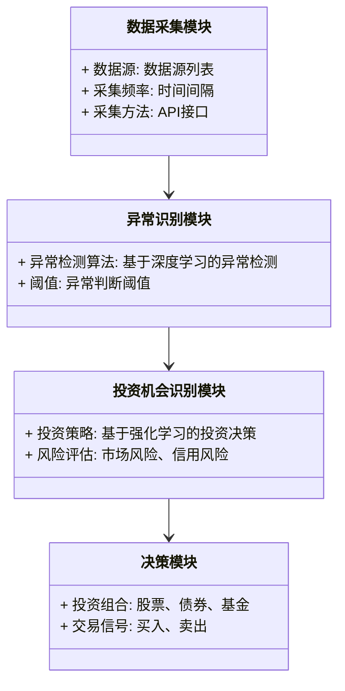
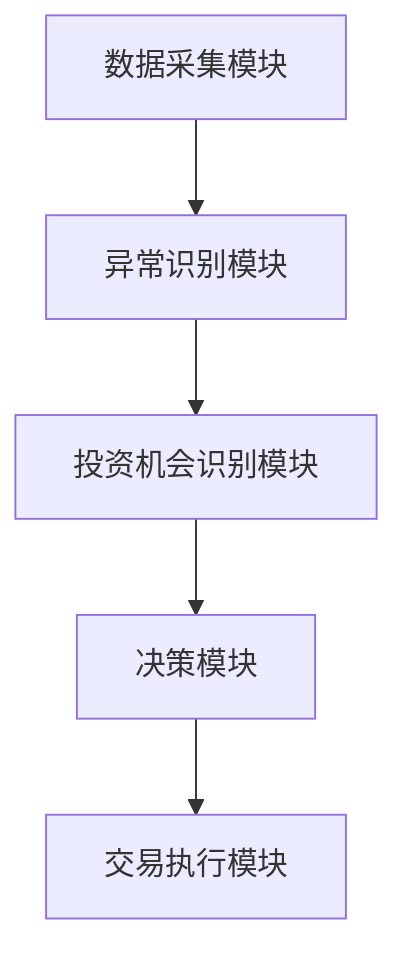
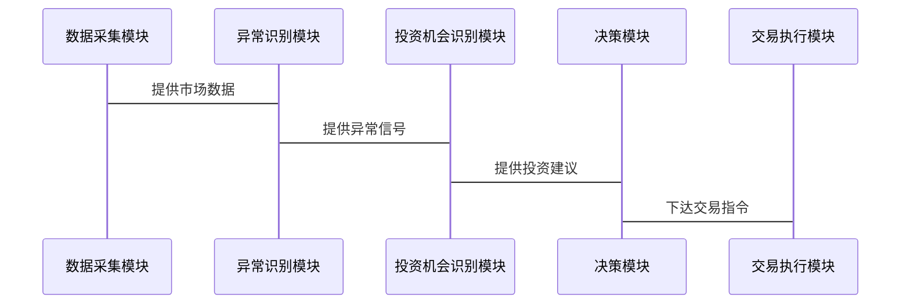

                 


# AI多智能体在识别市场异常和投资机会中的作用

**关键词**：AI多智能体、市场异常识别、投资机会、算法原理、系统架构

**摘要**：本文探讨AI多智能体在金融市场中的应用，重点分析其在识别市场异常和发现投资机会中的作用。通过详细讲解多智能体系统的核心概念、算法原理、系统架构以及项目实战，本文旨在为读者提供从理论到实践的全面指南，帮助他们在复杂多变的金融市场中利用AI技术捕捉潜在机会。

---

## 第1章: 引言

### 1.1 问题背景与研究意义

#### 1.1.1 金融市场中的异常识别与投资机会
金融市场是一个复杂且动态变化的环境，市场参与者的决策、宏观经济因素以及突发事件都可能导致市场价格的剧烈波动。识别这些异常波动并及时捕捉投资机会，对于投资者和机构来说至关重要。传统的单一智能体方法在面对金融市场中的高度不确定性时显得力不从心，而多智能体系统通过协同工作，能够更好地处理复杂问题。

#### 1.1.2 多智能体系统的优势与必要性
多智能体系统（Multi-Agent System, MAS）由多个相互作用的智能体组成，每个智能体负责特定的任务或子问题。在金融市场中，多智能体系统可以通过分工协作，分别关注市场数据的不同方面（如价格、成交量、市场情绪等），从而更全面地分析市场动态。此外，多智能体系统能够模拟市场参与者的博弈行为，帮助识别潜在的市场异常和投资机会。

#### 1.1.3 研究目标与意义
本文旨在探讨AI多智能体在金融市场中的应用，特别是其在识别市场异常和发现投资机会中的作用。通过分析多智能体系统的架构、算法原理以及实际应用场景，本文为投资者和研究人员提供理论和实践上的参考。

---

### 1.2 问题描述与解决思路

#### 1.2.1 金融市场中的复杂性与不确定性
金融市场是一个典型的动态复杂系统，价格波动、交易量变化、市场情绪等多种因素相互作用，导致市场的不可预测性。传统的基于单一智能体的分析方法在面对这些问题时显得力不从心，难以捕捉市场中的细微变化。

#### 1.2.2 多智能体系统的任务分解与协同
多智能体系统通过任务分解和智能体之间的协同，能够更有效地处理复杂问题。例如，一个智能体可以专注于分析市场趋势，另一个专注于识别异常交易，第三个专注于预测市场波动。通过智能体之间的协作，系统能够综合不同维度的信息，从而更准确地识别市场异常并发现投资机会。

#### 1.2.3 异常识别与投资机会的关联性分析
市场异常通常伴随着潜在的投资机会。例如，市场中的突然下跌可能意味着超卖现象，为抄底提供了机会；而市场中的突然上涨可能意味着泡沫，为离场提供了信号。通过多智能体系统，可以更快速地识别这些异常，并根据系统的预测结果，制定相应的投资策略。

---

### 1.3 本章小结
本章介绍了AI多智能体在金融市场中的应用背景，分析了多智能体系统的优势与必要性，并提出了本文的研究目标和解决思路。接下来的章节将详细探讨多智能体系统的核心概念、算法原理、系统架构以及实际应用。

---

## 第2章: 多智能体系统的核心概念与原理

### 2.1 多智能体系统的定义与特点

#### 2.1.1 多智能体系统的定义
多智能体系统是由多个智能体组成的分布式系统，每个智能体能够感知环境、执行任务并与其他智能体协同工作。多智能体系统的智能体通常具有自主性、反应性和社会性等特征。

#### 2.1.2 多智能体系统的属性与特征
- **自主性**：智能体能够在没有外部干预的情况下自主决策。
- **反应性**：智能体能够根据环境的变化调整自身行为。
- **社会性**：智能体之间能够通过通信和协作完成共同目标。

#### 2.1.3 多智能体与单智能体的区别
- **单智能体**：通常用于处理简单、静态的问题，决策基于当前状态。
- **多智能体**：适用于复杂、动态的问题，通过协作提高系统整体性能。

---

### 2.2 异常识别的核心原理

#### 2.2.1 异常识别的基本概念
异常识别是指通过分析数据，识别出与正常模式不符的异常点。在金融市场中，异常识别可以帮助发现潜在的市场操纵、突发事件或市场情绪的变化。

#### 2.2.2 基于多智能体的异常识别方法
多智能体系统可以通过分工协作，分别负责数据采集、特征提取、模型训练和结果分析。例如，一个智能体可以负责收集市场数据，另一个负责分析交易量异常，第三个负责预测价格波动。

#### 2.2.3 异常识别的挑战与解决方案
- **挑战**：数据噪声多、异常模式复杂、计算资源有限。
- **解决方案**：使用分布式计算、增强学习和协作机制。

---

### 2.3 投资机会识别的多智能体模型

#### 2.3.1 投资机会识别的基本原理
投资机会识别是通过分析市场数据，发现潜在的投资标的或交易信号。多智能体系统可以通过协同工作，分别分析不同市场指标，综合得出投资决策。

#### 2.3.2 多智能体在投资机会识别中的应用
- **市场趋势预测**：智能体通过分析历史价格和成交量，预测未来的价格走势。
- **风险评估**：智能体通过分析市场波动和新闻事件，评估投资标的的风险。
- **交易策略优化**：智能体通过协作，优化交易策略，提高投资收益。

#### 2.3.3 投资机会识别的优化策略
- **动态调整**：根据市场变化，实时调整智能体的任务分配和协作策略。
- **知识共享**：智能体之间共享知识和经验，提高整体系统的智能水平。

---

### 2.4 本章小结
本章介绍了多智能体系统的核心概念与原理，分析了异常识别和投资机会识别的实现方法。接下来的章节将详细探讨多智能体系统的算法原理与实现。

---

## 第3章: 多智能体系统的算法原理与实现

### 3.1 多智能体协作算法

#### 3.1.1 基于强化学习的多智能体协作
强化学习是一种通过试错机制优化决策的方法。在多智能体系统中，智能体通过与环境和其他智能体的交互，学习最优策略。

#### 3.1.2 多智能体的通信与决策机制
智能体之间的通信是多智能体协作的关键。通过共享信息和协调决策，智能体可以更好地完成共同任务。

#### 3.1.3 算法实现的数学模型
强化学习的数学模型如下：
$$ Q(s, a) = r + \gamma \max_{a'} Q(s', a') $$
其中，$Q(s, a)$表示在状态$s$下采取动作$a$的期望奖励，$\gamma$是折扣因子。

---

### 3.2 异常识别的算法实现

#### 3.2.1 基于深度学习的异常检测
深度学习通过多层神经网络，自动提取数据特征，识别异常点。例如，使用卷积神经网络（CNN）或循环神经网络（RNN）进行异常检测。

#### 3.2.2 基于统计学的异常检测
统计学方法通过分析数据分布，识别异常点。例如，使用均值和标准差进行异常检测。

#### 3.2.3 算法的优缺点分析
- **深度学习**：优点是特征提取能力强，缺点是需要大量数据和计算资源。
- **统计学方法**：优点是简单高效，缺点是难以捕捉复杂模式。

---

### 3.3 投资机会识别的算法优化

#### 3.3.1 基于强化学习的投资决策优化
通过强化学习，智能体可以学习最优的投资策略，例如买卖时机的选择。

#### 3.3.2 多智能体协同优化的策略
智能体之间通过协作，优化投资组合和风险控制。

#### 3.3.3 算法的数学模型与公式推导
强化学习的投资策略可以表示为：
$$ \pi(a|s) = \arg\max_a Q(s, a) $$

---

### 3.4 本章小结
本章详细探讨了多智能体系统的算法原理与实现，包括协作算法、异常识别算法和投资机会识别算法。接下来的章节将分析系统架构与设计。

---

## 第4章: 系统架构与设计

### 4.1 系统整体架构设计

#### 4.1.1 系统功能模块划分
- **数据采集模块**：负责采集市场数据。
- **异常识别模块**：负责识别市场异常。
- **投资机会识别模块**：负责发现投资机会。
- **决策模块**：负责制定投资策略。

#### 4.1.2 系统架构的层次化设计
系统架构分为数据层、算法层和决策层。数据层负责数据存储和管理，算法层负责异常识别和投资机会识别，决策层负责制定和优化投资策略。

#### 4.1.3 系统架构的可扩展性分析
系统架构设计充分考虑了扩展性，支持添加新的智能体和算法模块。

---

### 4.2 系统架构设计

#### 4.2.1 问题场景介绍
金融市场中的异常识别和投资机会识别需要多智能体系统的协同工作。系统需要实时处理大量数据，并根据市场变化动态调整策略。

#### 4.2.2 领域模型设计
领域模型类图如下：



#### 4.2.3 系统架构图
系统架构图如下：



---

### 4.3 系统接口设计

#### 4.3.1 系统接口设计
系统接口包括数据接口、算法接口和决策接口。数据接口负责与数据源对接，算法接口负责与异常识别和投资机会识别模块对接，决策接口负责与交易执行模块对接。

#### 4.3.2 系统交互设计
系统交互序列图如下：



---

### 4.4 本章小结
本章详细分析了多智能体系统的系统架构与设计，包括功能模块划分、系统架构设计和系统接口设计。接下来的章节将探讨项目实战与最佳实践。

---

## 第5章: 项目实战

### 5.1 环境安装与配置

#### 5.1.1 环境安装
- **Python**：安装Python 3.8及以上版本。
- **深度学习框架**：安装TensorFlow或PyTorch。
- **强化学习库**：安装OpenAI Gym或稳定_baseline。
- **数据分析库**：安装Pandas、NumPy、Matplotlib。

#### 5.1.2 系统配置
配置虚拟环境，安装所需的依赖库，确保所有模块能够协同工作。

---

### 5.2 系统核心实现

#### 5.2.1 异常识别模块实现
实现基于深度学习的异常检测算法，代码如下：

```python
import tensorflow as tf
from tensorflow.keras import layers

model = tf.keras.Sequential([
    layers.Conv1D(filters=32, kernel_size=3, padding='same', activation='relu'),
    layers.MaxPooling1D(pool_size=2),
    layers.Conv1D(filters=64, kernel_size=3, padding='same', activation='relu'),
    layers.MaxPooling1D(pool_size=2),
    layers.Flatten(),
    layers.Dense(128, activation='relu'),
    layers.Dense(1, activation='sigmoid')
])

model.compile(optimizer='adam', loss='binary_crossentropy', metrics=['accuracy'])
```

#### 5.2.2 投资机会识别模块实现
实现基于强化学习的投资决策算法，代码如下：

```python
import numpy as np
import gym

class Agent:
    def __init__(self, state_space, action_space):
        self.state_space = state_space
        self.action_space = action_space
        self.model = self.build_model()
    
    def build_model(self):
        model = tf.keras.Sequential([
            layers.Dense(32, activation='relu'),
            layers.Dense(32, activation='relu'),
            layers.Dense(self.action_space, activation='softmax')
        ])
        return model
    
    def act(self, state):
        prediction = self.model.predict(np.array([state]))[0]
        return np.argmax(prediction)
```

---

### 5.3 代码应用解读与分析

#### 5.3.1 异常识别模块解读
异常识别模块使用卷积神经网络（CNN）进行异常检测。模型通过提取市场数据的时序特征，判断是否存在异常交易。

#### 5.3.2 投资机会识别模块解读
投资机会识别模块使用强化学习算法，通过与市场的交互，学习最优的投资策略。智能体通过试错机制，不断优化自己的决策。

#### 5.3.3 系统运行与结果分析
系统运行后，可以根据实际市场数据，输出异常识别结果和投资机会识别结果。通过分析结果，可以验证系统的有效性和准确性。

---

### 5.4 本章小结
本章通过实际案例分析，详细讲解了多智能体系统的实现过程，包括环境配置、核心模块实现和系统运行结果分析。接下来的章节将总结全文并提出未来的研究方向。

---

## 第6章: 最佳实践与总结

### 6.1 最佳实践 tips

#### 6.1.1 数据预处理的重要性
数据预处理是系统运行的关键步骤。确保数据的准确性和完整性，可以提高系统的识别精度。

#### 6.1.2 系统调优技巧
通过调整模型参数和优化算法，可以提高系统的性能和效率。

#### 6.1.3 实际应用中的注意事项
在实际应用中，需要注意系统的实时性和可扩展性，确保系统能够应对市场的高频交易和大数据量。

---

### 6.2 总结与展望

#### 6.2.1 全文总结
本文详细探讨了AI多智能体在识别市场异常和投资机会中的作用，分析了多智能体系统的核心概念、算法原理和系统架构，并通过实际案例分析，验证了系统的有效性。

#### 6.2.2 未来的研究方向
未来的研究可以进一步探索多智能体系统的协作机制，优化算法性能，提高系统的实时性和可扩展性。

---

## 作者：AI天才研究院/AI Genius Institute & 禅与计算机程序设计艺术 /Zen And The Art of Computer Programming

---

**本文通过系统性的分析和实践，深入探讨了AI多智能体在识别市场异常和投资机会中的作用。通过理论与实践相结合的方式，为读者提供了从算法实现到系统设计的全面指导，帮助他们在金融市场中利用AI技术捕捉潜在机会。**

