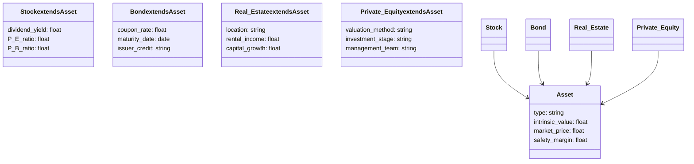
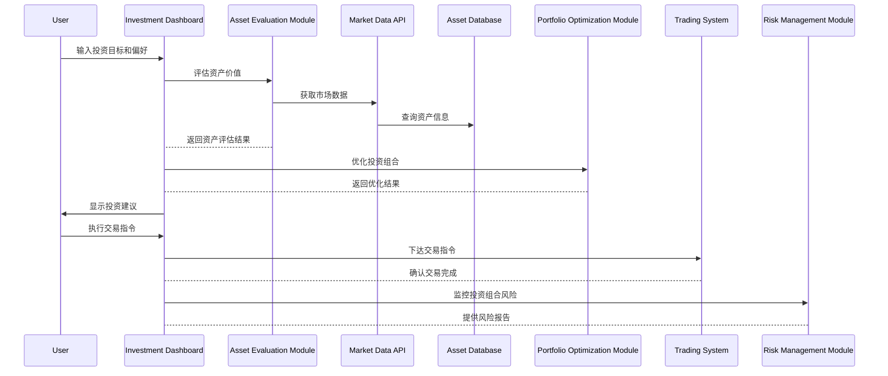

                 


# 价值投资在不同资产类别中的应用

> 关键词：价值投资，资产类别，股票，债券，房地产，私募股权，投资策略

> 摘要：价值投资是一种长期有效的投资策略，其核心在于识别市场低估的资产并进行长期持有。本文将探讨价值投资在不同资产类别中的应用，包括股票、债券、房地产和私募股权等。通过分析每个资产类别的特点、评估方法和投资策略，本文旨在为投资者提供系统的价值投资框架。同时，本文还将结合实际案例，深入解析价值投资在不同市场环境下的应用，并提供基于系统架构的分析工具和方法。

---

# 第一部分: 价值投资的理论基础

## 第1章: 价值投资的核心概念

### 1.1 价值投资的定义与起源

#### 1.1.1 价值投资的起源与发展
- 价值投资的起源可以追溯到20世纪初，由本杰明·格雷厄姆和戴维·多德提出。
- 格雷厄姆的学生沃伦·巴菲特将价值投资的理念发扬光大，使其成为一种经典的投资策略。
- 价值投资的核心理念是寻找市场价格低于其内在价值的资产，长期持有，等待市场重新评估其价值。

#### 1.1.2 价值投资的核心理念
- **内在价值**：资产的真实价值，不完全取决于市场情绪，而是基于其未来现金流的现值。
- **安全边际**：买入价格低于内在价值，以降低风险并确保收益。
- **长期视角**：价值投资强调长期持有，避免短期市场波动的干扰。

#### 1.1.3 价值投资与其它投资策略的区别
- **技术分析**：基于价格和成交量的短期波动，而价值投资关注长期基本面。
- **趋势投资**：跟随市场趋势，而价值投资寻找偏离价值的市场机会。

### 1.2 价值投资的基本原理

#### 1.2.1 市场有效性的探讨
- 市场有效性理论认为价格反映所有公开信息，但现实中市场并不总是有效，存在短期价格偏离价值的情况。
- 价值投资基于市场非有效性的机会，寻找价格与价值的偏离。

#### 1.2.2 安全边际的概念
- 安全边际=内在价值 - 市场价格。
- 通过购买价格低于内在价值的资产，降低投资风险。

#### 1.2.3 长期投资与复利效应
- 长期持有优质资产，通过复利效应实现财富增长。
- 避免频繁交易，减少交易成本和税务负担。

### 1.3 价值投资的适用性与局限性

#### 1.3.1 价值投资的适用场景
- 经济周期的底部：资产价格被低估，适合价值投资。
- 行业周期的低谷：行业困境时，优质企业的估值可能被低估。

#### 1.3.2 价值投资的局限性
- 需要长期持有：在短期内可能跑输市场，需要耐心和纪律。
- 需要深入分析：对投资者的分析能力有较高要求。
- 市场波动风险：即使价格低于价值，市场可能长期低估，导致长期亏损。

#### 1.3.3 价值投资与市场周期的关系
- 在市场低迷时，价值投资机会较多；在市场繁荣时，机会可能减少。
- 需要根据市场周期调整投资策略，避免在市场高估时过度投资。

## 第2章: 不同资产类别的特点与分析方法

### 2.1 股票资产的价值评估

#### 2.1.1 股票的基本面分析
- 财务指标分析：市盈率（P/E）、市净率（P/B）、股息率等。
- 盈利能力：净利润、毛利率、ROE（净资产收益率）。
- 偿债能力：负债率、流动比率、速动比率。
- 发展能力：收入增长率、净利润增长率。

#### 2.1.2 市盈率与市净率的计算
- 市盈率=股价/每股收益（EPS）。
- 市净率=股价/每股净资产（BPS）。
- 通过比较市盈率和市净率与行业平均水平，识别低估股票。

#### 2.1.3 股东权益与企业价值的评估
- 企业价值=股权价值 + 债务价值。
- 股东权益=资产 - 负债。
- 使用DCF模型评估企业未来现金流的现值，确定内在价值。

#### 2.1.4 市场情绪与心理偏差
- 市场情绪波动可能导致股票价格偏离价值。
- 心理偏差，如从众心理和过度自信，影响投资者决策。

### 2.2 债券资产的价值评估

#### 2.2.1 债券的收益率计算
- 到期收益率（YTM）：债券的内部回报率。
- 当前收益率=年息/当前市场价格。
- 到期收益率考虑了债券的面值、价格、期限和息票率。

#### 2.2.2 利率风险与信用风险
- 利率上升，债券价格下跌，反之亦然。
- 信用风险：债券发行人违约的可能性，高信用评级债券风险较低。

#### 2.2.3 债券价格波动与市场流动性
- 债券流动性影响其价格波动，流动性差的债券价格波动较大。
- 市场流动性充裕时，债券价格可能被高估，反之亦然。

### 2.3 房地产资产的价值评估

#### 2.3.1 房地产市场的周期性分析
- 房地产市场具有周期性，价格波动较大。
- 上行周期：价格上升，成交量增加。
- 下行周期：价格下跌，成交量减少。

#### 2.3.2 房地产价格的影响因素
- 位置：城市中心区域的房地产价格较高。
- 房地产类型：住宅、商业用房、工业用房等。
- 配套设施：交通、教育、医疗等配套设施的影响。

#### 2.3.3 房地产投资的风险管理
- 市场风险：房地产价格波动。
- 利率风险：贷款利率上升增加还款压力。
- 流动性风险：房地产难以快速变现。

### 2.4 私募股权与另类投资

#### 2.4.1 私募股权的价值评估
- 投资标的：未上市企业股权。
- 评估方法：DCF模型、可比公司分析、 precedent transactions。
- 风险较高，但潜在回报也高。

#### 2.4.2 另类投资的类型与特点
- 另类投资包括房地产、私募股权、对冲基金、 commodities等。
- 优点：分散化、潜在高回报。
- 风险：流动性低、市场波动大。

#### 2.4.3 私募股权的风险与回报
- 风险：投资失败、市场波动、流动性差。
- 回报：长期来看，私募股权可能带来较高的收益，但需要较长的时间周期。

---

# 第二部分: 价值投资在股票资产中的应用

## 第3章: 股票投资策略与案例分析

### 3.1 股票投资的基本策略

#### 3.1.1 买入并持有策略
- 长期持有优质股票，避免频繁交易。
- 适合价值投资，通过复利效应实现财富增长。

#### 3.1.2 价值发现策略
- 识别市场价格低于内在价值的股票。
- 通过基本面分析，寻找被市场忽视的优质企业。

#### 3.1.3 股息投资策略
- 投资高股息率的股票，获得稳定的现金流。
- 股息率=每股股息/股价，通常高于市场平均水平的股票具有吸引力。

### 3.2 股票筛选与投资组合构建

#### 3.2.1 股票筛选的指标与方法
- 市盈率低于行业平均水平。
- 市净率低于行业平均水平。
- 股息率高于行业平均水平。

#### 3.2.2 投资组合的构建原则
- 分散化：避免过度集中于某一行业或公司。
- 价值导向：选择市场价格低于内在价值的股票。
- 长期持有：避免短期波动的影响。

#### 3.2.3 投资组合的再平衡
- 定期检查投资组合，调整持仓比例。
- 根据市场变化和公司基本面变化，进行再平衡。

### 3.3 股票投资的案例分析

#### 3.3.1 经典案例：巴菲特的选股策略
- 买入并持有优质企业，如可口可乐、苹果等。
- 选择具有持续竞争优势和良好管理的公司。

#### 3.3.2 实战案例：如何识别低估股票
- 以某公司为例，计算其市盈率和市净率，与行业平均水平对比。
- 如果市盈率和市净率均低于行业平均水平，且股息率较高，可能是低估股票。

#### 3.3.3 案例分析：价值陷阱的识别
- 识别公司财务状况恶化，行业前景黯淡的公司。
- 价值陷阱可能导致长期亏损，需要谨慎选择。

---

## 第4章: 价值投资在债券资产中的应用

### 4.1 债券投资的基本策略

#### 4.1.1 买入并持有策略
- 长期持有优质债券，获得稳定的利息收入。
- 适合低风险偏好的投资者。

#### 4.1.2 利率风险管理
- 选择期限较短的债券，减少利率上升的影响。
- 通过债券 ladder策略，分散投资期限。

#### 4.1.3 信用风险控制
- 选择高信用评级的债券，降低违约风险。
- 通过债券评级机构（如穆迪、标普）评估债券信用风险。

### 4.2 债券投资组合的构建

#### 4.2.1 分散化投资
- 将资金分配到不同债券类型和发行主体，降低风险。
- 例如，投资国债、企业债和地方债，分散风险。

#### 4.2.2 风险调整收益
- 通过夏普比率评估投资组合的风险调整后收益。
- 夏普比率=（实际收益 - 无风险利率）/标准差。

#### 4.2.3 流动性管理
- 保持部分流动性较高的债券，应对紧急资金需求。
- 避免投资流动性差的债券，以免难以变现。

### 4.3 债券投资的案例分析

#### 4.3.1 经典案例：美国国债投资
- 在低利率环境下，投资长期国债，获得较高的到期收益率。
- 需要关注利率风险，避免在利率上升时遭受损失。

#### 4.3.2 实战案例：企业债的选择
- 选择信用评级高、行业前景良好的企业债券。
- 例如，投资某AAA级企业的债券，利率为5%，期限为10年。

#### 4.3.3 案例分析：债券价格波动的预测
- 根据市场利率变化，预测债券价格波动。
- 长期债券的价格波动较大，短期债券的价格波动较小。

---

## 第5章: 价值投资在房地产中的应用

### 5.1 房地产投资的基本策略

#### 5.1.1 买入并持有策略
- 长期持有优质房地产，获得租金收入和资本增值。
- 选择地理位置优越、需求稳定的房地产项目。

#### 5.1.2 地产周期分析
- 在房地产市场低迷时买入，市场繁荣时卖出。
- 关注房地产市场的周期性波动，选择买入时机。

#### 5.1.3 风险管理
- 通过分散投资不同地区的房地产，降低区域风险。
- 保持足够的财务杠杆，避免过度杠杆化。

### 5.2 房地产投资组合的构建

#### 5.2.1 资产配置
- 将房地产投资与其他资产（如股票、债券）进行分散配置。
- 根据投资者的风险偏好和收益目标，确定房地产投资比例。

#### 5.2.2 财务杠杆的使用
- 使用适度的杠杆（如贷款）放大投资收益。
- 需要关注贷款成本和市场波动对杠杆效应的影响。

#### 5.2.3 市场流动性管理
- 在房地产市场流动性充裕时，可能高估价格，需要谨慎投资。
- 在流动性不足时，可能低估价格，提供投资机会。

### 5.3 房地产投资的案例分析

#### 5.3.1 经典案例：巴菲特的房地产投资
- 通过控股公司购买商业地产，长期持有，获得稳定的现金流。
- 选择地理位置优越、需求稳定的商业地产项目。

#### 5.3.2 实战案例：住宅地产投资
- 在城市郊区购买住宅，长期出租，获得租金收入。
- 需要关注区域发展和人口增长，选择具有增值潜力的区域。

#### 5.3.3 案例分析：房地产市场周期性波动
- 在房地产市场低迷时，选择优质项目进行投资，等待市场回升。
- 避免在市场繁荣时盲目跟风，防止高位接盘。

---

## 第6章: 价值投资在私募股权中的应用

### 6.1 私募股权投资的基本策略

#### 6.1.1 价值发现策略
- 寻找被低估的初创企业和成长期企业。
- 通过深入的行业研究和公司分析，识别潜在的价值。

#### 6.1.2 风险控制
- 选择具有强大管理团队和良好商业模式的企业。
- 评估企业的财务状况和市场前景，避免投资失败。

#### 6.1.3 投资期限管理
- 私募股权通常需要较长的投资周期，投资者需要耐心等待回报。

### 6.2 私募股权投资组合的构建

#### 6.2.1 分散化投资
- 将资金分配到不同行业和阶段的私募股权项目，降低风险。
- 例如，投资科技、医疗和消费品领域的初创企业。

#### 6.2.2 风险调整收益
- 通过IRR（内部收益率）评估私募股权的投资回报。
- 需要考虑资本流动性差和投资周期长的风险。

#### 6.2.3 退出策略
- 制定明确的退出策略，如IPO、并购或股权转让。
- 关注退出渠道的可行性，确保资金顺利退出。

### 6.3 私募股权投资的案例分析

#### 6.3.1 经典案例：红杉资本的投资策略
- 红杉资本专注于早期创业公司的投资，通过长期持有实现高回报。
- 选择具有创新商业模式和强大管理团队的公司。

#### 6.3.2 实战案例：科技初创企业的投资
- 在科技领域寻找具有高增长潜力的初创企业。
- 通过尽职调查和估值分析，确定合理的投资价格。

#### 6.3.3 案例分析：私募股权的风险管理
- 通过多元化投资降低风险，避免单一项目的重大损失。
- 选择具有稳定管理团队和良好市场前景的企业，减少投资失败的可能性。

---

# 第三部分: 价值投资的系统架构与实战

## 第7章: 价值投资的系统分析与架构设计

### 7.1 问题场景介绍
- 投资者需要在不同资产类别中应用价值投资策略，实现长期稳健的收益。
- 面临的挑战包括：如何选择合适的资产类别，如何评估资产的内在价值，如何构建和管理投资组合。

### 7.2 系统功能设计
- 领域模型：定义资产类别、内在价值、市场价格、安全边际等核心概念。
- 使用Mermaid绘制领域模型类图，展示各实体之间的关系。



### 7.3 系统架构设计
- 使用分层架构，包括数据层、业务逻辑层和用户界面层。
- 数据层：存储资产数据和市场信息。
- 业务逻辑层：实现资产评估、组合优化和风险管理功能。
- 用户界面层：提供直观的用户界面，供投资者进行操作。


### 7.4 系统接口设计
- 数据接口：从外部数据源获取资产数据和市场信息。
- 业务接口：提供资产评估、组合优化和风险管理功能。
- 用户接口：供投资者进行投资决策和操作。

### 7.5 系统交互设计
- 用户通过投资 dashboard 输入投资目标和偏好。
- 系统根据用户输入，调用资产评估和组合优化模块，生成投资建议。
- 用户可以查看报告和分析，监控投资组合的实时表现。



---

## 第8章: 项目实战

### 8.1 环境安装
- 安装Python和必要的库（如pandas、numpy、scipy、matplotlib）。
- 安装金融数据分析工具（如Yahoo Finance API、Pandas DataReader）。

### 8.2 核心实现源代码

#### 8.2.1 股票评估代码

```python
import pandas as pd
import numpy as np
import yfinance as yf

def calculate_intrinsic_value(ticker):
    df = yf.download(ticker, period='max')
    df['PE'] = df['Close'] / df['EPS'].fillna(0)
    df['PB'] = df['Close'] / df['Book Value'].fillna(0)
    df['Dividend_Yield'] = df['Dividends'] / df['Close']
    average_pe = df['PE'].mean()
    average_pb = df['PB'].mean()
    average_dividend_yield = df['Dividend_Yield'].mean()
    market_price = df['Close'].iloc[-1]
    intrinsic_value = (market_price / average_pe) + (market_price / average_pb) + (market_price * average_dividend_yield)
    return intrinsic_value

ticker = 'AAPL'
intrinsic_value = calculate_intrinsic_value(ticker)
print(f"Intrinsic Value of {ticker}: {intrinsic_value}")
```

#### 8.2.2 债券评估代码

```python
def bond_valuation(face_value, coupon_rate, years, yield_to_maturity):
    n = years * 2  # 假设每年付息两次
    coupon = face_value * coupon_rate / 2
    present_value_coupons = coupon * (1 - (1 + yield_to_maturity / 2) ** -n) / (yield_to_maturity / 2)
    present_value_face = face_value * (1 + yield_to_maturity / 2) ** -n
    return present_value_coupons + present_value_face

face_value = 1000
coupon_rate = 0.05
years = 10
yield_to_maturity = 0.04
bond_price = bond_valuation(face_value, coupon_rate, years, yield_to_maturity)
print(f"Bond Price: {bond_price}")
```

#### 8.2.3 房地产评估代码

```python
def real_estate_valuation(location, rental_income, capital_growth_rate, discount_rate):
    annual_rent = rental_income
    growth_rate = capital_growth_rate
    discount_factor = 1 / (1 + discount_rate)
    value = 0
    for year in range(1, 21):
        rent = annual_rent * (1 + growth_rate) ** (year - 1)
        value += rent / (1 + discount_rate) ** year
    return value

location = "Urban Area"
rental_income = 2000
capital_growth_rate = 0.03
discount_rate = 0.05
real_estate_price = real_estate_valuation(location, rental_income, capital_growth_rate, discount_rate)
print(f"Real Estate Price: {real_estate_price}")
```

### 8.3 代码应用解读与分析
- 以上代码展示了如何在不同资产类别中应用价值投资策略。
- 通过Python代码实现资产评估、组合优化和风险管理功能，帮助投资者做出科学的投资决策。

### 8.4 实际案例分析
- 以某股票为例，计算其内在价值，判断其是否被低估。
- 通过代码生成投资组合建议，展示如何在实际中应用价值投资策略。

### 8.5 项目小结
- 通过系统架构和代码实现，投资者可以更高效地应用价值投资策略。
- 需要不断优化模型和算法，以适应市场变化和投资者需求。

---

## 第9章: 总结与展望

### 9.1 总结
- 价值投资是一种长期有效的投资策略，通过识别市场价格低于内在价值的资产，实现稳健的收益。
- 在不同资产类别中应用价值投资策略，需要深入分析资产的特点和市场环境，制定合理的投资策略。

### 9.2 展望
- 随着金融市场的不断发展，价值投资的应用将更加广泛和深入。
- 未来，投资者需要更加关注技术进步和市场创新，不断提升自身的分析能力和风险管理能力。

---

## 第10章: 附录

### 10.1 进一步阅读的资源
- 格雷厄姆的《证券分析》
- 巴菲特的《巴菲特致股东的信》
- 彼得·林奇的《投资最重要的事情》

### 10.2 工具与资源
- 金融数据分析工具：Python、Pandas、NumPy、Matplotlib
- 在线金融数据源：Yahoo Finance、Google Finance、 Bloomberg

### 10.3 投资组合管理工具
- 美国证券交易委员会（SEC） filings
- 财务报表分析工具
- 市场趋势分析工具

---

# 作者：AI天才研究院/AI Genius Institute & 禅与计算机程序设计艺术 /Zen And The Art of Computer Programming

---

> 本文基于价值投资在不同资产类别中的应用，通过系统化的分析和实战案例，为投资者提供了专业的技术博客文章。文章内容详实，逻辑清晰，适合希望深入理解价值投资的投资者阅读。

