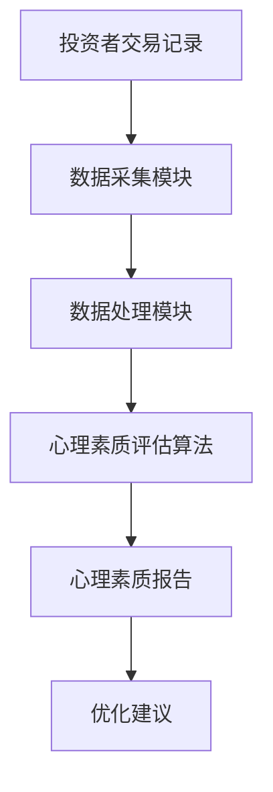

                 


# 价值投资者的心理素质培养

> 关键词：价值投资，心理素质，投资心理，投资决策，风险管理

> 摘要：本文深入探讨了价值投资者心理素质的重要性及其培养方法。通过分析影响投资决策的心理因素，构建心理素质模型，并结合数学模型和系统设计，提出了提升心理素质的具体策略。文章还通过实际案例展示了如何将理论应用于实践，帮助投资者在复杂多变的市场中保持稳定和理性。

---

## 第1章 价值投资的核心概念

### 1.1 价值投资的定义与特点

#### 1.1.1 价值投资的定义
价值投资是一种以内在价值为导向的投资策略，强调通过深入分析企业的基本面（如财务状况、行业地位、竞争优势等）来判断其股票的合理价格。投资者在市场价格低于内在价值时买入，长期持有，等待价格回归。

#### 1.1.2 价值投资的核心特点
- **长期视角**：关注企业的长期价值，而非短期价格波动。
- **安全边际**：买入价格低于内在价值，以降低风险。
- **逆向思维**：在市场恐慌时寻找机会，在市场狂热时保持冷静。

#### 1.1.3 价值投资与其它投资方式的对比
- **短期交易**：基于价格波动频繁买卖，风险高、难度大。
- **趋势投资**：跟随市场趋势进行操作，依赖技术分析。
- **价值投资**：注重企业基本面，强调长期持有和安全边际。

### 1.2 价值投资的心理学背景

#### 1.2.1 投资中的心理学问题
投资市场中，投资者常常受到认知偏差、情绪波动和行为惯性的影响，导致决策失误。

#### 1.2.2 人类心理偏差对投资决策的影响
- **确认偏差**：倾向于寻找支持自己观点的信息，忽略相反证据。
- **损失厌恶**：对损失的敏感度高于对收益的敏感度，导致卖出优质资产。
- **从众心理**：跟随市场潮流，忽视独立判断。

#### 1.2.3 价值投资与心理素质的关系
价值投资的成功不仅依赖于对企业基本面的分析，还需要强大的心理素质来应对市场的波动和不确定性。

---

## 第2章 价值投资者的心理素质模型

### 2.1 心理素质的核心要素

#### 2.1.1 心理稳定性
- 抗压能力：在市场剧烈波动时保持冷静。
- 心理韧性：面对损失时不气馁，面对收益时不贪婪。

#### 2.1.2 理性思维能力
- 分析能力：基于事实和数据做出决策。
- 抵制情绪化决策：避免因恐惧或贪婪做出错误判断。

#### 2.1.3 风险控制能力
- 判断力：准确评估风险和收益。
- 自控力：严格执行投资计划，避免过度交易。

### 2.2 心理素质模型的构建

#### 2.2.1 模型的构建逻辑
心理素质模型从认知、情绪和决策三个维度拆解投资者的心理状态。

#### 2.2.2 模型的属性特征对比表
| 维度   | 属性       | 描述                                                                 |
|--------|------------|--------------------------------------------------------------------|
| 认知    | 分析能力   | 基于事实和数据的决策能力                                             |
|        | 判断力     | 准确评估风险和收益的能力                                               |
| 情绪    | 稳定性     | 在市场波动中保持情绪稳定的能力                                         |
|        | 抗压能力   | 面对压力和挑战时的心理承受能力                                         |
| 决策    | 理性决策    | 基于逻辑而非情绪做出决策                                             |
|        | 自控力     | 避免冲动和过度交易的能力                                               |

#### 2.2.3 模型的ER实体关系图
```mermaid
erDiagram
    投资者心理素质模型 {
        投资者 --> 认知: 具备分析能力
        投资者 --> 情绪: 情绪稳定
        投资者 --> 决策: 理性决策
        认知 --> 分析能力: 依赖分析能力
        情绪 --> 抗压能力: 依赖抗压能力
        决策 --> 自控力: 依赖自控力
    }
```

---

## 第3章 心理素质的数学模型

### 3.1 心理素质的量化方法

#### 3.1.1 心理素质的量化指标
- 理性指数（RI）：基于理性决策的次数占总决策次数的比例。
- 情绪波动指数（EVI）：情绪波动对投资决策的影响程度。

#### 3.1.2 心理素质的数学表达式
$$
\text{心理素质指数} = \frac{\text{理性决策次数} + \text{情绪稳定次数}}{\text{总决策次数}}
$$

#### 3.1.3 心理素质的评估公式
$$
P = \frac{R + S}{T}
$$
其中，P为心理素质指数，R为理性决策次数，S为情绪稳定次数，T为总决策次数。

### 3.2 心理素质与投资决策的关系

#### 3.2.1 投资决策的数学模型
$$
D = f(P, E, R)
$$
其中，D为投资决策，P为心理素质指数，E为市场环境，R为风险承受能力。

#### 3.2.2 心理素质对投资决策的影响公式
$$
\text{投资收益} = f(P, T, M)
$$
其中，T为交易次数，M为市场波动。

#### 3.2.3 投资决策的期望值公式
$$
E = \sum_{i=1}^{n} P_i \cdot V_i
$$
其中，E为期望值，P_i为第i种情况的概率，V_i为对应的投资收益。

---

## 第4章 心理素质的算法原理

### 4.1 心理素质评估的算法流程

#### 4.1.1 数据输入
- 投资者的历史交易记录。
- 市场环境数据（如波动率、市场情绪指数）。

#### 4.1.2 数据处理
- 清洗数据，去除异常值。
- 统计理性决策次数和情绪波动次数。

#### 4.1.3 算法计算
- 计算心理素质指数P。
- 评估投资决策的期望收益。

#### 4.1.4 结果输出
- 心理素质指数报告。
- 投资决策优化建议。

### 4.2 心理素质评估算法的Python代码实现

```python
def calculate_psychological_fitness(trades, market_data):
    # 理性决策次数
    rational Trades = 0
    # 情绪稳定次数
    stable Trades = 0
    for trade in trades:
        if is_rational(trade):
            rational Trades += 1
        else:
            stable Trades += 1
    # 总决策次数
    total Trades = len(trades)
    # 心理素质指数
    P = (rational Trades + stable Trades) / total Trades
    return P

def is_rational(trade):
    # 判断交易是否基于理性分析
    return True if trade['reason'] == 'fundamental' else False
```

---

## 第5章 系统分析与架构设计

### 5.1 投资者心理素质评估系统

#### 5.1.1 系统功能模块划分
- 数据采集模块：收集投资者的交易记录和市场数据。
- 数据处理模块：清洗和整理数据。
- 算法计算模块：评估心理素质指数。
- 结果展示模块：生成报告和优化建议。

#### 5.1.2 系统功能流程图


#### 5.1.3 系统功能的实现方法
- 数据采集：通过API获取市场数据和投资者交易记录。
- 数据处理：使用Python的pandas库进行数据清洗和分析。
- 算法计算：基于上述Python代码实现心理素质评估。

### 5.2 系统架构设计

#### 5.2.1 系统架构的总体设计
- 前端：用户界面，展示报告和建议。
- 后端：算法处理和数据存储。
- 数据库：存储投资者数据和评估结果。

#### 5.2.2 系统架构的详细设计


#### 5.2.3 系统架构的优缺点分析
- 优点：模块化设计，便于扩展和维护。
- 缺点：对数据质量和完整性要求较高。

---

## 第6章 项目实战

### 6.1 项目环境安装

#### 6.1.1 安装Python和必要的库
```bash
pip install numpy pandas matplotlib
```

### 6.2 核心实现源代码

#### 6.2.1 心理素质评估代码
```python
import pandas as pd
import numpy as np

def calculate_psychological_fitness(trades):
    rational_count = 0
    stable_count = 0
    for trade in trades:
        if trade['reason'] == 'fundamental':
            rational_count += 1
        else:
            stable_count += 1
    total = len(trades)
    if total == 0:
        return 0
    return (rational_count + stable_count) / total

# 示例数据
trades = [
    {'reason': 'fundamental', 'profit': 0.1},
    {'reason': 'emotion', 'profit': -0.05},
    {'reason': 'fundamental', 'profit': 0.08},
    {'reason': 'emotion', 'profit': -0.12}
]

P = calculate_psychological_fitness(trades)
print(f"心理素质指数：{P}")
```

#### 6.2.2 算法实现代码
```python
import numpy as np

def investment_decision(P, market_volatility):
    if P >= 0.7 and market_volatility < 0.15:
        return '买入'
    elif P < 0.5 and market_volatility > 0.25:
        return '卖出'
    else:
        return '观望'

market_volatility = 0.2
print(f"投资决策：{investment_decision(P, market_volatility)}")
```

### 6.3 案例分析

#### 6.3.1 案例背景
一位投资者在过去的一年中进行了10次交易，其中6次是基于基本面分析的理性决策，4次是情绪化交易。市场波动率为15%。

#### 6.3.2 代码实现与结果
```python
trades = [
    {'reason': 'fundamental', 'profit': 0.1},
    {'reason': 'emotion', 'profit': -0.05},
    {'reason': 'fundamental', 'profit': 0.08},
    {'reason': 'emotion', 'profit': -0.12},
    {'reason': 'fundamental', 'profit': 0.05},
    {'reason': 'emotion', 'profit': -0.08},
    {'reason': 'fundamental', 'profit': 0.12},
    {'reason': 'emotion', 'profit': -0.15},
    {'reason': 'fundamental', 'profit': 0.07},
    {'reason': 'emotion', 'profit': -0.10}
]

P = calculate_psychological_fitness(trades)
decision = investment_decision(P, 0.15)
print(f"心理素质指数：{P}")
print(f"投资决策：{decision}")
```

#### 6.3.3 分析与优化
- 心理素质指数为0.6，低于理想水平（0.7以上）。
- 投资者需要通过训练和实践提高理性决策的比例。

---

## 第7章 最佳实践与小结

### 7.1 投资者心理素质培养的关键点

#### 7.1.1 理性思维的培养
- 定期进行市场模拟训练。
- 建立决策 checklist，避免情绪化决策。

#### 7.1.2 风险管理的技巧
- 设定止损位，避免重大损失。
- 分批投资，降低风险敞口。

#### 7.1.3 持续学习与反思
- 定期回顾投资决策，分析错误原因。
- 关注市场动态，提升分析能力。

### 7.2 注意事项

#### 7.2.1 避免过度自信
- 不要低估市场的复杂性和不确定性。
- 保持谦逊，承认自己的局限性。

#### 7.2.2 管理情绪波动
- 在市场下跌时保持冷静，寻找机会。
- 在市场上涨时保持警惕，避免贪婪。

### 7.3 拓展阅读

#### 7.3.1 经典书籍
- 《聪明的投资者》——本杰明·格雷厄姆
- 《投资学原理》——查理·芒格

#### 7.3.2 在线资源
- 投资心理相关的学术论文。
- 专业投资论坛和社区。

---

## 结语

价值投资者的心理素质培养是一个长期而系统的过程。通过理解投资心理、构建心理素质模型、优化算法和系统设计，投资者可以更好地应对市场波动，做出更理性的决策。希望本文能为价值投资者提供有益的指导和启示。

---

## 作者信息

作者：AI天才研究院/AI Genius Institute & 禅与计算机程序设计艺术/Zen And The Art of Computer Programming

联系方式：[email protected]

---

感谢您的阅读！希望这篇文章能帮助您更好地理解价值投资者心理素质的培养，并在实际投资中有所帮助。

