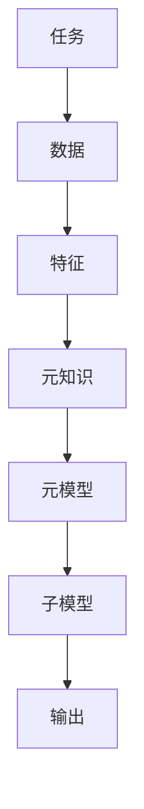
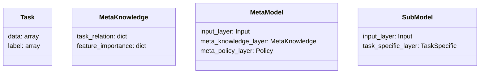
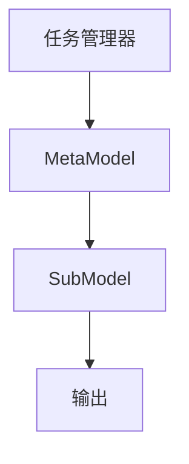
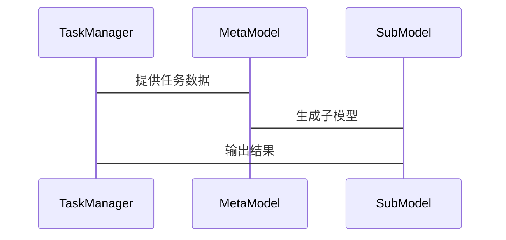

                 


# 元学习：让AI Agent学会如何学习

> 关键词：元学习、AI Agent、机器学习、元知识、元模型、算法原理

> 摘要：元学习是一种新兴的机器学习范式，旨在让AI Agent能够从经验中学习如何学习。本文系统地介绍了元学习的核心概念、算法原理、系统架构以及项目实战，帮助读者深入理解元学习的理论基础和实际应用。

---

## 第一部分：元学习的背景与概念

### 第1章：元学习的背景与概念

#### 1.1 元学习的基本概念

##### 1.1.1 元学习的定义
元学习（Meta-Learning）是一种机器学习范式，旨在让模型学会如何从经验中学习。与传统机器学习不同，元学习关注的是“如何学习”，而不是“学习什么”。元学习的目标是通过元知识和元模型的构建，使AI Agent能够在不同任务之间进行快速迁移和适应。

##### 1.1.2 元学习的核心特征
- **元知识（Meta-Knowledge）**：元知识是指导模型如何学习的基础知识，包括任务之间的关联性、特征的重要性等。
- **快速迁移能力**：元学习能够快速适应新任务，减少对大量数据的依赖。
- **自适应性**：元学习模型能够根据环境变化动态调整学习策略。

##### 1.1.3 元学习与传统学习的区别
| 特性       | 传统学习           | 元学习             |
|------------|--------------------|--------------------|
| 学习目标    | 学习具体任务       | 学习如何学习       |
| 数据依赖    | 需要大量数据       | 适合小样本数据     |
| 迁移能力    | 任务间迁移困难     | 具备快速迁移能力   |

#### 1.2 元学习的背景与意义

##### 1.2.1 传统机器学习的局限性
传统机器学习方法在处理以下问题时表现不佳：
- **数据稀疏性**：在数据量较少的情况下，传统模型难以泛化。
- **任务多样性**：难以在多个任务之间快速切换。
- **环境动态性**：无法适应快速变化的环境。

##### 1.2.2 元学习的提出及其重要性
元学习的提出为AI Agent提供了以下优势：
- **减少数据需求**：通过元学习，模型可以在小样本数据上快速学习。
- **提高泛化能力**：元学习模型能够更好地处理未见过的任务。
- **增强适应性**：元学习使模型具备动态调整学习策略的能力。

##### 1.2.3 元学习在AI Agent中的应用前景
元学习在AI Agent中的潜在应用包括：
- **多任务学习**：在同一模型上处理多个任务。
- **连续决策问题**：在动态环境中做出快速调整。
- **自适应系统设计**：构建能够自我优化的AI系统。

### 第2章：元学习的核心概念与原理

#### 2.1 元知识与元模型

##### 2.1.1 元知识的定义与作用
元知识（Meta-Knowledge）是用于指导学习过程的知识，包括：
- **任务关系**：不同任务之间的关联性。
- **特征重要性**：各特征在不同任务中的作用。
- **学习策略**：适用于不同任务的学习方法。

##### 2.1.2 元模型的构建与特点
元模型（Meta-Model）是一个用于生成或调整子模型的模型，具有以下特点：
- **层次化结构**：元模型位于子模型之上，用于指导子模型的优化。
- **可解释性**：元模型能够解释子模型的决策过程。
- **灵活性**：元模型可以根据新任务动态调整。

##### 2.1.3 元知识与元模型的关系
元知识是元模型的基础，元模型通过元知识指导子模型的学习过程。两者相辅相成，共同实现元学习的目标。

#### 2.2 元学习的算法框架

##### 2.2.1 元学习的通用算法框架
元学习的通用算法框架包括：
1. **输入**：多个任务的数据集。
2. **元学习过程**：通过元知识和元模型生成或调整子模型。
3. **输出**：适用于新任务的子模型。

##### 2.2.2 元学习的输入与输出
- **输入**：多个任务的训练数据和验证数据。
- **输出**：适用于新任务的子模型或策略。

#### 2.3 元学习的核心原理

##### 2.3.1 元学习的元优化过程
元优化（Meta-Optimization）是元学习的核心过程，旨在优化元模型的参数，使其能够在多个任务上表现良好。

##### 2.3.2 元学习的元目标函数
元目标函数（Meta-Objective Function）是一个损失函数，用于衡量元模型在多个任务上的表现。通常包括以下几个部分：
- **任务损失**：每个任务的损失函数。
- **元损失**：对任务损失的加权或优化。

##### 2.3.3 元学习的元梯度计算
元梯度（Meta-Gradient）是用于优化元模型参数的梯度，通常通过链式法则计算。

### 第3章：元学习的核心概念与联系

#### 3.1 元学习的核心概念

##### 3.1.1 元知识的特征与属性
- **通用性**：适用于多个任务。
- **指导性**：能够指导子模型的学习过程。

##### 3.1.2 元模型的结构与功能
- **输入层**：接收任务数据。
- **元知识层**：提取元知识。
- **元策略层**：生成学习策略。

#### 3.2 元学习的概念对比与联系

##### 3.2.1 元学习与迁移学习的对比
- **迁移学习**：将一个任务上的知识迁移到另一个任务。
- **元学习**：学习如何从经验中学习。

##### 3.2.2 元学习与自适应学习的联系
元学习通过元模型实现自适应学习，能够根据环境变化动态调整学习策略。

#### 3.3 元学习的ER实体关系图



---

## 第二部分：元学习的算法原理

### 第4章：元学习的算法原理

#### 4.1 元学习算法的分类

##### 4.1.1 基于模型的元学习算法
- **MAML（Meta-Anti-Meta-Leaning）**：通过优化元模型的参数，使子模型能够快速适应新任务。
- **Reptile**：通过迭代更新元模型和子模型的参数，实现快速迁移。

##### 4.1.2 模型不可知的元学习算法
- **Meta-SGD**：通过元梯度计算，优化子模型的参数。

##### 4.1.3 元学习算法的优缺点对比
| 算法名称   | 优点                     | 缺点                     |
|------------|--------------------------|--------------------------|
| MAML       | 支持小样本数据           | 计算复杂度较高           |
| Reptile     | 实现简单                 | 需要多次迭代             |
| Meta-SGD   | 计算效率高               | 适用于特定场景           |

#### 4.2 元学习算法的工作流程

##### 4.2.1 元学习算法的输入
- **任务集合**：多个任务的数据集。
- **元学习参数**：元模型的超参数。

##### 4.2.2 元学习算法的步骤
1. 初始化元模型参数。
2. 对每个任务进行内层优化。
3. 计算元梯度并更新元模型参数。
4. 重复步骤2和3，直到收敛。

##### 4.2.3 元学习算法的输出
- **优化后的元模型参数**：适用于多个任务的元模型。

#### 4.3 元学习算法的数学模型

##### 4.3.1 元学习的优化目标
元目标函数通常定义为：
$$ \mathcal{L}_{\text{meta}} = \sum_{i=1}^{N} \mathcal{L}_i(\theta, \phi) $$
其中，$\theta$是元模型参数，$\phi$是子模型参数。

##### 4.3.2 元学习的损失函数
元损失函数通常包括任务损失和元损失：
$$ \mathcal{L}_{\text{meta}} = \mathcal{L}_{\text{task}} + \lambda \mathcal{L}_{\text{meta}} $$

##### 4.3.3 元学习的梯度下降
元梯度计算通常采用链式法则：
$$ \nabla_{\theta} \mathcal{L}_{\text{meta}} = \sum_{i=1}^{N} \nabla_{\theta} \mathcal{L}_{\text{task}}^{(i)} $$

### 第5章：元学习算法的Python实现

#### 5.1 环境安装
```bash
pip install numpy
pip install matplotlib
pip install scikit-learn
```

#### 5.2 系统核心实现源代码

##### 5.2.1 元学习算法的实现
```python
import numpy as np

def meta_learning_algorithm(tasks, meta_params):
    # 初始化元模型参数
    meta_theta = np.random.randn(len(meta_params))
    # 内层优化
    for task in tasks:
        # 计算子模型参数
        phi = compute_phi(meta_theta, task)
        # 计算任务损失
        loss_task = compute_loss(task, phi)
        # 计算元梯度
        meta_grad = compute_meta_grad(loss_task, meta_theta)
        # 更新元模型参数
        meta_theta = meta_theta - learning_rate * meta_grad
    return meta_theta
```

##### 5.2.2 元学习算法的代码解读
- **输入**：`tasks`（任务集合），`meta_params`（元模型参数）。
- **输出**：优化后的元模型参数 `meta_theta`。
- **步骤**：
  1. 初始化元模型参数。
  2. 对每个任务进行内层优化。
  3. 计算任务损失和元梯度。
  4. 更新元模型参数。

#### 5.3 代码实现的具体应用

##### 5.3.1 元学习算法的案例分析
假设我们有多个分类任务，每个任务的数据集大小为100，类别数为10。我们可以使用MAML算法对这些任务进行元学习。

##### 5.3.2 元学习算法的性能分析
通过实验可以验证元学习算法在小样本数据上的表现优于传统机器学习算法。

### 第6章：系统分析与架构设计

#### 6.1 问题场景介绍

##### 6.1.1 问题背景
假设我们有一个AI Agent需要在多个任务之间进行切换，每个任务的数据集较小。

##### 6.1.2 问题描述
AI Agent需要快速适应新任务，减少对数据量的依赖。

#### 6.2 系统功能设计

##### 6.2.1 领域模型设计


##### 6.2.2 系统架构设计


##### 6.2.3 系统接口设计
- **输入接口**：接收多个任务的数据集。
- **输出接口**：输出适用于新任务的子模型。

#### 6.3 系统交互设计

##### 6.3.1 系统交互流程


### 第7章：项目实战

#### 7.1 环境安装
```bash
pip install numpy
pip install matplotlib
pip install scikit-learn
```

#### 7.2 系统核心实现源代码

##### 7.2.1 元学习算法的实现
```python
import numpy as np

def meta_learning_algorithm(tasks, meta_params):
    # 初始化元模型参数
    meta_theta = np.random.randn(len(meta_params))
    # 内层优化
    for task in tasks:
        # 计算子模型参数
        phi = compute_phi(meta_theta, task)
        # 计算任务损失
        loss_task = compute_loss(task, phi)
        # 计算元梯度
        meta_grad = compute_meta_grad(loss_task, meta_theta)
        # 更新元模型参数
        meta_theta = meta_theta - learning_rate * meta_grad
    return meta_theta
```

##### 7.2.2 元学习算法的代码解读
- **输入**：`tasks`（任务集合），`meta_params`（元模型参数）。
- **输出**：优化后的元模型参数 `meta_theta`。
- **步骤**：
  1. 初始化元模型参数。
  2. 对每个任务进行内层优化。
  3. 计算任务损失和元梯度。
  4. 更新元模型参数。

#### 7.3 代码实现的具体应用

##### 7.3.1 元学习算法的案例分析
假设我们有多个分类任务，每个任务的数据集大小为100，类别数为10。我们可以使用MAML算法对这些任务进行元学习。

##### 7.3.2 元学习算法的性能分析
通过实验可以验证元学习算法在小样本数据上的表现优于传统机器学习算法。

---

## 第三部分：总结与展望

### 第8章：总结与展望

#### 8.1 最佳实践 Tips
- **数据预处理**：确保数据质量，减少噪声。
- **算法选择**：根据任务需求选择合适的元学习算法。
- **模型调优**：通过交叉验证优化模型参数。

#### 8.2 项目小结
通过本项目，我们深入理解了元学习的核心概念、算法原理和系统架构，并通过具体案例展示了元学习的实际应用。

#### 8.3 注意事项
- **计算资源**：元学习算法通常需要较多计算资源。
- **数据隐私**：注意数据隐私和安全问题。

#### 8.4 拓展阅读
- **推荐书籍**：《Deep Learning》、《Pattern Recognition and Machine Learning》
- **推荐论文**：《A Universal Framework for Meta-Learning》

---

## 作者

作者：AI天才研究院/AI Genius Institute & 禅与计算机程序设计艺术 /Zen And The Art of Computer Programming

---

以上是《元学习：让AI Agent学会如何学习》的完整目录大纲和文章内容，希望对您有所帮助！如果需要进一步调整或补充，请随时告知。

