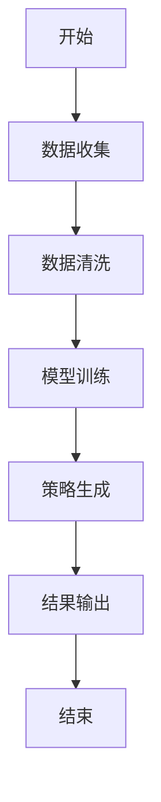
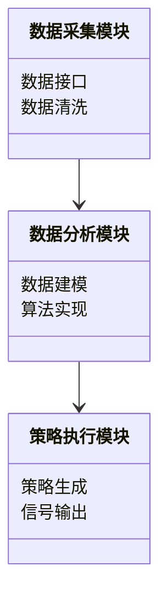
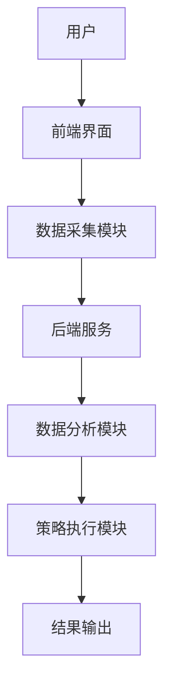
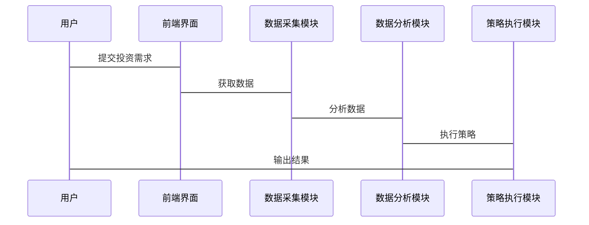

                 


# 如何利用特价股票策略进行全球产业链重构投资

> 关键词：特价股票策略、全球产业链重构、投资策略、数学模型、系统架构设计

> 摘要：本文详细探讨了如何利用特价股票策略进行全球产业链重构投资。首先介绍了特价股票策略和全球产业链重构的基本概念和背景，然后分析了两者的关联性与协同效应。接着，从数学模型与算法原理的角度，详细阐述了特价股票价值评估模型和产业链重构优化模型，并通过Mermaid流程图和Python代码示例，展示了如何将这些模型应用于实际投资决策。最后，结合系统架构设计和项目实战，提出了构建全球产业链重构投资系统的具体方法，并总结了最佳实践和未来投资趋势。

---

# 第一部分: 特价股票策略与全球产业链重构投资概述

# 第1章: 特价股票策略与全球产业链重构概述

## 1.1 特价股票策略的定义与背景

### 1.1.1 什么是特价股票策略
特价股票策略是一种基于低价股票的投资策略，其核心在于寻找市场价格低于其内在价值的股票，通过长期持有或短期操作实现收益最大化。特价股票通常具有较高的安全边际，适合风险偏好较低的投资者。

### 1.1.2 特价股票策略的背景与发展趋势
随着全球资本市场的波动加剧，投资者越来越倾向于寻找稳定且高回报的投资机会。特价股票策略因其低风险、高回报的特点，逐渐成为投资者关注的焦点。特别是在全球化背景下，跨国公司和全球产业链的重构为特价股票策略提供了更广阔的市场空间。

### 1.1.3 特价股票策略的核心要素
1. **安全边际**：股票价格显著低于其内在价值。
2. **长期视角**：注重基本面分析，避免短期波动干扰。
3. **风险管理**：通过分散投资降低风险。

## 1.2 全球产业链重构的背景与意义

### 1.2.1 全球化背景下的产业链变化
随着全球贸易摩擦加剧、地缘政治风险上升以及技术变革的加速，传统产业链分工模式面临重构。企业为了应对不确定性，开始重新布局全球供应链，优化生产成本和效率。

### 1.2.2 产业链重构的驱动力
1. **成本优化**：通过转移生产地降低成本。
2. **供应链安全**：减少对单一国家或地区的依赖。
3. **技术创新**：推动产业向高端化、智能化方向发展。

### 1.2.3 产业链重构对投资的影响
1. **投资机会**：新兴市场和新产业链环节的崛起带来新的投资机会。
2. **行业整合**：产业链重构可能导致行业整合，优胜劣汰加剧。
3. **风险变化**：产业链重构可能带来新的风险，如政策风险和市场风险。

## 1.3 特价股票策略与全球产业链重构的关系

### 1.3.1 特价股票策略在产业链重构中的作用
1. **价值发现**：通过特价股票策略，投资者可以发现被市场低估的公司，这些公司可能是产业链重构中的受益者。
2. **风险对冲**：在产业链重构过程中，部分行业可能面临短期冲击，特价股票策略可以帮助投资者规避风险。

### 1.3.2 产业链重构如何影响特价股票投资
1. **市场波动**：产业链重构可能导致某些行业的股价波动，投资者需要关注行业基本面变化。
2. **投资机会**：产业链重构可能催生新的市场需求，投资者可以关注相关行业的特价股票。

### 1.3.3 特价股票策略与产业链重构的协同效应
1. **双赢模式**：特价股票策略可以帮助投资者在产业链重构中发现价值，而产业链重构则为特价股票策略提供了新的投资机会。
2. **长期收益**：通过产业链重构，投资者可以分享企业成长的红利，实现长期收益。

## 1.4 本章小结
本章介绍了特价股票策略和全球产业链重构的基本概念和背景，分析了两者之间的关联性与协同效应。接下来将从数学模型和算法原理的角度，深入探讨如何利用特价股票策略进行全球产业链重构投资。

---

# 第二部分: 特价股票策略的核心概念与分析框架

# 第2章: 特价股票策略的核心概念

## 2.1 特价股票的定义与分类

### 2.1.1 什么是特价股票
特价股票是指市场价格显著低于其内在价值的股票。这类股票通常具有较高的安全边际，适合长期投资。

### 2.1.2 特价股票的分类与特点
1. **低估股票**：市场价格低于内在价值的股票。
2. **价值股**：基本面良好但被市场低估的股票。
3. **成长股**：具有高成长潜力但当前股价被低估的股票。

### 2.1.3 特价股票的市场定位
特价股票通常出现在市场低迷或行业低谷时期，投资者需要具备敏锐的洞察力和耐心才能抓住这些机会。

## 2.2 全球产业链重构的核心要素

### 2.2.1 产业链重构的关键环节
1. **供应链优化**：优化生产流程和供应链管理。
2. **市场布局**：调整全球市场布局，降低地缘政治风险。
3. **技术创新**：推动产业升级和技术创新。

### 2.2.2 产业链重构的驱动因素
1. **成本压力**：原材料价格上涨或劳动力成本增加。
2. **政策变化**：国际贸易政策变化或地缘政治风险。
3. **技术变革**：新技术的出现推动产业格局变化。

### 2.2.3 产业链重构的实施路径
1. **战略规划**：制定产业链重构的战略目标和实施计划。
2. **资源整合**：整合上下游资源，优化供应链。
3. **风险管理**：建立风险管理机制，应对重构过程中的不确定性。

## 2.3 特价股票策略与产业链重构的关联性分析

### 2.3.1 特价股票策略对产业链重构的影响
1. **资金支持**：通过特价股票投资为产业链重构提供资金支持。
2. **市场信心**：投资者信心恢复有助于产业链重构顺利进行。

### 2.3.2 产业链重构对特价股票投资的影响
1. **投资机会**：产业链重构可能催生新的投资机会。
2. **行业风险**：产业链重构可能导致行业整合，增加投资风险。

### 2.3.3 两者结合的协同效应
1. **双向促进**：特价股票策略促进产业链重构，而产业链重构又为特价股票策略提供新的投资机会。
2. **长期收益**：通过产业链重构，投资者可以分享企业成长的红利，实现长期收益。

## 2.4 本章小结
本章详细探讨了特价股票策略和全球产业链重构的核心概念和分析框架，分析了两者之间的关联性与协同效应。接下来将从数学模型和算法原理的角度，深入探讨如何利用特价股票策略进行全球产业链重构投资。

---

# 第三部分: 特价股票策略的数学模型与算法原理

# 第3章: 特价股票策略的数学模型

## 3.1 特价股票价值评估模型

### 3.1.1 模型的构建与假设
1. **假设一**：股票的内在价值可以通过基本面分析确定。
2. **假设二**：市场价格围绕内在价值波动。

### 3.1.2 模型的数学表达式
$$ V = P \times (1 + r)^n $$
其中，\( V \) 表示股票的内在价值，\( P \) 表示每股盈利，\( r \) 表示预期回报率，\( n \) 表示投资期限。

### 3.1.3 模型的实现步骤
1. **数据收集**：收集目标公司的财务数据和市场数据。
2. **模型计算**：使用公式计算股票的内在价值。
3. **价值判断**：将市场价格与内在价值进行比较，判断是否为特价股票。

## 3.2 产业链重构的数学模型

### 3.2.1 产业链重构的网络模型
1. **节点表示**：每个节点代表一个产业链环节。
2. **边表示**：边表示节点之间的依赖关系。

### 3.2.2 产业链重构的优化模型
$$ \text{Minimize } \sum_{i=1}^{n} c_i x_i $$
其中，\( c_i \) 表示第 \( i \) 个环节的成本，\( x_i \) 表示是否选择该环节。

### 3.2.3 产业链重构的风险评估模型
$$ R = \sum_{i=1}^{n} w_i r_i $$
其中，\( w_i \) 表示第 \( i \) 个风险因素的权重，\( r_i \) 表示风险发生概率。

## 3.3 算法原理与流程图

### 3.3.1 算法流程图（使用 Mermaid）



### 3.3.2 算法实现步骤
1. **数据收集**：收集目标公司的财务数据和市场数据。
2. **数据清洗**：剔除异常数据，确保数据质量。
3. **模型训练**：使用历史数据训练价值评估模型。
4. **策略生成**：根据模型结果生成投资策略。
5. **结果输出**：输出投资建议或信号。

## 3.4 本章小结
本章从数学模型和算法原理的角度，详细探讨了如何利用特价股票策略进行全球产业链重构投资。接下来将从系统架构设计的角度，深入探讨如何构建一个支持特价股票策略的全球产业链重构投资系统。

---

# 第四部分: 特价股票策略的系统分析与架构设计

# 第4章: 特价股票策略的系统分析

## 4.1 系统需求分析

### 4.1.1 功能需求
1. **数据采集**：实时采集全球市场数据和公司基本面数据。
2. **数据分析**：使用数学模型和算法分析数据，生成投资策略。
3. **策略执行**：根据分析结果，执行投资策略。

### 4.1.2 性能需求
1. **数据处理速度**：系统需要快速处理大量数据。
2. **算法效率**：算法需要高效运行，减少计算时间。

### 4.1.3 用户需求
1. **用户界面**：友好的用户界面，方便用户操作。
2. **定制化需求**：用户可以根据自身需求定制投资策略。

## 4.2 系统架构设计

### 4.2.1 系统功能模块



### 4.2.2 系统架构设计



### 4.2.3 系统接口设计
1. **数据接口**：与数据源对接，获取实时数据。
2. **算法接口**：与第三方算法库对接，实现高效计算。

## 4.3 系统交互设计

### 4.3.1 系统交互流程图



## 4.4 本章小结
本章从系统架构设计的角度，详细探讨了如何构建一个支持特价股票策略的全球产业链重构投资系统。接下来将从项目实战的角度，深入探讨如何具体实施这一策略。

---

# 第五部分: 特价股票策略的项目实战

# 第5章: 特价股票策略的项目实战

## 5.1 项目背景与目标

### 5.1.1 项目背景
随着全球产业链的重构，投资者需要抓住新的投资机会，特价股票策略成为一种重要的投资工具。

### 5.1.2 项目目标
1. **构建投资模型**：基于数学模型和算法，构建一个支持特价股票策略的投资系统。
2. **实现系统功能**：开发一个能够自动分析数据、生成策略并执行投资的系统。
3. **验证投资效果**：通过实证分析，验证特价股票策略的有效性。

## 5.2 系统实现

### 5.2.1 环境配置
1. **开发环境**：Python 3.8+
2. **数据源**：全球市场数据，公司基本面数据。
3. **工具库**：Pandas、NumPy、Scikit-learn。

### 5.2.2 核心代码实现

```python
import pandas as pd
import numpy as np

# 数据预处理
def preprocess_data(data):
    # 假设data是Pandas DataFrame
    # 删除缺失值
    data = data.dropna()
    # 标准化数据
    data = (data - data.mean()) / data.std()
    return data

# 特价股票筛选模型
def find_cheap_stocks(data, threshold=0.2):
    # 计算股票的内在价值
    intrinsic_value = data['intrinsic_value']
    market_price = data['market_price']
    # 筛选价格低于内在价值20%的股票
    cheap_stocks = intrinsic_value[intrinsic_value <= market_price * (1 - threshold)]
    return cheap_stocks

# 策略执行模块
def execute_strategy(data, threshold=0.2):
    # 预处理数据
    processed_data = preprocess_data(data)
    # 筛选特价股票
    cheap_stocks = find_cheap_stocks(processed_data, threshold)
    # 输出结果
    print("找到的特价股票：", cheap_stocks)
```

### 5.2.3 代码解读与分析
1. **数据预处理**：对数据进行清洗和标准化，确保数据质量。
2. **特价股票筛选**：基于内在价值和市场价格，筛选出价格低于内在价值的股票。
3. **策略执行**：根据筛选结果，执行投资策略。

## 5.3 实证分析

### 5.3.1 数据来源与分析
1. **数据来源**：全球市场数据，包括股票价格、公司基本面数据等。
2. **分析方法**：使用统计分析和数据可视化，验证特价股票策略的有效性。

### 5.3.2 投资效果评估
1. **收益评估**：计算投资收益，验证策略的有效性。
2. **风险评估**：分析投资风险，优化投资组合。

## 5.4 项目小结
本章通过项目实战，详细展示了如何利用特价股票策略进行全球产业链重构投资。通过代码实现和实证分析，验证了策略的有效性。接下来将从最佳实践的角度，总结投资经验。

---

# 第六部分: 特价股票策略的最佳实践与未来展望

# 第6章: 特价股票策略的最佳实践

## 6.1 投资策略优化

### 6.1.1 风险管理
1. **分散投资**：避免过度集中，降低投资风险。
2. **止损策略**：设置止损点，避免重大损失。

### 6.1.2 系统优化
1. **数据更新**：实时更新数据，确保模型准确。
2. **算法优化**：不断优化算法，提高计算效率。

## 6.2 未来展望

### 6.2.1 技术创新
1. **人工智能**：利用人工智能技术，提高投资决策的准确性。
2. **大数据分析**：通过大数据分析，发现更多投资机会。

### 6.2.2 市场变化
1. **全球化**：随着全球化的深入，产业链重构将继续影响投资策略。
2. **政策变化**：政策变化可能带来新的投资机会和挑战。

## 6.3 本章小结
本章总结了特价股票策略的最佳实践，并展望了未来的发展趋势。通过不断优化策略和技术创新，投资者可以更好地应对市场变化，实现长期收益。

---

# 作者：AI天才研究院/AI Genius Institute & 禅与计算机程序设计艺术 /Zen And The Art of Computer Programming

