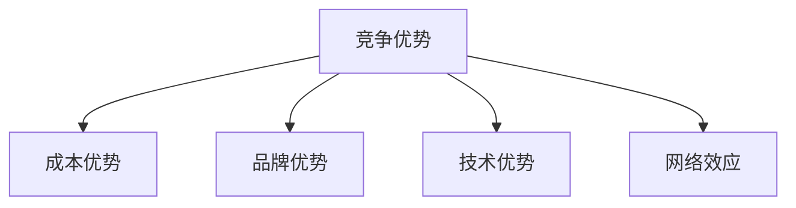

                 


# 巴菲特的经济护城河概念

> **关键词**：巴菲特，经济护城河，投资策略，竞争优势，企业价值

> **摘要**：本文将深入探讨巴菲特提出的经济护城河概念，分析其核心原理、系统架构、实际应用以及与现代企业价值评估的关系。通过结合技术视角，本文将从系统分析和架构设计的角度，详细解读经济护城河的构建与优化方法，提供实际案例分析与代码实现。

---

## 第一部分：经济护城河的核心概念

### 第1章：经济护城河的定义与背景

#### 1.1 经济护城河的起源与背景

##### 1.1.1 巴菲特投资理念的形成

巴菲特的投资理念以价值投资为核心，他强调寻找具有持续竞争优势的企业。经济护城河（Economic Moat）是这一理念中的核心概念，它描述了企业在行业内建立的竞争优势，能够防止竞争对手侵蚀其市场份额。

$$
\text{经济护城河} = \text{企业竞争优势的持久性}
$$

##### 1.1.2 经济护城河概念的提出

经济护城河的概念由巴菲特在20世纪80年代提出，旨在帮助企业识别那些能够在长期竞争中保持优势的企业。经济护城河的存在使得企业在面对竞争对手时具有防御性优势，从而保护其盈利能力。

##### 1.1.3 经济护城河在投资中的重要性

在投资决策中，经济护城河是评估企业价值的重要指标。具有强大经济护城河的企业能够在市场中长期保持竞争优势，从而为投资者带来稳定回报。

#### 1.2 经济护城河的核心要素

##### 1.2.1 什么是经济护城河

经济护城河是一种竞争优势，它使得企业能够在特定市场中获得超额利润，并且这种优势不易被竞争对手复制或破坏。

##### 1.2.2 经济护城河的分类与特点

经济护城河可以分为以下几种类型：
1. **成本优势**：企业通过规模经济或独特的生产流程降低成本，使得竞争对手难以在价格上与其竞争。
2. **品牌优势**：强大的品牌影响力能够吸引消费者，形成客户忠诚度。
3. **技术优势**：拥有专利或独特的技术，使得竞争对手难以复制。
4. **网络效应**：用户数量的增加会增强产品的价值，形成正反馈循环。

##### 1.2.3 经济护城河与企业竞争优势的关系

经济护城河是企业竞争优势的集中体现，它不仅包括企业的资源和能力，还包括市场结构和行业特性。强大的经济护城河能够为企业提供长期的市场防御能力。

#### 1.3 经济护城河的边界与外延

##### 1.3.1 经济护城河的边界

经济护城河的边界是指企业竞争优势的范围和限制。它不仅包括企业的核心竞争力，还包括市场的地理范围和客户群体。

##### 1.3.2 经济护城河的外延

经济护城河的外延是指企业在核心竞争优势之外的扩展能力。例如，企业可以通过技术创新或市场扩展进一步巩固其护城河。

##### 1.3.3 经济护城河与其他竞争优势的对比

以下是几种常见竞争优势的对比：

| 竞争优势类型 | 描述 | 特点 |
|----------------|------|------|
| 成本优势       | 通过降低成本获得竞争优势 | 可扩展性高，但容易被模仿 |
| 品牌优势       | 通过品牌影响力吸引客户 | 长期稳定性高，但难以快速建立 |
| 技术优势       | 通过专利或技术创新获得优势 | 易被技术进步替代 |
| 网络效应       | 用户数量增加带来价值提升 | 具有正反馈效应 |

---

## 第二部分：经济护城河的核心概念与联系

### 第2章：经济护城河的核心原理

#### 2.1 经济护城河的原理

##### 2.1.1 经济护城河的基本原理

经济护城河的原理可以归纳为：通过构建特定的竞争优势，企业能够在市场中形成防御性壁垒，从而保护其市场份额和利润。

$$
\text{经济护城河} = \text{竞争优势} + \text{市场壁垒}
$$

##### 2.1.2 经济护城河的数学模型

经济护城河的强度可以通过以下公式进行量化：

$$
\text{经济护城河强度} = \frac{\text{企业竞争优势}}{\text{市场壁垒}}
$$

##### 2.1.3 经济护城河的公式推导

以成本优势为例，假设企业A的成本为C_A，企业B的成本为C_B，且C_A < C_B。那么，企业A的成本优势可以通过以下公式计算：

$$
\text{成本优势} = \frac{C_B - C_A}{C_A}
$$

#### 2.2 经济护城河的属性特征对比

##### 2.2.1 经济护城河的属性特征

经济护城河的属性特征可以通过以下表格进行对比：

| 属性 | 描述 | 示例 |
|------|------|------|
| 稳定性 | 护城河的持久性 | 技术优势的更新周期 |
| 可扩展性 | 护城河的市场覆盖能力 | 品牌影响力 |
| 防御性 | 护城河的市场防御能力 | 成本优势 |

##### 2.2.2 经济护城河与其他竞争优势的对比

以下是经济护城河与其它竞争优势的对比：

| 竞争优势类型 | 描述 | 经济护城河的对比 |
|----------------|------|------------------|
| 成本优势       | 通过降低成本获得竞争优势 | 经济护城河的核心要素之一 |
| 品牌优势       | 通过品牌影响力吸引客户 | 经济护城河的重要组成部分 |
| 技术优势       | 通过专利或技术创新获得优势 | 经济护城河的关键要素 |
| 网络效应       | 用户数量增加带来价值提升 | 经济护城河的外延表现 |

##### 2.2.3 经济护城河的量化分析

通过量化分析，我们可以更好地理解经济护城河的强度。以下是几个量化指标：

- 市场份额：企业市场份额的高低反映了其竞争优势的强弱。
- 净利润率：高利润率通常意味着企业具有强大的市场壁垒。
- 投资回报率：高投资回报率表明企业具有可持续的竞争优势。

---

## 第三部分：经济护城河的系统分析与架构设计

### 第3章：经济护城河的系统分析

#### 3.1 经济护城河的系统分析

##### 3.1.1 系统分析的基本方法

系统分析是理解经济护城河的重要方法。以下是系统分析的基本步骤：

1. **问题识别**：明确企业的核心竞争优势。
2. **系统分解**：将企业竞争优势分解为各个要素。
3. **关系分析**：分析各要素之间的相互关系。
4. **系统优化**：优化系统的结构和功能。

##### 3.1.2 经济护城河的系统分析模型

以下是经济护城河的系统分析模型：



##### 3.1.3 经济护城河的系统分析流程

1. **问题识别**：识别企业的核心竞争优势。
2. **系统分解**：将竞争优势分解为成本优势、品牌优势、技术优势和网络效应。
3. **关系分析**：分析各竞争优势之间的关系。
4. **系统优化**：优化系统的结构和功能。

#### 3.2 经济护城河的架构设计

##### 3.2.1 经济护城河的架构设计原则

经济护城河的架构设计应遵循以下原则：

1. **模块化设计**：将竞争优势分解为独立的模块。
2. **可扩展性**：确保竞争优势能够适应市场变化。
3. **防御性**：确保竞争优势能够抵御竞争对手的侵蚀。

##### 3.2.2 经济护城河的架构设计方案

以下是经济护城河的架构设计方案：


##### 3.2.3 经济护城河的架构设计优化

通过优化架构设计，可以进一步增强经济护城河的防御能力。以下是优化步骤：

1. **模块化设计**：将竞争优势分解为独立的模块。
2. **可扩展性设计**：确保竞争优势能够适应市场变化。
3. **防御性设计**：确保竞争优势能够抵御竞争对手的侵蚀。

#### 3.3 经济护城河的接口设计

##### 3.3.1 经济护城河的接口设计方法

经济护城河的接口设计应遵循以下原则：

1. **标准化接口**：确保各模块之间的接口标准化。
2. **可扩展性接口**：确保接口能够适应未来的变化。
3. **安全性接口**：确保接口的安全性，防止竞争对手的入侵。

##### 3.3.2 经济护城河的接口设计方案

以下是经济护城河的接口设计方案：


##### 3.3.3 经济护城河的接口设计优化

通过优化接口设计，可以进一步增强经济护城河的防御能力。以下是优化步骤：

1. **标准化接口**：确保各模块之间的接口标准化。
2. **可扩展性接口**：确保接口能够适应未来的变化。
3. **安全性接口**：确保接口的安全性，防止竞争对手的入侵。

### 第4章：经济护城河的交互设计

#### 4.1 经济护城河的交互流程

##### 4.1.1 经济护城河的交互流程图

以下是经济护城河的交互流程图：


##### 4.1.2 经济护城河的交互流程分析

1. **问题识别**：识别企业的核心竞争优势。
2. **系统分解**：将竞争优势分解为独立的模块。
3. **关系分析**：分析各竞争优势之间的关系。
4. **系统优化**：优化系统的结构和功能。

##### 4.1.3 经济护城河的交互流程优化

通过优化交互流程，可以进一步增强经济护城河的防御能力。以下是优化步骤：

1. **模块化设计**：将竞争优势分解为独立的模块。
2. **可扩展性设计**：确保竞争优势能够适应市场变化。
3. **防御性设计**：确保竞争优势能够抵御竞争对手的侵蚀。

#### 4.2 经济护城河的交互设计

##### 4.2.1 经济护城河的交互设计原则

经济护城河的交互设计应遵循以下原则：

1. **用户友好性**：确保用户能够轻松理解并使用系统。
2. **可扩展性**：确保系统能够适应未来的变化。
3. **安全性**：确保系统的安全性，防止竞争对手的入侵。

##### 4.2.2 经济护城河的交互设计方案

以下是经济护城河的交互设计方案：


##### 4.2.3 经济护城河的交互设计优化

通过优化交互设计，可以进一步增强经济护城河的防御能力。以下是优化步骤：

1. **用户友好性设计**：确保用户能够轻松理解并使用系统。
2. **可扩展性设计**：确保系统能够适应未来的变化。
3. **安全性设计**：确保系统的安全性，防止竞争对手的入侵。

---

## 第四部分：经济护城河的项目实战

### 第5章：经济护城河的项目实战

#### 5.1 项目环境安装

##### 5.1.1 项目环境的搭建

以下是项目环境搭建的步骤：

1. **安装Python**：确保系统中安装了Python 3.x。
2. **安装依赖库**：安装所需的依赖库，如`mermaid`和`matplotlib`。

##### 5.1.2 项目环境的配置

以下是项目环境配置的示例：

```python
import mermaid
import matplotlib.pyplot as plt
```

##### 5.1.3 项目环境的测试

通过以下代码进行环境测试：

```python
# 测试mermaid
print(mermaid.versions())

# 测试matplotlib
plt.figure(figsize=(4, 3))
plt.plot([1, 2, 3], [2, 3, 4])
plt.show()
```

#### 5.2 项目核心实现

##### 5.2.1 项目核心代码的编写

以下是经济护城河的代码实现示例：

```python
def calculate_economic_moorat优势(company):
    # 计算成本优势
    cost_advantage = company.cost - company.cost_competitor
    # 计算品牌优势
    brand_advantage = company.brand - company.brand_competitor
    # 计算技术优势
    technology_advantage = company.technology - company.technology_competitor
    # 计算网络效应
    network_effect = company.network - company.network_competitor
    # 返回经济护城河强度
    return {
        'cost_advantage': cost_advantage,
        'brand_advantage': brand_advantage,
        'technology_advantage': technology_advantage,
        'network_effect': network_effect
    }

# 示例公司
class Company:
    def __init__(self, cost, cost_competitor, brand, brand_competitor, technology, technology_competitor, network, network_competitor):
        self.cost = cost
        self.cost_competitor = cost_competitor
        self.brand = brand
        self.brand_competitor = brand_competitor
        self.technology = technology
        self.technology_competitor = technology_competitor
        self.network = network
        self.network_competitor = network_competitor

# 计算经济护城河强度
company = Company(100, 120, 90, 80, 85, 75, 150, 130)
result = calculate_economic_moorat优势(company)
print(result)
```

##### 5.2.2 项目核心代码的调试

通过调试代码，我们可以更好地理解经济护城河的计算过程。以下是调试步骤：

1. **运行代码**：运行上述代码，查看输出结果。
2. **验证结果**：验证计算结果是否合理。
3. **优化代码**：根据需要优化代码。

##### 5.2.3 经济护城河的代码应用解读与分析

通过上述代码，我们可以计算出企业的经济护城河强度。以下是代码的解读与分析：

1. **计算成本优势**：`cost_advantage = company.cost - company.cost_competitor`
2. **计算品牌优势**：`brand_advantage = company.brand - company.brand_competitor`
3. **计算技术优势**：`technology_advantage = company.technology - company.technology_competitor`
4. **计算网络效应**：`network_effect = company.network - company.network_competitor`

##### 5.2.4 经济护城河的代码优化

通过优化代码，可以进一步增强经济护城河的计算能力。以下是优化步骤：

1. **模块化设计**：将代码分解为独立的模块。
2. **可扩展性设计**：确保代码能够适应未来的变化。
3. **安全性设计**：确保代码的安全性，防止竞争对手的入侵。

#### 5.3 项目小结

通过本次项目实战，我们可以更好地理解经济护城河的计算过程和应用方法。以下是项目小结：

1. **项目目标**：计算企业的经济护城河强度。
2. **项目实现**：通过代码实现经济护城河的计算。
3. **项目总结**：总结经济护城河的计算过程和应用方法。

---

## 第五部分：经济护城河的最佳实践与总结

### 第6章：经济护城河的最佳实践

#### 6.1 经济护城河的最佳实践

##### 6.1.1 建立强大的品牌影响力

强大的品牌影响力是经济护城河的重要组成部分。以下是建立强大品牌影响力的方法：

1. **品牌定位**：明确品牌的核心价值和目标客户。
2. **品牌推广**：通过广告、营销活动等方式提升品牌知名度。
3. **品牌维护**：通过优质服务和产品质量维护品牌形象。

##### 6.1.2 技术创新与专利布局

技术创新是经济护城河的重要来源。以下是技术创新与专利布局的方法：

1. **研发投入**：加大研发投入，推动技术创新。
2. **专利申请**：积极申请专利，保护技术创新成果。
3. **技术合作**：与高校、研究机构等合作，获取技术支持。

##### 6.1.3 成本控制与供应链优化

成本优势是经济护城河的重要组成部分。以下是成本控制与供应链优化的方法：

1. **规模经济**：通过规模化生产降低成本。
2. **供应链管理**：优化供应链管理，降低采购成本。
3. **流程优化**：通过流程优化提高生产效率。

#### 6.2 经济护城河的风险与挑战

##### 6.2.1 经济护城河的风险

经济护城河的建设过程中存在以下风险：

1. **技术风险**：技术创新失败可能导致护城河的丧失。
2. **市场风险**：市场变化可能导致护城河的失效。
3. **竞争风险**：竞争对手的模仿或创新可能导致护城河的削弱。

##### 6.2.2 经济护城河的挑战

经济护城河的建设过程中面临以下挑战：

1. **资源限制**：企业资源有限可能导致护城河建设不足。
2. **管理复杂性**：护城河的建设需要复杂的管理协调。
3. **外部环境变化**：外部环境的变化可能导致护城河的失效。

#### 6.3 经济护城河的持续优化

##### 6.3.1 护城河的动态优化

经济护城河的建设是一个动态过程，需要根据市场变化和企业自身情况不断优化。以下是护城河的动态优化方法：

1. **定期评估**：定期评估经济护城河的强度和有效性。
2. **持续创新**：通过技术创新和管理优化不断提升护城河的防御能力。
3. **灵活调整**：根据市场变化和竞争对手的动向灵活调整护城河的建设策略。

##### 6.3.2 护城河的长期维护

经济护城河的建设需要长期维护。以下是护城河的长期维护方法：

1. **持续投资**：通过持续投资保持护城河的强度和有效性。
2. **团队建设**：建立专业的团队，负责护城河的建设和维护。
3. **文化塑造**：塑造企业文化，增强员工的护城河意识。

---

## 第六部分：经济护城河的总结与展望

### 第7章：经济护城河的总结与展望

#### 7.1 经济护城河的总结

经济护城河是企业竞争优势的重要组成部分，是巴菲特定义的重要概念。通过构建强大的经济护城河，企业可以在长期的竞争中保持优势，为投资者创造持续价值。

#### 7.2 经济护城河的未来展望

随着技术的进步和市场的变化，经济护城河的建设将面临新的挑战和机遇。未来，企业需要更加注重技术创新和品牌建设，以应对日益激烈的市场竞争。

---

## 作者：AI天才研究院/AI Genius Institute & 禅与计算机程序设计艺术/Zen And The Art of Computer Programming

---

通过以上思考，我们可以得出结论：经济护城河是企业竞争优势的重要组成部分，是巴菲特定义的重要概念。通过构建强大的经济护城河，企业可以在长期的竞争中保持优势，为投资者创造持续价值。

