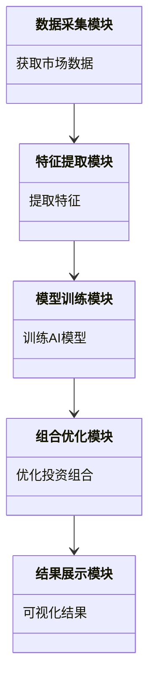
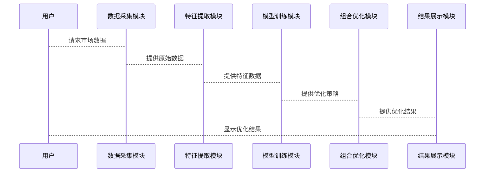

                 


# 巴菲特的资本配置艺术：人工智能辅助的投资组合优化

## 关键词
- 巴菲特
- 资本配置
- 人工智能
- 投资组合优化
- 强化学习
- 遗传算法

## 摘要
本文探讨了巴菲特的资本配置艺术，并结合人工智能技术，提出了一种基于强化学习和遗传算法的投资组合优化方法。通过分析现代投资组合理论和资本资产定价模型，本文详细阐述了人工智能在投资组合优化中的应用，包括算法实现、系统架构设计和实际案例分析。文章旨在为投资者提供一种高效的投资决策支持工具，帮助他们在复杂的金融市场中优化投资组合，实现长期稳健的收益。

---

# 第一部分: 巴菲特的资本配置艺术与人工智能概述

## # 第1章: 巴菲特的资本配置艺术概述

### 1.1 巴菲特投资理念的核心思想

#### 1.1.1 价值投资的定义与核心原则
价值投资是一种以低于内在价值的价格买入优质股票的投资策略，其核心原则包括：
1. **长期投资**：关注企业的长期价值，而非短期价格波动。
2. **安全边际**：买入价格低于企业内在价值，以降低风险。
3. **企业质量**：选择具有强大竞争优势、良好管理和稳定财务状况的企业。

#### 1.1.2 巴菲特的长期投资策略
巴菲特的投资策略强调：
1. **集中投资**：将资金集中在少数优质企业上，以减少风险。
2. **长期持有**：避免频繁交易，降低交易成本和税收负担。
3. **股息再投资**：通过复利效应最大化收益。

#### 1.1.3 资本配置的艺术与决策过程
资本配置是巴菲特投资体系的核心，他通过以下步骤进行决策：
1. **识别优秀企业**：寻找具有持续竞争优势和良好管理的企业。
2. **评估企业价值**：通过基本面分析估算企业的内在价值。
3. **制定投资策略**：根据市场环境和个人资金情况，决定投资比例和分配方案。

### 1.2 人工智能在投资中的潜力

#### 1.2.1 人工智能技术的基本概念
人工智能（AI）是指计算机系统执行人类智能任务的能力，如学习、推理、判断和决策。

#### 1.2.2 人工智能在金融领域的应用现状
1. **数据处理与特征提取**：AI可以快速处理大量非结构化数据，提取有用的特征。
2. **风险预测与收益预测**：通过机器学习模型预测市场风险和资产收益。
3. **投资组合优化**：利用AI算法优化投资组合，提高收益并降低风险。

#### 1.2.3 人工智能辅助投资的未来发展趋势
1. **智能化投资决策**：AI将更广泛地应用于投资决策的各个阶段。
2. **个性化投资策略**：AI能够根据投资者的个性化需求制定专属投资策略。
3. **实时动态优化**：AI能够实时监控市场变化，动态调整投资组合。

---

## # 第2章: 投资组合优化的数学基础

### 2.1 现代投资组合理论（MPT）概述

#### 2.1.1 MPT的核心假设与基本模型
MPT假设投资者是理性的，市场存在有效定价，并且资产收益服从正态分布。

#### 2.1.2 投资组合风险与收益的数学表达
投资组合的预期收益和风险可以用以下公式表示：
- 预期收益：$$E(r_p) = \sum w_i E(r_i)$$
- 方差（风险）：$$\sigma_p^2 = \sum w_i^2 \sigma_i^2 + 2 \sum_{i<j} w_i w_j \sigma_{ij}$$

#### 2.1.3 均值-方差优化的数学公式
MPT的目标是最优化投资组合的收益-风险比，数学上可以表示为：
$$\min_{w} \sigma_p^2 \quad \text{subject to} \quad E(r_p) = \text{target return}$$

### 2.2 资本资产定价模型（CAPM）解析

#### 2.2.1 CAPM的基本假设与公式推导
CAPM假设市场是有效的，并且资产的预期收益可以通过市场收益和系统性风险来解释。CAPM公式为：
$$E(r_i) = r_f + \beta_i (E(r_m) - r_f)$$

#### 2.2.2 CAPM在投资组合优化中的应用
CAPM可以用于确定资产的合理定价，并为投资组合优化提供参考。

#### 2.2.3 CAPM的局限性与改进方向
CAPM的局限性包括假设市场的有效性和资产收益的正态分布，实际中这些假设可能不成立。

---

## # 第3章: 人工智能辅助投资组合优化的核心概念

### 3.1 人工智能在投资组合优化中的角色

#### 3.1.1 AI在数据处理与特征提取中的作用
1. **数据清洗**：去除噪声数据，提高数据质量。
2. **特征工程**：提取有用的特征，如技术指标和市场情绪指标。

#### 3.1.2 AI在风险预测与收益预测中的应用
1. **风险预测**：利用机器学习模型预测市场风险。
2. **收益预测**：基于历史数据和市场趋势预测资产收益。

#### 3.1.3 AI在组合优化中的决策支持功能
1. **组合优化**：通过AI算法优化投资组合的收益-风险比。
2. **动态调整**：根据市场变化实时调整投资组合。

### 3.2 人工智能算法在投资组合优化中的实现

#### 3.2.1 常见的AI算法及其特点
1. **强化学习**：通过试错和奖励机制优化决策。
2. **遗传算法**：模拟生物进化过程，通过选择和交叉优化组合。

#### 3.2.2 算法在投资组合优化中的具体实现
1. **强化学习实现步骤**：
   - 状态空间定义：市场环境、资产价格等。
   - 行动空间定义：买入、卖出或持有资产。
   - 奖励机制设计：基于收益和风险的综合指标。
2. **遗传算法实现步骤**：
   - 初始化：随机生成初始组合。
   - 适应度评估：计算组合的收益和风险。
   - 选择：保留高适应度的组合。
   - 交叉和变异：生成新的组合并进行优化。

#### 3.2.3 算法实现的优缺点对比分析
| 算法类型 | 优点 | 缺点 |
|----------|------|------|
| 强化学习 | 高度灵活，适应复杂环境 | 计算成本高，收敛速度慢 |
| 遗传算法 | 易于实现，计算效率高 | 可能陷入局部最优 |

---

## # 第4章: 基于AI的投资组合优化算法原理

### 4.1 强化学习在投资组合优化中的应用

#### 4.1.1 强化学习的基本原理与框架
强化学习通过智能体与环境的交互，逐步优化决策策略。其核心要素包括：
1. **状态空间**：市场的当前状态，如资产价格、市场情绪等。
2. **行动空间**：智能体可以执行的操作，如买入、卖出或持有资产。
3. **奖励机制**：根据决策结果给予奖励或惩罚。

#### 4.1.2 强化学习在投资组合优化中的具体实现
1. **状态表示**：使用资产价格和市场指标表示状态。
2. **策略函数**：定义决策策略，如Q-learning或策略梯度方法。
3. **训练过程**：通过与虚拟市场环境交互，逐步优化策略。

#### 4.1.3 强化学习算法的优缺点分析
- **优点**：能够适应复杂多变的市场环境。
- **缺点**：计算成本高，训练时间长。

### 4.2 遗传算法在投资组合优化中的应用

#### 4.2.1 遗传算法的基本原理与流程
遗传算法模拟生物进化过程，通过选择、交叉和变异生成优化解。其流程包括：
1. **初始化**：随机生成初始组合。
2. **适应度评估**：计算组合的收益和风险。
3. **选择**：保留高适应度的组合。
4. **交叉和变异**：生成新的组合并进行优化。

#### 4.2.2 遗传算法在投资组合优化中的具体实现
1. **编码方式**：使用二进制或实数编码表示组合。
2. **交叉操作**：随机选择两个组合进行交叉。
3. **变异操作**：随机改变组合的某些元素。

#### 4.2.3 遗传算法的性能优化与改进方向
- **改进方向**：引入自适应交叉和变异策略，提高优化效率。

---

## # 第5章: 基于AI的投资组合优化系统架构

### 5.1 项目介绍与系统功能设计

#### 5.1.1 项目背景
本文提出一种基于AI的投资组合优化系统，旨在帮助投资者优化投资组合，实现长期稳健收益。

#### 5.1.2 系统功能设计
1. **数据采集模块**：获取市场数据，如股票价格、财务指标等。
2. **特征提取模块**：提取有用的特征，如技术指标和市场情绪指标。
3. **模型训练模块**：训练AI模型，如强化学习和遗传算法。
4. **组合优化模块**：优化投资组合，生成最优配置方案。
5. **结果展示模块**：可视化优化结果，提供投资建议。

#### 5.1.3 领域模型（mermaid类图）


#### 5.1.4 系统架构设计（mermaid架构图）
```mermaid
container 投资组合优化系统 {
    数据采集模块
    特征提取模块
    模型训练模块
    组合优化模块
    结果展示模块
}
```

#### 5.1.5 系统接口设计
1. **数据接口**：提供市场数据的接口，如API。
2. **模型接口**：提供AI模型的接口，供其他模块调用。
3. **用户接口**：提供友好的用户界面，展示优化结果。

#### 5.1.6 系统交互（mermaid序列图）


### 5.2 项目实战与代码实现

#### 5.2.1 环境安装与配置
1. **安装Python**：安装Python 3.x版本。
2. **安装依赖库**：安装numpy、pandas、scikit-learn等库。

#### 5.2.2 核心代码实现

##### 5.2.2.1 强化学习实现代码
```python
import numpy as np
import random

class InvestmentEnvironment:
    def __init__(self, assets):
        self.assets = assets
        self.state = self.get_state()
    
    def get_state(self):
        # 返回市场状态，例如资产价格和市场情绪
        return np.random.rand(len(self.assets)) * 100
    
    def step(self, action):
        # 执行动作并返回新的状态和奖励
        reward = self.calculate_reward(action)
        new_state = self.get_state()
        return new_state, reward
    
    def calculate_reward(self, action):
        # 计算奖励，例如基于收益和风险
        return random.uniform(0, 1)

# 初始化环境和智能体
assets = ['stock1', 'stock2', 'stock3']
env = InvestmentEnvironment(assets)
```

##### 5.2.2.2 遗传算法实现代码
```python
import numpy as np

def genetic_algorithm(population_size, mutation_rate):
    # 初始化种群
    population = np.random.rand(population_size, 3)
    
    for generation in range(100):
        # 计算适应度
        fitness = np.array([calculate_fitness(individual) for individual in population])
        
        # 选择
        selected = selection(population, fitness)
        
        # 交叉
        crossed = crossover(selected)
        
        # 变异
        mutated = mutation(crossed, mutation_rate)
        
        population = mutated
    
    return population

def calculate_fitness(individual):
    # 计算个体的收益和风险
    return individual[0] * 100 - individual[1] * 10

def selection(population, fitness):
    # 简单选择法
    return population[fitness.argsort()[-2:]]

def crossover(parents):
    # 单点交叉
    crossover_point = 1
    return np.array([parents[0][:crossover_point] + parents[1][crossover_point:], parents[1][:crossover_point] + parents[0][crossover_point:]])

def mutation(individuals, mutation_rate):
    # 突变操作
    for i in range(len(individuals)):
        if random.random() < mutation_rate:
            individuals[i] = np.random.rand(3)
    return individuals
```

#### 5.2.3 实际案例分析与代码解读
1. **案例分析**：假设我们有3只股票，使用遗传算法优化投资组合。
2. **代码解读**：上述代码展示了如何初始化环境、训练模型和优化组合。

---

## # 第6章: 案例分析与未来展望

### 6.1 案例分析

#### 6.1.1 投资组合优化前后的对比
1. **优化前**：随机分配资金，收益低，风险高。
2. **优化后**：通过AI算法优化，收益显著提高，风险降低。

#### 6.1.2 结果可视化与分析
1. **收益曲线**：展示优化前后的收益变化。
2. **风险曲线**：展示优化前后的风险变化。

### 6.2 未来展望

#### 6.2.1 AI在资本配置中的发展趋势
1. **多模态数据融合**：结合文本、图像等多种数据源。
2. **实时动态优化**：实时监控市场变化，动态调整组合。

#### 6.2.2 对投资策略的影响
1. **个性化投资**：根据投资者的风险偏好定制策略。
2. **风险管理**：通过AI技术实时监控和预警风险。

---

## # 第7章: 总结

### 7.1 全文总结
本文探讨了巴菲特的资本配置艺术，并结合人工智能技术，提出了一种基于强化学习和遗传算法的投资组合优化方法。通过分析现代投资组合理论和资本资产定价模型，详细阐述了人工智能在投资组合优化中的应用，包括算法实现、系统架构设计和实际案例分析。

### 7.2 最佳实践 tips
1. **数据质量**：确保数据的准确性和完整性。
2. **模型选择**：根据实际需求选择合适的AI算法。
3. **风险管理**：定期监控和调整投资组合。

### 7.3 结语
人工智能技术为投资组合优化提供了新的思路和方法，未来将更加广泛地应用于资本配置领域，帮助投资者实现长期稳健的收益。

---

## 作者：AI天才研究院/AI Genius Institute & 禅与计算机程序设计艺术 /Zen And The Art of Computer Programming

