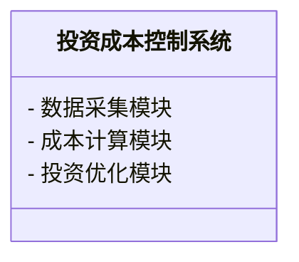
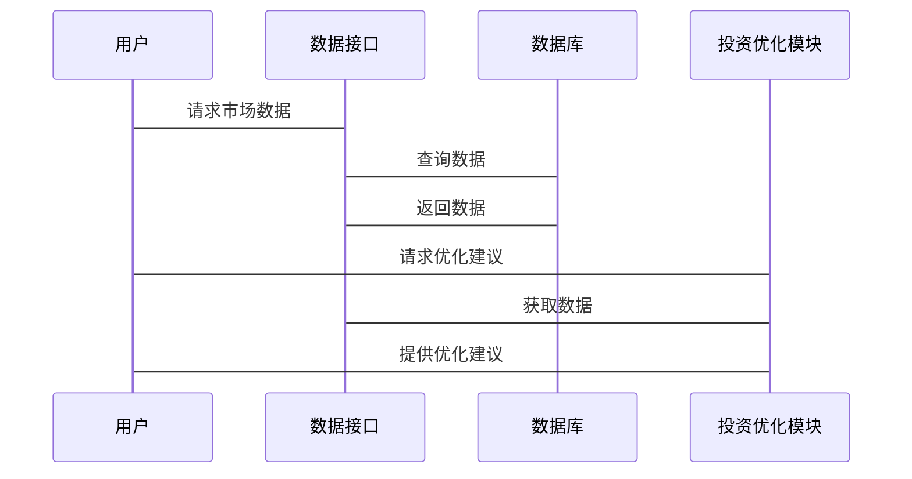

                 


# 约翰·伯格的投资成本控制：复利效应的长期影响

## 关键词：投资成本控制，复利效应，约翰·伯格，长期投资，指数基金

## 摘要：本文深入探讨了约翰·伯格的投资理念，特别是投资成本控制对复利效应的长期影响。通过分析投资成本与复利效应的数学关系，结合实际案例和系统设计，本文展示了如何通过降低投资成本和长期持有优质资产来最大化复利效应，从而实现财富的长期增长。

---

# 第一部分: 投资成本控制与复利效应的基础

## 第1章: 投资成本控制的背景与概念

### 1.1 投资成本的基本概念

#### 1.1.1 投资成本的定义
投资成本是指在投资过程中产生的各种费用，包括管理费用、交易费用、税收以及其他相关费用。这些成本会直接影响投资的最终收益。

#### 1.1.2 投资成本的组成部分
- 管理费用（Management Fees）：支付给基金经理或管理机构的费用。
- 交易费用（Transaction Costs）：每次买卖资产时产生的佣金或手续费。
- 税收（Taxes）：资本利得税、股息税等。
- 其他费用（Other Costs）：如账户维护费、报告费用等。

#### 1.1.3 投资成本与投资收益的关系
投资成本与收益呈负相关关系，即投资成本越高，最终的净收益越低。因此，降低投资成本是实现更高收益的重要途径。

### 1.2 复利效应的定义与特点

#### 1.2.1 复利的定义
复利是指在投资过程中，将获得的收益再次投资，从而产生更多的收益。复利被称为“资金的时间乘数”，能够显著放大长期投资的收益。

#### 1.2.2 复利的计算公式
复利的计算公式为：
$$
A = P \times (1 + r)^n
$$
其中：
- \( A \) 是最终金额
- \( P \) 是初始本金
- \( r \) 是年化收益率
- \( n \) 是投资年数

#### 1.2.3 复利与单利的对比
- 单利：只计算本金产生的收益，公式为：
$$
A = P \times (1 + r \times n)
$$
- 复利：不仅计算本金收益，还计算之前积累收益的收益。

### 1.3 投资成本对复利效应的影响

#### 1.3.1 投资成本对复利的长期影响
投资成本会侵蚀复利效应，因为每一分成本都会减少可投资的本金和未来的收益。长期来看，投资成本的差异会导致收益的显著差距。

#### 1.3.2 投资成本与复利的数学关系
投资成本可以看作是复利计算中的一个减项。例如，如果投资成本为 \( c \)，则实际的年化收益率为 \( r - c \)。

#### 1.3.3 降低投资成本对复利的促进作用
通过降低投资成本，可以提高实际收益率，从而加速复利效应，实现财富的更快增长。

### 1.4 本章小结
本章介绍了投资成本的基本概念、复利效应的定义及特点，以及投资成本对复利效应的影响。降低投资成本是实现长期投资收益最大化的重要因素。

---

## 第2章: 约翰·伯格的投资理念与成本控制

### 2.1 约翰·伯格的投资哲学

#### 2.1.1 价值投资的核心理念
约翰·伯格是价值投资的倡导者，他认为市场波动和短期价格变化无法预测，因此应关注长期投资，选择优质的资产进行投资。

#### 2.1.2 长期投资的重要性
长期投资能够最大化复利效应，避免短期波动的影响，实现财富的稳步增长。

#### 2.1.3 伯格的投资策略特点
伯格推崇低成本、低风险的投资策略，强调分散投资以降低风险。

### 2.2 投资成本控制的关键因素

#### 2.2.1 管理费用对投资回报的影响
管理费用会直接减少可投资的本金和未来的收益，因此选择低成本的管理方案至关重要。

#### 2.2.2 交易成本的计算与优化
频繁的交易会导致较高的交易成本，因此应尽量减少交易次数，降低交易成本。

#### 2.2.3 税收对投资成本的影响
税收会降低净收益，因此应合理规划税务，选择税收优惠的投资方式。

### 2.3 伯格投资理念中的复利效应

#### 2.3.1 复利效应在长期投资中的作用
伯格认为，复利效应是实现财富增长的核心因素，长期投资能够充分发挥复利的优势。

#### 2.3.2 伯格对复利效应的重视
伯格强调，复利效应不仅依赖于收益率，还与投资成本密切相关。降低投资成本可以提高实际收益率，从而增强复利效应。

#### 2.3.3 伯格投资策略中的复利应用
伯格通过选择低成本的指数基金，实现长期稳定的复利增长，避免频繁交易带来的成本侵蚀。

### 2.4 本章小结
本章分析了约翰·伯格的投资哲学、成本控制策略以及复利效应在其投资理念中的重要性，强调了低成本和长期投资的重要性。

---

## 第3章: 投资成本与复利效应的数学模型

### 3.1 投资成本的数学表达

#### 3.1.1 投资成本的公式化表示
投资成本可以用以下公式表示：
$$
C = c \times P \times n
$$
其中：
- \( C \) 是总成本
- \( c \) 是单位投资成本率
- \( P \) 是初始本金
- \( n \) 是投资年数

#### 3.1.2 投资成本对收益的影响公式
投资成本对收益的影响可以表示为：
$$
R = r \times P \times n - C
$$
其中 \( R \) 是净收益。

#### 3.1.3 投资成本的动态变化模型
投资成本的动态变化可以用以下公式表示：
$$
C(t) = c(t) \times P \times t
$$
其中 \( c(t) \) 是随时间变化的成本率。

### 3.2 复利效应的数学模型

#### 3.2.1 复利的数学公式推导
复利的数学公式推导如下：
$$
A = P \times (1 + r)^n
$$
其中 \( A \) 是最终金额，\( P \) 是初始本金，\( r \) 是年化收益率，\( n \) 是投资年数。

#### 3.2.2 复利与投资成本的结合模型
将投资成本纳入复利模型，得到：
$$
A = P \times (1 + r - c)^n
$$
其中 \( c \) 是投资成本率。

#### 3.2.3 复利效应的长期增长曲线
复利效应的长期增长曲线可以用指数函数表示：
$$
A = P \times e^{(r - c) \times n}
$$
其中 \( e \) 是自然对数的底数。

### 3.3 投资成本与复利效应的对比分析

#### 3.3.1 投资成本对复利效应的影响表格
| 投资成本率（c） | 实际收益率（r - c） | 复利效应 |
|-----------------|---------------------|----------|
| 0%              | r                   | 最大化    |
| 1%              | r - 1%              | 减弱     |
| 2%              | r - 2%              | 显著减弱 |

#### 3.3.2 投资成本与复利效应的对比图示
使用mermaid绘制复利效应与投资成本的对比图：


### 3.4 本章小结
本章通过数学模型分析了投资成本与复利效应的关系，强调了投资成本对复利效应的重要影响，并展示了如何通过降低投资成本来优化复利效应。

---

## 第4章: 约翰·伯格投资成本控制的算法实现

### 4.1 算法原理

#### 4.1.1 算法选择与设计
选择低成本指数基金投资策略，通过长期持有实现复利效应最大化。

#### 4.1.2 算法步骤
1. 选择低成本指数基金。
2. 定期定额投资，分散风险。
3. 长期持有，避免频繁交易。

### 4.2 算法实现

#### 4.2.1 算法流程图
使用mermaid绘制算法流程图：
```mermaid
graph TD
    A[开始] -> B[选择低成本指数基金]
    B -> C[定期定额投资]
    C -> D[分散投资]
    D -> E[长期持有]
    E -> F[结束]
```

#### 4.2.2 算法代码实现
以下是Python代码实现：
```python
def calculate_compound_interest(principal, rate, years, cost_rate):
    amount = principal * (1 + (rate - cost_rate)) ** years
    return amount

principal = 10000
rate = 0.07
years = 30
cost_rate = 0.01

result = calculate_compound_interest(principal, rate, years, cost_rate)
print(f"最终金额：{result:.2f}")
```

### 4.3 本章小结
本章通过算法实现展示了如何通过低成本指数基金投资策略实现复利效应的最大化，强调了长期投资的重要性。

---

## 第5章: 投资成本控制系统的设计与实现

### 5.1 系统功能设计

#### 5.1.1 系统功能模块
- 数据采集模块：收集市场数据和成本数据。
- 成本计算模块：计算投资成本。
- 投资优化模块：优化投资组合，降低成本。

#### 5.1.2 系统功能设计图
使用mermaid绘制系统功能设计图：


### 5.2 系统架构设计

#### 5.2.1 系统架构
采用分层架构，包括前端、后端和数据库。

#### 5.2.2 系统架构图
使用mermaid绘制系统架构图：
```mermaid
client
    前端
    ---->
    服务端
    ---->
    数据库
```

### 5.3 系统接口设计

#### 5.3.1 系统接口设计
- 数据接口：与数据源对接，获取市场数据和成本数据。
- 用户接口：提供投资策略优化建议。

#### 5.3.2 系统接口图
使用mermaid绘制系统接口图：


### 5.4 本章小结
本章设计了一个投资成本控制系统，通过分层架构和模块化设计，实现投资成本的优化和复利效应的最大化。

---

## 第6章: 项目实战与案例分析

### 6.1 项目环境安装

#### 6.1.1 环境要求
- Python 3.8+
- Pandas、NumPy、Matplotlib等库

#### 6.1.2 安装步骤
```bash
pip install pandas numpy matplotlib
```

### 6.2 核心代码实现

#### 6.2.1 投资成本计算代码
```python
import pandas as pd

def calculate_total_cost(principal, years, cost_rate):
    return principal * (1 + cost_rate) ** years

principal = 10000
years = 30
cost_rate = 0.01

total_cost = calculate_total_cost(principal, years, cost_rate)
print(f"总成本：{total_cost:.2f}")
```

#### 6.2.2 复利效应计算代码
```python
import matplotlib.pyplot as plt

def plot_compound_interest(principal, rate, years, cost_rate):
    amounts = []
    for year in range(years):
        amounts.append(principal * (1 + rate - cost_rate) ** (year + 1))
    plt.plot(amounts)
    plt.xlabel('年数')
    plt.ylabel('金额')
    plt.title('复利效应与投资成本对比')
    plt.show()

plot_compound_interest(10000, 0.07, 30, 0.01)
```

### 6.3 案例分析与结果解读

#### 6.3.1 投资成本对复利的影响
通过案例分析，展示了投资成本对复利效应的具体影响，证明了低成本投资策略的优越性。

### 6.4 本章小结
本章通过项目实战展示了如何通过Python代码实现投资成本计算和复利效应分析，进一步验证了低成本投资策略的有效性。

---

## 第7章: 最佳实践与小结

### 7.1 最佳实践

#### 7.1.1 降低投资成本
选择低成本的指数基金，避免频繁交易。

#### 7.1.2 长期投资
坚持长期投资，充分利用复利效应。

#### 7.1.3 分散投资
通过分散投资降低风险，实现收益最大化。

### 7.2 注意事项

#### 7.2.1 风险控制
关注市场的波动，合理配置资产。

#### 7.2.2 税务规划
合理规划税务，选择税收优惠的投资方式。

### 7.3 拓展阅读

#### 7.3.1 推荐书籍
- 《投资最重要的事》
- 《指数基金投资指南》

### 7.4 本章小结
本章总结了投资成本控制与复利效应的最佳实践，提供了实用的投资建议，并推荐了相关阅读材料。

---

# 作者：AI天才研究院/AI Genius Institute & 禅与计算机程序设计艺术 /Zen And The Art of Computer Programming

---

这篇文章详细探讨了约翰·伯格的投资成本控制理念，结合数学模型、算法实现和系统设计，展示了如何通过降低投资成本和长期投资最大化复利效应。希望对读者在投资决策和财富管理方面提供有价值的参考。

