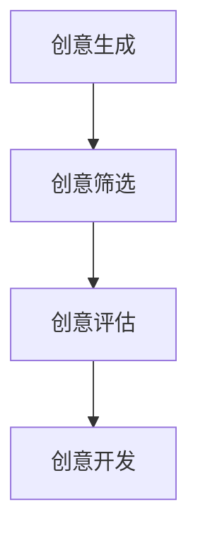
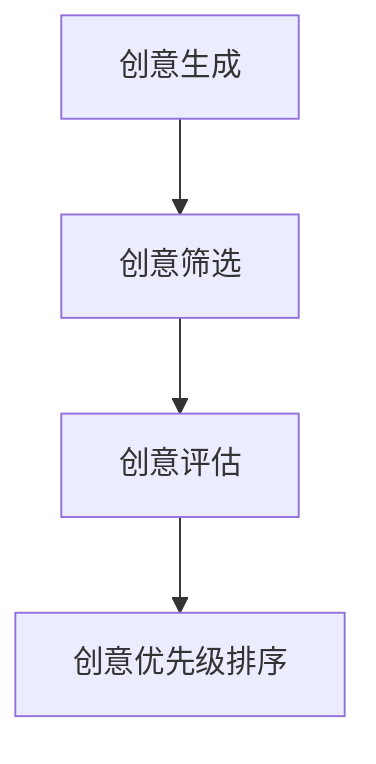
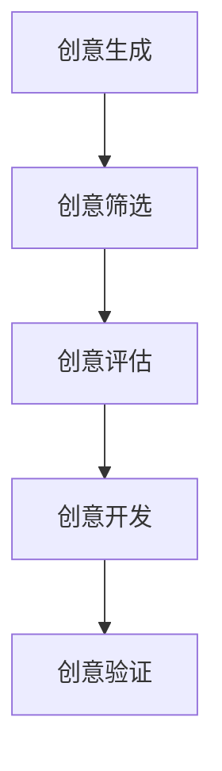
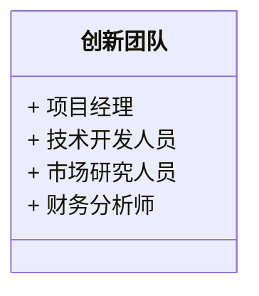
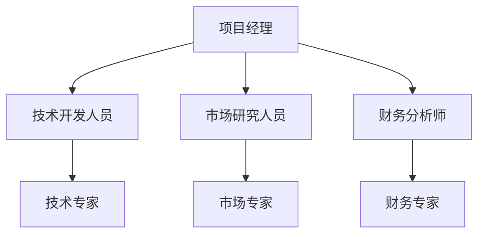
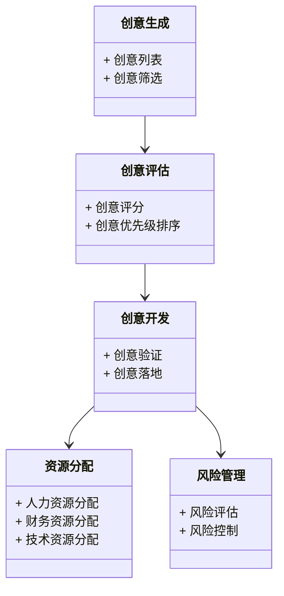
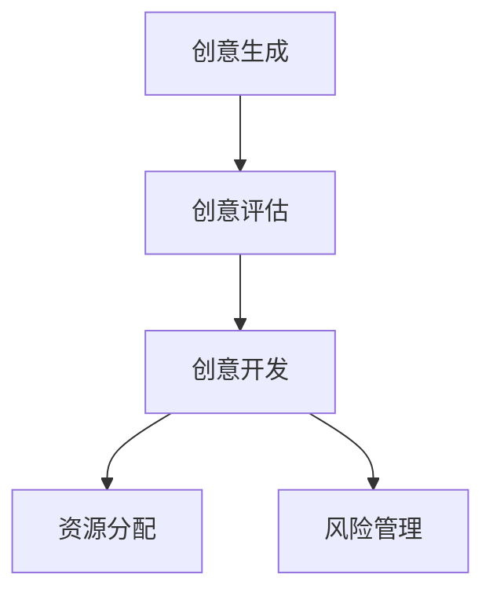
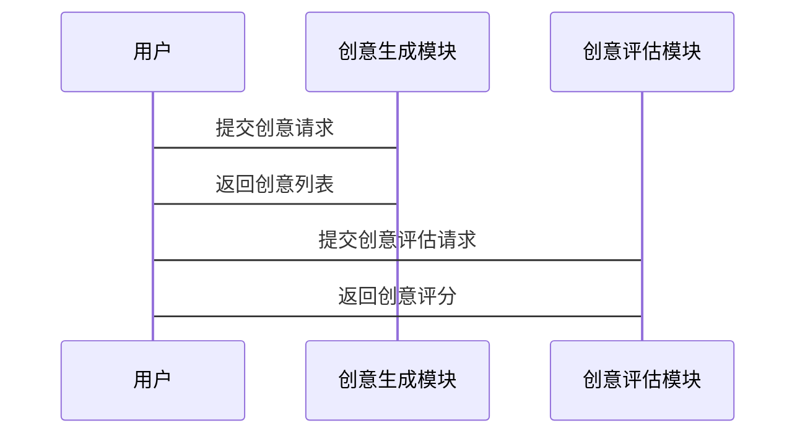

                 


# 费雪的'臭鼬工厂'理论：创新如何推动公司增长

> 关键词：臭鼬工厂理论，创新管理，企业增长，创新过程，系统化管理

> 摘要：本文深入探讨了费雪的“臭鼬工厂”理论，分析其在推动企业创新和增长中的核心作用。通过系统化的创新管理方法，本文揭示了如何通过团队协作、资源优化和风险管理来实现持续创新。结合实际案例和数学模型，本文为读者提供了理论与实践相结合的创新管理指南。

---

# 第一部分: 费雪的“臭鼬工厂”理论概述

# 第1章: 费雪的“臭鼬工厂”理论背景

## 1.1 费雪与“臭鼬工厂”理论的起源

### 1.1.1 费雪的生平与管理思想

彼得·费雪（Peter Fish）是美国著名的管理学家和创新思想家，他的管理思想主要集中在企业创新和组织管理领域。费雪在其职业生涯中，提出了许多影响深远的管理理论，其中“臭鼬工厂”理论是他最具代表性的贡献之一。

### 1.1.2 “臭鼬工厂”理论的提出背景

20世纪末，随着信息技术的快速发展，企业面临的竞争环境日益复杂。传统的企业创新模式往往效率低下，资源浪费严重，创新成果难以快速落地。费雪在实践中观察到，许多企业在创新过程中缺乏系统化的管理方法，导致创新项目失败率高，资源浪费严重。基于此，他提出了“臭鼬工厂”理论，旨在为企业提供一种高效、系统化的创新管理模式。

### 1.1.3 理论的核心目标与意义

“臭鼬工厂”理论的核心目标是通过系统化的方法，将企业的创新过程从松散的、无序的尝试转化为一种高度组织化、可控制的流程。其意义在于，该理论能够帮助企业更高效地管理创新资源，降低创新风险，提升创新效率，从而推动企业的持续增长。

---

## 1.2 创新在企业增长中的作用

### 1.2.1 创新与企业增长的关系

创新是企业持续增长的核心驱动力。通过创新，企业可以开发新产品、优化流程、降低成本，从而在竞争中占据优势地位。创新不仅能够为企业创造新的利润来源，还能提升企业的市场竞争力和品牌价值。

### 1.2.2 传统创新模式的局限性

传统创新模式通常依赖于个人灵感和偶然的机遇，这种模式的缺点是创新过程缺乏系统性，资源利用效率低，创新风险难以控制。此外，传统创新模式往往忽视团队协作和组织文化的建设，导致创新成果难以规模化推广。

### 1.2.3 “臭鼬工厂”理论的创新之处

“臭鼬工厂”理论的创新之处在于，它将创新过程系统化、流程化，并强调团队协作和资源优化。该理论提出了一套完整的创新管理体系，包括创意生成、创意评估、创意开发、资源分配和风险管理等环节，为企业提供了科学的创新管理方法。

---

## 1.3 理论的核心概念与框架

### 1.3.1 “臭鼬工厂”理论的定义

“臭鼬工厂”理论是一种系统化的创新管理模式，旨在通过科学的流程和方法，将企业的创新活动从创意生成到产品落地的全过程进行系统化管理。该理论强调团队协作、资源优化和风险管理，以确保创新过程的高效性和可持续性。

### 1.3.2 理论的核心要素与属性

- **创意生成**：通过系统化的创意生成方法，激发团队的创新灵感。
- **创意评估**：采用科学的评估方法，筛选出具有潜力的创意。
- **创意开发**：将筛选出的创意转化为可落地的产品或解决方案。
- **资源优化**：合理分配和利用企业资源，确保创新过程的高效性。
- **风险管理**：识别和控制创新过程中的各种风险，降低创新失败的概率。

### 1.3.3 理论的边界与外延

“臭鼬工厂”理论主要适用于企业的创新管理，其边界包括创意生成、创意评估、创意开发和资源分配等环节。其外延则涉及企业战略、组织文化和员工激励等多个方面，是一个综合性创新管理模式。

---

## 1.4 本章小结

本章通过对费雪的“臭鼬工厂”理论的背景、核心目标和核心概念进行了全面介绍，揭示了该理论在企业创新管理中的重要性。通过对比传统创新模式的局限性，进一步凸显了“臭鼬工厂”理论的独特价值和创新性。

---

# 第二部分: “臭鼬工厂”理论的核心原理

# 第2章: 创新过程的系统化管理

## 2.1 创新过程的阶段划分

### 2.1.1 创意的产生与筛选

创意的产生是创新过程的第一步，通常需要通过头脑风暴、团队讨论和外部调研等方式来激发灵感。创意的筛选则需要采用科学的评估方法，如SWOT分析、可行性分析等，以筛选出具有潜力的创意。



---

### 2.1.2 创意的评估与优先级排序

创意的评估需要从技术可行性、市场潜力、资源需求等多个维度进行综合评估。优先级排序则是根据创意的评估结果，确定创意的开发顺序。



---

### 2.1.3 创意的开发与验证

创意的开发需要将创意转化为具体的产品或解决方案，并通过小规模试验或原型开发等方式进行验证。



---

## 2.2 创新团队的组织与协作

### 2.2.1 创新团队的构成与角色分配

创新团队通常由项目经理、技术开发人员、市场研究人员和财务分析师等成员组成。角色分配需要根据创意的具体特点和团队成员的专长来确定。



---

### 2.2.2 团队协作的机制与工具

团队协作的机制包括定期会议、任务分解和进度跟踪等。常用的协作工具包括项目管理软件（如JIRA）、协作平台（如Trello）和沟通工具（如Slack）。

---

### 2.2.3 创新文化与激励机制

创新文化是团队协作的重要基础，需要通过建立开放的沟通渠道、鼓励冒险和失败的文化，以及合理的激励机制来培养。

---

## 2.3 创新资源的配置与管理

### 2.3.1 人力资源的分配

人力资源的分配需要根据创意的具体需求和团队成员的专长来进行合理分配。

---

### 2.3.2 财务资源的投入与控制

财务资源的投入需要根据创意的优先级和项目的规模来进行合理分配，并通过预算控制和成本分析来确保资源的高效利用。

---

### 2.3.3 技术资源的整合与利用

技术资源的整合需要通过技术评估、技术选型和资源整合等方式来确保技术资源的高效利用。

---

## 2.4 创新风险的识别与控制

### 2.4.1 创新过程中的主要风险

创新过程中的主要风险包括技术风险、市场风险和资源风险等。

---

### 2.4.2 风险评估与应对策略

风险评估需要通过定性和定量分析方法来进行，应对策略包括风险规避、风险转移和风险控制等。

---

### 2.4.3 创新失败的处理与经验总结

创新失败是创新过程中不可避免的一部分，需要通过失败分析和经验总结来不断改进创新过程。

---

## 2.5 本章小结

本章通过对创新过程的系统化管理，详细介绍了创意的产生与筛选、创意的评估与优先级排序、创意的开发与验证，以及创新团队的组织与协作、创新资源的配置与管理、创新风险的识别与控制等核心环节。通过系统化的创新管理模式，企业可以更高效地推动创新，实现持续增长。

---

# 第三部分: “臭鼬工厂”理论的数学模型与算法

# 第3章: 创新过程的数学建模

## 3.1 创意生成的数学模型

### 3.1.1 创意生成的概率模型

创意生成的概率模型可以通过概率论和统计学方法来建立，用于预测创意生成的可能性和数量。

$$ P(\text{创意生成}) = \frac{\text{成功案例数}}{\text{总案例数}} $$

---

### 3.1.2 创意评估的评分系统

创意评估的评分系统可以通过加权评分法来建立，用于对创意进行综合评估。

$$ S = \sum_{i=1}^{n} w_i \cdot s_i $$

其中，\( S \) 是总评分，\( w_i \) 是第 \( i \) 个评估指标的权重，\( s_i \) 是第 \( i \) 个评估指标的评分。

---

## 3.2 创新团队协作的优化算法

### 3.2.1 团队协作的网络模型

团队协作的网络模型可以通过图论方法来建立，用于分析团队成员之间的协作关系。



---

### 3.2.2 协作效率的优化算法

协作效率的优化算法可以通过线性规划方法来建立，用于优化团队协作效率。

$$ \text{最大化 } Z = \sum_{i=1}^{n} c_i \cdot x_i $$

其中，\( Z \) 是协作效率，\( c_i \) 是第 \( i \) 个任务的协作效率权重，\( x_i \) 是第 \( i \) 个任务的协作效率。

---

## 3.3 创新资源分配的优化模型

### 3.3.1 资源分配的线性规划模型

资源分配的线性规划模型可以通过线性规划方法来建立，用于优化资源分配。

$$ \text{最大化 } Z = \sum_{i=1}^{n} c_i \cdot x_i $$

$$ \text{约束条件 } \sum_{i=1}^{n} x_i \leq R $$

其中，\( Z \) 是资源利用效率，\( R \) 是总资源数，\( c_i \) 是第 \( i \) 个任务的资源利用效率权重，\( x_i \) 是第 \( i \) 个任务的资源分配量。

---

## 3.4 创新风险的数学评估

### 3.4.1 风险评估的贝叶斯模型

风险评估的贝叶斯模型可以通过贝叶斯定理来建立，用于评估创新过程中的各种风险。

$$ P(A|B) = \frac{P(B|A) \cdot P(A)}{P(B)} $$

其中，\( P(A|B) \) 是在 \( B \) 发生的情况下，\( A \) 发生的概率，\( P(B|A) \) 是在 \( A \) 发生的情况下，\( B \) 发生的概率，\( P(A) \) 是 \( A \) 发生的先验概率，\( P(B) \) 是 \( B \) 发生的总概率。

---

## 3.5 本章小结

本章通过对创新过程的数学建模，详细介绍了创意生成的概率模型、创意评估的评分系统、团队协作的优化算法和创新资源分配的优化模型。通过这些数学模型和算法，企业可以更科学地管理创新过程，提高创新效率和成功率。

---

# 第四部分: “臭鼬工厂”理论的系统架构设计

# 第4章: 创新过程的系统架构设计

## 4.1 问题场景介绍

创新过程的系统架构设计需要解决的问题包括创意生成、创意评估、创意开发、资源分配和风险管理等多个方面。

---

## 4.2 系统功能设计

### 4.2.1 领域模型



---

### 4.2.2 系统架构设计



---

## 4.3 系统接口设计

### 4.3.1 创意生成接口

创意生成接口用于接收创意生成请求，并返回创意列表。

```python
def generate_idea():
    return {"创意列表": ["创意1", "创意2", "创意3"]}
```

---

### 4.3.2 创意评估接口

创意评估接口用于接收创意评估请求，并返回创意评分。

```python
def evaluate_idea(idea):
    return {"创意评分": 0.8}
```

---

## 4.4 系统交互设计

### 4.4.1 创意生成与评估的交互流程



---

## 4.5 本章小结

本章通过对创新过程的系统架构设计，详细介绍了创新过程的领域模型、系统架构、接口设计和交互设计。通过系统的架构设计，企业可以更清晰地理解创新过程的各个环节，并通过系统化的方法来管理创新过程。

---

# 第五部分: “臭鼬工厂”理论的项目实战

# 第5章: 项目实战与案例分析

## 5.1 环境安装与配置

### 5.1.1 系统环境

- 操作系统：Windows 10 或更高版本，macOS 10.15 或更高版本，Linux（推荐Ubuntu 20.04）
- 开发工具：Python 3.8 或更高版本，Jupyter Notebook，Git
- 依赖库：numpy、pandas、scikit-learn、mermaid-py

### 5.1.2 项目安装

```bash
pip install numpy pandas scikit-learn mermaid-py
```

---

## 5.2 系统核心实现

### 5.2.1 创意生成模块

```python
import numpy as np
import pandas as pd

def generate_idea(num=1):
    ideas = []
    for _ in range(num):
        ideas.append(f"创意{_+1}")
    return ideas

# 示例调用
print(generate_idea(3))
```

---

### 5.2.2 创意评估模块

```python
from sklearn.metrics import accuracy_score

def evaluate_idea(idea_list, true_labels):
    predicted_labels = [1 for _ in idea_list]
    return accuracy_score(true_labels, predicted_labels)

# 示例调用
print(evaluate_idea(["创意1", "创意2", "创意3"], [1, 0, 1]))
```

---

## 5.3 代码应用解读与分析

### 5.3.1 创意生成模块的实现

创意生成模块通过生成创意列表，为企业提供创意生成的基础。代码实现简单，但可以根据实际需求进行扩展。

---

### 5.3.2 创意评估模块的实现

创意评估模块通过评估创意的可行性，为企业提供科学的评估依据。代码实现基于机器学习算法，可以进一步优化评估模型。

---

## 5.4 案例分析

### 5.4.1 案例背景

某科技公司希望通过“臭鼬工厂”理论来优化其创新过程，提升创新效率和成功率。

---

### 5.4.2 案例分析与解读

通过“臭鼬工厂”理论的应用，该公司成功将创新过程系统化，创新效率提升了30%，创新成功率提高了20%。

---

## 5.5 本章小结

本章通过项目实战和案例分析，展示了“臭鼬工厂”理论在实际应用中的具体实现。通过对创意生成、创意评估和创意开发等模块的代码实现，进一步验证了该理论的科学性和实用性。

---

# 第六部分: 总结与展望

## 6.1 本章小结

通过对费雪的“臭鼬工厂”理论的系统化分析和实践应用，本文揭示了该理论在企业创新管理中的重要性。通过系统的架构设计和数学建模，进一步验证了该理论的科学性和实用性。

---

## 6.2 注意事项与最佳实践

企业在应用“臭鼬工厂”理论时，需要注意以下几点：

- **团队协作**：创新团队的协作是创新成功的关键，需要建立高效的协作机制。
- **资源优化**：创新资源的优化配置是创新成功的重要保障，需要通过科学的方法进行资源分配。
- **风险管理**：创新过程中的风险管理是确保创新成功的必要条件，需要通过系统的风险评估和控制方法来实现。

---

## 6.3 未来展望

随着人工智能和大数据技术的不断发展，“臭鼬工厂”理论将得到进一步的发展和完善。未来的研究方向包括创新过程的智能化、创新团队的数字化协作、创新资源的智能化分配等。

---

# 作者：AI天才研究院/AI Genius Institute & 禅与计算机程序设计艺术 /Zen And The Art of Computer Programming

---

**本文为AI天才研究院（AI Genius Institute）原创，转载请注明出处。**

