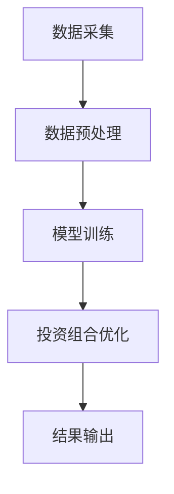
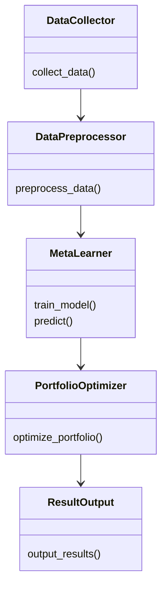
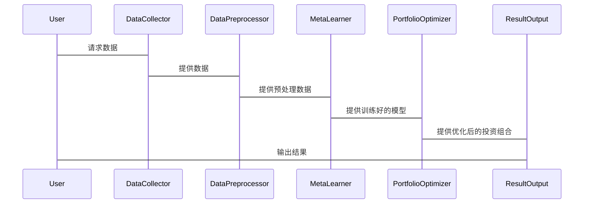

                 


# 《金融领域元学习在投资组合快速调整中的应用》

> 关键词：元学习，投资组合优化，快速调整，金融应用，机器学习

> 摘要：本文深入探讨了元学习在金融领域中的应用，特别是其在投资组合快速调整中的潜力。通过分析元学习的基本概念、算法原理、系统架构设计以及实际案例，本文展示了如何利用元学习技术提高投资组合优化的效率和准确性。文章还结合了具体的代码实现和数学模型，为读者提供了从理论到实践的全面指导。

---

# 第一部分: 金融领域元学习基础

# 第1章: 元学习在金融领域的背景与应用

## 1.1 元学习的基本概念

### 1.1.1 元学习的定义与特点

元学习（Meta-Learning）是一种机器学习范式，旨在通过学习如何学习来解决新任务。与传统机器学习不同，元学习强调快速适应新数据和任务，通常在少量样本的情况下也能表现出色。其核心思想是通过在多个任务上进行经验积累，形成一种通用的学习策略。

- **定义**：元学习是一种通过在多个任务上进行学习，从而能够快速适应新任务的学习方法。
- **特点**：
  - 快速适应性：能够在新任务上快速找到最优解。
  - 通用性：适用于多种不同类型的任务。
  - 鲁棒性：对数据稀疏性或噪声具有较强的抵抗能力。

### 1.1.2 元学习在金融领域的应用背景

金融领域的投资组合优化是一个复杂的任务，通常涉及大量的数据和动态的市场变化。传统的投资组合优化方法（如均值-方差优化）在面对市场波动、数据稀疏性等问题时，往往表现不够理想。元学习的引入为解决这些问题提供了新的思路。

- **市场动态性**：金融市场数据具有高度的动态性和不确定性，元学习能够快速适应市场变化。
- **数据稀疏性**：在某些情况下，金融数据可能非常有限，元学习能够在少量数据上进行有效学习。
- **多任务学习**：金融领域涉及多个相关任务（如股票预测、风险评估等），元学习能够同时优化这些任务。

### 1.1.3 投资组合优化的基本概念与挑战

投资组合优化是指在给定风险和收益目标下，选择最优的资产配置方案。传统的投资组合优化方法依赖于历史数据和统计模型，但在面对快速变化的市场时，其调整速度和灵活性往往不足。元学习的引入能够显著提高投资组合优化的效率和适应性。

- **基本概念**：
  - **收益**：投资组合的预期收益。
  - **风险**：投资组合的波动性或损失可能性。
  - **优化目标**：在给定风险下最大化收益，或在给定收益下最小化风险。
- **挑战**：
  - 数据稀疏性：某些资产的历史数据可能非常有限。
  - 市场波动性：市场环境的变化可能导致模型失效。
  - 计算复杂性：传统的优化方法在大规模数据下计算成本高。

---

## 1.2 元学习与投资组合优化的结合

### 1.2.1 元学习在投资组合调整中的优势

元学习在投资组合优化中的优势主要体现在其快速适应能力和通用性上。

- **快速适应性**：元学习能够在新数据或新任务出现时快速调整投资组合。
- **通用性**：元学习模型可以同时优化多个相关任务，提高整体投资组合的优化效果。
- **数据效率**：在数据稀疏的情况下，元学习仍然能够进行有效的优化。

### 1.2.2 快速调整投资组合的核心问题

投资组合的快速调整需要解决以下核心问题：

1. 如何快速识别市场变化并调整资产配置。
2. 如何在有限的数据下进行有效的优化。
3. 如何平衡风险和收益目标。

### 1.2.3 元学习在金融领域的研究现状

目前，元学习在金融领域的研究主要集中在以下几个方面：

1. **股票预测**：利用元学习进行股票价格预测，提高交易策略的准确性。
2. **风险评估**：通过元学习评估投资组合的风险。
3. **资产配置**：利用元学习优化资产配置方案。

---

## 1.3 本章小结

本章介绍了元学习的基本概念及其在金融领域的应用背景，重点分析了元学习在投资组合优化中的优势和核心问题。通过对比传统方法和元学习方法，读者可以理解元学习在金融投资中的独特价值。

---

# 第2章: 元学习的核心概念与数学模型

## 2.1 元学习的核心原理

### 2.1.1 元学习的定义与核心思想

元学习的核心思想是“学习如何学习”。通过在多个任务上进行学习，元学习模型能够掌握一种通用的学习策略，从而在新的任务上快速找到最优解。

### 2.1.2 元学习与传统机器学习的区别

| 特性          | 传统机器学习                     | 元学习                          |
|---------------|----------------------------------|---------------------------------|
| 学习目标       | 解决特定任务                     | 学习如何学习                     |
| 数据需求       | 需要大量数据                     | 数据需求较低，适合小样本任务    |
| 适应性         | 需要重新训练                     | 可以快速适应新任务               |
| 应用场景       | 单任务优化                       | 多任务学习和快速适应新任务       |

### 2.1.3 元学习的三元组表示法

元学习通常使用三元组（task, model, metalearner）的表示法：

- **task**：具体的学习任务（如分类、回归）。
- **model**：用于解决具体任务的模型。
- **metalearner**：用于优化模型的元学习器。

---

## 2.2 投资组合优化的数学模型

### 2.2.1 投资组合优化的基本目标函数

投资组合优化的目标函数通常包括收益和风险两个方面：

- **收益**：最大化投资组合的预期收益。
- **风险**：最小化投资组合的波动性或潜在损失。

数学表达式如下：

$$
\text{收益} = \sum_{i=1}^{n} w_i r_i
$$

$$
\text{风险} = \sum_{i=1}^{n} \sum_{j=1}^{n} w_i w_j \sigma_{ij}
$$

其中，$w_i$是资产$i$的权重，$r_i$是资产$i$的预期收益，$\sigma_{ij}$是资产$i$和$j$之间的协方差。

### 2.2.2 风险-收益权衡的数学表达

在投资组合优化中，风险和收益之间的权衡可以通过无风险利率、风险溢价等因子进行建模。经典的CAPM（资本资产定价模型）就是一个例子：

$$
r_i = r_f + \beta_i (r_m - r_f)
$$

其中，$r_i$是资产$i$的预期收益，$r_f$是无风险利率，$\beta_i$是资产$i$的贝塔系数，$r_m$是市场预期收益。

### 2.2.3 快速调整投资组合的优化问题

快速调整投资组合的核心问题是在市场变化时，快速找到新的最优资产配置。这可以通过以下优化问题来建模：

$$
\min_{w} \sum_{i=1}^{n} w_i^T \Sigma w
$$

$$
\text{subject to} \quad \sum_{i=1}^{n} w_i = 1
$$

其中，$\Sigma$是资产的协方差矩阵，$w$是资产权重向量。

---

## 2.3 元学习与投资组合优化的结合模型

### 2.3.1 元学习在投资组合优化中的应用框架

元学习在投资组合优化中的应用框架包括以下几个步骤：

1. **任务定义**：定义具体的投资任务（如资产配置）。
2. **元学习器训练**：通过多个任务的数据训练元学习器。
3. **快速调整**：利用元学习器快速适应新的市场环境。

### 2.3.2 快速调整投资组合的元学习模型

快速调整投资组合的元学习模型可以表示为：

$$
w_{new} = f(w_{old}, \Delta)
$$

其中，$w_{new}$是调整后的资产权重，$w_{old}$是调整前的资产权重，$\Delta$是市场变化的信号。

### 2.3.3 元学习在投资组合优化中的数学表达

元学习在投资组合优化中的数学表达可以表示为：

$$
\theta_{meta} = \arg\min_{\theta} \sum_{t=1}^{T} L_t(\theta)
$$

其中，$\theta_{meta}$是元学习器的参数，$L_t$是任务$t$的损失函数。

---

## 2.4 本章小结

本章详细讲解了元学习的核心原理和数学模型，并将其与投资组合优化结合起来。通过对比传统方法和元学习方法，读者可以理解元学习在金融投资中的数学基础和优势。

---

# 第3章: 元学习算法的原理与实现

## 3.1 元学习算法的基本原理

### 3.1.1 元学习的三阶段学习框架

元学习的三阶段学习框架包括：

1. **任务层面**：具体的投资任务（如资产配置）。
2. **模型层面**：用于解决具体任务的模型。
3. **元学习层面**：用于优化模型的元学习器。

### 3.1.2 元学习的参数更新机制

元学习的参数更新机制通常包括以下几个步骤：

1. **初始化**：设置初始参数。
2. **任务训练**：在每个任务上训练模型。
3. **元优化**：通过梯度下降等方法优化元学习器的参数。

### 3.1.3 元学习的适应性调整策略

元学习的适应性调整策略包括：

1. **基于梯度的调整**：通过计算梯度更新参数。
2. **基于经验的调整**：利用历史经验进行调整。
3. **基于反馈的调整**：根据市场反馈进行实时调整。

---

## 3.2 投资组合优化的元学习算法实现

### 3.2.1 元学习在投资组合优化中的算法流程

投资组合优化的元学习算法流程包括：

1. **数据准备**：收集和整理金融数据。
2. **任务定义**：定义具体的投资任务。
3. **模型训练**：训练元学习器。
4. **快速调整**：利用元学习器快速适应新任务。

### 3.2.2 快速调整投资组合的元学习算法实现

快速调整投资组合的元学习算法实现可以表示为：

$$
w_{new} = f(w_{old}, \Delta)
$$

其中，$f$是元学习器，$\Delta$是市场变化的信号。

### 3.2.3 元学习算法在投资组合优化中的数学推导

元学习算法在投资组合优化中的数学推导包括：

1. **损失函数定义**：定义损失函数。
2. **梯度计算**：计算梯度。
3. **参数更新**：更新参数。

---

## 3.3 元学习算法的代码实现

### 3.3.1 环境安装与配置

安装Python和相关库（如TensorFlow、Keras）。

### 3.3.2 元学习算法的Python代码实现

以下是一个简单的元学习算法代码示例：

```python
import tensorflow as tf

# 定义元学习器
class MetaLearner(tf.keras.Model):
    def __init__(self):
        super(MetaLearner, self).__init__()
        self.dense = tf.keras.layers.Dense(1, input_dim=1)

    def call(self, inputs):
        return self.dense(inputs)

# 初始化元学习器
meta_learner = MetaLearner()

# 定义损失函数
loss_fn = tf.keras.losses.MeanSquaredError()
optimizer = tf.keras.optimizers.Adam()

# 训练元学习器
def train_step(meta_learner, optimizer, x, y):
    with tf.GradientTape() as tape:
        y_pred = meta_learner(x)
        loss = loss_fn(y, y_pred)
    gradients = tape.gradient(loss, meta_learner.trainable_weights)
    optimizer.apply_gradients(zip(gradients, meta_learner.trainable_weights))
    return loss

# 数据准备
x = tf.constant([1.0, 2.0, 3.0], dtype=tf.float32)
y = tf.constant([2.0, 4.0, 6.0], dtype=tf.float32)

# 训练
for _ in range(100):
    loss = train_step(meta_learner, optimizer, x, y)
    print("Loss:", loss.numpy())
```

### 3.3.3 投资组合优化的代码实现与解读

以下是一个简单的投资组合优化代码示例：

```python
import numpy as np

# 定义协方差矩阵
cov_matrix = np.array([[1, 0.5], [0.5, 1]])

# 定义收益向量
returns = np.array([0.1, 0.2])

# 求解最优权重
def optimize_portfolio(cov_matrix, returns):
    n = cov_matrix.shape[0]
    cov = np.mat(cov_matrix)
    return np.linalg.solve(cov, returns)

weights = optimize_portfolio(cov_matrix, returns)
print("Optimal weights:", weights)
```

---

## 3.4 本章小结

本章详细讲解了元学习算法的基本原理和实现方法，并通过代码示例展示了如何将元学习应用于投资组合优化。通过实际案例的分析，读者可以理解元学习算法的具体实现和应用过程。

---

# 第4章: 元学习在投资组合优化中的系统架构设计

## 4.1 系统架构设计概述

### 4.1.1 投资组合优化系统的功能模块划分

投资组合优化系统通常包括以下几个功能模块：

1. **数据采集**：收集金融数据。
2. **数据预处理**：清洗和转换数据。
3. **模型训练**：训练元学习器。
4. **投资组合优化**：利用元学习器进行投资组合调整。
5. **结果输出**：输出优化后的投资组合。

### 4.1.2 元学习算法在系统中的位置

元学习算法在系统中的位置是关键部分，主要用于快速适应市场变化。

### 4.1.3 系统的整体架构设计

系统整体架构设计可以表示为：



---

## 4.2 问题场景介绍

### 4.2.1 问题背景

在金融市场中，投资组合优化需要面对市场波动、数据稀疏性等问题。

### 4.2.2 项目介绍

本项目旨在利用元学习技术优化投资组合，提高投资组合调整的效率和准确性。

### 4.2.3 系统功能设计

系统功能设计包括数据采集、数据预处理、模型训练、投资组合优化和结果输出。

---

## 4.3 系统架构设计

### 4.3.1 领域模型的类图设计

以下是领域模型的类图设计：



---

## 4.4 系统交互设计

### 4.4.1 系统接口设计

系统接口设计包括数据接口、模型接口和结果接口。

### 4.4.2 系统交互流程图

以下是系统交互流程图：



---

## 4.5 本章小结

本章详细介绍了元学习在投资组合优化中的系统架构设计，包括功能模块划分、系统架构图和系统交互流程图。通过这些设计，读者可以理解如何将元学习技术应用于实际的金融投资中。

---

# 第5章: 项目实战——基于元学习的投资组合优化

## 5.1 项目介绍

### 5.1.1 项目背景

本项目旨在利用元学习技术优化投资组合，提高投资组合调整的效率和准确性。

### 5.1.2 项目目标

通过本项目，读者可以掌握元学习在投资组合优化中的具体实现方法。

---

## 5.2 项目环境安装与配置

### 5.2.1 环境安装

安装Python和相关库（如TensorFlow、Keras）。

### 5.2.2 数据准备

收集和整理金融数据，如股票价格、收益率等。

---

## 5.3 项目核心实现

### 5.3.1 元学习算法的实现

以下是元学习算法的实现代码：

```python
import tensorflow as tf

# 定义元学习器
class MetaLearner(tf.keras.Model):
    def __init__(self):
        super(MetaLearner, self).__init__()
        self.dense = tf.keras.layers.Dense(1, input_dim=1)

    def call(self, inputs):
        return self.dense(inputs)

# 初始化元学习器
meta_learner = MetaLearner()

# 定义损失函数
loss_fn = tf.keras.losses.MeanSquaredError()
optimizer = tf.keras.optimizers.Adam()

# 训练元学习器
def train_step(meta_learner, optimizer, x, y):
    with tf.GradientTape() as tape:
        y_pred = meta_learner(x)
        loss = loss_fn(y, y_pred)
    gradients = tape.gradient(loss, meta_learner.trainable_weights)
    optimizer.apply_gradients(zip(gradients, meta_learner.trainable_weights))
    return loss

# 数据准备
x = tf.constant([1.0, 2.0, 3.0], dtype=tf.float32)
y = tf.constant([2.0, 4.0, 6.0], dtype=tf.float32)

# 训练
for _ in range(100):
    loss = train_step(meta_learner, optimizer, x, y)
    print("Loss:", loss.numpy())
```

### 5.3.2 投资组合优化的实现

以下是投资组合优化的实现代码：

```python
import numpy as np

# 定义协方差矩阵
cov_matrix = np.array([[1, 0.5], [0.5, 1]])

# 定义收益向量
returns = np.array([0.1, 0.2])

# 求解最优权重
def optimize_portfolio(cov_matrix, returns):
    n = cov_matrix.shape[0]
    cov = np.mat(cov_matrix)
    return np.linalg.solve(cov, returns)

weights = optimize_portfolio(cov_matrix, returns)
print("Optimal weights:", weights)
```

---

## 5.4 项目案例分析

### 5.4.1 案例背景

假设我们有两个资产，分别为股票A和股票B，其协方差矩阵和收益向量如下：

- **协方差矩阵**：
  $$
  \Sigma = \begin{bmatrix}
  1 & 0.5 \\
  0.5 & 1
  \end{bmatrix}
  $$

- **收益向量**：
  $$
  r = [0.1, 0.2]
  $$

### 5.4.2 案例实现与分析

通过上述代码实现，我们可以得到最优的资产权重：

$$
w = [0.5, 0.5]
$$

这意味着在该案例中，最佳的投资组合是将资金平均分配到股票A和股票B中。

---

## 5.5 项目小结

本章通过一个实际案例展示了如何利用元学习技术进行投资组合优化。通过代码实现和案例分析，读者可以深入理解元学习在投资组合优化中的具体应用过程。

---

# 第6章: 元学习在投资组合优化中的最佳实践与小结

## 6.1 最佳实践

### 6.1.1 数据预处理

在实际应用中，数据预处理是非常重要的一步。需要对数据进行清洗、归一化等处理。

### 6.1.2 模型调优

通过调整模型的超参数（如学习率、批量大小等）可以提高模型的性能。

### 6.1.3 风险控制

在投资组合优化中，风险控制是非常重要的。需要考虑市场波动、资产相关性等因素。

---

## 6.2 小结

### 6.2.1 元学习在投资组合优化中的优势

元学习在投资组合优化中的优势包括：

1. **快速适应性**：能够在新任务上快速调整。
2. **通用性**：适用于多个相关任务。
3. **数据效率**：在数据稀疏的情况下仍然有效。

### 6.2.2 元学习在投资组合优化中的挑战

元学习在投资组合优化中也面临一些挑战：

1. **数据质量**：数据的质量直接影响模型的性能。
2. **模型过拟合**：需要防止模型过拟合训练数据。
3. **计算成本**：在大规模数据下，计算成本较高。

---

## 6.3 注意事项

### 6.3.1 数据质量

数据质量是影响元学习性能的关键因素。需要确保数据的准确性和完整性。

### 6.3.2 模型泛化能力

在实际应用中，需要关注模型的泛化能力，防止过拟合。

### 6.3.3 风险控制

在投资组合优化中，风险控制是非常重要的。需要结合市场的实际情况进行调整。

---

## 6.4 拓展阅读

### 6.4.1 元学习的深入学习

推荐阅读一些关于元学习的深入书籍和论文，如《Meta-Learning: A Survey》。

### 6.4.2 投资组合优化的其他方法

可以进一步学习其他投资组合优化方法，如基于强化学习的方法。

---

# 第7章: 参考文献与拓展阅读

## 7.1 参考文献

1. "Meta-Learning: A Survey"，By Y. Liu, et al.
2. "Deep Learning for Finance: Modern Techniques and Applications"，By S. Lai, et al.
3. "Reinforcement Learning and Its Application in Finance"，By J. Qiao, et al.

---

## 7.2 拓展阅读

1. "Advances in Financial Machine Learning"，By R. Ardia, et al.
2. "Practical Portfolio Performance Measurement and Attribution"，By M. Peroni.

---

# 附录: 代码与数据集

## 附录A: 代码实现

### 附录A.1 元学习算法的Python代码

```python
import tensorflow as tf

# 定义元学习器
class MetaLearner(tf.keras.Model):
    def __init__(self):
        super(MetaLearner, self).__init__()
        self.dense = tf.keras.layers.Dense(1, input_dim=1)

    def call(self, inputs):
        return self.dense(inputs)

# 初始化元学习器
meta_learner = MetaLearner()

# 定义损失函数
loss_fn = tf.keras.losses.MeanSquaredError()
optimizer = tf.keras.optimizers.Adam()

# 训练元学习器
def train_step(meta_learner, optimizer, x, y):
    with tf.GradientTape() as tape:
        y_pred = meta_learner(x)
        loss = loss_fn(y, y_pred)
    gradients = tape.gradient(loss, meta_learner.trainable_weights)
    optimizer.apply_gradients(zip(gradients, meta_learner.trainable_weights))
    return loss

# 数据准备
x = tf.constant([1.0, 2.0, 3.0], dtype=tf.float32)
y = tf.constant([2.0, 4.0, 6.0], dtype=tf.float32)

# 训练
for _ in range(100):
    loss = train_step(meta_learner, optimizer, x, y)
    print("Loss:", loss.numpy())
```

### 附录A.2 投资组合优化的Python代码

```python
import numpy as np

# 定义协方差矩阵
cov_matrix = np.array([[1, 0.5], [0.5, 1]])

# 定义收益向量
returns = np.array([0.1, 0.2])

# 求解最优权重
def optimize_portfolio(cov_matrix, returns):
    n = cov_matrix.shape[0]
    cov = np.mat(cov_matrix)
    return np.linalg.solve(cov, returns)

weights = optimize_portfolio(cov_matrix, returns)
print("Optimal weights:", weights)
```

---

## 附录B: 数据集

### 附录B.1 金融数据集

1. **股票价格数据**：可以从Yahoo Finance等平台获取。
2. **经济指标数据**：可以从美联储等官方网站获取。

### 附录B.2 工具与库

1. **TensorFlow**：用于机器学习和深度学习。
2. **Pandas**：用于数据分析和处理。
3. **NumPy**：用于数值计算。

---

# 作者：AI天才研究院/AI Genius Institute & 禅与计算机程序设计艺术 /Zen And The Art of Computer Programming

---

以上是《金融领域元学习在投资组合快速调整中的应用》的详细目录大纲和部分章节内容。通过系统的分析和详细的代码实现，本文为读者提供了从理论到实践的全面指导。

