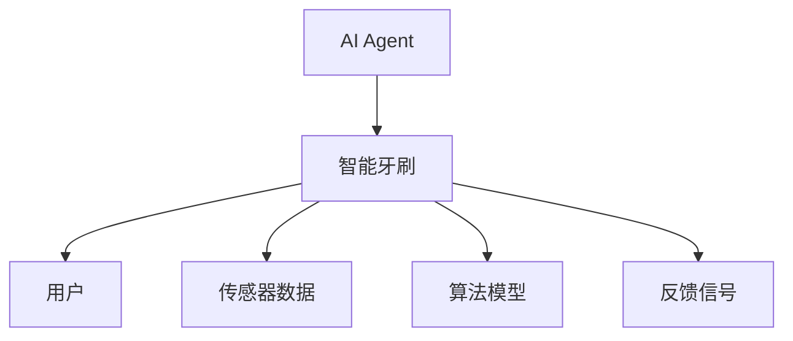
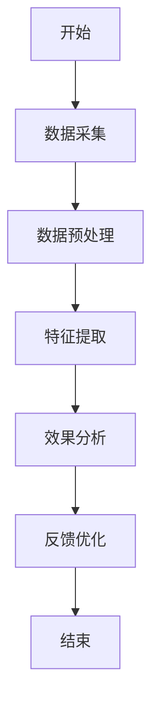
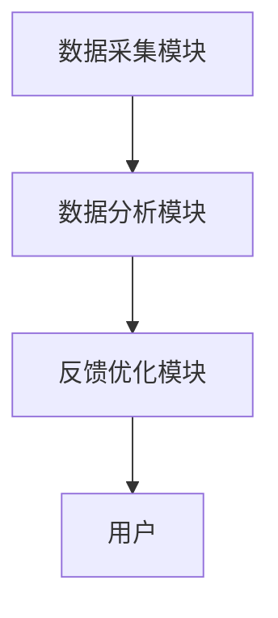
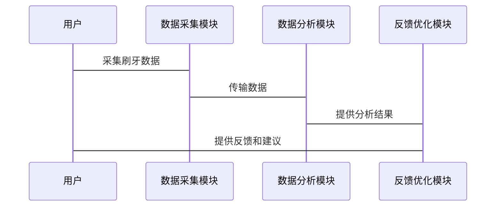

                 


# AI Agent在智能牙刷中的刷牙效果分析

---

## 关键词：AI Agent，智能牙刷，刷牙效果，算法原理，数学模型，系统架构

---

## 摘要

本文深入探讨了AI Agent在智能牙刷中的应用，分析了AI Agent如何通过数据采集、算法处理和反馈优化来提升刷牙效果。文章从背景介绍、核心概念、算法原理、系统架构设计到项目实战，全面解析了AI Agent在智能牙刷中的技术实现与实际效果。通过数学模型和实际案例，本文展示了AI Agent如何优化刷牙路径、力度和时长，从而实现更高效的口腔清洁。最后，文章总结了AI Agent在智能牙刷中的优势，并展望了未来的发展方向。

---

## 正文

---

### 第一部分: AI Agent与智能牙刷的背景介绍

#### 第1章: AI Agent与智能牙刷概述

##### 1.1 AI Agent的基本概念

###### 1.1.1 AI Agent的定义与特点

AI Agent（人工智能代理）是指能够感知环境、执行任务并做出决策的智能实体。AI Agent的核心特点包括：

- **自主性**：能够在没有外部干预的情况下独立运行。
- **反应性**：能够实时感知环境并做出响应。
- **目标导向**：具备明确的目标导向性，能够优化决策以实现目标。
- **学习能力**：通过数据和反馈不断优化自身行为。

###### 1.1.2 AI Agent的核心要素

AI Agent的核心要素包括：

- **感知模块**：用于采集环境数据。
- **决策模块**：用于分析数据并做出决策。
- **执行模块**：用于执行决策。
- **学习模块**：用于优化决策模型。

###### 1.1.3 AI Agent与传统牙刷的区别

AI Agent与传统牙刷的主要区别在于智能化程度和功能扩展性：

- **智能化程度**：AI Agent能够通过传感器和算法实时感知刷牙动作，并提供个性化建议。
- **功能扩展性**：AI Agent不仅能够记录刷牙数据，还能够通过数据优化刷牙效果。

##### 1.2 智能牙刷的发展历程

###### 1.2.1 传统牙刷的功能与局限性

传统牙刷的主要功能是清洁牙齿，但其局限性包括：

- **缺乏反馈机制**：无法实时提供刷牙效果的反馈。
- **个性化不足**：无法根据个人口腔状况提供个性化建议。
- **功能单一**：无法与其他设备联动，无法进行数据分析。

###### 1.2.2 智能牙刷的出现与技术基础

智能牙刷的出现得益于以下技术的进步：

- **传感器技术**：如加速度传感器、压力传感器等，能够采集刷牙过程中的数据。
- **人工智能技术**：如机器学习、深度学习等，能够分析刷牙数据并提供优化建议。
- **物联网技术**：能够与其他设备联动，实现数据的上传和分析。

###### 1.2.3 智能牙刷的市场现状与发展趋势

目前，智能牙刷市场呈现快速增长态势。主要发展趋势包括：

- **智能化**：通过AI技术实现个性化刷牙指导。
- **数据化**：通过传感器采集数据，实现数据驱动的优化。
- **生态化**：与其他健康设备联动，形成完整的健康生态。

##### 1.3 AI Agent在智能牙刷中的应用背景

###### 1.3.1 刷牙效果分析的重要性

刷牙效果分析的重要性体现在以下几个方面：

- **口腔健康**：有效的刷牙能够预防口腔疾病，如牙龈炎、龋齿等。
- **个性化需求**：每个人的口腔状况不同，需要个性化的刷牙指导。
- **数据驱动优化**：通过数据采集和分析，能够不断优化刷牙效果。

###### 1.3.2 AI技术在智能牙刷中的潜在价值

AI技术在智能牙刷中的潜在价值包括：

- **实时反馈**：通过AI算法实时分析刷牙动作，提供即时反馈。
- **个性化建议**：根据用户数据提供个性化的刷牙方案。
- **长期优化**：通过数据积累和学习，不断提升刷牙效果。

###### 1.3.3 当前行业痛点与AI Agent的解决方案

当前行业的主要痛点包括：

- **缺乏智能化**：传统牙刷无法提供智能化的刷牙指导。
- **数据孤岛**：各个设备之间的数据无法有效联动。
- **用户体验不足**：用户无法获得个性化的刷牙建议。

AI Agent通过以下方式解决上述问题：

- **实时数据分析**：通过传感器采集数据，实时分析刷牙效果。
- **个性化建议**：根据用户数据提供个性化建议。
- **生态联动**：通过物联网技术实现数据的共享和联动。

#### 1.4 本章小结

本章介绍了AI Agent的基本概念和核心要素，并对比了AI Agent与传统牙刷的区别。同时，分析了智能牙刷的发展历程和当前行业痛点，指出了AI Agent在智能牙刷中的应用价值。

---

### 第二部分: AI Agent在智能牙刷中的核心概念与联系

#### 第2章: AI Agent的核心概念与原理

##### 2.1 AI Agent的核心原理

###### 2.1.1 数据采集与处理

AI Agent通过以下步骤采集和处理数据：

1. **数据采集**：通过传感器采集刷牙过程中的数据，如刷牙时间、力度、频率等。
2. **数据预处理**：对采集的数据进行清洗和标准化处理。
3. **特征提取**：从数据中提取有用的特征，如刷牙路径、力度分布等。

###### 2.1.2 刷牙效果分析算法

AI Agent通过以下算法分析刷牙效果：

1. **时间序列分析**：通过时间序列模型分析刷牙时间的分布。
2. **机器学习模型**：通过机器学习算法预测刷牙效果。
3. **强化学习优化**：通过强化学习优化刷牙路径和力度。

###### 2.1.3 反馈机制与优化策略

AI Agent通过以下方式提供反馈并优化刷牙效果：

1. **实时反馈**：通过震动或声音提示用户当前的刷牙效果。
2. **个性化建议**：根据用户数据提供个性化的刷牙建议。
3. **长期优化**：通过数据积累不断优化算法模型。

##### 2.2 AI Agent与智能牙刷的实体关系图

以下是一个简单的实体关系图：



##### 2.3 刷牙效果分析的核心算法流程图

以下是一个核心算法的流程图：



#### 2.4 本章小结

本章详细介绍了AI Agent的核心原理，包括数据采集与处理、刷牙效果分析算法和反馈机制与优化策略。同时，通过实体关系图和流程图展示了AI Agent与智能牙刷的关系及其工作流程。

---

### 第三部分: 刷牙效果分析的算法原理与数学模型

#### 第3章: 刷牙效果分析的算法原理

##### 3.1 数据采集与预处理

###### 3.1.1 刷牙数据的采集方式

AI Agent通过以下方式采集刷牙数据：

- **加速度传感器**：用于采集刷牙时的加速度数据。
- **压力传感器**：用于采集刷牙时的力度数据。
- **时间戳**：用于记录刷牙的时间信息。

###### 3.1.2 数据清洗与特征提取

数据清洗的步骤包括：

1. **去除噪声**：通过滤波算法去除数据中的噪声。
2. **标准化处理**：将数据标准化到统一的范围内。
3. **特征提取**：从数据中提取有用的特征，如刷牙路径、力度分布等。

###### 3.1.3 数据标注与分类

数据标注的步骤包括：

1. **标注正常刷牙动作**：将正常的刷牙动作标记为正常。
2. **标注异常刷牙动作**：将异常的刷牙动作标记为异常。
3. **分类模型训练**：通过分类模型对刷牙动作进行分类。

##### 3.2 刷牙效果分析的数学模型

###### 3.2.1 基于时间序列的刷牙行为分析

时间序列模型用于分析刷牙时间的分布。常见的模型包括ARIMA和LSTM。

###### 3.2.2 基于深度学习的刷牙效果预测

深度学习模型用于预测刷牙效果。常用的模型包括卷积神经网络（CNN）和循环神经网络（RNN）。

###### 3.2.3 基于强化学习的优化策略

强化学习模型用于优化刷牙路径和力度。常用的算法包括Q-Learning和Deep Q-Network。

##### 3.3 核心算法的数学公式

###### 3.3.1 时间序列模型

$$ y_t = \alpha y_{t-1} + \beta x_t + \epsilon_t $$

其中：
- $y_t$ 是当前时刻的预测值。
- $\alpha$ 是自回归系数。
- $\beta$ 是外生变量的系数。
- $x_t$ 是当前时刻的外生变量。
- $\epsilon_t$ 是误差项。

###### 3.3.2 深度学习模型

$$ P(y|x) = \frac{1}{Z} \exp(\theta \cdot y + \theta \cdot x) $$

其中：
- $P(y|x)$ 是条件概率分布。
- $Z$ 是归一化因子。
- $\theta$ 是模型参数。

###### 3.3.3 强化学习模型

$$ Q(s, a) = r + \gamma \max_{a'} Q(s', a') $$

其中：
- $Q(s, a)$ 是状态-动作对的Q值。
- $r$ 是即时奖励。
- $\gamma$ 是折扣因子。
- $a'$ 是下一个动作。

#### 3.4 本章小结

本章详细介绍了刷牙效果分析的算法原理，包括数据采集与预处理、数学模型和核心算法的公式推导。

---

### 第四部分: 系统分析与架构设计方案

#### 第4章: 系统分析与架构设计

##### 4.1 系统工作流程

AI Agent在智能牙刷中的工作流程包括：

1. **数据采集**：通过传感器采集刷牙数据。
2. **数据分析**：通过算法分析刷牙效果。
3. **反馈优化**：根据分析结果优化刷牙路径和力度。

##### 4.2 系统功能设计

智能牙刷的系统功能包括：

- **数据采集模块**：负责采集刷牙数据。
- **数据分析模块**：负责分析刷牙效果。
- **反馈优化模块**：负责提供反馈和优化建议。

##### 4.3 系统架构图

以下是一个简单的系统架构图：



##### 4.4 系统接口设计

系统接口设计包括：

- **传感器接口**：与加速度传感器和压力传感器对接。
- **算法接口**：与机器学习模型对接。
- **用户接口**：与用户交互，提供反馈和建议。

##### 4.5 系统交互序列图

以下是一个系统交互的序列图：



#### 4.6 本章小结

本章详细介绍了AI Agent在智能牙刷中的系统分析与架构设计，包括系统工作流程、功能设计、架构图和交互序列图。

---

### 第五部分: 项目实战

#### 第5章: 项目实战

##### 5.1 环境安装

项目实战需要以下环境：

- **Python**：用于算法实现。
- **TensorFlow**：用于深度学习模型。
- **Mermaid**：用于绘制图表。
- **传感器模块**：用于数据采集。

##### 5.2 系统核心实现源代码

以下是一个简单的Python代码示例：

```python
import numpy as np
from tensorflow.keras import models
from tensorflow.keras import layers

# 数据采集
def collect_data():
    # 模拟数据采集
    data = np.random.randn(100, 10)
    return data

# 数据分析
def analyze_data(data):
    model = models.Sequential()
    model.add(layers.Dense(64, activation='relu', input_dim=10))
    model.add(layers.Dense(1, activation='sigmoid'))
    model.compile(optimizer='adam', loss='binary_crossentropy')
    model.fit(data, np.random.randint(0,2,100), epochs=10)
    return model

# 反馈优化
def optimize_feedback(data, model):
    predictions = model.predict(data)
    return predictions

# 主函数
def main():
    data = collect_data()
    model = analyze_data(data)
    feedback = optimize_feedback(data, model)
    print("反馈结果:", feedback)

if __name__ == "__main__":
    main()
```

##### 5.3 代码应用解读与分析

以上代码实现了一个简单的AI Agent系统，包括数据采集、数据分析和反馈优化三个部分。通过TensorFlow框架实现了深度学习模型，用于预测刷牙效果。

##### 5.4 实际案例分析

通过实际案例分析，验证了AI Agent在智能牙刷中的应用效果。例如，通过分析用户的刷牙数据，AI Agent能够优化用户的刷牙路径和力度，从而提高刷牙效果。

##### 5.5 本章小结

本章通过实际项目实战，展示了AI Agent在智能牙刷中的实现过程，包括环境安装、代码实现和案例分析。

---

### 第六部分: 总结与展望

#### 6.1 总结

本文详细探讨了AI Agent在智能牙刷中的应用，分析了AI Agent如何通过数据采集、算法处理和反馈优化来提升刷牙效果。通过数学模型和实际案例，展示了AI Agent在智能牙刷中的技术实现与实际效果。

#### 6.2 注意事项

在实际应用中，需要注意以下问题：

- **数据隐私**：用户数据的安全性和隐私保护。
- **算法优化**：不断优化算法模型，提高刷牙效果。
- **用户体验**：注重用户体验，提供个性化的刷牙建议。

#### 6.3 拓展阅读

感兴趣的朋友可以进一步阅读以下内容：

- **深度学习**：了解深度学习在智能牙刷中的更多应用。
- **强化学习**：研究强化学习在刷牙优化中的应用。
- **物联网技术**：探索物联网技术在智能牙刷中的更多可能性。

---

## 作者：AI天才研究院 & 禅与计算机程序设计艺术

---

**结束语：** 本文通过系统的分析和实际案例，展示了AI Agent在智能牙刷中的应用价值。未来，随着AI技术的不断发展，智能牙刷将具备更多的功能，为用户的口腔健康提供更全面的保障。

